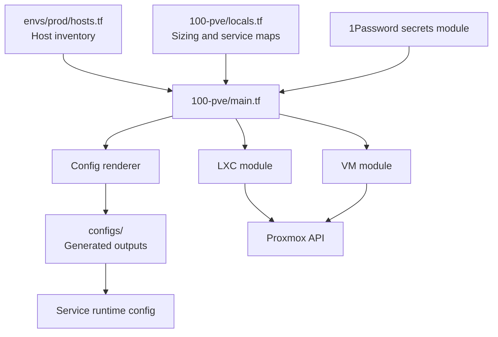

# 100-pve: Proxmox Hypervisor Host

## Overview

Central Terraform workspace orchestrating all Proxmox infrastructure for the `jclee.me` homelab. Provisions LXC containers and VMs via reusable modules, renders service configs, and manages host-level firewall rules.

## Architecture



## Source of Truth

- **All host IPs, VMIDs, roles, ports**: `envs/prod/hosts.tf`
- **Container sizing and service maps**: `locals.tf`
- **1Password secrets**: `secrets.tf`
- **Rendered configs**: `configs/` (generated, never hand-edit)

## Operations

```bash
# Plan changes
make plan SVC=pve

# SSH into the host
ssh pve

# Manage LXC Containers
pct list                      # Show status of all containers
pct start <VMID>              # Start container (e.g., pct start 102)
pct stop <VMID>               # Graceful shutdown
pct enter <VMID>              # Open a shell inside the container

# Manage Virtual Machines
qm list                       # Show status of all VMs
qm start <VMID>               # Power on VM (e.g., qm start 112)
qm shutdown <VMID>            # Graceful ACPI shutdown
```

### Logging

- **System Logs**: `journalctl -f`
- **Task Logs**: `/var/log/pve/tasks/`
- **Cluster Logs**: `/var/log/pveproxy/access.log`

## Safety Notes

- **Local `make apply` is disabled.** All deployments go through GitHub Actions CI/CD.
- **`configs/` outputs are generated.** Never hand-edit. Regenerate via `terraform apply`.
- **Manual changes in the Proxmox UI will be overwritten** by Terraform. Always update `.tf` files instead.
- **High memory pressure** from ELK (105) or MCPHub (112) can affect the host. Monitor with `htop`.
- **IO delay** usually indicates intensive backup jobs or heavy Elasticsearch indexing.

<!-- BEGIN_TF_DOCS -->
## Requirements

| Name | Version |
|------|---------|
| <a name="requirement_terraform"></a> [terraform](#requirement\_terraform) | >= 1.7, < 2.0 |
| <a name="requirement_onepassword"></a> [onepassword](#requirement\_onepassword) | ~> 3.2 |
| <a name="requirement_proxmox"></a> [proxmox](#requirement\_proxmox) | ~> 0.94 |

## Providers

| Name | Version |
|------|---------|
| <a name="provider_proxmox"></a> [proxmox](#provider\_proxmox) | 0.98.1 |

## Modules

| Name | Source | Version |
|------|--------|---------|
| <a name="module_config_renderer"></a> [config\_renderer](#module\_config\_renderer) | ../modules/proxmox/config-renderer | n/a |
| <a name="module_hosts"></a> [hosts](#module\_hosts) | ./envs/prod | n/a |
| <a name="module_lxc"></a> [lxc](#module\_lxc) | ../modules/proxmox/lxc | n/a |
| <a name="module_lxc_config"></a> [lxc\_config](#module\_lxc\_config) | ../modules/proxmox/lxc-config | n/a |
| <a name="module_onepassword_secrets"></a> [onepassword\_secrets](#module\_onepassword\_secrets) | ../modules/shared/onepassword-secrets | n/a |
| <a name="module_vm"></a> [vm](#module\_vm) | ../modules/proxmox/vm | n/a |
| <a name="module_vm_config"></a> [vm\_config](#module\_vm\_config) | ../modules/proxmox/vm-config | n/a |

## Resources

| Name | Type |
|------|------|
| [proxmox_virtual_environment_firewall_options.container](https://registry.terraform.io/providers/bpg/proxmox/latest/docs/resources/virtual_environment_firewall_options) | resource |
| [proxmox_virtual_environment_firewall_options.vm](https://registry.terraform.io/providers/bpg/proxmox/latest/docs/resources/virtual_environment_firewall_options) | resource |
| [proxmox_virtual_environment_firewall_rules.container](https://registry.terraform.io/providers/bpg/proxmox/latest/docs/resources/virtual_environment_firewall_rules) | resource |
| [proxmox_virtual_environment_firewall_rules.vm](https://registry.terraform.io/providers/bpg/proxmox/latest/docs/resources/virtual_environment_firewall_rules) | resource |
| [proxmox_virtual_environment_storage_pbs.pbs](https://registry.terraform.io/providers/bpg/proxmox/latest/docs/resources/virtual_environment_storage_pbs) | resource |
| [proxmox_virtual_environment_nodes.nodes](https://registry.terraform.io/providers/bpg/proxmox/latest/docs/data-sources/virtual_environment_nodes) | data source |

## Inputs

| Name | Description | Type | Default | Required |
|------|-------------|------|---------|:--------:|
| <a name="input_datastore_id"></a> [datastore\_id](#input\_datastore\_id) | Proxmox storage ID for container disks | `string` | `"dfge"` | no |
| <a name="input_deploy_lxc_configs"></a> [deploy\_lxc\_configs](#input\_deploy\_lxc\_configs) | Whether to deploy LXC configurations via SSH | `bool` | `false` | no |
| <a name="input_deploy_vm_configs"></a> [deploy\_vm\_configs](#input\_deploy\_vm\_configs) | Whether to deploy VM configurations via SSH | `bool` | `false` | no |
| <a name="input_dns_servers"></a> [dns\_servers](#input\_dns\_servers) | DNS servers for containers | `list(string)` | <pre>[<br/>  "192.168.50.103",<br/>  "8.8.8.8"<br/>]</pre> | no |
| <a name="input_enable_pbs"></a> [enable\_pbs](#input\_enable\_pbs) | Enable Proxmox Backup Server storage registration (requires 'pbs' item in 1Password vault) | `bool` | `false` | no |
| <a name="input_enable_synology"></a> [enable\_synology](#input\_enable\_synology) | Whether to look up Synology secrets from 1Password | `bool` | `false` | no |
| <a name="input_enable_youtube"></a> [enable\_youtube](#input\_enable\_youtube) | Whether to look up YouTube secrets from 1Password | `bool` | `false` | no |
| <a name="input_github_org"></a> [github\_org](#input\_github\_org) | GitHub organization/user name | `string` | `"qws941"` | no |
| <a name="input_homelab_tunnel_token"></a> [homelab\_tunnel\_token](#input\_homelab\_tunnel\_token) | Cloudflare Tunnel token for homelab connector (from 300-cloudflare workspace) | `string` | `""` | no |
| <a name="input_managed_vmid_range"></a> [managed\_vmid\_range](#input\_managed\_vmid\_range) | VMID range for Terraform-managed containers and VMs (101-220) | <pre>object({<br/>    min = number<br/>    max = number<br/>  })</pre> | <pre>{<br/>  "max": 220,<br/>  "min": 101<br/>}</pre> | no |
| <a name="input_network_cidr"></a> [network\_cidr](#input\_network\_cidr) | Network CIDR for container IPs | `string` | `"192.168.50.0/24"` | no |
| <a name="input_network_gateway"></a> [network\_gateway](#input\_network\_gateway) | Network gateway IP address | `string` | `"192.168.50.1"` | no |
| <a name="input_node_name"></a> [node\_name](#input\_node\_name) | Proxmox node name to deploy containers | `string` | `"pve3"` | no |
| <a name="input_onepassword_vault_name"></a> [onepassword\_vault\_name](#input\_onepassword\_vault\_name) | 1Password vault name for shared infrastructure secrets | `string` | `"homelab"` | no |
| <a name="input_proxmox_api_token"></a> [proxmox\_api\_token](#input\_proxmox\_api\_token) | Proxmox API token in format 'user@realm!tokenid=uuid' (optional — 1Password is preferred source) | `string` | `""` | no |
| <a name="input_proxmox_endpoint"></a> [proxmox\_endpoint](#input\_proxmox\_endpoint) | Proxmox VE API endpoint URL | `string` | `"https://192.168.50.100:8006/"` | no |
| <a name="input_proxmox_insecure"></a> [proxmox\_insecure](#input\_proxmox\_insecure) | Skip TLS verification (use only for self-signed certs) | `bool` | `true` | no |
| <a name="input_ssh_public_keys"></a> [ssh\_public\_keys](#input\_ssh\_public\_keys) | SSH public keys for LXC containers (root user) | `list(string)` | `[]` | no |

## Outputs

| Name | Description |
|------|-------------|
| <a name="output_container_ids"></a> [container\_ids](#output\_container\_ids) | Container VMIDs |
| <a name="output_container_ips"></a> [container\_ips](#output\_container\_ips) | Container IP addresses |
| <a name="output_container_status"></a> [container\_status](#output\_container\_status) | Container deployment status |
| <a name="output_host_inventory"></a> [host\_inventory](#output\_host\_inventory) | Host inventory map (ip, ports, vmid) for consumption by app workspaces via remote\_state |
| <a name="output_lxc_configs"></a> [lxc\_configs](#output\_lxc\_configs) | LXC configuration paths |
| <a name="output_nodes"></a> [nodes](#output\_nodes) | List of Proxmox nodes |
| <a name="output_rendered_configs"></a> [rendered\_configs](#output\_rendered\_configs) | Paths to rendered configuration files |
| <a name="output_required_template_secrets_validation"></a> [required\_template\_secrets\_validation](#output\_required\_template\_secrets\_validation) | Fail-fast validation for required 1Password secret keys consumed by rendered templates |
| <a name="output_service_urls"></a> [service\_urls](#output\_service\_urls) | Derived service URLs for consumption by app workspaces via remote\_state |
| <a name="output_validation_summary"></a> [validation\_summary](#output\_validation\_summary) | Configuration validation summary |
| <a name="output_vm_configs"></a> [vm\_configs](#output\_vm\_configs) | VM configuration paths |
<!-- END_TF_DOCS -->
