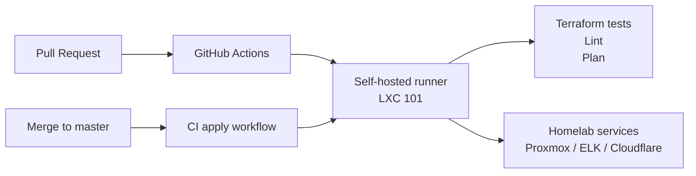

# 101-runner: GitHub Actions Self-hosted Runner

## Overview

LXC container (VMID 101) running multiple GitHub Actions self-hosted runner instances for shared CI/CD across all repositories.

## Architecture



## Source of Truth

- **Host inventory**: `100-pve/envs/prod/hosts.tf`
- **Runner scripts**: `scripts/setup-runner.go`, `scripts/register-all-repos.go`
- **Systemd services**: `github-runner-{N}-{repo}.service`

## Operations

### Runner Setup

```bash
# From PVE host
ssh root@192.168.50.100 'pct exec 101 -- bash'

# Install dependencies (run once)
go run /opt/runner/scripts/setup-runner.go

# Register all repos with 2 instances each (default)
GITHUB_TOKEN="ghp_xxx" GITHUB_USER="qws941" \
  go run /opt/runner/scripts/register-all-repos.go

# Register all repos with 3 instances each
RUNNER_COUNT=3 GITHUB_TOKEN="ghp_xxx" GITHUB_USER="qws941" \
  go run /opt/runner/scripts/register-all-repos.go
```

### Lifecycle Management

```bash
# List all running instances
systemctl list-units 'github-runner-*'

# Status of specific instance
systemctl status github-runner-1-terraform
journalctl -u github-runner-2-terraform -f

# Register a single repo (all instances)
GITHUB_TOKEN="ghp_xxx" GITHUB_USER="qws941" \
  go run /opt/runner/scripts/register-repo.go <repo-name>

# Register a single repo (specific instance only)
GITHUB_TOKEN="ghp_xxx" GITHUB_USER="qws941" \
  go run /opt/runner/scripts/register-repo.go <repo-name> 1

# Unregister all
GITHUB_TOKEN="ghp_xxx" GITHUB_USER="qws941" \
  go run /opt/runner/scripts/unregister-all.go
```

### Using in Workflows

```yaml
jobs:
  build:
    runs-on: [self-hosted, linux, x64, homelab]
    steps:
      - uses: actions/checkout@v4
      - run: echo "Running on homelab runner!"
```

## Safety Notes

- `GITHUB_TOKEN` requires `repo` scope. Store it securely (1Password recommended).
- This is an **unprivileged LXC** with nesting enabled for Docker-in-Docker. Only trusted code should run.
- Internal network `192.168.50.0/24` only. Outbound via gateway for GitHub API access.
