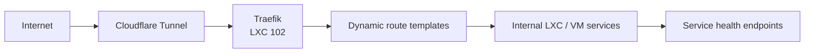

# 102-traefik: Edge Ingress & Reverse Proxy

## Overview

High-performance reverse proxy and load balancer. Serves as the single entry point for all `jclee.me` subdomains and internal services.

## Architecture



## Source of Truth

- **Host inventory**: `100-pve/envs/prod/hosts.tf`
- **Static config template**: `templates/traefik.yml.tftpl`
- **Dynamic routes**: `templates/*.yml.tftpl`
- **Rendered outputs**: `100-pve/configs/rendered/traefik/` (generated)

## Operations

```bash
# SSH into Traefik container
ssh traefik

# Check service status
systemctl status traefik

# Verify configuration and health
traefik healthcheck

# Debug routing (API)
curl localhost:8080/api/http/routers | jq
curl localhost:8080/api/http/services | jq
```

### Logging

- **Access Logs**: `/var/log/traefik/access.log` (shipped via Filebeat to ELK)
- **Error Logs**: `journalctl -u traefik -f`

## Safety Notes

- All MCP routes MUST use the `mcp-resilient` middleware chain (retry-5 + circuit-breaker).
- Do not manually edit files in `/etc/traefik/dynamic/` on the LXC. Use Terraform.
- Never place sensitive auth headers or tokens in public YAML configs.
- Direct HTTP access is forbidden. Redirect to 443 is mandatory.
