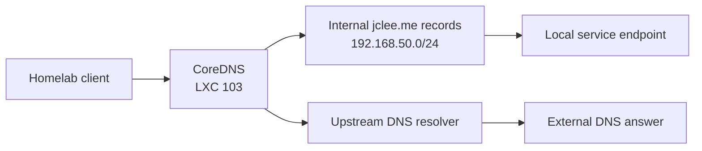

# 103-coredns: Split DNS Resolver

## Overview

Split DNS resolver for the `jclee.me` homelab. Resolves internal domain names to local IPs so traffic stays inside the network and bypasses Cloudflare Tunnel and Access authentication. All other queries are forwarded to upstream resolvers.

## Architecture



## Source of Truth

- **Host inventory**: `100-pve/envs/prod/hosts.tf`
- **Corefile template**: `templates/Corefile.tftpl`
- **Docker Compose template**: `templates/docker-compose.yml.tftpl`

## Operations

```bash
# SSH into the container
ssh coredns

# Check CoreDNS status
systemctl status coredns

# View logs
journalctl -u coredns -f
```

## Safety Notes

- Update DHCP/router DNS to `192.168.50.103` for internal clients.
- Never point external DNS clients at this resolver. It is internal-only.
- Configs are generated by Terraform. Do not hand-edit rendered files.
