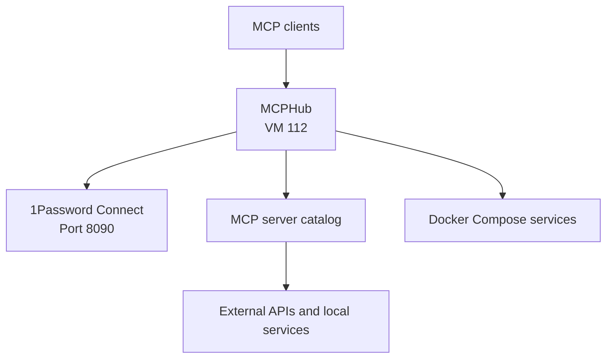

# 112-mcphub: MCP Server Hub

## Overview

MCPHub aggregates and proxies Model Context Protocol (MCP) servers for the `jclee.me` homelab. It provides a gateway, catalog UI, and stdio/SSE proxy for MCP clients.

## Architecture



## Source of Truth

- **Host inventory**: `100-pve/envs/prod/hosts.tf`
- **MCP catalog**: `mcp_servers.json`
- **Docker Compose template**: `templates/docker-compose.yml.tftpl`
- **1Password secrets**: `homelab` vault under item `mcphub`

## Operations

```bash
# SSH into the VM
ssh mcphub

# Check container status
docker compose -f /opt/mcphub/docker-compose.yml ps

# View logs
docker compose -f /opt/mcphub/docker-compose.yml logs -f
```

## Safety Notes

- Managed by Terraform via `100-pve/main.tf`. Do not mutate via UI.
- Catalog changes require updating `mcp_servers.json` and re-running Terraform.
- Secrets stay as `${ENV_VAR}` placeholders in templates. Never inject plaintext tokens.
