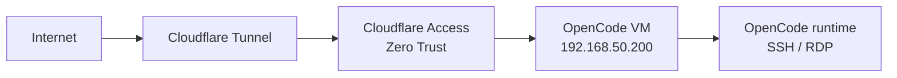

# 200-oc: OpenCode Dev Machine (VM)

## Overview

OpenCode development VM on Proxmox. Terraform-provisioned via `100-pve/main.tf` as `jclee-dev`. Hosts the OpenCode agent runtime and development tooling.

## Architecture



## Source of Truth

- **Host inventory**: `100-pve/envs/prod/hosts.tf` → `hosts.jclee-dev`
- **VM definition**: `100-pve/main.tf` → `vm_definitions`
- **Cloudflare tunnels**: `300-cloudflare/locals.tf` → `tcp_services`

## Operations

```bash
# SSH access (local network)
ssh jclee@192.168.50.200

# SSH access (external via CF tunnel)
ssh -o ProxyCommand="cloudflared access tcp --hostname ssh.jclee.me" jclee@ssh.jclee.me
```

## Safety Notes

- External access requires Cloudflare Access with email authentication.
- Do not expose ports directly. All external access routes through CF tunnel.
- Do not hardcode `192.168.50.200` in dependent configs. Use `var.jclee_dev_ip`.
