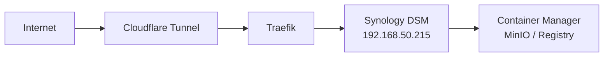

# 215-synology: Synology NAS

## Overview

Synology NAS providing network-attached storage for the homelab. Managed via the `synology-community/synology` Terraform provider for DSM packages, Docker Compose projects, and file operations.

## Architecture



## Source of Truth

- **Host inventory**: `100-pve/envs/prod/hosts.tf` → `hosts.synology`
- **Terraform resources**: `main.tf`, `variables.tf`, `onepassword.tf`
- **Traefik routing**: `102-traefik/templates/synology.yml.tftpl`

## Operations

```bash
make plan SVC=synology    # Plan changes
# Apply via CI only (merge to main/master)
```

## Safety Notes

- This is a **physical device**, not a Proxmox VM/LXC.
- Provider requires DSM 7.0+ with HTTPS enabled on port 5001.
- `skip_cert_check = true` is set for self-signed DSM certificates.
- Do not hardcode IPs in service configs. Use `module.hosts.synology_ip`.
- DSM admin credentials are stored in 1Password vault "homelab" under item "synology".

<!-- BEGIN_TF_DOCS -->
## Requirements

| Name | Version |
|------|---------|
| <a name="requirement_terraform"></a> [terraform](#requirement\_terraform) | >= 1.7, < 2.0 |
| <a name="requirement_onepassword"></a> [onepassword](#requirement\_onepassword) | ~> 3.2 |
| <a name="requirement_synology"></a> [synology](#requirement\_synology) | ~> 0.6 |

## Providers

| Name | Version |
|------|---------|
| <a name="provider_synology"></a> [synology](#provider\_synology) | 0.6.9 |

## Modules

| Name | Source | Version |
|------|--------|---------|
| <a name="module_onepassword_secrets"></a> [onepassword\_secrets](#module\_onepassword\_secrets) | ../modules/shared/onepassword-secrets | n/a |

## Resources

| Name | Type |
|------|------|
| [synology_container_project.minio](https://registry.terraform.io/providers/synology-community/synology/latest/docs/resources/container_project) | resource |
| [synology_container_project.registry](https://registry.terraform.io/providers/synology-community/synology/latest/docs/resources/container_project) | resource |
| [synology_core_package.container_manager](https://registry.terraform.io/providers/synology-community/synology/latest/docs/resources/core_package) | resource |
| [synology_core_network.this](https://registry.terraform.io/providers/synology-community/synology/latest/docs/data-sources/core_network) | data source |

## Inputs

| Name | Description | Type | Default | Required |
|------|-------------|------|---------|:--------:|
| <a name="input_enable_container_manager_package"></a> [enable\_container\_manager\_package](#input\_enable\_container\_manager\_package) | Manage ContainerManager package installation via Terraform | `bool` | `false` | no |
| <a name="input_enable_portainer"></a> [enable\_portainer](#input\_enable\_portainer) | Enable Portainer CE container deployment on Synology | `bool` | `false` | no |
| <a name="input_enable_registry"></a> [enable\_registry](#input\_enable\_registry) | Enable Docker Registry container on Synology | `bool` | `true` | no |
| <a name="input_minio_endpoint"></a> [minio\_endpoint](#input\_minio\_endpoint) | MinIO S3 endpoint for Registry backend | `string` | `"http://192.168.50.215:9000"` | no |
| <a name="input_minio_registry_bucket"></a> [minio\_registry\_bucket](#input\_minio\_registry\_bucket) | MinIO bucket name for Registry storage | `string` | `"docker-registry"` | no |
| <a name="input_minio_root_password"></a> [minio\_root\_password](#input\_minio\_root\_password) | MinIO root password for Registry backend | `string` | `""` | no |
| <a name="input_minio_root_user"></a> [minio\_root\_user](#input\_minio\_root\_user) | MinIO root user for Registry backend (from 1Password if empty) | `string` | `""` | no |
| <a name="input_minio_share_path"></a> [minio\_share\_path](#input\_minio\_share\_path) | Synology share path for MinIO compose project | `string` | `"/docker/minio"` | no |
| <a name="input_minio_version"></a> [minio\_version](#input\_minio\_version) | MinIO server image tag | `string` | `"latest"` | no |
| <a name="input_onepassword_vault_name"></a> [onepassword\_vault\_name](#input\_onepassword\_vault\_name) | 1Password vault name for secret retrieval | `string` | `"homelab"` | no |
| <a name="input_portainer_edge_port"></a> [portainer\_edge\_port](#input\_portainer\_edge\_port) | Published TCP port for Portainer Edge agent communication | `string` | `"8000"` | no |
| <a name="input_portainer_https_port"></a> [portainer\_https\_port](#input\_portainer\_https\_port) | Published HTTPS port for Portainer web UI | `string` | `"9443"` | no |
| <a name="input_portainer_share_path"></a> [portainer\_share\_path](#input\_portainer\_share\_path) | Synology share path for Portainer compose project | `string` | `"/docker/portainer"` | no |
| <a name="input_portainer_timezone"></a> [portainer\_timezone](#input\_portainer\_timezone) | Timezone used by Portainer container | `string` | `"Asia/Seoul"` | no |
| <a name="input_portainer_version"></a> [portainer\_version](#input\_portainer\_version) | Portainer CE image tag | `string` | `"latest"` | no |
| <a name="input_registry_port"></a> [registry\_port](#input\_registry\_port) | Published HTTP port for Docker Registry | `string` | `"5051"` | no |
| <a name="input_registry_share_path"></a> [registry\_share\_path](#input\_registry\_share\_path) | Synology share path for Registry compose project | `string` | `"/docker/registry"` | no |
| <a name="input_registry_version"></a> [registry\_version](#input\_registry\_version) | Docker Registry image tag | `string` | `"2"` | no |
| <a name="input_synology_host"></a> [synology\_host](#input\_synology\_host) | Synology DSM HTTPS URL (e.g. https://192.168.50.215:5001) | `string` | `"https://192.168.50.215:5001"` | no |
| <a name="input_synology_password"></a> [synology\_password](#input\_synology\_password) | Synology DSM admin password (overridden by 1Password if available) | `string` | `""` | no |
| <a name="input_synology_skip_cert_check"></a> [synology\_skip\_cert\_check](#input\_synology\_skip\_cert\_check) | Skip TLS certificate verification for self-signed DSM certs | `bool` | `true` | no |
| <a name="input_synology_user"></a> [synology\_user](#input\_synology\_user) | Synology DSM admin username (overridden by 1Password if available) | `string` | `""` | no |

## Outputs

| Name | Description |
|------|-------------|
| <a name="output_container_manager_installed"></a> [container\_manager\_installed](#output\_container\_manager\_installed) | Whether ContainerManager package is installed |
| <a name="output_network_info"></a> [network\_info](#output\_network\_info) | Synology NAS network configuration |
| <a name="output_portainer_enabled"></a> [portainer\_enabled](#output\_portainer\_enabled) | Whether Portainer container project is enabled |
| <a name="output_portainer_endpoints"></a> [portainer\_endpoints](#output\_portainer\_endpoints) | Portainer endpoint details when container project is enabled |
| <a name="output_registry_enabled"></a> [registry\_enabled](#output\_registry\_enabled) | Whether standalone Docker Registry + MinIO is enabled |
| <a name="output_registry_endpoints"></a> [registry\_endpoints](#output\_registry\_endpoints) | Docker Registry and MinIO endpoint details when enabled |
<!-- END_TF_DOCS -->
