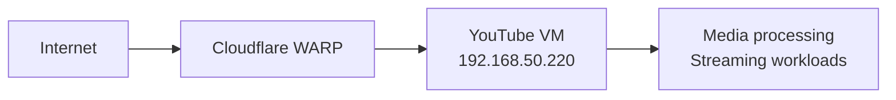

# 220-youtube: YouTube Media Server VM

## Overview

A dedicated ephemeral virtual machine for YouTube media workloads. Designed to be destroyed and recreated without data loss.

## Architecture



## Source of Truth

- **Host inventory**: `100-pve/envs/prod/hosts.tf`
- **VM definition**: `100-pve/main.tf` → `vm_definitions.youtube`
- **Cloud-init**: `cloud-init/youtube-user-data.yaml`

## Operations

```bash
# SSH access (local network)
ssh youtube
ssh jclee@192.168.50.220

# SSH access (external via CF tunnel)
ssh -o ProxyCommand="cloudflared access tcp --hostname youtube-ssh.jclee.me" jclee@youtube-ssh.jclee.me

# Recreate the VM
cd 100-pve
terraform destroy -target=module.vm["youtube"]
terraform apply -target=module.vm["youtube"]
```

## Safety Notes

- This VM is **ephemeral**. It can be destroyed and recreated at any time.
- Do **not** store production credentials or persistent data.
- Not backed up. Assume local data will be lost during recreation.
- Cloudflare WARP provides outbound-only encrypted connectivity.
