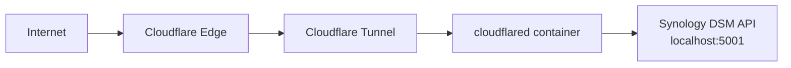

# Cloudflare Tunnel — Synology NAS

## Overview

Runs `cloudflared` as a Docker container on the Synology NAS to establish a secure tunnel to Cloudflare. Bridges external traffic to the DSM API and other NAS services.

## Architecture



## Source of Truth

- **Terraform workspace**: `../../terraform/` (tunnel token output)
- **Docker Compose**: `docker-compose.yml` in this directory
- **Environment**: `.env` (tunnel token, never commit)

## Operations

### Setup

```bash
# Get tunnel token from Terraform output
cd ../../terraform
terraform output -raw tunnel_token

# Create environment file
cp .env.example .env
# Paste the tunnel token into .env
```

### Deploy

```bash
# SSH into Synology NAS
ssh admin@192.168.50.215

# Navigate to this directory
cd /volume1/docker/cloudflared

# Start the tunnel
docker compose up -d

# Verify it's running
docker compose logs -f
```

### Lifecycle

```bash
# Check status
docker compose ps

# View logs
docker compose logs -f cloudflared

# Restart
docker compose restart

# Update cloudflared
docker compose pull && docker compose up -d

# Stop
docker compose down
```

## Safety Notes

- Never commit `.env` or tunnel tokens to git.
- If the container fails to connect, re-run `terraform output -raw tunnel_token` to verify the token.
- Ensure DSM HTTPS is running on port 5001.
