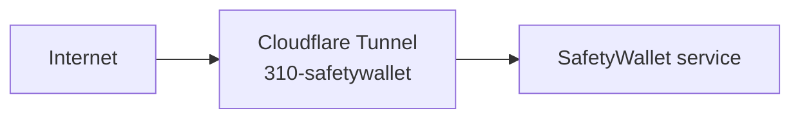

# 310-safetywallet: SafetyWallet Service

## Overview

SafetyWallet external service directory. Connected to the homelab via a dedicated Cloudflare tunnel. This is a reserved workspace for future Terraform provider integration.

## Architecture

## Source of Truth

- **Cloudflare tunnel config**: Cloudflare Dashboard → tunnel `310-safetywallet`
- **Tunnel ID**: `abd283cf-032a-402b-8c41-5689315bd47b`

## Operations

Access is managed via Cloudflare tunnel with Zero Trust policies configured in the Cloudflare Dashboard.

## Safety Notes

- Not provisioned by Terraform. Manual connector configuration only.
- Do not store secrets or credentials in this directory.
- Do not hardcode tunnel IDs in other workspaces.
