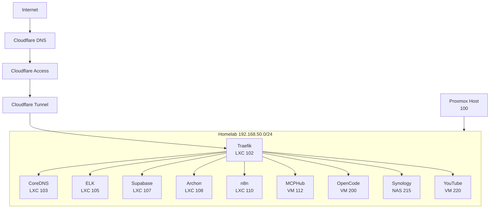
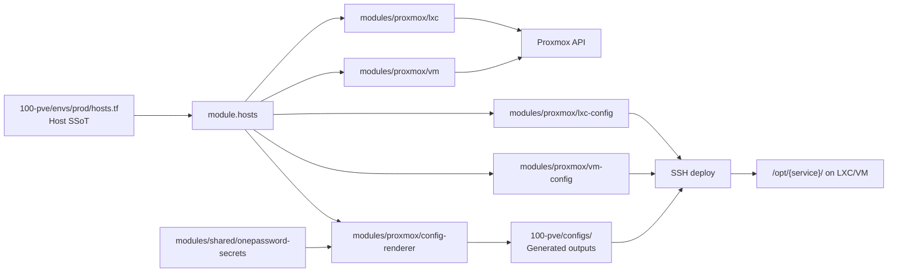
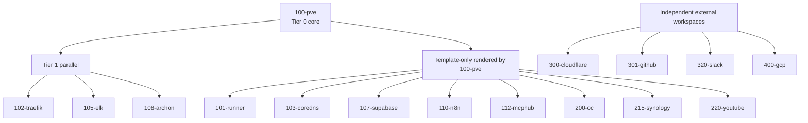
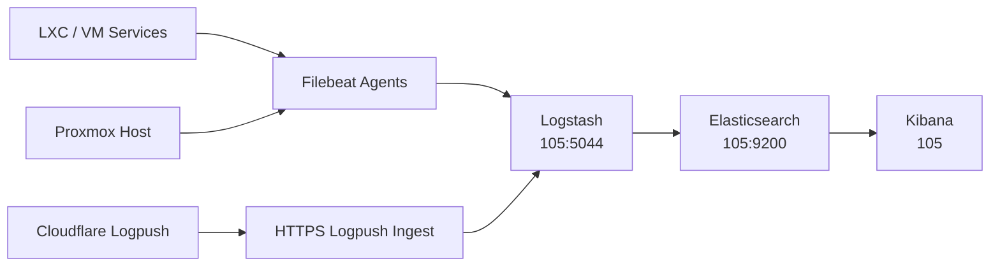

# Architecture

**Last Updated:** 2026-05-07

## Overview

Homelab infrastructure-as-code monorepo. Provisions a Proxmox LXC/VM fleet, networking, monitoring, and external services via Terraform workspaces with 1Password secret injection and GitHub Actions CI/CD.

- **Domain**: `jclee.me`
- **Subnet**: `192.168.50.0/24`
- **Terraform**: 1.10.5 (`>= 1.7, < 2.0`)

## Tech Stack

| Component | Version | Purpose |
| --------- | ------- | ------- |
| Terraform | 1.10.5 | Infrastructure provisioning |
| bpg/proxmox | ~>0.94 | Proxmox VE provider |
| 1Password/onepassword | ~>3.2 | Secret retrieval |
| elastic/elasticstack | ~>0.13 | ILM/index template management |
| cloudflare/cloudflare | ~>5.0 | DNS, tunnels, Access, Workers |
| TFLint | 0.10.0 | Terraform linting (recommended preset) |
| Pre-commit | — | Hook repos (tf, yaml, secrets, actions) |
| Checkov | — | Security scanning |

## Directory Structure

```
terraform/
├── 80-jclee/                     # Personal workspace (skeleton)
├── 100-pve/                      # Tier 0: Central orchestrator (all LXC/VM lifecycle)
│   ├── main.tf                   # Providers, module calls
│   ├── locals.tf                 # Sizing, VM defs, config maps
│   ├── checks.tf                 # TF 1.5+ validation checks
│   ├── firewall.tf               # Proxmox firewall rules
│   ├── variables.tf              # Input variables with validation
│   ├── envs/prod/hosts.tf        # SSoT: all host IPs, VMIDs, roles, ports
│   └── configs/                  # Rendered outputs (never hand-edit)
├── 101-runner/                   # Template-only: GitHub Actions runner
├── 102-traefik/                  # Tier 1: Reverse proxy config
├── 103-coredns/                  # Template-only: Split DNS
├── 105-elk/                      # Tier 1: Log aggregation (ES + Logstash + Kibana)
├── 107-supabase/                 # Template-only: Backend-as-a-Service
├── 108-archon/                   # Tier 1: AI knowledge management
├── 110-n8n/                      # Template-only: n8n workflow automation
├── 112-mcphub/                   # Template-only: MCP Hub + 1Password Connect
├── 200-oc/                       # Template-only: OpenCode dev environment
├── 215-synology/                 # Template-only: NAS inventory
├── 220-youtube/                  # Template-only: YouTube automation VM
├── 300-cloudflare/               # Independent: DNS, tunnels, Access, Workers, R2
├── 301-github/                   # Independent: GitHub repo/ruleset management
├── 310-safetywallet/             # Template-only
├── 320-slack/                    # Independent: Slack integration
├── 400-gcp/                      # Independent: Google Cloud Platform
├── modules/
│   ├── proxmox/
│   │   ├── lxc/                  # LXC container provisioning
│   │   ├── vm/                   # QEMU VM provisioning
│   │   ├── lxc-config/           # LXC config rendering (systemd templates)
│   │   ├── vm-config/            # VM cloud-init + systemd rendering
│   │   └── config-renderer/      # Central template → config pipeline
│   └── shared/
│       └── onepassword-secrets/  # 1Password secret retrieval (12 items, 48 keys)
├── tests/
│   ├── modules/                  # Unit tests (proxmox, shared)
│   ├── integration/              # Cross-module integration tests
| `tests/workspaces/{pve,cloudflare,elk,slack}/` | `make test-workspace` |
├── scripts/                      # Operational tooling (Go)
├── docs/                         # Architecture docs, ADRs, runbooks
├── .github/workflows/            # CI/CD workflows
├── AGENTS.md                     # AI agent project context (synced from .github)
├── DEPENDENCY_MAP.md             # Module dependency graph + template inventory
└── Makefile                      # Build/lint/test/verify targets
```

## Workspace Tiers

| Tier | Workspaces | Role | Apply Order |
| ---- | ---------- | ---- | ----------- |
| 0 (core) | `100-pve` | Central orchestrator. Provisions 7 LXC + 3 VM. | First |
| 1 (infra) | `102-traefik`, `105-elk`, `108-archon` | Consume `terraform_remote_state` from 100-pve. | Second (parallel) |
| Independent | `300-cloudflare`, `301-github`, `320-slack`, `400-gcp` | No Proxmox dependency. | Third (parallel) |
| Template-only | 10 workspaces | Config templates + docker-compose only, no `.tf` files. | N/A |

## Service Inventory

| VMID | Name | IP | Type | Purpose |
| ---- | ---- | -- | ---- | ------- |
| 100 | pve | .100 | Host | Proxmox hypervisor |
| 101 | runner | .101 | LXC | GitHub Actions self-hosted runner |
| 102 | traefik | .102 | LXC | Reverse proxy (ingress) |
| 103 | coredns | .103 | LXC | Split DNS |
| 105 | elk | .105 | LXC | ELK Stack |
| 110 | n8n | .110 | LXC | Workflow automation |
| 112 | mcphub | .112 | VM | MCP Hub + 1Password Connect |
| 114 | cliproxy | .114 | LXC | Squid proxy |
| 200 | oc | .200 | VM | OpenCode dev environment (RTX 5070 Ti GPU passthrough) |
| 215 | synology | .215 | Physical | NAS storage |
| 220 | youtube | .220 | VM | YouTube automation |
| 250 | pbs | .250 | VM | Proxmox Backup Server |

## Data Flows

### Service Topology



### Terraform Control Flow



### Workspace Apply Order



### Observability Flow



## Module Architecture

### `modules/proxmox/`

| Module | Purpose | Key Resource |
| ------ | ------- | ------------ |
| `lxc/` | LXC container provisioning | `proxmox_virtual_environment_lxc` |
| `vm/` | QEMU VM provisioning | `proxmox_virtual_environment_vm` |
| `lxc-config/` | LXC systemd config rendering | `templatefile()` |
| `vm-config/` | VM cloud-init + systemd rendering | `templatefile()` |
| `config-renderer/` | Central template pipeline | `templatefile()` + `local_file` |

### `modules/shared/`

| Module | Purpose | Key Resource |
| ------ | ------- | ------------ |
| `onepassword-secrets/` | 1Password secret retrieval | `data.onepassword_item` × 12 services |

## State Management

- **Backend**: `backend "local" {}` — state files stored alongside each workspace.
- **Locking**: No remote locking. CI concurrency groups provide serialization.
- **State files**: Committed to git (`.tfstate` tracked per workspace).

## Secrets

1Password vault `homelab` (12 items, 48 keys) → `onepassword-secrets` module → `.tftpl` templates → `.env` files on hosts.

- **Connect Server**: LXC 112, port 8090
- **Auth**: `OP_CONNECT_TOKEN` + `OP_CONNECT_HOST` environment variables
- **Access pattern**: `module.secrets.secrets["elk_kibana_system_password"]`
go run scripts/sync-vault-secrets.go → GitHub Actions Secrets

## CI/CD

- **Runner**: Self-hosted on LXC 101
- **PR workflow**: `terraform plan` on PR, `terraform apply` on merge to master
- **Local apply**: Disabled (`make apply` exits with error)
- **Drift detection**: Mon–Fri 00:00 UTC via scheduled workflow
- **Actions**: All SHA-pinned with `# vN` version comment
- **Workflows**: `.github/workflows/`, reusable `_*.yml` from `qws941/.github`

## Testing

| Suite | Location | Command |
| ----- | -------- | ------- |
| Unit (modules) | `tests/modules/{proxmox,shared}/` | `make test-unit` |
| Integration | `tests/integration/` | `make test-integration` |
| Workspace validation | `tests/workspaces/{pve,cloudflare,elk,slack}/` | `make test-workspace` |
| All | — | `make test` |

## Key References

| Document | Location |
| -------- | -------- |
| Dependency graph | `DEPENDENCY_MAP.md` |
| Secret lifecycle | `docs/secret-management.md` |
| Workspace ordering | `docs/workspace-ordering.md` |
| Backup strategy | `docs/backup-strategy.md` |
| ADRs | `docs/adr/` |
| Drift detection | Scheduled GitHub Actions workflow (Mon–Fri 00:00 UTC) |
| Alert reference | `docs/ALERTING-REFERENCE.md` |
