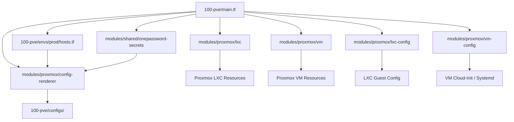
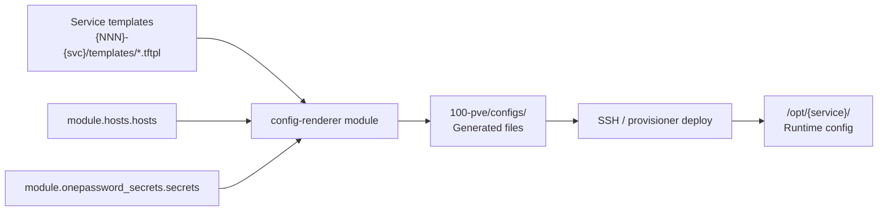
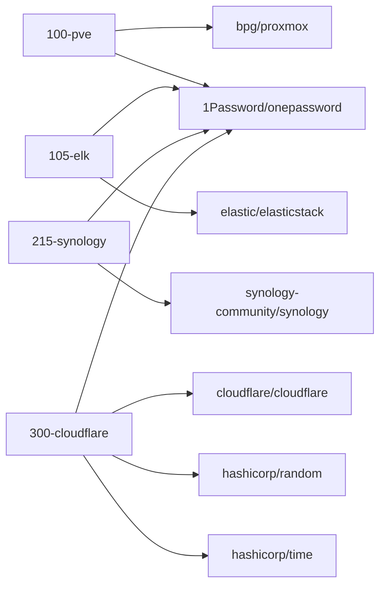
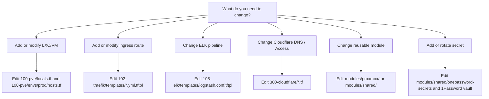

# Terraform Monorepo — Dependency Graph & Entry Points

**Generated:** 2026-05-07
**Scope:** Complete module dependency mapping, template inventory, provider matrix

---

## WORKSPACE ENTRY POINTS

### PRIMARY ORCHESTRATOR

| Workspace   | Entry Point           | Role              | Modules Used                                                         |
| ----------- | --------------------- | ----------------- | -------------------------------------------------------------------- |
| **100-pve** | `main.tf` (77 lines) | Central infra hub | lxc, vm, vm-config, lxc-config, config-renderer, onepassword-secrets |

### SECONDARY WORKSPACES (Terraform-managed)

| Workspace          | Entry Point         | Role                     | Modules Used            | Providers                                           |
| ------------------ | ------------------- | ------------------------ | ----------------------- | --------------------------------------------------- |
| **102-traefik**    | `terraform/main.tf` | Reverse proxy config     | None (remote-state shim) | None (template-only)                                |
| **105-elk**        | `terraform/main.tf` | Log aggregation          | None                    | elasticstack ~>0.13, onepassword ~>3.2              |
| **215-synology**   | `main.tf`           | NAS management           | onepassword-secrets     | synology ~>0.6, onepassword ~>3.2                   |
| **300-cloudflare** | `main.tf`           | External DNS/tunnel      | onepassword-secrets     | cloudflare ~>5.0, random ~>3.0, onepassword ~>3.2, time ~>0.12 |

### TEMPLATE-ONLY WORKSPACES (No Terraform)

| Workspace         | Purpose               | Templates          | Rendered By                    |
| ----------------- | --------------------- | ------------------ | ------------------------------ |
| **101-runner**    | GitHub Actions runner | filebeat.yml.tftpl | 100-pve/module.config_renderer |
| **103-coredns**   | DNS resolver          | 3x .tftpl          | 100-pve/module.config_renderer |
| **110-n8n**       | Workflow automation   | 3x .tftpl          | 100-pve/module.config_renderer |
| **112-mcphub**    | MCP server hub        | 5x .tftpl          | 100-pve/module.config_renderer |
| **220-youtube**   | YouTube VM            | 3x .tftpl          | 100-pve/module.config_renderer |

### PLACEHOLDER WORKSPACES

| Workspace           | Status    | Notes                        |
| ------------------- | --------- | ---------------------------- |
| **80-jclee**        | Reserved  | Workstation documentation    |
| **114-cliproxy**    | Reserved  | Placeholder                  |
| **200-oc**          | Reserved  | OpenCode workspace docs      |
| **310-safetywallet**| Reserved  | Placeholder                  |
| **320-slack**       | Reserved  | Placeholder                  |
| **400-gcp**         | Reserved  | Placeholder                  |

---

## MODULE DEPENDENCY GRAPH



### CORE MODULES (modules/proxmox/)

| Module            | Purpose                        | Key Outputs                     |
| ----------------- | ------------------------------ | ------------------------------- |
| `lxc`             | LXC container provisioning     | container_id, container_status  |
| `vm`              | QEMU VM provisioning           | vm_id, vm_status                |
| `lxc-config`      | LXC config rendering           | rendered_config                 |
| `vm-config`       | VM cloud-init / systemd        | rendered_cloud_init, rendered_systemd |
| `config-renderer` | Central template pipeline      | rendered_configs (map)          |

### SHARED MODULES (modules/shared/)

| Module              | Purpose                 | Key Outputs        |
| ------------------- | ----------------------- | ------------------ |
| `onepassword-secrets` | 1Password secret fetch | secrets map        |

---

## TEMPLATE RENDERING PIPELINE



---

## TEMPLATE INVENTORY

### By Workspace

| Workspace                      | Template                      | Purpose             | Rendered By       | Output Path                                     |
| ------------------------------ | ----------------------------- | ------------------- | ----------------- | ----------------------------------------------- |
| **101-runner**                 | filebeat.yml.tftpl            | Filebeat config     | config-renderer   | configs/lxc-101-runner/filebeat.yml             |
| **102-traefik**                | cloudflared-docker-compose.yml.tftpl | Cloudflared tunnel  | config-renderer   | configs/lxc-102-traefik/cloudflared-docker-compose.yml |
|                                | filebeat.yml.tftpl            | Filebeat config     | config-renderer   | configs/lxc-102-traefik/filebeat.yml            |
|                                | mcphub.yml.tftpl              | Traefik route       | config-renderer   | configs/rendered/traefik/mcphub.yml             |
|                                | middlewares.yml.tftpl         | Traefik middlewares | config-renderer   | configs/rendered/traefik/middlewares.yml        |
|                                | n8n.yml.tftpl                 | Traefik route       | config-renderer   | configs/rendered/traefik/n8n.yml                |
|                                | nas.yml.tftpl                 | Traefik route       | config-renderer   | configs/rendered/traefik/nas.yml                |
|                                | registry.yml.tftpl            | Traefik route       | config-renderer   | configs/rendered/traefik/registry.yml           |
|                                | traefik-elk.yml.tftpl         | Traefik route       | config-renderer   | configs/rendered/traefik/traefik-elk.yml        |
| **103-coredns**                | Corefile.tftpl                | CoreDNS config      | config-renderer   | configs/lxc-103-coredns/Corefile                |
|                                | docker-compose.yml.tftpl      | CoreDNS stack       | config-renderer   | configs/lxc-103-coredns/docker-compose.yml      |
|                                | filebeat.yml.tftpl            | Filebeat config     | config-renderer   | configs/lxc-103-coredns/filebeat.yml            |
| **105-elk**                    | docker-compose.yml.tftpl      | ELK stack           | config-renderer   | configs/lxc-105-elk/docker-compose.yml          |
|                                | Dockerfile.logstash.tftpl     | Logstash container  | config-renderer   | configs/lxc-105-elk/Dockerfile.logstash         |
|                                | filebeat.yml.tftpl            | Filebeat config     | config-renderer   | configs/lxc-105-elk/filebeat.yml                |
|                                | ilm-policy.json.tftpl         | ILM policy          | config-renderer   | configs/lxc-105-elk/ilm-policy.json             |
|                                | logstash.conf.tftpl           | Logstash pipeline   | config-renderer   | configs/lxc-105-elk/logstash.conf               |
|                                | logstash.yml.tftpl            | Logstash config     | config-renderer   | configs/lxc-105-elk/logstash.yml                |
|                                | setup-ilm.sh.tftpl            | ILM setup script    | config-renderer   | configs/lxc-105-elk/setup-ilm.sh                |
| **110-n8n**                    | docker-compose.yml.tftpl      | n8n stack           | config-renderer   | configs/lxc-110-n8n/docker-compose.yml          |
|                                | filebeat.yml.tftpl            | Filebeat config     | config-renderer   | configs/lxc-110-n8n/filebeat.yml                |
|                                | n8n.env.tftpl                 | n8n env vars        | config-renderer   | configs/lxc-110-n8n/n8n.env                     |
| **112-mcphub**                 | .env.tftpl                    | Env vars            | config-renderer   | configs/vm-112-mcphub/.env                      |
|                                | docker-compose.yml.tftpl      | MCPHub stack        | config-renderer   | configs/vm-112-mcphub/docker-compose.yml        |
|                                | docker-compose-op-connect.yml.tftpl | 1Password Connect | config-renderer   | configs/vm-112-mcphub/docker-compose-op-connect.yml |
|                                | filebeat.yml.tftpl            | Filebeat config     | config-renderer   | configs/vm-112-mcphub/filebeat.yml              |
|                                | mcp_settings.json.tftpl       | MCP server catalog  | config-renderer   | configs/rendered/mcphub/mcp_settings.json       |
| **220-youtube**                | .env.tftpl                    | Env vars            | config-renderer   | configs/vm-220-youtube/.env                     |
|                                | docker-compose.yml.tftpl      | YouTube stack       | config-renderer   | configs/vm-220-youtube/docker-compose.yml       |
|                                | filebeat.yml.tftpl            | Filebeat config     | config-renderer   | configs/vm-220-youtube/filebeat.yml             |
| **modules/proxmox/vm-config**  | cloud-init.yaml.tftpl         | Cloud-init          | vm-config module  | (inline in VM resource)                         |
|                                | systemd.service.tftpl         | Systemd service     | vm-config module  | (inline in VM resource)                         |
| **modules/proxmox/lxc-config** | cloud-init-lxc.yaml.tftpl     | Cloud-init (LXC)    | lxc-config module | (inline in LXC resource)                        |
|                                | lxc-systemd.service.tftpl     | Systemd service     | lxc-config module | (inline in LXC resource)                        |

**Total:** 34 `.tftpl` files across 8 service workspaces and 2 module template directories.

### Template Variables (from 100-pve/main.tf)

```hcl
template_vars = {
  # Host inventory
  hosts = module.hosts.hosts

  # Service secrets (from 1Password)
  # ... consumed via module.onepassword_secrets.secrets

  # MCP catalog
  mcp_servers = local.mcp_catalog.servers
  mcp_hub_servers = local.mcp_hub_servers

  # Service-specific vars
  traefik_domain = "jclee.me"
  elk_memory = local.container_sizing.elk.memory
  # ... per-service overrides
}
```

---

## PROVIDER REQUIREMENTS MATRIX

### Provider Dependency Graph



### By Workspace

| Workspace          | Provider              | Version | Auth Method           | Purpose                |
| ------------------ | --------------------- | ------- | --------------------- | ---------------------- |
| **100-pve**        | bpg/proxmox           | ~>0.94  | API token (env)       | LXC/VM provisioning    |
|                    | 1Password/onepassword | ~>3.2   | Service account (env) | Secret fetching        |
| **102-traefik**    | None                  | —       | —                     | Template-only          |
| **105-elk**        | elastic/elasticstack  | ~>0.13  | API key (env)         | Index/ILM/space mgmt   |
|                    | 1Password/onepassword | ~>3.2   | Service account (env) | Secret fetching        |
| **215-synology**   | synology-community/synology | ~>0.6 | DSM credentials (env) | NAS package/container mgmt |
|                    | 1Password/onepassword | ~>3.2   | Service account (env) | Secret fetching        |
| **300-cloudflare** | cloudflare/cloudflare | ~>5.0   | API token (env)       | DNS/tunnel/access      |
|                    | hashicorp/random      | ~>3.0   | —                     | Random values          |
|                    | hashicorp/time        | ~>0.12  | —                     | Time-based rotation    |
|                    | 1Password/onepassword | ~>3.2   | Service account (env) | Secret fetching        |

### Environment Variables (Required for CI/Local)

```bash
# Core infrastructure
export PROXMOX_VE_ENDPOINT="https://pve.jclee.me:8006"
export PROXMOX_VE_API_TOKEN="PVEAPIToken=user@pam!terraform=..."
export OP_CONNECT_TOKEN="ops_..."
export OP_CONNECT_HOST="http://192.168.50.112:8090"

# Secondary workspaces
export ELASTICSEARCH_ENDPOINTS="http://192.168.50.105:9200"
export ELASTICSEARCH_USERNAME="elastic"
export ELASTICSEARCH_PASSWORD="${ELK_ELASTIC_PASSWORD}"
export CLOUDFLARE_API_TOKEN="..."
```

---

## DATA SOURCES USED

| Data Source                                             | Workspace            | Purpose                                        |
| ------------------------------------------------------- | -------------------- | ---------------------------------------------- |
| `data "proxmox_virtual_environment_nodes"`              | 100-pve, modules/lxc, modules/vm | Validate Proxmox node availability     |
| `data "onepassword_vault"`                              | 100-pve (via module) | Resolve vault UUID by name                     |
| `data "onepassword_item"`                               | 100-pve (via module) | Fetch service secrets                          |
| `data "terraform_remote_state"`                         | 102-traefik          | Cross-workspace state reference (from 100-pve) |
| `data "cloudflare_zero_trust_tunnel_cloudflared_token"` | 300-cloudflare       | Fetch tunnel tokens                            |
| `data "synology_core_network"`                          | 215-synology         | Read NAS network configuration                 |

---

## ENTRY POINT SUMMARY

### For New Contributors

1. **Understanding Infrastructure**: Start at `/home/jclee/dev/terraform/100-pve/main.tf` (77 lines)
2. **Host Inventory**: Read `/home/jclee/dev/terraform/100-pve/envs/prod/hosts.tf` (SSoT)
3. **Module Behavior**: Read `/home/jclee/dev/terraform/modules/proxmox/AGENTS.md`
4. **Service Config**: Check `/home/jclee/dev/terraform/{NNN}-{svc}/templates/` for template logic
5. **Rendered Outputs**: Never edit `/home/jclee/dev/terraform/100-pve/configs/` (auto-generated)

### For Workspace-Specific Work

- **Traefik routes**: Edit `/home/jclee/dev/terraform/102-traefik/templates/*.yml.tftpl`
- **ELK pipelines**: Edit `/home/jclee/dev/terraform/105-elk/templates/logstash.conf.tftpl`
- **Cloudflare DNS**: Edit `/home/jclee/dev/terraform/300-cloudflare/main.tf`
- **Synology NAS**: Edit `/home/jclee/dev/terraform/215-synology/main.tf`

### Entrypoint Decision Tree



### For Module Development

- **LXC provisioning**: `/home/jclee/dev/terraform/modules/proxmox/lxc/main.tf`
- **VM provisioning**: `/home/jclee/dev/terraform/modules/proxmox/vm/main.tf`
- **Config rendering**: `/home/jclee/dev/terraform/modules/proxmox/config-renderer/main.tf`
- **Secret fetching**: `/home/jclee/dev/terraform/modules/shared/onepassword-secrets/main.tf`

---

## CRITICAL RULES

1. **NEVER hand-edit** `/home/jclee/dev/terraform/100-pve/configs/` — regenerate via `terraform apply`
2. **ALWAYS use** `module.hosts.hosts[name].ip` for IPs (never hardcode)
3. **ALWAYS validate** with `terraform plan` before `terraform apply`
4. **ALWAYS source** templates from workspace `templates/` directories
5. **ALWAYS inject secrets** via environment variables (never in `.tf` files)
6. **NEVER commit** `.tfvars`, `.env`, `.tfstate`, or API keys
