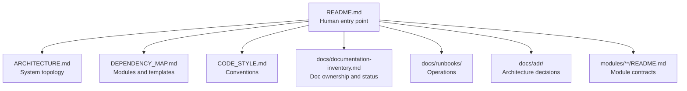
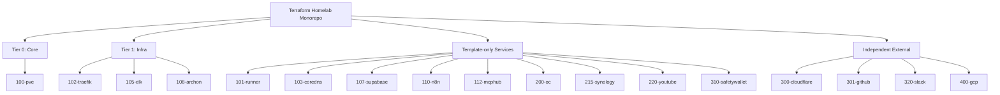

# Terraform Homelab Infrastructure

Infrastructure-as-code monorepo for `jclee.me`. Provisions a Proxmox LXC/VM fleet, networking, monitoring, and external services via Terraform workspaces with 1Password secret injection and GitHub Actions CI/CD.

- **Domain**: `jclee.me`
- **Subnet**: `192.168.50.0/24`
- **Terraform**: 1.10.5
- **21 workspaces** across 4 tiers
- **6 modules** for Proxmox and shared infrastructure

## Quick Start

Get oriented with these commands:

```bash
make plan SVC=pve         # plan the core workspace
make fmt                  # format all Terraform files
make validate SVC=pve     # validate a workspace
make lint                 # run all linters
make test                 # run all tests
make docs                 # regenerate module READMEs
make security             # security scan
```

17 workspace aliases: `jclee`, `pve`, `runner`, `traefik`, `elk`, `supabase`, `archon`, `n8n`, `mcphub`, `oc`, `synology`, `youtube`, `cloudflare`, `github`, `safetywallet`, `slack`, `gcp`

## Documentation Map

| Document | Purpose |
|----------|---------|
| [ARCHITECTURE.md](ARCHITECTURE.md) | Full system topology and service relationships |
| [DEPENDENCY_MAP.md](DEPENDENCY_MAP.md) | Module dependency graph and template inventory |
| [CODE_STYLE.md](CODE_STYLE.md) | Naming conventions, file organization, and variable standards |
| [docs/documentation-inventory.md](docs/documentation-inventory.md) | Documentation ownership and status |
| [docs/runbooks/](docs/runbooks/) | Operational procedures and incident response guides |
| [docs/adr/](docs/adr/) | Architecture Decision Records (append-only) |

## Workspace Tiers

Workspaces are grouped by dependency and apply order.

| Tier | Workspaces | Description |
|------|-----------|-------------|
| **Tier 0: Core** | `100-pve` | Central orchestrator. Provisions all LXC/VM lifecycle. Must apply first. |
| **Tier 1: Infra** | `102-traefik`, `105-elk`, `108-archon` | Infrastructure services that consume `remote_state` from 100-pve. Apply second, in parallel. |
| **Template-only** | 10 workspaces | No `.tf` files. Templates rendered by 100-pve config_renderer. |
| **Independent External** | `300-cloudflare`, `301-github`, `320-slack`, `400-gcp` | External services with no Proxmox dependency. Can apply in any order. |

## Operations

### Daily Commands

```bash
make plan SVC=<alias>     # terraform plan
make fmt                  # format all .tf files
make validate SVC=<alias> # terraform validate
make lint                 # yaml, tf fmt, go vet, tflint
make test                 # unit + integration + workspace tests
make docs                 # generate module READMEs via terraform-docs
make security             # tflint + checkov security scan
```

### Verification and Backup

```bash
make verify               # production verification (Go script)
make backup               # encrypted tfstate backup
make setup                # load 1Password credentials locally
```

## Safety Notes

- **Local `make apply` is disabled.** All deployments go through GitHub Actions CI/CD.
- **`100-pve/configs/` outputs are generated.** Never hand-edit. Regenerate via `terraform apply` in 100-pve.
- **Subdirectory `AGENTS.md` files are auto-synced.** Changes will be overwritten on the next sync push.
- **Never hardcode IPs.** Use `module.hosts.hosts[name].ip` or variables.
- **Never commit secrets.** `.tfvars`, `.env`, and API keys are excluded by `.gitignore`.

## Documentation Entry Map



## Workspace Tier Map


