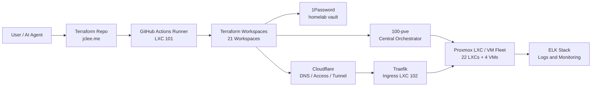

# Terraform Homelab Infrastructure / Terraform Homelab 인프라

[](https://www.terraform.io)
[](LICENSE)
[](.github/workflows)
[](https://scorecard.dev)
[](https://www.proxmox.com/)
[](Makefile)

> English version follows Korean content / 한국어 다음에 영어 버전이 이어집니다.

Infrastructure-as-code monorepo for `jclee.me`. Provisions a Proxmox LXC/VM fleet, networking, monitoring, and external services via 21 Terraform workspaces with 1Password secret injection and GitHub Actions CI/CD.

`jclee.me`를 위한 Infrastructure-as-Code 모노레포입니다. 21개의 Terraform 워크스페이스를 통해 Proxmox LXC/VM 플릿, 네트워킹, 모니터링 및 외부 서비스를 프로비저닝하며, 1Password 시크릿 주입과 GitHub Actions CI/CD로 운영됩니다.

---

## Table of Contents / 목차

- [Features / 주요 기능](#features--주요-기능)
- [Architecture / 아키텍처](#architecture--아키텍처)
- [Automation Inventory / 자동화 인벤토리](#automation-inventory--자동화-인벤토리)
- [Quick Start / 빠른 시작](#quick-start--빠른-시작)
- [Local Development / 로컬 개발](#local-development--로컬-개발)
- [Commands Reference / 명령어 참조](#commands-reference--명령어-참조)
- [Contribution Guide / 기여 가이드](#contribution-guide--기여-가이드)

---

## Features / 주요 기능

### Infrastructure Provisioning / 인프라 프로비저닝

- **21 Terraform workspaces** across 4 tiers (Tier 0 core, Tier 1 infra, Tier 2 VMs, Tier 3 external/cloud)
- **Proxmox LXC/VM fleet** managed as code (22 LXCs, 4 VMs across `<homelab-host>/24` subnet)
- **Single Source of Truth (SSoT)** in `100-pve/envs/prod/hosts.tf` for all host definitions

### Configuration Management / 구성 관리

- **Template-driven rendering** via `modules/proxmox/config-renderer` for consistent service configs
- **Cloud-init** support for LXC and VM bootstrapping
- **Systemd unit templates** for service deployment

### Secret Management / 시크릿 관리

- **1Password integration** via `modules/shared/onepassword-secrets`
- **12 vault items, 48 secret keys** managed in `homelab` vault
- **Zero hardcoded secrets** in repository

### CI/CD Automation / CI/CD 자동화

- **33 GitHub Actions workflows** covering PR lifecycle, issue management, releases, and health checks
- **Automated dependency management** with Dependabot integration
- **Reusable workflow library** for DRY automation

### Documentation / 문서

- **Bilingual documentation** (Korean/English)
- **Architecture Decision Records (ADRs)** in `docs/adr/`
- **Runbooks and operational guides** in `docs/runbooks/`

---

## Architecture / 아키텍처

### System Overview / 시스템 개요


```mermaid
flowchart LR
    Agent["User / AI Agent"] --> Repo["Terraform Repo<br/>jclee.me"]
    Repo --> CI["GitHub Actions Runner<br/>LXC 101"]
    CI --> TF["Terraform Workspaces<br/>21 Workspaces"]
    TF --> PVE["100-pve<br/>Central Orchestrator"]
    PVE --> Fleet["Proxmox LXC / VM Fleet<br/>22 LXCs + 4 VMs"]
    TF --> OP["1Password<br/>homelab vault"]
    TF --> CF["Cloudflare<br/>DNS / Access / Tunnel"]
    Fleet --> ELK["ELK Stack<br/>Logs and Monitoring"]
    CF --> Traefik["Traefik<br/>Ingress LXC 102"]
    Traefik --> Fleet
```

### Workspace Tiers / 워크스페이스 계층

| Tier | Workspaces | Description |
| ---- | ---------- | ----------- |
| 0 (core) | `100-pve` | Central orchestrator — provisions all LXC/VM lifecycle |
| 1 (infra) | `101-runner`, `102-traefik`, `105-elk`, `108-archon` | Core infrastructure services |
| 1 (apps) | `107-supabase`, `110-n8n`, `112-mcphub` | Application platforms |
| 2 (vms) | `200-oc`, `215-synology`, `220-youtube` | VM-based workloads |
| 3 (external) | `300-cloudflare`, `301-github`, `310-safetywallet`, `320-slack` | External service integrations |
| 4 (cloud) | `400-gcp` | Google Cloud Platform |

### Config Pipeline / 구성 파이프라인

```mermaid
flowchart LR
    subgraph SSoT["Single Source of Truth"]
        H[hosts.tf] --> MH[module.hosts]
    end
    MH --> OPS[onepassword_secrets]
    MH --> CR[config_renderer]
    CR --> TMPL[templatefile<br/>.tftpl]
    TMPL --> CFG[configs/]
    CFG --> DEPLOY[SSH Deploy<br/>/opt/${service}/]
```

### Repository Structure / 저장소 구조

```text
/
├── 100-pve/                          # Tier 0: Central orchestrator
│   ├── terraform/                    # Terraform configuration
│   │   ├── main.tf                   # Main orchestration logic
│   │   ├── locals.tf                 # Local values and sizing
│   │   ├── variables.tf              # Input variables
│   │   ├── outputs.tf                # Output values
│   │   ├── lxc_configs.tf            # LXC configuration generator
│   │   ├── vm_configs.tf             # VM configuration generator
│   │   ├── firewall.tf               # Proxmox firewall rules
│   │   ├── storage.tf                # Storage definitions
│   │   ├── backup_jobs.tf            # Backup job definitions
│   │   ├── secrets.tf                # Secret references
│   │   ├── data.tf                   # Data sources
│   │   ├── checks.tf                 # Health check definitions
│   │   ├── configs/                  # Rendered configurations (auto-generated)
│   │   └── envs/prod/hosts.tf        # SSoT: all host definitions
├── 101-runner/                       # GitHub Actions runner host
├── 102-traefik/terraform/           # Reverse proxy and ingress
├── 105-elk/terraform/                # Elasticsearch, Logstash, Kibana stack
├── 107-supabase/                     # Supabase self-hosted
├── 108-archon/terraform/             # Archon deployment
├── 110-n8n/                          # n8n workflow automation
├── 112-mcphub/                       # MCP Hub
├── 200-oc/                           # Owncast streaming
├── 215-synology/                     # Synology NAS integration
├── 220-youtube/                      # YouTube metadata automation
├── 300-cloudflare/                   # Cloudflare DNS, Access, Tunnel
├── 301-github/                       # GitHub organization management
├── 310-safetywallet/                 # Safety Wallet integration
├── 320-slack/                        # Slack integration
├── 400-gcp/                          # Google Cloud Platform
├── modules/
│   ├── proxmox/
│   │   ├── lxc/                      # LXC resource Terraform module
│   │   ├── vm/                       # VM resource Terraform module
│   │   ├── lxc-config/               # LXC configuration renderer
│   │   ├── vm-config/                # VM configuration renderer
│   │   │   └── templates/
│   │   │       ├── cloud-init.yaml.tftpl
│   │   │       └── systemd.service.tftpl
│   │   └── config-renderer/           # Unified config rendering
│   └── shared/
│       └── onepassword-secrets/      # 1Password secret injection module
├── Makefile                          # Workspace management and commands
├── AGENTS.md                         # AI agent knowledge base
├── ARCHITECTURE.md                   # Detailed architecture documentation
├── CODE_STYLE.md                     # Coding conventions
├── CONTRIBUTING.md                   # Contribution guidelines
├── DEPENDENCY_MAP.md                 # Module dependency graph
└── .github/
    └── workflows/                    # 33 GitHub Actions workflows
```

---

## Automation Inventory / 자동화 인벤토리

### GitHub Actions Workflows / GitHub Actions 워크플로우

#### Pull Request Workflows / 풀 리퀘스트 워크플로우

| Workflow File | Description |
| ------------- | ----------- |
| [01_branch-to-pr.yml](.github/workflows/01_branch-to-pr.yml) | Creates PR from feature branch with auto-labeling |
| [03_pr-checks.yml](.github/workflows/03_pr-checks.yml) | Runs terraform fmt, validate, and plan on PRs |
| [04_actionlint.yml](.github/workflows/04_actionlint.yml) | Lints GitHub Actions workflow files |
| [05_gitleaks.yml](.github/workflows/05_gitleaks.yml) | Scans for secrets and credentials |
| [06_codeql.yml](.github/workflows/06_codeql.yml) | CodeQL security analysis |
| [07_dependency-review.yml](.github/workflows/07_dependency-review.yml) | Reviews dependency changes for vulnerabilities |
| [08_scorecard.yml](.github/workflows/08_scorecard.yml) | OpenSSF Scorecard security assessment |
| [09_semantic-pr.yml](.github/workflows/09_semantic-pr.yml) | Enforces semantic PR title format |
| [10_pr-review.yml](.github/workflows/10_pr-review.yml) | AI-powered PR review via pr-agent |
| [13_pr-auto-merge.yml](.github/workflows/13_pr-auto-merge.yml) | Auto-merges approved PRs |
| [14_bot-auto-fix.yml](.github/workflows/14_bot-auto-fix.yml) | Auto-fixes code issues |
| [15_merged-pr-cleanup.yml](.github/workflows/15_merged-pr-cleanup.yml) | Cleans up after PR merge |
| [44_reusable-pr-checks.yml](.github/workflows/44_reusable-pr-checks.yml) | Reusable workflow for PR checks |
| [45_reusable-gitleaks.yml](.github/workflows/45_reusable-gitleaks.yml) | Reusable workflow for secret scanning |
| [11_pr-review.yml](security/11_pr-review.yml) | Security-focused PR review |

#### Issue Management Workflows / 이슈 관리 워크플로우

| Workflow File | Description |
| ------------- | ----------- |
| [02_issue-to-branch.yml](.github/workflows/02_issue-to-branch.yml) | Creates branch from issue |
| [18_issue-management.yml](.github/workflows/18_issue-management.yml) | Issue lifecycle management |
| [19_issue-backfill.yml](.github/workflows/19_issue-backfill.yml) | Backfills issue metadata |
| [37_ci-failure-issues.yml](.github/workflows/37_ci-failure-issues.yml) | Creates issues from CI failures |
| [43_reusable-issue-management.yml](.github/workflows/43_reusable-issue-management.yml) | Reusable issue management |
| [91_issue-classification.yml](.github/workflows/91_issue-classification.yml) | Classifies and routes issues |

#### Release Workflows / 릴리스 워크플로우

| Workflow File | Description |
| ------------- | ----------- |
| [24_release-notes.yml](.github/workflows/24_release-notes.yml) | Auto-generates release notes |
| [25_release-publish.yml](.github/workflows/25_release-publish.yml) | Publishes releases |

#### Documentation Workflows / 문서화 워크플로우

| Workflow File | Description |
| ------------- | ----------- |
| [20_readme-gen.yml](.github/workflows/20_readme-gen.yml) | Auto-generates README documentation |
| [21_docs-sync.yml](.github/workflows/21_docs-sync.yml) | Syncs documentation across repos |
| [42_reusable-docs-sync.yml](.github/workflows/42_reusable-docs-sync.yml) | Reusable documentation sync |

#### Dependency Management Workflows / 의존성 관리 워크플로우

| Workflow File | Description |
| ------------- | ----------- |
| [12_dependabot-auto-merge.yml](.github/workflows/12_dependabot-auto-merge.yml) | Auto-merges Dependabot PRs |

#### Health Check & Monitoring Workflows / 상태 확인 및 모니터링 워크플로우

| Workflow File | Description |
| ------------- | ----------- |
| [29_downstream-health-check.yml](.github/workflows/29_downstream-health-check.yml) | Monitors downstream service health |

#### CI/CD Workflows / CI/CD 워크플로우

| Workflow File | Description |
| ------------- | ----------- |
| [ci.yml](.github/workflows/ci.yml) | Main CI pipeline |
| [60_ci-auto-heal.yml](.github/workflows/60_ci-auto-heal.yml) | Auto-heals CI failures |

#### Supporting Workflows / 지원 워크플로우

| Workflow File | Description |
| ------------- | ----------- |
| [auto-merge.yml](.github/workflows/auto-merge.yml) | Generic auto-merge logic |
| [labeler.yml](.github/workflows/labeler.yml) | Auto-labels issues and PRs |
| [welcome.yml](.github/workflows/welcome.yml) | Welcomes new contributors |

### Terraform Modules / Terraform 모듈

| Module | Purpose |
| ------ | ------- |
| `modules/proxmox/lxc` | Proxmox LXC container resource |
| `modules/proxmox/vm` | Proxmox VM resource |
| `modules/proxmox/lxc-config` | LXC configuration rendering |
| `modules/proxmox/vm-config` | VM configuration rendering |
| `modules/proxmox/config-renderer` | Unified configuration rendering |
| `modules/shared/onepassword-secrets` | 1Password secret injection |

### Makefile Targets / Makefile 타겟

```makefile
# Terraform operations
make init           # Initialize Terraform workspace
make plan           # Create Terraform plan
make apply          # Apply Terraform plan (disabled - use CI/CD)
make validate       # Validate Terraform configuration
make lint           # Lint Terraform code
make fmt            # Format Terraform code
make test           # Run tests

# Development
make setup          # Setup local environment
make pre-commit-run # Run pre-commit hooks

# Workspace management
make help           # Show help with all targets
```

---

## Quick Start / 빠른 시작

### Prerequisites / 사전 요구사항

- Terraform `>= 1.7, < 2.0`
- Git
- 1Password CLI (`op`) for secret access
- Make

### Clone and Setup / 클론 및 설정

```bash
# Clone the repository
git clone https://github.com/jclee941/.github
cd terraform-homelab

# Install pre-commit hooks
make pre-commit-install

# Initialize a workspace
make init SVC=100-pve
```

### Basic Workflow / 기본 워크플로우

```bash
# 1. Create a plan for a specific workspace
make plan SVC=100-pve

# 2. Review the plan output

# 3. Push changes to trigger CI/CD (do NOT manually apply)
git add .
git commit -m "feat: add new LXC definition"
git push origin feature-branch

# 4. Create PR via CI (workflow 01_branch-to-pr.yml auto-creates PR)
```

---

## Local Development / 로컬 개발

### Workspace Selection / 워크스페이스 선택

Use the `SVC` variable to target a specific workspace:

```bash
# Using full workspace name
make plan SVC=100-pve

# Using alias
make plan SVC=pve      # → 100-pve
make plan SVC=elk      # → 105-elk/terraform
make plan SVC=traefik  # → 102-traefik/terraform
```

### Available Workspace Aliases / 사용 가능한 워크스페이스 별칭

| Alias | Workspace Path | Description |
| ----- | -------------- | ----------- |
| `jclee` | `80-jclee` | Personal infrastructure |
| `pve` | `100-pve` | Proxmox central orchestrator |
| `runner` | `101-runner` | GitHub Actions runner |
| `traefik` | `102-traefik/terraform` | Traefik reverse proxy |
| `elk` | `105-elk/terraform` | ELK stack |
| `supabase` | `107-supabase` | Supabase |
| `archon` | `108-archon/terraform` | Archon |
| `n8n` | `110-n8n` | n8n automation |
| `mcphub` | `112-mcphub` | MCP Hub |
| `oc` | `200-oc` | Owncast |
| `synology` | `215-synology` | Synology NAS |
| `youtube` | `220-youtube` | YouTube automation |
| `cloudflare` | `300-cloudflare` | Cloudflare |
| `github` | `301-github` | GitHub org |
| `safetywallet` | `310-safetywallet` | Safety Wallet |
| `slack` | `320-slack` | Slack integration |
| `gcp` | `400-gcp` | Google Cloud |

### Running Tests / 테스트 실행

```bash
# Run unit tests
make test-unit

# Run integration tests
make test-integration

# Run workspace-specific tests
make test-workspace SVC=100-pve
```

### Linting / 린팅

```bash
# Lint all Terraform code
make lint

# Format Terraform code
make fmt

# Validate configurations
make validate
```

---

## Commands Reference / 명령어 참조

### Terraform Commands / Terraform 명령어

| Command | Description |
| ------- | ----------- |
| `make init SVC=<workspace>` | Initialize Terraform workspace |
| `make plan SVC=<workspace>` | Generate execution plan |
| `make apply SVC=<workspace>` | Apply changes (disabled) |
| `make validate SVC=<workspace>` | Validate configuration |
| `make fmt SVC=<workspace>` | Format code |
| `make drift-check SVC=<workspace>` | Check for configuration drift |

### Development Commands / 개발 명령어

| Command | Description |
| ------- | ----------- |
| `make setup` | Setup local development environment |
| `make pre-commit-install` | Install pre-commit hooks |
| `make pre-commit-run` | Run pre-commit hooks |
| `make lint` | Run all linters |
| `make lint-go` | Run Go linters |
| `make docs` | Generate documentation |

### Testing Commands / 테스트 명령어

| Command | Description |
| ------- | ----------- |
| `make test` | Run all tests |
| `make test-unit` | Run unit tests |
| `make test-integration` | Run integration tests |
| `make test-workspace SVC=<workspace>` | Run workspace-specific tests |

### Operational Commands / 운영 명령어

| Command | Description |
| ------- | ----------- |
| `make backup SVC=<workspace>` | Trigger backup job |
| `make drift-check SVC=<workspace>` | Detect infrastructure drift |

---

## Contribution Guide / 기여 가이드

### Getting Started / 시작하기

1. **Fork the repository** on GitHub
2. **Clone your fork** locally:

   ```bash
   git clone https://github.com/YOUR_USERNAME/terraform-homelab.git
   cd terraform-homelab
   ```

3. **Add upstream remote**:

   ```bash
   git remote add upstream https://github.com/jclee941/.github
   ```

4. **Install pre-commit hooks**:

   ```bash
   make pre-commit-install
   ```

### Workflow / 워크플로우

1. **Create a branch** from an issue (workflow `02_issue-to-branch.yml`):

   ```bash
   git checkout -b feature/your-feature-name
   ```

2. **Make changes** following the [CODE_STYLE.md](CODE_STYLE.md) conventions

3. **Run validation**:

   ```bash
   make lint validate test
   ```

4. **Commit** using conventional commits format:

   ```bash
   git commit -m "feat: add new LXC definition"
   ```

5. **Push and create PR** — workflows `01_branch-to-pr.yml` and `10_pr-review.yml` will handle the rest

### Code Review Process / 코드 리뷰 프로세스

1. PR triggers workflow `03_pr-checks.yml` for validation
2. AI review via workflow `10_pr-review.yml`
3. Security scan via workflow `05_gitleaks.yml` and `06_codeql.yml`
4. Human review and approval
5. Auto-merge via workflow `13_pr-auto-merge.yml` (if enabled)

### Adding New Resources / 새 리소스 추가

#### Adding a New LXC / 새 LXC 추가

1. Add host definition to `100-pve/envs/prod/hosts.tf`
2. Add sizing to `100-pve/locals.tf`
3. Configure secrets in `modules/shared/onepassword-secrets/`
4. Add template in `modules/proxmox/lxc-config/templates/`
5. Create PR — CI will render and deploy

#### Adding a New Workspace / 새 워크스페이스 추가

1. Create directory with numeric prefix (e.g., `113-newservice/`)
2. Add to `Makefile` `ALIAS_` map if needed
3. Follow tier conventions (see [ARCHITECTURE.md](ARCHITECTURE.md))
4. Add to CI workflow `ci.yml`

### Documentation Updates / 문서 업데이트

Documentation is auto-generated via workflow `20_readme-gen.yml`. To update:

1. Modify source files (`AGENTS.md`, module READMEs)
2. Workflow will regenerate `README.md` on push to `master`
3. For manual regeneration:

   ```bash
   make docs
   ```

### Security Considerations / 보안 고려사항

- **Never commit secrets** — use 1Password integration
- **All PRs require scans** — workflows `05_gitleaks.yml` and `08_scorecard.yml`
- **Dependency scanning** — workflow `07_dependency-review.yml`
- **Access secrets** via `module.onepassword_secrets.secrets["key"]`

### Resources / 참고 자료

- [ARCHITECTURE.md](ARCHITECTURE.md) — Detailed architecture documentation
- [CODE_STYLE.md](CODE_STYLE.md) — Coding conventions
- [DEPENDENCY_MAP.md](DEPENDENCY_MAP.md) — Module dependency graph
- [AGENTS.md](AGENTS.md) — AI agent knowledge base
- [CONTRIBUTING.md](CONTRIBUTING.md) — Extended contribution guidelines

---

## License / 라이선스

This project is licensed under the MIT License. See [LICENSE](LICENSE) for details.

---

## Badges Reference / 배지 참조

| Badge | Source |
| ----- | ------ |
| Terraform | [shields.io](https://img.shields.io/badge/Terraform-1.10.5-7B42BC) |
| License | [shields.io](https://img.shields.io/badge/License-MIT-yellow.svg) |
| GitHub Actions | [shields.io](https://img.shields.io/badge/GitHub_Actions-33%20workflows-2088FF) |
| Scorecard | [openssf.org](https://scorecard.dev) |
| Proxmox VE | [proxmox.com](https://www.proxmox.com/) |
| Workspaces | [hashicorp.com](https://www.terraform.io/) |
