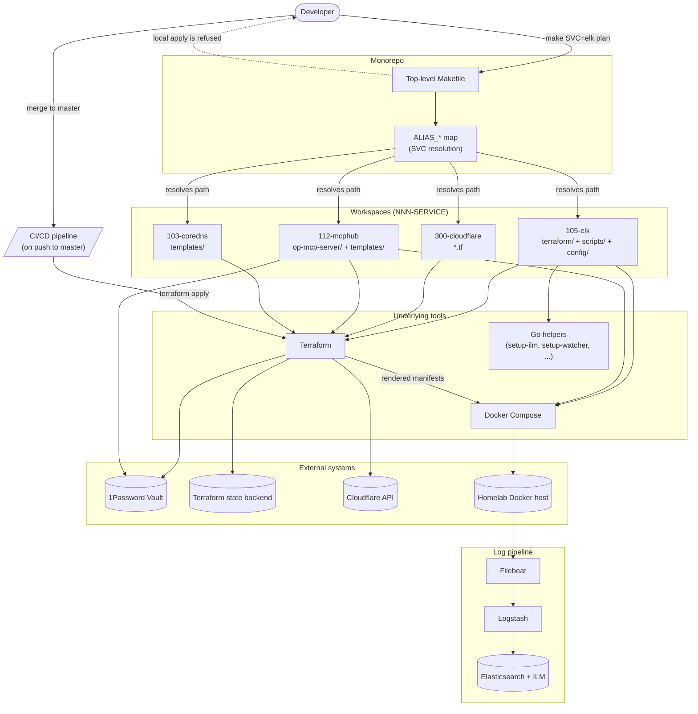

# Homelab Infrastructure Monorepo / 홈랩 인프라 모노레포

> **Manual `apply` is disabled. All changes deploy through CI/CD.**
> **수동 `apply`는 비활성화되어 있습니다. 모든 변경 사항은 CI/CD를 통해 배포됩니다.**

A monorepo of self-contained infrastructure-as-code workspaces for a personal homelab and a small set of external (cloud) integrations. Every workspace is named with a flat `NNN-SERVICE` identifier and managed through a single top-level `Makefile`.

개인 홈랩과 소규모 외부(클라우드) 통합을 위한 독립형 인프라스트럭처-코드(IaC) 워크스페이스 모노레포입니다. 각 워크스페이스는 `NNN-SERVICE` 형식의 평탄한(flat) 식별자로 명명되며, 최상위 `Makefile` 하나로 전부 제어합니다.

---

## Table of Contents / 목차

- [Overview / 개요](#overview--개요)
- [Features / 주요 기능](#features--주요-기능)
- [Architecture / 아키텍처](#architecture--아키텍처)
- [Repository Layout / 저장소 구성](#repository-layout--저장소-구성)
- [Workspaces / 워크스페이스](#workspaces--워크스페이스)
- [Numbering Convention / 번호 규칙](#numbering-convention--번호-규칙)
- [Quick Start / 빠른 시작](#quick-start--빠른-시작)
- [Configuration / 설정](#configuration--설정)
- [Commands Reference / 명령어 참조](#commands-reference--명령어-참조)
- [Local Development / 로컬 개발](#local-development--로컬-개발)
- [Testing / 테스트](#testing--테스트)
- [Contributing / 기여 방법](#contributing--기여-방법)
- [License / 라이선스](#license--라이선스)
- [Additional Documentation / 추가 문서](#additional-documentation--추가-문서)

---

## Overview / 개요

Each workspace is a standalone unit of deployment:

- A **Terraform workspace** provisions external APIs (Cloudflare, GitHub, GCP, Slack, …) or bootstraps a local host.
- A **Docker Compose workspace** runs containerised services on the homelab.
- A **template-only workspace** keeps reusable `.tftpl` files that Terraform renders into per-environment manifests.

A single `Makefile` dispatches commands to the correct workspace by resolving a short alias (e.g. `SVC=elk`) to the full directory path. Secrets are sourced at apply time from a 1Password vault, and changes are merged into `master` to trigger CI/CD — direct `terraform apply` from a workstation is intentionally blocked.

각 워크스페이스는 독립적인 배포 단위입니다:

- **Terraform 워크스페이스**는 외부 API(Cloudflare, GitHub, GCP, Slack 등)를 프로비저닝하거나 로컬 호스트를 부트스트랩합니다.
- **Docker Compose 워크스페이스**는 홈랩에서 컨테이너 기반 서비스를 실행합니다.
- **템플릿 전용 워크스페이스**는 Terraform이 환경별 매니페스트로 렌더링할 수 있는 재사용 가능한 `.tftpl` 파일을 보관합니다.

단일 `Makefile`이 짧은 별칭(예: `SVC=elk`)을 전체 디렉터리 경로로 해석하여 올바른 워크스페이스에 명령을 전달합니다. 시크릿은 apply 시점에 1Password 볼트에서 가져오며, 모든 변경은 `master`로 병합되어 CI/CD를 통해 배포됩니다. 워크스테이션에서 직접 `terraform apply`를 실행하는 것은 의도적으로 차단됩니다.

---

## Features / 주요 기능

- **Unified orchestration** — one `Makefile`, one set of commands, every workspace.
- **Flat naming convention** — predictable ordering, easy mental mapping.
- **Hybrid Terraform + Compose** — mix provisioning engines within a single repo.
- **Template-driven rendering** — `.tftpl` files generate per-environment manifests.
- **1Password secret injection** — secrets never live in the repository.
- **Validation before plan** — `checks.tf` and `validation.tf` enforce invariants.
- **CI/CD-only deploys** — local `apply` is refused at the Makefile level.
- **Containerised log shipping** — Filebeat/Logstash pipelines push to Elasticsearch with ILM.
- **Workspace alias map** — `SVC=elk` is friendlier than `SVC=105-elk/terraform`.

- **통합 오케스트레이션** — 단일 `Makefile`과 단일 명령어 세트로 모든 워크스페이스를 제어합니다.
- **평탄한 명명 규칙** — 예측 가능한 순서와 직관적인 매핑이 가능합니다.
- **Terraform + Compose 하이브리드** — 단일 저장소에서 프로비저닝 엔진을 혼합합니다.
- **템플릿 기반 렌더링** — `.tftpl` 파일이 환경별 매니페스트를 생성합니다.
- **1Password 시크릿 주입** — 시크릿은 저장소에 저장되지 않습니다.
- **plan 이전 검증** — `checks.tf`와 `validation.tf`가 불변식을 강제합니다.
- **CI/CD 전용 배포** — 로컬 `apply`는 Makefile 레벨에서 거부됩니다.
- **컨테이너 기반 로그 수집** — Filebeat/Logstash 파이프라인이 ILM과 함께 Elasticsearch로 전송합니다.
- **워크스페이스 별칭 맵** — `SVC=elk`가 `SVC=105-elk/terraform`보다 사용하기 쉽습니다.

---

## Architecture / 아키텍처

The repository is a dispatcher. A developer invokes a `make` target, the `Makefile` resolves the alias, and the underlying tool (Terraform, Docker Compose, or a small Go helper) takes over. Secrets are read from 1Password at apply time; logs are shipped to Elasticsearch.

저장소는 디스패처입니다. 개발자가 `make` 타깃을 호출하면 `Makefile`이 별칭을 해석하고, 그 아래의 도구(Terraform, Docker Compose, 또는 작은 Go 헬퍼)가 동작을 이어받습니다. 시크릿은 apply 시점에 1Password에서 읽고, 로그는 Elasticsearch로 전송됩니다.


```mermaid
flowchart TB
  Dev([Developer])

  subgraph Repo["Monorepo"]
    MF[Top-level Makefile]
    Aliases["ALIAS_* map<br/>(SVC resolution)"]
  end

  subgraph Workspaces["Workspaces (NNN-SERVICE)"]
    Cdns["103-coredns<br/>templates/"]
    Elk["105-elk<br/>terraform/ + scripts/ + config/"]
    Mcp["112-mcphub<br/>op-mcp-server/ + templates/"]
    Cf["300-cloudflare<br/>*.tf"]
  end

  subgraph Tooling["Underlying tools"]
    TF[Terraform]
    Compose[Docker Compose]
    Go["Go helpers<br/>(setup-ilm, setup-watcher, ...)"]
  end

  subgraph Backends["External systems"]
    OP[(1Password Vault)]
    State[(Terraform state backend)]
    CloudflareAPI[(Cloudflare API)]
    DockerHost[(Homelab Docker host)]
  end

  subgraph Logging["Log pipeline"]
    FB[Filebeat]
    LS[Logstash]
    ES[(Elasticsearch + ILM)]
  end

  CICD[/"CI/CD pipeline<br/>(on push to master)"/]

  Dev -- "make SVC=elk plan" --> MF
  MF --> Aliases
  Aliases -->|resolves path| Cdns
  Aliases -->|resolves path| Elk
  Aliases -->|resolves path| Mcp
  Aliases -->|resolves path| Cf

  Elk --> TF
  Cf --> TF
  Mcp --> TF
  Cdns --> TF
  Elk --> Compose
  Mcp --> Compose
  Elk --> Go

  TF --> OP
  Mcp --> OP
  TF --> State
  TF --> CloudflareAPI

  TF -- "rendered manifests" --> Compose
  Compose --> DockerHost
  DockerHost --> FB
  FB --> LS --> ES

  MF -. "local apply is refused" .-> Dev
  Dev -- "merge to master" --> CICD
  CICD -- "terraform apply" --> TF
```

Key design points / 핵심 설계 포인트:

1. **The `Makefile` is the only entry point** for every workspace. This keeps the contributor surface area small.
2. **CI/CD is the only path that mutates state.** The `apply` target in the Makefile is a guard that prints a refusal message and exits non-zero.
3. **`onepassword.tf` files** declare data sources that read secrets from 1Password at apply time.
4. **Templates (`*.tftpl`)** are rendered with `templatefile()` into rendered Dockerfiles, Compose files, and ILM policies.
5. **Go scripts** (e.g. `setup-ilm.go`, `setup-watcher.go`, `remove-promtail.go`) handle one-shot bootstrap and maintenance tasks that don't fit into a Terraform resource.

1. **`Makefile`만이 모든 워크스페이스의 진입점**입니다. 이를 통해 기여자 학습 곡선을 최소화합니다.
2. **CI/CD가 state를 변경할 수 있는 유일한 경로**입니다. Makefile의 `apply` 타깃은 거부 메시지를 출력하고 비정상 종료하는 가드 역할을 합니다.
3. **`onepassword.tf` 파일**은 apply 시점에 1Password에서 시크릿을 읽는 데이터 소스를 선언합니다.
4. **템플릿(`*.tftpl`)**은 `templatefile()`을 통해 Dockerfile, Compose 파일, ILM 정책으로 렌더링됩니다.
5. **Go 스크립트**(예: `setup-ilm.go`, `setup-watcher.go`, `remove-promtail.go`)는 Terraform 리소스로 표현하기 어려운 일회성 부트스트랩 및 유지보수 작업을 처리합니다.

---

## Repository Layout / 저장소 구성

The top-level layout of this repository is intentionally flat: shared governance files at the root, then `NNN-SERVICE` workspace directories.

저장소 최상위는 의도적으로 평탄하게 구성되어 있습니다. 공유 거버넌스 파일이 루트에 있고, 그 아래에 `NNN-SERVICE` 워크스페이스 디렉터리가 위치합니다.

```text
/
├── AGENTS.md               # Workspace-level agent guidance
├── ARCHITECTURE.md         # Cross-workspace architecture notes
├── CODE_STYLE.md           # Coding standards (Go, Terraform, .tftpl)
├── CONTRIBUTING.md         # Contribution workflow
├── DEPENDENCY_MAP.md       # Provider / module / image dependencies
├── LICENSE                 # Project license
├── Makefile                # The single entry point
├── OWNERS                  # Code-review approvers
├── OWNERS_ALIASES          # Alias roster for OWNERS
├── README.md               # This document
├── build.env               # Shared build-time environment variables
│
├── 103-coredns/            # Internal — CoreDNS templates
├── 105-elk/                # Internal — ELK log stack
├── 112-mcphub/             # Internal — MCP hub / op-mcp-server
└── 300-cloudflare/         # External — Cloudflare API provisioning
```

> The `Makefile` registers aliases for additional workspaces that are stored as sibling directories (for example `100-pve`, `110-n8n`, `200-oc`, `215-synology`, `220-youtube`, `301-github`, `310-safetywallet`, `320-slack`, `400-gcp`, and others). This README focuses on the workspaces present in the current checkout; the alias map in the `Makefile` is the canonical source of truth for the full set.
>
> `Makefile`은 동일한 방식으로 형제 디렉터리에 저장된 추가 워크스페이스(예: `100-pve`, `110-n8n`, `200-oc`, `215-synology`, `220-youtube`, `301-github`, `310-safetywallet`, `320-slack`, `400-gcp` 등)에 대한 별칭을 등록합니다. 이 README는 현재 체크아웃에 포함된 워크스페이스를 중심으로 설명하며, 전체 워크스페이스의 정식 출처는 `Makefile`의 별칭 맵입니다.

---

## Workspaces / 워크스페이스

### `103-coredns` — CoreDNS

Template-only workspace. Renders the Corefile, Docker Compose manifest, and Filebeat sidecar configuration from `.tftpl` files under `templates/`. No Terraform state is produced — the rendered artefacts are consumed by the host that runs CoreDNS.

템플릿 전용 워크스페이스입니다. `templates/` 디렉터리의 `.tftpl` 파일을 사용해 Corefile, Docker Compose 매니페스트, Filebeat 사이드카 구성을 렌더링합니다. Terraform state는 생성되지 않으며, 렌더링된 산출물은 CoreDNS를 실행하는 호스트에서 사용됩니다.

```
103-coredns/
├── AGENTS.md
├── README.md
└── templates/
    ├── AGENTS.md
    ├── Corefile.tftpl
    ├── docker-compose.yml.tftpl
    └── filebeat.yml.tftpl
```

### `105-elk` — ELK stack

The largest workspace. It composes Elasticsearch, Logstash, Filebeat, and an ILM policy. It has both a top-level `docker-compose.yml` (for direct `docker compose` workflows) and a `terraform/` subdirectory that provisions the same stack declaratively. Go helpers in `scripts/` perform bootstrap and one-shot maintenance.

가장 큰 워크스페이스입니다. Elasticsearch, Logstash, Filebeat, ILM 정책을 구성합니다. 최상위 `docker-compose.yml`(직접 `docker compose` 워크플로용)과 동일한 스택을 선언적으로 프로비저닝하는 `terraform/` 하위 디렉터리를 모두 포함합니다. `scripts/`의 Go 헬퍼는 부트스트랩 및 일회성 유지보수를 수행합니다.

```
105-elk/
├── AGENTS.md
├── docker-compose.yml       # Direct-Compose entry point
├── ilm-policy.json          # Pre-rendered ILM policy
├── scripts/                 # Go bootstrap / maintenance helpers
│   ├── remove-promtail
│   ├── remove-promtail.go
│   ├── setup-ilm.go
│   └── setup-watcher.go
├── config/                  # Pre-rendered config artefacts
│   ├── AGENTS.md
│   ├── Dockerfile.logstash
│   ├── filebeat.yml
│   ├── ilm-policy.json
│   ├── logstash.conf
│   └── logstash.yml
├── templates/               # Source-of-truth .tftpl files
│   ├── AGENTS.md
│   ├── Dockerfile.logstash.tftpl
│   ├── docker-compose.yml.tftpl
│   ├── filebeat.yml.tftpl
│   ├── ilm-policy.json.tftpl
│   ├── logstash.conf.tftpl
│   ├── logstash.yml.tftpl
│   └── setup-ilm.sh.tftpl
└── terraform/               # Declarative provisioning (SVC=elk target)
    ├── AGENTS.md
    ├── README.md
    ├── checks.tf            # Pre-plan invariant checks
    ├── main.tf
    ├── onepassword.tf       # 1Password secret data sources
    ├── outputs.tf
    ├── providers.tf
    ├── validation.tf        # Variable validation blocks
    ├── variables.tf
    └── versions.tf          # Provider version pins
```

### `112-mcphub` — MCP hub

A workspace for a Model Context Protocol hub. It bundles:

- Three container images (`Dockerfile.dev-browser`, `Dockerfile.playwright`, `Dockerfile.proxmox`).
- An `op-mcp-server` Node.js sub-package that bridges 1Password items into the MCP world.
- A `patches/n8n/` directory with JavaScript patches applied to upstream n8n.
- A `config/` directory with entrypoint patching utilities written in Go and JavaScript.
- A `templates/` directory with rendered Docker Compose, Filebeat, and MCP settings.
- `mcp_servers.json` and `validate_mcps.py` for inventory and validation.

Model Context Protocol 허브를 위한 워크스페이스입니다. 다음을 포함합니다:

- 세 개의 컨테이너 이미지(`Dockerfile.dev-browser`, `Dockerfile.playwright`, `Dockerfile.proxmox`).
- 1Password 항목을 MCP 세계로 연결하는 Node.js 서브 패키지 `op-mcp-server`.
- 업스트림 n8n에 적용되는 JavaScript 패치가 담긴 `patches/n8n/` 디렉터리.
- Go와 JavaScript로 작성된 entrypoint 패치 유틸리티를 담은 `config/` 디렉터리.
- 렌더링된 Docker Compose, Filebeat, MCP 설정을 담은 `templates/` 디렉터리.
- 인벤토리 및 검증을 위한 `mcp_servers.json`과 `validate_mcps.py`.

```
112-mcphub/
├── AGENTS.md
├── Dockerfile.dev-browser
├── Dockerfile.playwright
├── Dockerfile.proxmox
├── README.md
├── mcp_servers.json         # MCP server inventory
├── validate_mcps.py         # MCP config validator
├── patches/
│   └── n8n/
│       ├── license-state.js
│       └── license.js
├── op-mcp-server/           # 1Password ↔ MCP bridge (Node.js)
│   ├── AGENTS.md
│   ├── index.mjs
│   ├── package-lock.json
│   └── package.json
├── config/                  # Entrypoint patch utilities
│   ├── AGENTS.md
│   ├── entrypoint-patch.go
│   ├── filebeat.yml
│   ├── patch-placeholder.cjs
│   └── patch-sdk-schema.cjs
└── templates/               # Rendered manifests
    ├── AGENTS.md
    ├── docker-compose-op-connect.yml.tftpl
    ├── docker-compose.yml.tftpl
    ├── filebeat.yml.tftpl
    └── mcp_settings.json.tftpl
```

### `300-cloudflare` — Cloudflare

A pure-Terraform workspace that manages DNS records, Zero-Trust Access policies, identity providers, and Logpush jobs on Cloudflare. It splits outputs into project-specific files (`outputs-jclee.tf`, `outputs-homelab.tf`, `outputs-synology.tf`) and a generic `outputs.tf`.

Cloudflare의 DNS 레코드, Zero-Trust Access 정책, ID 공급자, Logpush 작업을 관리하는 순수 Terraform 워크스페이스입니다. 출력은 프로젝트별 파일(`outputs-jclee.tf`, `outputs-homelab.tf`, `outputs-synology.tf`)과 범용 `outputs.tf`로 분리됩니다.

```
300-cloudflare/
├── AGENTS.md
├── README.md
├── access.tf
├── checks.tf
├── dns.tf
├── identity-provider.tf
├── locals.tf
├── logpush.tf
├── main.tf
├── onepassword.tf
├── outputs-homelab.tf
├── outputs-jclee.tf
├── outputs-synology.tf
└── outputs.tf
```

---

## Numbering Convention / 번호 규칙

| Range / 범위 | Purpose / 용도 |
| --- | --- |
| `1`–`255` | Internal homelab services / 홈랩 내부 서비스 |
| `300`+ | External / cloud services / 외부 / 클라우드 서비스 |

The convention is enforced socially, not programmatically — keep new workspaces in the right band when adding them. If you need to slot a workspace between two existing ones, the new `NNN` must be unique and ordered.

이 규칙은 도구로 강제되지 않고 컨벤션으로 유지됩니다. 새 워크스페이스를 추가할 때 올바른 대역에 배치하세요. 기존 워크스페이스 사이에 삽입이 필요한 경우, 새 `NNN`은 고유하고 정렬 순서를 따라야 합니다.

---

## Quick Start / 빠른 시작

### Prerequisites / 사전 준비

| Tool / 도구 | Why / 용도 | Install / 설치 |
| --- | --- | --- |
| `make` | The only entry point / 유일한 진입점 | Preinstalled on most Unix systems |
| `terraform` | Plan / apply workspaces / 워크스페이스 plan/apply | `tfenv install` or your distro's package manager |
| `docker` + `docker compose` | Run rendered Compose stacks / 렌더링된 Compose 스택 실행 | `docker.com` install instructions |
| `go` (1.21+) | Build helpers in `105-elk/scripts/` / `105-elk/scripts/`의 헬퍼 빌드 | `go.dev` install instructions |
| `node` + `npm` | Build `112-mcphub/op-mcp-server` / `112-mcphub/op-mcp-server` 빌드 | `nodejs.org` install instructions |
| 1Password CLI (`op`) | Read secrets at apply time / apply 시점에 시크릿 읽기 | `developer.1password.com/docs/cli` |

### First-time setup / 최초 설정

```bash
# 1. Clone the repository
git clone <repo-url> homelab-infra
cd homelab-infra

# 2. Confirm a workspace exists
make SVC=cloudflare help    # Should print the workspace's internal help

# 3. Initialise Terraform for a workspace
make SVC=cloudflare init

# 4. Produce a plan (apply is refused locally)
make SVC=cloudflare plan
```

`plan` produces `tfplan` inside the resolved workspace directory. Inspect it, then push the change to `master` to let CI/CD perform the `apply`.

`plan`은 해석된 워크스페이스 디렉터리에 `tfplan`을 생성합니다. 결과를 검토한 다음 변경 사항을 `master`로 푸시하여 CI/CD가 `apply`를 수행하도록 합니다.

---

## Configuration / 설정

### 1Password integration / 1Password 통합

Workspaces that need secrets declare them in `onepassword.tf` as `data "onepassword_item"` blocks. The provider is configured in `providers.tf`; the actual vault UUID, account name, and item selectors live in `variables.tf` and are typically read from `build.env` and a workspace-level `terraform.tfvars`.

시크릿이 필요한 워크스페이스는 `onepassword.tf`에 `data "onepassword_item"` 블록으로 선언합니다. 공급자는 `providers.tf`에서 설정되며, 실제 볼트 UUID, 계정명, 항목 셀렉터는 `variables.tf`에 정의되고 일반적으로 `build.env`와 워크스페이스 수준의 `terraform.tfvars`에서 읽습니다.

```hcl
# Example pattern (see 105-elk/terraform/onepassword.tf)
data "onepassword_item" "elastic_password" {
  vault = var.op_vault_id
  title = "elasticsearch-admin"
}
```

### Shared environment / 공유 환경 변수

`build.env` at the repository root carries build-time variables exported to sub-Makefiles and to Terraform via `TF_VAR_…` prefixes. Keep workspace-specific values in workspace-level `terraform.tfvars` files (gitignored where appropriate).

저장소 루트의 `build.env`는 빌드 시 변수를 담으며, 서브 Makefile과 `TF_VAR_…` 접두사를 통해 Terraform으로 전달됩니다. 워크스페이스별 값은 워크스페이스 수준의 `terraform.tfvars`에 보관하세요(필요한 경우 `.gitignore` 처리).

### Validation rules / 검증 규칙

`checks.tf` enforces preconditions (for example, "the target DNS zone must exist") and `validation.tf` enforces variable-level rules. The `validate` Makefile target surfaces them; the `plan` target also fails fast when they fire.

`checks.tf`는 사전 조건(예: "대상 DNS 존이 존재해야 함")을 강제하고, `validation.tf`는 변수 수준 규칙을 강제합니다. `validate` Makefile 타깃이 이를 노출하며, `plan` 타깃도 조건 위반 시 빠르게 실패합니다.

---

## Commands Reference / 명령어 참조

All targets accept `SVC=<alias>` (e.g. `SVC=elk`). The default is `SVC=100-pve`.

모든 타깃은 `SVC=<alias>`(예: `SVC=elk`)를 인자로 받습니다. 기본값은 `SVC=100-pve`입니다.

| Target / 타깃 | Description / 설명 |
| --- | --- |
| `help` | Print the auto-generated target list / 자동 생성된 타깃 목록 출력 |
| `init` | `terraform init` in the resolved workspace / 해석된 워크스페이스에서 `terraform init` |
| `plan` | `terraform plan -out=tfplan` in the resolved workspace / 해석된 워크스페이스에서 `terraform plan -out=tfplan` |
| `apply` | **Refused locally** — print a refusal and exit non-zero / **로컬에서 거부됨** — 거부 메시지 출력 후 비정상 종료 |
| `verify` | Run `terraform verify` / `terraform verify` 실행 |
| `validate` | Run `terraform validate` (and pre-flight checks where defined) / `terraform validate` 실행(정의된 경우 사전 점검 포함) |
| `fmt` | Run `terraform fmt -recursive` / `terraform fmt -recursive` 실행 |
| `lint` | Workspace-aware Terraform linter runner / 워크스페이스 인식 Terraform 린터 실행기 |
| `lint-go` | Run `go vet` / `golangci-lint` over Go helpers / Go 헬퍼에 `go vet` / `golangci-lint` 실행 |
| `drift-check` | Detect state drift against the live infrastructure / 라이브 인프라 대비 state 드리프트 감지 |
| `backup` | Snapshot the Terraform state / Terraform state 스냅샷 |
| `test` | Run the full test matrix / 전체 테스트 매트릭스 실행 |
| `test-unit` | Run unit tests only / 단위 테스트만 실행 |
| `test-integration` | Run integration tests only / 통합 테스트만 실행 |
| `test-workspace` | Run workspace-scoped tests for `SVC` / `SVC`에 대해 워크스페이스 범위 테스트 실행 |
| `docs` | Regenerate workspace documentation / 워크스페이스 문서 재생성 |
| `pre-commit-install` | Install pre-commit hooks / pre-commit 훅 설치 |
| `pre-commit-run` | Run pre-commit hooks on all files / 전체 파일에 pre-commit 훅 실행 |
| `setup` | One-shot bootstrap of a fresh checkout (providers, hooks, …) / 신규 체크아웃의 일회성 부트스트랩(공급자, 훅 등) |

Examples / 예시:

```bash
# Plan a workspace by its short alias
make SVC=elk plan

# Initialise by full path (also works)
make SVC=105-elk/terraform init

# Run pre-commit hooks across the whole repo
make pre-commit-run

# Drift-check the Cloudflare workspace
make SVC=cloudflare drift-check
```

---

## Local Development / 로컬 개발

### Working in a Terraform workspace / Terraform 워크스페이스에서의 작업

1. `cd` into the workspace (or use `make SVC=<alias>` from the root).
2. Make your changes to `*.tf` and `*.tftpl` files.
3. Run `make SVC=<alias> fmt validate plan`.
4. Inspect `tfplan` with `terraform show -json tfplan | jq` if needed.
5. Commit the change; CI/CD will run `apply`.

1. 워크스페이스로 이동하거나 루트에서 `make SVC=<alias>`를 사용합니다.
2. `*.tf` 및 `*.tftpl` 파일을 수정합니다.
3. `make SVC=<alias> fmt validate plan`을 실행합니다.
4. 필요 시 `terraform show -json tfplan | jq`로 `tfplan`을 검토합니다.
5. 변경 사항을 커밋하면 CI/CD가 `apply`를 실행합니다.

### Working in a Compose-only workspace / Compose 전용 워크스페이스에서의 작업

For workspaces that produce Docker Compose output (e.g. `103-coredns`, the rendered artefacts in `105-elk`), follow the `.tftpl` → `docker compose up -d` flow:

1. Edit the `.tftpl` source-of-truth file.
2. Re-render (Terraform handles this when you `plan` / `apply`).
3. `cd` into the rendered output location and run `docker compose up -d`.
4. Tail logs through the Filebeat sidecar to Elasticsearch.

Compose 출력을 생성하는 워크스페이스(예: `103-coredns`, `105-elk`의 렌더링된 산출물)는 `.tftpl` → `docker compose up -d` 흐름을 따릅니다:

1. `.tftpl` 원본 파일을 수정합니다.
2. `plan` / `apply` 시 Terraform이 다시 렌더링합니다.
3. 렌더링된 출력 위치로 이동해 `docker compose up -d`를 실행합니다.
4. Filebeat 사이드카를 통해 Elasticsearch로 로그를 전송합니다.

### Editing Go helpers / Go 헬퍼 수정

```bash
cd 105-elk/scripts
go vet ./...
go build -o setup-ilm ./setup-ilm.go
```

Always rebuild the compiled artefacts (`remove-promtail`, `setup-ilm`, `setup-watcher`) before committing; the `lint-go` target is wired into the standard hook set.

커밋 전에 컴파일된 산출물(`remove-promtail`, `setup-ilm`, `setup-watcher`)을 항상 다시 빌드하세요. `lint-go` 타깃이 표준 훅 세트에 연결되어 있습니다.

### Editing the Node.js MCP bridge / Node.js MCP 브리지 수정

```bash
cd 112-mcphub/op-mcp-server
npm ci
npm test
```

The `op-mcp-server` package is invoked at apply time by the `112-mcphub` Terraform module to translate 1Password items into MCP server definitions.

`op-mcp-server` 패키지는 `112-mcphub` Terraform 모듈이 apply 시점에 호출하여 1Password 항목을 MCP 서버 정의로 변환합니다.

---

## Testing / 테스트

| Target / 타깃 | Scope / 범위 |
| --- | --- |
| `make test-unit` | Pure unit tests (Go, Python, Node) / 순수 단위 테스트(Go, Python, Node) |
| `make test-integration` | Tests that require live services (e.g. Elasticsearch) / 라이브 서비스(예: Elasticsearch)를 필요로 하는 테스트 |
| `make test-workspace` | Workspace-scoped test for the current `SVC` / 현재 `SVC`에 대한 워크스페이스 범위 테스트 |
| `make SVC=<alias> test` | Full test suite for a single workspace / 단일 워크스페이스 전체 테스트 스위트 |
| `make lint` / `make lint-go` | Static analysis / 정적 분석 |
| `make pre-commit-run` | Formatting and secret scanning / 포맷팅 및 시크릿 스캐닝 |

CI/CD runs the same matrix against every push; matching it locally reduces the rate of failed CI runs.

CI/CD는 모든 푸시에 대해 동일한 매트릭스를 실행합니다. 로컬에서도 동일하게 실행하면 CI 실패율을 줄일 수 있습니다.

---

## Contributing / 기여 방법

1. **Read the governance docs** in this order:
   - `AGENTS.md` — repository-level agent and contributor guidance.
   - `ARCHITECTURE.md` — cross-workspace architectural decisions.
   - `CODE_STYLE.md` — language-specific style rules.
   - `CONTRIBUTING.md` — review process and merge requirements.
   - `DEPENDENCY_MAP.md` — provider / module / image inventory.
2. **Pick or create a workspace.** Match the numbering convention.
3. **Make the change small.** One workspace per PR where possible.
4. **Run the local checks** (`make fmt validate plan pre-commit-run`).
5. **Open a PR.** Code-review approval is governed by `OWNERS` and `OWNERS_ALIASES`.
6. **Merge to `master`.** CI/CD takes over from there.

1. **거버넌스 문서를 다음 순서로 읽으세요**:
   - `AGENTS.md` — 저장소 수준의 에이전트 및 기여자 가이드.
   - `ARCHITECTURE.md` — 워크스페이스 간 아키텍처 결정.
   - `CODE_STYLE.md` — 언어별 스타일 규칙.
   - `CONTRIBUTING.md` — 리뷰 프로세스와 병합 요구사항.
   - `DEPENDENCY_MAP.md` — 공급자 / 모듈 / 이미지 인벤토리.
2. **워크스페이스를 선택하거나 생성하세요.** 번호 규칙을 따르세요.
3. **변경 사항을 작게 유지하세요.** 가능하면 PR당 워크스페이스 하나.
4. **로컬 점검을 실행하세요**(`make fmt validate plan pre-commit-run`).
5. **PR을 여세요.** 코드 리뷰 승인은 `OWNERS`와 `OWNERS_ALIASES`에 따라 결정됩니다.
6. **`master`로 병합하세요.** 그 이후는 CI/CD가 처리합니다.

---

## License / 라이선스

See the `LICENSE` file at the repository root. By contributing, you agree that your contributions will be licensed under the same terms.

저장소 루트의 `LICENSE` 파일을 참조하세요. 기여함으로써 자신의 기여물도 동일한 조건으로 라이선스된다는 데 동의합니다.

---

## Additional Documentation / 추가 문서

- [`AGENTS.md`](./AGENTS.md) — agent-style contributor guidance.
- [`ARCHITECTURE.md`](./ARCHITECTURE.md) — cross-workspace architecture notes.
- [`CODE_STYLE.md`](./CODE_STYLE.md) — style rules for Go, Terraform, and `.tftpl`.
- [`CONTRIBUTING.md`](./CONTRIBUTING.md) — review and merge workflow.
- [`DEPENDENCY_MAP.md`](./DEPENDENCY_MAP.md) — provider / module / image inventory.
- `OWNERS`, `OWNERS_ALIASES` — code-review approvers and alias roster.
- `Makefile` — the single command entry point (also the canonical list of workspace aliases).
- Per-workspace `AGENTS.md` files — workspace-specific contributor notes.
- Per-workspace `README.md` files — workspace-specific operational notes (e.g. `105-elk/terraform/README.md`).