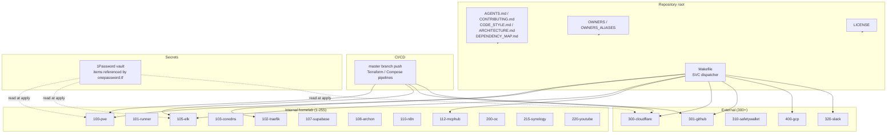

# Homelab Infrastructure Monorepo / 홈랩 인프라 모노레포

> **Manual `apply` is disabled. All changes deploy through CI/CD.**
> **수동 `apply`는 비활성화되어 있습니다. 모든 변경 사항은 CI/CD를 통해 배포됩니다.**

A monorepo of self-contained infrastructure-as-code workspaces for a personal homelab and a small set of external (cloud) integrations. Every workspace is named with a flat `NNN-SERVICE` identifier and managed through a single top-level `Makefile`.

개인 홈랩과 소규모 외부(클라우드) 통합을 위한 독립형 인프라스트럭처-코드(IaC) 워크스페이스 모노레포입니다. 각 워크스페이스는 `NNN-SERVICE` 형식의 평탄한(flat) 식별자로 명명되며, 최상위 `Makefile` 하나로 전부 제어합니다.

---

## Table of Contents / 목차

- [Overview / 개요](#overview--개요)
- [Features / 주요 기능](#features--주요-기능)
- [Architecture / 아키텍처](#architecture--아키텍처)
- [Repository Layout / 저장소 구성](#repository-layout--저장소-구성)
- [Workspaces / 워크스페이스](#workspaces--워크스페이스)
- [Numbering Convention / 번호 규칙](#numbering-convention--번호-규칙)
- [Quick Start / 빠른 시작](#quick-start--빠른-시작)
- [Configuration / 설정](#configuration--설정)
- [Commands Reference / 명령어 참조](#commands-reference--명령어-참조)
- [Local Development / 로컬 개발](#local-development--로컬-개발)
- [Testing / 테스트](#testing--테스트)
- [Contributing / 기여 방법](#contributing--기여-방법)
- [License / 라이선스](#license--라이선스)
- [Additional Documentation / 추가 문서](#additional-documentation--추가-문서)

---

## Overview / 개요

Each workspace is a self-contained unit of deployment. There are three flavors:

- **Terraform workspaces** provision external APIs (Cloudflare, GitHub, GCP, Slack, …) or bootstrap local hosts. Some expose a nested `terraform/` directory that the root `Makefile` resolves automatically.
- **Docker Compose workspaces** run containerised services on the homelab (ELK, CoreDNS, MCP Hub, …).
- **Template-only workspaces** keep reusable `.tftpl` files rendered by Terraform into per-environment manifests.

A single root `Makefile` dispatches commands to the correct workspace by resolving a short alias (`SVC=elk`) to the full directory path. Secrets are sourced at apply time from a 1Password vault, and changes merge into `master` to trigger CI/CD — direct `terraform apply` from a workstation is intentionally blocked.

각 워크스페이스는 독립적인 배포 단위입니다. 크게 세 종류로 나뉩니다.

- **Terraform 워크스페이스**는 외부 API(Cloudflare, GitHub, GCP, Slack 등)를 프로비저닝하거나 로컬 호스트를 부트스트랩합니다. 일부는 중첩된 `terraform/` 디렉터리를 노출하며, 루트 `Makefile`이 이를 자동으로 해석합니다.
- **Docker Compose 워크스페이스**는 홈랩에서 컨테이너화된 서비스(ELK, CoreDNS, MCP Hub 등)를 실행합니다.
- **템플릿 전용 워크스페이스**는 Terraform이 환경별 매니페스트로 렌더링할 수 있는 재사용 가능한 `.tftpl` 파일을 보관합니다.

루트 `Makefile` 하나가 단축 별칭(`SVC=elk`)을 전체 디렉터리 경로로 해석하여 올바른 워크스페이스로 명령을 전달합니다. 시크릿은 적용 시점에 1Password 볼트에서 가져오며, 변경 사항은 `master`로 병합되어 CI/CD를 트리거합니다. 워크스테이션에서의 직접 `terraform apply`는 의도적으로 차단되어 있습니다.

---

## Features / 주요 기능

- **Single dispatch surface / 단일 디스패치 표면**: One `Makefile` covers every workspace via `SVC=<alias>`.
- **Flat `NNN-SERVICE` naming / 평탄한 `NNN-SERVICE` 명명 규칙**: Stable directory ordering, predictable ordering for CI matrices, and clear separation between internal (1–255) and external (300+) integrations.
- **CI/CD-only apply / CI/CD 전용 apply**: The `apply` target refuses to run locally and prints the correct workflow.
- **Template-driven rendering / 템플릿 기반 렌더링**: `.tftpl` files produce consistent Docker Compose, Filebeat, and Logstash artifacts per environment.
- **1Password-backed secrets / 1Password 기반 시크릿**: Vault integration via `onepassword.tf` modules keeps credentials out of plaintext.
- **Pre-flight validation / 사전 검증**: `checks.tf`, `validation.tf`, and Go `scripts/` enforce invariants before any plan is generated.
- **Bilingual documentation / 이중 언어 문서**: `README.md` and per-workspace notes ship in English and Korean.

---

## Architecture / 아키텍처

The repository is a **dispatcher + workspace collection**. The root `Makefile` resolves `SVC` to a directory, then runs `terraform` or `docker compose` inside it. CI/CD drives every apply.


```mermaid
flowchart TB
    subgraph Repo["Repository root"]
        MF["Makefile<br/>SVC dispatcher"]
        AG["AGENTS.md / CONTRIBUTING.md<br/>CODE_STYLE.md / ARCHITECTURE.md<br/>DEPENDENCY_MAP.md"]
        OWN["OWNERS / OWNERS_ALIASES"]
        LIC["LICENSE"]
    end

    subgraph CICD["CI/CD"]
        WF["master branch push<br/>Terraform / Compose pipelines"]
    end

    subgraph Secret["Secrets"]
        OP["1Password vault<br/>items referenced by onepassword.tf"]
    end

    subgraph Internal["Internal homelab (1-255)"]
        PVE["100-pve"]
        RUN["101-runner"]
        TRA["102-traefik"]
        CD["103-coredns"]
        ELK["105-elk"]
        SUP["107-supabase"]
        ARC["108-archon"]
        N8N["110-n8n"]
        MCP["112-mcphub"]
        OC["200-oc"]
        SYN["215-synology"]
        YT["220-youtube"]
    end

    subgraph External["External (300+)"]
        CF["300-cloudflare"]
        GH["301-github"]
        SW["310-safetywallet"]
        SL["320-slack"]
        GCP["400-gcp"]
    end

    MF --> PVE
    MF --> TRA
    MF --> ELK
    MF --> MCP
    MF --> CF
    MF --> GH
    MF --> GCP
    MF --> SL

    WF --> PVE
    WF --> ELK
    WF --> CF
    WF --> GH

    OP -. read at apply .-> PVE
    OP -. read at apply .-> ELK
    OP -. read at apply .-> CF

    AG --> Repo
    OWN --> Repo
    LIC --> Repo
```

---

## Repository Layout / 저장소 구성

The repository is intentionally shallow — every workspace lives at the top level so the dispatcher can resolve it without globbing.

```
.
├── AGENTS.md                  # Agent-facing instructions (context only)
├── ARCHITECTURE.md            # Deep-dive architecture notes
├── CODE_STYLE.md              # Style guide
├── CONTRIBUTING.md            # Contribution workflow
├── DEPENDENCY_MAP.md          # Cross-workspace dependencies
├── LICENSE
├── Makefile                   # Single dispatcher for all workspaces
├── OWNERS                     # CODEOWNERS
├── OWNERS_ALIASES             # Aliases for OWNERS
├── README.md                  # This file
├── build.env                  # Shared build environment variables
├── 103-coredns/               # CoreDNS Docker Compose + templates
│   ├── README.md
│   ├── templates/
│   │   ├── Corefile.tftpl
│   │   ├── docker-compose.yml.tftpl
│   │   └── filebeat.yml.tftpl
│   └── AGENTS.md
├── 105-elk/                   # ELK stack (Docker Compose + Terraform)
│   ├── docker-compose.yml
│   ├── ilm-policy.json
│   ├── scripts/               # Go helpers: setup-ilm, setup-watcher, remove-promtail
│   ├── config/                # Static Docker / Logstash / Filebeat configs
│   ├── templates/             # .tftpl rendering sources
│   └── terraform/             # Terraform workspace (default target for SVC=elk)
├── 112-mcphub/                # MCP Hub: Dockerfiles, patches, MCP server config
│   ├── Dockerfile.dev-browser
│   ├── Dockerfile.playwright
│   ├── Dockerfile.proxmox
│   ├── mcp_servers.json
│   ├── validate_mcps.py
│   ├── patches/               # Runtime patches (n8n license state, etc.)
│   ├── op-mcp-server/         # Node.js MCP server (package.json, index.mjs)
│   ├── config/                # Entrypatch helpers, Filebeat config
│   └── templates/             # docker-compose + filebeat + mcp_settings templates
└── 300-cloudflare/            # Cloudflare DNS / Access / Logpush / IdP
    ├── access.tf
    ├── checks.tf
    ├── dns.tf
    ├── identity-provider.tf
    ├── locals.tf
    ├── logpush.tf
    ├── main.tf
    ├── onepassword.tf
    ├── outputs-homelab.tf
    ├── outputs-jclee.tf
    ├── outputs-synology.tf
    ├── outputs.tf
    ├── README.md
    └── AGENTS.md
```

> **Note / 참고**: Only directories present in this repository are listed. Aliases such as `pve`, `traefik`, `supabase`, `archon`, `n8n`, `oc`, `synology`, `youtube`, `github`, `safetywallet`, `slack`, and `gcp` are resolved by the `Makefile` from sibling workspaces not shown in the snippet above.

---

## Workspaces / 워크스페이스

| Alias / 별칭 | Path / 경로 | Type / 종류 | Purpose / 용도 |
|---|---|---|---|
| `jclee` | `80-jclee` | Terraform | Personal identity / bootstrap resources |
| `pve` | `100-pve` | Terraform | Proxmox VE bootstrap |
| `runner` | `101-runner` | Terraform | CI runner host |
| `traefik` | `102-traefik/terraform` | Terraform | Reverse proxy |
| `coredns` | `103-coredns` | Compose + templates | Authoritative DNS for the lab |
| `elk` | `105-elk/terraform` | Compose + Terraform | Elasticsearch / Logstash / Kibana + ILM |
| `supabase` | `107-supabase` | Compose | Local Supabase stack |
| `archon` | `108-archon/terraform` | Terraform | Archon service provisioning |
| `n8n` | `110-n8n` | Compose | n8n workflow automation |
| `mcphub` | `112-mcphub` | Compose + MCP | MCP Hub, browsers, Proxmox MCP server |
| `oc` | `200-oc` | Compose | OpenShift / OKD |
| `synology` | `215-synology` | Compose | Synology NAS integration |
| `youtube` | `220-youtube` | Compose | YouTube pipeline services |
| `cloudflare` | `300-cloudflare` | Terraform | DNS, Access, Logpush, Identity Provider |
| `github` | `301-github` | Terraform | GitHub org / repo settings |
| `safetywallet` | `310-safetywallet` | Terraform | External service integration |
| `slack` | `320-slack` | Terraform | Slack workspace configuration |
| `gcp` | `400-gcp` | Terraform | Google Cloud project bootstrap |

Each workspace has its own `README.md` and `AGENTS.md` describing local concerns. Read those before editing.

각 워크스페이스에는 자체 `README.md`와 `AGENTS.md`가 있어 로컬 이슈를 설명합니다. 편집 전 반드시 읽어 주세요.

---

## Numbering Convention / 번호 규칙

The first segment of the directory name is a zero-padded integer. Two bands are reserved:

- **`1`–`255` — Internal homelab / 내부 홈랩**: Hosts, network services, container stacks running on local hardware. Address range documented per workspace (placeholders only; no hardcoded RFC1918 addresses in this README).
- **`300`+ — External / 외부**: Cloud and SaaS providers (Cloudflare, GitHub, Slack, GCP, …).

Gaps in the numbering are intentional — they leave room to insert new workspaces without renumbering. When adding a new one, pick the lowest free number in the correct band.

디렉터리 이름의 첫 세그먼트는 0으로 패딩된 정수입니다. 두 개의 대역이 예약되어 있습니다.

- **`1`–`255` — 내부 홈랩**: 로컬 하드웨어에서 실행되는 호스트, 네트워크 서비스, 컨테이너 스택. 주소 범위는 워크스페이스별 문서에 명시(이 README에는 RFC1918 주소를 하드코딩하지 않습니다).
- **`300` 이상 — 외부**: 클라우드 및 SaaS 공급자(Cloudflare, GitHub, Slack, GCP 등).

번호 사이의 공백은 의도적입니다 — 번호를 다시 매기지 않고 새 워크스페이스를 삽입할 공간을 남겨 둡니다. 새 워크스페이스를 추가할 때는 해당 대역에서 사용 가능한 가장 낮은 번호를 선택하세요.

---

## Quick Start / 빠른 시작

### Prerequisites / 사전 준비

- `terraform` ≥ 1.5
- `docker` + `docker compose`
- `make`
- `python3` (for `validate_mcps.py`)
- `go` ≥ 1.21 (for `scripts/` helpers under `105-elk`)
- `pre-commit`
- `op` (1Password CLI) signed in to the vault referenced by `onepassword.tf`

### Pick a workspace / 워크스페이스 선택

```bash
# List all known aliases
make help

# Show what 'elk' resolves to
make SVC=elk plan
```

### Plan a workspace / 워크스페이스 플랜 실행

```bash
make SVC=cloudflare plan    # writes tfplan inside 300-cloudflare/
make SVC=elk plan           # writes tfplan inside 105-elk/terraform/
make SVC=mcphub plan        # writes tfplan inside 112-mcphub/
```

### Inspect / 검증

```bash
make SVC=cloudflare verify
make SVC=cloudflare validate
make SVC=cloudflare fmt
```

### Deploy / 배포

Do **not** run `make apply` locally — it is intentionally disabled. Open a PR, get review, merge to `master`, and let CI/CD pick up the change.

`make apply`를 로컬에서 실행하지 마세요. 의도적으로 비활성화되어 있습니다. PR을 열고 리뷰를 받은 뒤 `master`로 병합하면 CI/CD가 변경 사항을 가져갑니다.

```bash
# This will fail with a red ERROR message and instructions
make SVC=cloudflare apply
```

---

## Configuration / 설정

### Shared environment / 공유 환경

- **`build.env`** — exported into Make targets; tune logging, parallelism, and feature flags here.

### Per-workspace inputs / 워크스페이스별 입력

Terraform workspaces expose `variables.tf` (or per-workspace `main.tf` variables). Common patterns:

- **1Password references** in `onepassword.tf` — resolved by the `onepassword` Terraform provider at apply time. Never commit secrets.
- **Environment-aware `.tftpl` files** — rendered into per-environment manifests by `templatefile()` calls.

### Docker Compose workspaces / Docker Compose 워크스페이스

- **`config/`** holds static files that ship verbatim (e.g. `Dockerfile.logstash`, `filebeat.yml`, `logstash.conf`).
- **`templates/`** holds `.tftpl` sources rendered by Terraform into the working tree.

### Go helpers / Go 헬퍼

`105-elk/scripts/` contains small Go programs (`setup-ilm.go`, `setup-watcher.go`, `remove-promtail.go`). They are invoked from CI to maintain Elasticsearch ILM, file watcher state, and Promtail cleanup.

---

## Commands Reference / 명령어 참조

All targets accept `SVC=<alias>` (default `100-pve`). The dispatcher validates that the resolved directory exists and prints the available aliases if it does not.

모든 타깃은 `SVC=<alias>`를 받습니다(기본값 `100-pve`). 디스패처는 해석된 디렉터리가 존재하는지 확인하고, 존재하지 않으면 사용 가능한 별칭을 출력합니다.

| Target / 타깃 | Description / 설명 |
|---|---|
| `help` | Print all targets with descriptions |
| `init` | `terraform init` in the resolved workspace |
| `plan` | `terraform plan -out=tfplan` in the resolved workspace |
| `apply` | **Disabled**. Prints CI/CD instructions |
| `verify` | Run verification checks after a plan |
| `validate` | `terraform validate` |
| `fmt` | `terraform fmt -recursive` |
| `lint` | Run lint suite for the workspace |
| `lint-go` | Run `go vet` / `golangci-lint` on Go helpers |
| `drift-check` | Compare live state against the workspace |
| `backup` | Snapshot state before risky changes |
| `test` | Run all tests for the workspace |
| `test-unit` | Unit tests only |
| `test-integration` | Integration tests only |
| `test-workspace` | Workspace-level smoke tests |
| `docs` | Regenerate per-workspace documentation |
| `pre-commit-install` | Install `pre-commit` hooks |
| `pre-commit-run` | Run `pre-commit` against all files |
| `setup` | First-time workstation bootstrap |

### Examples / 예시

```bash
make help
make SVC=elk init
make SVC=cloudflare plan
make SVC=mcphub fmt
make SVC=elk lint-go
make SVC=cloudflare pre-commit-run
```

---

## Local Development / 로컬 개발

1. **Clone and enter / 클론 및 진입**

   ```bash
   git clone <repo-url> homelab-infra
   cd homelab-infra
   ```

2. **Install hooks / 훅 설치**

   ```bash
   make pre-commit-install
   ```

3. **Authenticate / 인증**

   ```bash
   op signin
   ```

4. **Iterate on a workspace / 워크스페이스에서 반복 작업**

   ```bash
   make SVC=cloudflare fmt
   make SVC=cloudflare validate
   make SVC=cloudflare plan
   ```

5. **Open a PR / PR 열기**

   Push your branch, open a PR against `master`, request review from owners listed in `OWNERS`/`OWNERS_ALIASES`, and merge once CI is green.

   브랜치를 푸시하고 `master`에 대한 PR을 열고, `OWNERS`/`OWNERS_ALIASES`에 지정된 소유자의 리뷰를 요청한 뒤 CI가 통과되면 병합하세요.

### Editing templates / 템플릿 편집

When changing a `.tftpl`:

1. Update the source in `templates/`.
2. Re-render locally with `terraform plan` (the renderer runs as part of plan).
3. Commit the rendered artifact only if the workspace intentionally checks it in; otherwise rely on CI to render at apply time.

`.tftpl`를 수정할 때는:

1. `templates/`의 소스를 업데이트합니다.
2. `terraform plan`을 통해 로컬에서 다시 렌더링합니다(렌더러는 plan의 일부로 실행됨).
3. 워크스페이스가 의도적으로 렌더링된 결과물을 체크인하는 경우에만 커밋하고, 그렇지 않으면 CI가 apply 시점에 렌더링하도록 둡니다.

---

## Testing / 테스트

- **`test-unit`** — fast, no external dependencies. Runs inside the resolved workspace.
- **`test-integration`** — may spin up containers or hit 1Password; gated by CI.
- **`test-workspace`** — workspace-level smoke tests (e.g. `105-elk` verifies ILM policy and watcher presence).
- **`validate_mcps.py`** under `112-mcphub/` validates `mcp_servers.json` against the patched schemas; run before pushing MCP changes.
- **`pre-commit-run`** — runs formatting, `terraform fmt`, `go vet`, and the `validate_mcps.py` check.

```bash
make SVC=cloudflare test-unit
make SVC=elk test-integration
make SVC=mcphub pre-commit-run
python3 112-mcphub/validate_mcps.py
```

---

## Contributing / 기여 방법

1. Read `CONTRIBUTING.md` and `CODE_STYLE.md` first.
2. Read the target workspace's `README.md` and `AGENTS.md`.
3. Branch from `master`: `git checkout -b <workspace>/<short-topic>`.
4. Keep changes scoped to **one workspace**. Cross-workspace dependencies go in `DEPENDENCY_MAP.md`.
5. Run the full pre-flight locally:

   ```bash
   make pre-commit-run
   make SVC=<alias> validate
   make SVC=<alias> plan
   ```

6. Open a PR. CI will run `plan`, `validate`, `lint`, and the workspace's test target. **Do not run `apply` locally.**
7. Get an approval from a code owner (see `OWNERS` / `OWNERS_ALIASES`) and merge.

1. 먼저 `CONTRIBUTING.md`와 `CODE_STYLE.md`를 읽으세요.
2. 대상 워크스페이스의 `README.md`와 `AGENTS.md`를 읽으세요.
3. `master`에서 브랜치를 만듭니다: `git checkout -b <workspace>/<short-topic>`.
4. 변경은 **하나의 워크스페이스**에만 한정하세요. 워크스페이스 간 의존성은 `DEPENDENCY_MAP.md`에 기록합니다.
5. 로컬에서 사전 점검을 모두 실행하세요.

   ```bash
   make pre-commit-run
   make SVC=<alias> validate
   make SVC=<alias> plan
   ```

6. PR을 엽니다. CI가 `plan`, `validate`, `lint` 및 워크스페이스의 테스트 타깃을 실행합니다. **로컬에서 `apply`를 실행하지 마세요.**
7. 코드 소유자(`OWNERS` / `OWNERS_ALIASES` 참조)의 승인을 받고 병합하세요.

---

## License / 라이선스

See [`LICENSE`](./LICENSE).

본 저장소의 라이선스 조건은 [`LICENSE`](./LICENSE) 파일을 참조하세요.

---

## Additional Documentation / 추가 문서

- [`ARCHITECTURE.md`](./ARCHITECTURE.md) — design decisions and data flow across workspaces.
- [`CODE_STYLE.md`](./CODE_STYLE.md) — Terraform, Go, Python, and Markdown conventions.
- [`CONTRIBUTING.md`](./CONTRIBUTING.md) — review process and ownership rules.
- [`DEPENDENCY_MAP.md`](./DEPENDENCY_MAP.md) — which workspaces depend on which outputs.
- Per-workspace `README.md` and `AGENTS.md` — local context, runbooks, and incident notes.

- [`ARCHITECTURE.md`](./ARCHITECTURE.md) — 워크스페이스 간 설계 결정 및 데이터 흐름.
- [`CODE_STYLE.md`](./CODE_STYLE.md) — Terraform, Go, Python, Markdown 컨벤션.
- [`CONTRIBUTING.md`](./CONTRIBUTING.md) — 리뷰 프로세스 및 소유권 규칙.
- [`DEPENDENCY_MAP.md`](./DEPENDENCY_MAP.md) — 어떤 워크스페이스가 어떤 출력에 의존하는지.
- 워크스페이스별 `README.md` 및 `AGENTS.md` — 로컬 컨텍스트, 런북, 인시던트 노트.