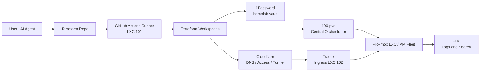

# Terraform Homelab Infrastructure / Terraform Homelab 인프라

[](https://www.terraform.io)
[](LICENSE)
[](.github/workflows)
[](https://scorecard.dev)
[](https://www.proxmox.com/)
[](Makefile)

> English version follows Korean content / 한국어 다음에 영어 버전이 이어집니다.

---

## Overview / 개요

Infrastructure-as-code monorepo for `jclee.me`. Provisions a Proxmox LXC/VM fleet, networking, monitoring, and external services via **21 Terraform workspaces** with 1Password secret injection and GitHub Actions CI/CD.

`jclee.me`를 위한 Infrastructure-as-Code 모노레포입니다. 21개의 Terraform 워크스페이스를 통해 Proxmox LXC/VM 플릿, 네트워킹, 모니터링 및 외부 서비스를 프로비저닝하며, 1Password 시크릿 주입과 GitHub Actions CI/CD로 운영됩니다.

---

## Features / 주요 기능

### Infrastructure Provisioning / 인프라 프로비저닝

- **21 Terraform workspaces** across 4 tiers (Tier 0 core, Tier 1 infra, Tier 2 VMs, Tier 3 external/cloud)
- **Proxmox LXC/VM fleet** managed as code (22 LXCs, 4 VMs across `<homelab-host>/24` subnet)
- **Single Source of Truth (SSoT)** in `100-pve/envs/prod/hosts.tf` for all host definitions

### Configuration Management / 구성 관리

- **Template-driven rendering** via `modules/proxmox/config-renderer/` — config files are NEVER hand-edited
- **Terraform modules** for reusable LXC (`modules/proxmox/lxc`), VM (`modules/proxmox/vm`), and config templates
- **Cloud-init** support for both LXC and VM provisioning

### Secret Management / 시크릿 관리

- **1Password integration** via `modules/shared/onepassword-secrets/` — 12 vault items, 48 keys
- **Zero hardcoded secrets** — all secrets injected at apply time from 1Password `homelab` vault

### CI/CD Automation / CI/CD 자동화

- **33 GitHub Actions workflows** covering PR checks, auto-merge, issue management, releases, and downstream health
- **Automated PR review** via `10_pr-review.yml` (Qodo PR-Agent)
- **Gitleaks scanning** via `05_gitleaks.yml`
- **CodeQL analysis** via `06_codeql.yml`
- **Dependency review** via `07_dependency-review.yml`
- **Auto-heal CI failures** via `60_ci-auto-heal.yml`

---

## Architecture / 아키텍처


```mermaid
flowchart LR
    Agent["User / AI Agent"] --> Repo["Terraform Repo"]
    Repo --> CI["GitHub Actions Runner<br/>LXC 101"]
    CI --> TF["Terraform Workspaces"]
    TF --> PVE["100-pve<br/>Central Orchestrator"]
    PVE --> Fleet["Proxmox LXC / VM Fleet"]
    TF --> OP["1Password<br/>homelab vault"]
    TF --> CF["Cloudflare<br/>DNS / Access / Tunnel"]
    Fleet --> ELK["ELK<br/>Logs and Search"]
    CF --> Traefik["Traefik<br/>Ingress LXC 102"]
    Traefik --> Fleet
```

### Workspace Tiers / 워크스페이스 계층

| Tier | Workspaces | Apply Order |
| ---- | ---------- | ----------- |
| 0 (core) | `100-pve` | First — provisions all LXC/VM |
| 1 (infra) | `102-traefik`, `105-elk`, `108-archon`, etc. | Second (parallel) |
| 2 (apps) | `110-n8n`, `112-mcphub`, `220-youtube`, etc. | Third |
| 3 (external) | `300-cloudflare`, `301-github`, `320-slack`, `400-gcp` | Any order |

### Config Pipeline / 구성 파이프라인

```
hosts.tf (SSoT) → module.hosts → onepassword_secrets + config_renderer
  → templatefile(.tftpl) → configs/ → SSH deploy to /opt/{service}/
```

---

## Repository Structure / 저장소 구조

```text
/
├── 100-pve/                          # Tier 0: Central orchestrator
│   ├── terraform/                    #   (all LXC/VM lifecycle)
│   │   ├── locals.tf                #   Sizing definitions
│   │   ├── lxc_configs.tf           #   LXC configuration resources
│   │   ├── vm_configs.tf            #   VM configuration resources
│   │   ├── configs/                 #   Rendered outputs (NEVER hand-edit)
│   │   │   ├── lxc-103-coredns/     #   CoreDNS LXC config bundle
│   │   │   └── rendered/            #   Auto-generated config files
│   │   └── envs/prod/hosts.tf        #   SSoT: all host IPs, VMIDs, roles
├── modules/
│   ├── proxmox/
│   │   ├── lxc/                     #   LXC resource module
│   │   ├── vm/                      #   VM resource module
│   │   ├── lxc-config/              #   LXC config templates (cloud-init, systemd)
│   │   ├── vm-config/               #   VM config templates (cloud-init, systemd)
│   │   └── config-renderer/          #   Template rendering module
│   └── shared/
│       └── onepassword-secrets/      #   1Password vault integration
├── 10x-{svc}/                        #   Tier 1: Infra (traefik, elk, archon)
├── 11x-{svc}/                        #   Tier 1: Infra (n8n, mcphub)
├── 2xx-{svc}/                        #   Tier 2: VM-based apps (oc, synology, youtube)
├── 3xx-{svc}/                        #   Tier 3: External services (cloudflare, github, slack)
├── 400-gcp/                          #   Tier 3: Google Cloud Platform
├── .github/workflows/                #   33 GitHub Actions workflows
├── modules/proxmox/vm-config/templates/  #   VM cloud-init & systemd templates
├── modules/proxmox/lxc-config/templates/ #   LXC cloud-init & systemd templates
├── Makefile                          #   Workspace automation (SVC= alias)
├── ARCHITECTURE.md                   #   Full architecture reference
├── DEPENDENCY_MAP.md                 #   Module dependency graph
├── CODE_STYLE.md                     #   Naming and template conventions
├── AGENTS.md                         #   AI agent knowledge base
└── CONTRIBUTING.md                   #   Contribution guidelines
```

---

## Automation Inventory / 자동화 인벤토리

### GitHub Actions Workflows (33 total)

| File | Purpose |
| ---- | ------- |
| `01_branch-to-pr.yml` | Convert feature branch to PR |
| `02_issue-to-branch.yml` | Create branch from issue |
| `03_pr-checks.yml` | PR validation checks |
| `04_actionlint.yml` | Workflow syntax validation |
| `05_gitleaks.yml` | Secret scanning |
| `06_codeql.yml` | Code quality analysis |
| `07_dependency-review.yml` | Dependency vulnerability review |
| `08_scorecard.yml` | OpenSSF security scorecard |
| `09_semantic-pr.yml` | Enforce semantic PR titles |
| `10_pr-review.yml` | AI-powered PR review (Qodo PR-Agent) |
| `12_dependabot-auto-merge.yml` | Auto-merge Dependabot PRs |
| `13_pr-auto-merge.yml` | Auto-merge passing PRs |
| `14_bot-auto-fix.yml` | Auto-fix linting issues |
| `15_merged-pr-cleanup.yml` | Post-merge cleanup |
| `18_issue-management.yml` | Issue lifecycle automation |
| `19_issue-backfill.yml` | Sync issues to external systems |
| `20_readme-gen.yml` | Auto-generate README |
| `21_docs-sync.yml` | Documentation sync |
| `24_release-notes.yml` | Generate release notes |
| `25_release-publish.yml` | Publish releases |
| `29_downstream-health-check.yml` | Monitor downstream services |
| `37_ci-failure-issues.yml` | Create issues for CI failures |
| `42_reusable-docs-sync.yml` | Reusable docs sync workflow |
| `43_reusable-issue-management.yml` | Reusable issue management |
| `44_reusable-pr-checks.yml` | Reusable PR checks |
| `45_reusable-gitleaks.yml` | Reusable gitleaks scan |
| `60_ci-auto-heal.yml` | Auto-heal CI failures |
| `91_issue-classification.yml` | Classify issues with AI |
| `auto-merge.yml` | General auto-merge workflow |
| `ci.yml` | Main CI workflow |
| `labeler.yml` | PR label automation |
| `welcome.yml` | New contributor welcome |
| `security/11_pr-review.yml` | Security-focused PR review |

### External Integrations

| Service | Purpose |
| ------- | ------- |
| **Qodo PR-Agent** | AI-powered PR review and description (`10_pr-review.yml`) |
| **1Password** | Secret management via `modules/shared/onepassword-secrets/` |
| **Cloudflare** | DNS, Access, and Tunnel management (`300-cloudflare/`) |
| **GitHub API** | Repository automation (`301-github/`) |

---

## Quick Start / 빠른 시작

### Prerequisites

- Terraform `>= 1.7, < 2.0` (tested with `1.10.5`)
- 1Password CLI (`op`) for secret access
- SSH access to Proxmox host
- GitHub Actions runner (LXC 101 on `<homelab-host>`)

### Clone and Initialize

```bash
git clone https://github.com/jclee941/.github
cd terraform-homelab

# Install pre-commit hooks
make pre-commit-install

# Initialize a workspace
make init SVC=100-pve
```

### Common Commands

```bash
# Plan changes
make plan SVC=100-pve

# Validate configuration
make validate SVC=100-pve

# Run tests
make test SVC=100-pve

# Lint all workspaces
make lint

# Drift check
make drift-check SVC=100-pve
```

> **Warning**: `make apply` is disabled. All changes must be applied via GitHub Actions CI/CD.

---

## Local Development / 로컬 개발

### Workspace Aliases

The Makefile provides short aliases for workspace navigation:

```bash
# Direct workspace (prefix required for disambiguation)
make plan SVC=100-pve    # → 100-pve/terraform/
make plan SVC=105-elk    # → 105-elk/terraform/

# Alias shortcuts
make plan SVC=pve        # → 100-pve
make plan SVC=elk        # → 105-elk/terraform
make plan SVC=traefik    # → 102-traefik/terraform
make plan SVC=n8n        # → 110-n8n
make plan SVC=youtube    # → 220-youtube

# Cloud aliases
make plan SVC=cloudflare # → 300-cloudflare
make plan SVC=github     # → 301-github
make plan SVC=gcp        # → 400-gcp
```

### Available Aliases

| Alias | Workspace | Description |
| ----- | --------- | ----------- |
| `jclee` | `80-jclee` | Personal workspace |
| `pve` | `100-pve` | Proxmox central |
| `runner` | `101-runner` | GitHub Actions runner |
| `traefik` | `102-traefik/terraform` | Reverse proxy |
| `elk` | `105-elk/terraform` | ELK stack |
| `supabase` | `107-supabase` | Supabase |
| `archon` | `108-archon/terraform` | Archon |
| `n8n` | `110-n8n` | n8n workflow |
| `mcphub` | `112-mcphub` | MCP Hub |
| `oc` | `200-oc` | Owncast |
| `synology` | `215-synology` | Synology |
| `youtube` | `220-youtube` | YouTube mirroring |
| `cloudflare` | `300-cloudflare` | Cloudflare |
| `github` | `301-github` | GitHub management |
| `safetywallet` | `310-safetywallet` | Safety wallet |
| `slack` | `320-slack` | Slack integration |
| `gcp` | `400-gcp` | Google Cloud |

### Pre-commit Hooks

```bash
# Install
make pre-commit-install

# Run manually
make pre-commit-run

# Format and validate
make fmt
make lint
```

---

## Makefile Commands Reference / Makefile 명령어 참고

| Command | Description |
| ------- | ----------- |
| `make init SVC=<svc>` | Initialize Terraform workspace |
| `make plan SVC=<svc>` | Create Terraform plan |
| `make apply` | **Disabled** — use CI/CD |
| `make verify SVC=<svc>` | Verify configuration |
| `make lint` | Lint all Terraform files |
| `make lint-go` | Lint Go files (if any) |
| `make fmt` | Format Terraform code |
| `make validate SVC=<svc>` | Validate Terraform modules |
| `make init` | Initialize Terraform backend |
| `make drift-check SVC=<svc>` | Check for infrastructure drift |
| `make test SVC=<svc>` | Run all tests |
| `make test-unit SVC=<svc>` | Run unit tests only |
| `make test-integration SVC=<svc>` | Run integration tests only |
| `make test-workspace SVC=<svc>` | Run workspace tests only |
| `make docs` | Generate documentation |
| `make pre-commit-install` | Install pre-commit hooks |
| `make pre-commit-run` | Run pre-commit hooks |
| `make setup` | Initial setup |
| `make help` | Show help |

---

## Adding New Infrastructure / 새 인프라 추가

### Add New LXC/VM

1. Add sizing to `100-pve/locals.tf`
2. Add host entry to `100-pve/envs/prod/hosts.tf`
3. Create service templates in `{workspace}/templates/`
4. Open PR — CI/CD handles the rest

### Add New Workspace

1. Create `{NNN}-{svc}/` directory structure
2. Add `versions.tf` with Terraform version constraint
3. Add to Makefile `ALIAS_` map if short name desired
4. Reference parent workspace `remote_state` if dependent

### Secret Rotation

1. Update secret in 1Password `homelab` vault
2. Trigger re-apply via `make plan SVC=<svc>` + merge to `master`

---

## Contribution Guide / 기여 가이드

### Workflow Philosophy

- **All changes via PR** — no direct pushes to `master`
- **CI must pass** — all 33 workflows must green before merge
- **SSoT原则** — single source of truth in `hosts.tf`
- **Template-only** — never hand-edit rendered configs

### Branch Strategy

1. Create branch from issue: `02_issue-to-branch.yml` automates this
2. Make changes following `CODE_STYLE.md`
3. Open PR with semantic title (enforced by `09_semantic-pr.yml`)
4. AI review via `10_pr-review.yml`
5. Auto-merge when checks pass via `13_pr-auto-merge.yml`

### Code Standards

- Follow naming conventions in `CODE_STYLE.md`
- Run `make lint` and `make fmt` before committing
- Update `ARCHITECTURE.md` if introducing new patterns
- Add tests for new modules (see `vm_test.tftest.hcl`)

### Testing

```bash
# Unit tests
make test-unit SVC=<svc>

# Integration tests
make test-integration SVC=<svc>

# Workspace validation
make test-workspace SVC=<svc>

# Full test suite
make test SVC=<svc>
```

---

## External Resources / 외부 리소스

| Resource | URL |
| -------- | --- |
| Infrastructure Docs | [ARCHITECTURE.md](ARCHITECTURE.md) |
| Module Dependencies | [DEPENDENCY_MAP.md](DEPENDENCY_MAP.md) |
| Code Style Guide | [CODE_STYLE.md](CODE_STYLE.md) |
| AI Agent Knowledge | [AGENTS.md](AGENTS.md) |
| Contribution Guide | [CONTRIBUTING.md](CONTRIBUTING.md) |
| Proxmox VE | <https://www.proxmox.com/> |
| Terraform | <https://www.terraform.io/> |
| Qodo PR-Agent | <https://www.qodo.ai/pr-agent/> |
| 1Password CLI | <https://developer.1password.com/docs/cli/> |

---

## License

MIT License - see [LICENSE](LICENSE) for details.
