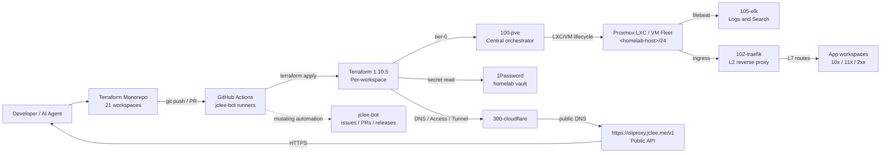

# Terraform Homelab Infrastructure / Terraform Homelab 인프라

> **Bilingual README** — Korean precedes English.
> **이중 언어 README** — 한국어 본문이 영어보다 먼저 옵니다.
>
> Generated by `gpt-5.5` (fallback: `minimax-m3` via CLIProxyAPI).
> README auto-sync target: <https://bot.jclee.me>

## Badges / 배지

| Category            | Detail                                                                                 |
| ------------------- | -------------------------------------------------------------------------------------- |
| IaC                 | Terraform `1.10.5` (`>= 1.7, < 2.0`)                                                   |
| Workspace Convention | Flat `NNN-SVC` (e.g. `100-pve`, `105-elk`, `300-cloudflare`)                          |
| CI/CD               | 14 GitHub Actions workflows (`.github/workflows/`) — owned by **jclee-bot**             |
| Secret Backend      | 1Password `homelab` vault (12 items, 48 keys)                                          |
| Review Automation   | [qodo-ai/pr-agent](https://github.com/qodo-ai/pr-agent) + Dependabot auto-merge        |
| Security            | CodeQL · Gitleaks · Dependency Review · OpenSSF Scorecard                              |
| Public Endpoint     | <https://cliproxy.jclee.me/v1>                                                         |
| Docs Mirror         | <https://bot.jclee.me>                                                                 |
| License             | MIT                                                                                    |

---

# 한국어

## 1. 개요

이 저장소는 `jclee.me` 호멜랩과 관련 외부 서비스를 코드로 관리하기 위한 **Infrastructure-as-Code 모노레포**입니다. Proxmox LXC/VM 플릿, 네트워크, 모니터링 스택, 그리고 Cloudflare · GitHub · Slack 같은 외부 서비스를 Terraform 워크스페이스 단위로 프로비저닝하며, 1Password 시크릿 주입과 GitHub Actions 기반 CI/CD를 사용합니다.

- **도메인**: `jclee.me`
- **내부 서브넷**: `<homelab-host>/24` (LXC/VM 플릿, RFC1918 — 외부 노출 금지)
- **Terraform 버전**: `1.10.5` (`>= 1.7, < 2.0`)
- **공개 엔드포인트**: <https://cliproxy.jclee.me/v1>
- **워크스페이스 규칙**: 평탄(flat) `NNN-SVC` 컨벤션
  - `1–255` = 내부 인프라 (Proxmox LXC/VM)
  - `300+` = 외부 서비스 (Cloudflare, GitHub, Slack, …)
  - `400+` = 퍼블릭 클라우드 (GCP)
- **모듈**: `modules/proxmox/{lxc, vm, lxc-config, vm-config, config-renderer}`, `modules/shared/onepassword-secrets`
- **총 워크스페이스**: 21개 (Tier 0/1/independent/template-only로 분류)

## 2. 주요 기능

- **단일 진실 공급원(Single Source of Truth)**: `100-pve/envs/prod/hosts.tf`가 모든 호스트 IP · VMID · 역할 · 포트를 보유합니다.
- **템플릿 렌더링 파이프라인**: `{NNN}-{svc}/templates/*.tftpl` → `config-renderer` 모듈 → `configs/` → SSH 배포.
- **1Password 시크릿 주입**: `modules/shared/onepassword-secrets`가 `homelab` 볼트(12 items, 48 keys)를 노출.
- **병렬 적용**: Tier 1 워크스페이스는 `remote_state`를 통해 Tier 0 출력에 의존하며, GitHub Actions 컨커런시 그룹이 적용 직렬화를 보장.
- **로컬 state 백엔 + Git 커밋**: `.tfstate`는 저장소에 커밋되어 변경 추적.
- **보안 스캔 자동화**: CodeQL · Gitleaks · Dependency Review · OpenSSF Scorecard.
- **AI-도우미 PR 리뷰**: [qodo-ai/pr-agent](https://github.com/qodo-ai/pr-agent) 통합.
- **jclee-bot 자동화**: 이슈 → 브랜치 → PR → 머지 → 릴리스까지 GitHub Actions에서 전 과정 자동화.

## 3. 아키텍처


```mermaid
flowchart LR
  Dev["Developer / AI Agent"] --> Repo["Terraform Monorepo<br/>21 workspaces"]
  Repo -->|git push / PR| CI["GitHub Actions<br/>jclee-bot runners"]
  CI -->|terraform apply| TF["Terraform 1.10.5<br/>Per-workspace"]
  TF -->|tier-0| PVE["100-pve<br/>Central orchestrator"]
  PVE -->|LXC/VM lifecycle| Fleet["Proxmox LXC / VM Fleet<br/>&lt;homelab-host&gt;/24"]
  TF -->|secret read| OP["1Password<br/>homelab vault"]
  TF -->|DNS / Access / Tunnel| CF["300-cloudflare"]
  Fleet -->|filebeat| ELK["105-elk<br/>Logs and Search"]
  Fleet -->|ingress| Traefik["102-traefik<br/>L2 reverse proxy"]
  Traefik -->|L7 routes| Apps["App workspaces<br/>10x / 11x / 2xx"]
  CF -->|public DNS| Public["https://cliproxy.jclee.me/v1<br/>Public API"]
  Public -->|HTTPS| Dev
  CI -.->|mutating automation| Bot["jclee-bot<br/>issues / PRs / releases"]
```

**계층 요약**

| Tier | 워크스페이스                                | 적용 순서                                                                 |
| ---- | -------------------------------------------- | ------------------------------------------------------------------------- |
| 0    | `100-pve`                                    | 1순위 — 모든 LXC/VM 라이프사이클                                          |
| 1    | `102-traefik`, `105-elk`, `108-archon`       | 2순위(병렬) — `100-pve`의 `remote_state` 소비                              |
| 독립 | `300-cloudflare`, `301-github`, `320-slack`, `400-gcp` | 순서 무관 — Proxmox 의존성 없음                                |
| 템플릿 전용 | 10개 워크스페이스                  | `.tf` 없음 — `100-pve`가 템플릿을 렌더링                                  |

## 4. jclee-bot 자동화 영역

**jclee-bot**은 본 저장소의 모든 변형(mutating) 자동화를 소유합니다. 14개의 GitHub Actions 워크플로는 *구현 트리거*일 뿐, 자동화의 진실 공급원(source of truth)은 **jclee-bot**입니다. 아래 영역은 워크플로 파일을 직접 나열하지 않고, jclee-bot이 책임지는 *기능 표면*을 기준으로 정리합니다.

### 4.1 읽기 전용 트리거 (Read-only)

- **CI 빌드**: push/PR 시 정적 분석, 린트, 테스트를 트리거. 외부 변형 없음.

### 4.2 변형 자동화 (Mutating) — jclee-bot 소유

- **Pull Request 자동화**
  - 브랜치 → PR 핸드오프 (원격 브랜치를 PR로 승격)
  - AI 리뷰 트리거 ([qodo-ai/pr-agent](https://github.com/qodo-ai/pr-agent))
  - 보안 특화 PR 리뷰 (CodeQL / Gitleaks 결과 반영)
  - Dependabot PR 자동 머지 (호환 버전으로 판단될 때)
  - 신뢰 라벨이 부착된 PR 자동 머지
  - 리뷰 피드백에 대한 봇 자동 수정 PR
  - 머지된 PR의 잔여 정리 (이슈 링크, 브랜치 삭제, 알림)
- **Issue 자동화**
  - 이슈 → 브랜치 자동 생성 (이슈 본문이 작업 명세로 변환됨)
  - 이슈 백필(backfill) — 닫힌 이슈에 누락된 메타데이터 보강
  - **CI 실패 → 이슈 자동 생성**: 실패 워크플로에서 파생된 자동 생성 이슈는 닫힐 때 `jclee-bot에의해자동화됨` 마커를 댓글에 부착하여 봇이 시작한 상태 전이를 명확히 표시합니다.
- **릴리스 자동화**
  - 릴리스 노트 자동 생성 (변경 로그, 워크스페이스 영향도)
  - 릴리스 게시 (태그, GitHub Release, 공지)
- **운영 헬스체크**
  - 다운스트림 헬스체크 — 외부 의존(Cloudflare, GitHub API, OAuth IdP) 장애를 감지하면 자동 이슈를 발행.

### 4.3 안전성 보장

- 변형 자동화는 모두 `jclee-bot` GitHub App을 통해 발생하며, 사람 리뷰어의 라벨/승인 없이는 머지·릴리스·삭제 단계에 진입하지 않습니다.
- 워크플로는 *트리거*일 뿐 결정 로직은 봇에 있으므로, 봇의 정책이 바뀌면 14개 트리거를 한꺼번에 수정할 필요가 없습니다.

## 5. Go 도구

- **중앙 자동화 표면의 Go 도구**: **0개**. 모든 변형 자동화는 `jclee-bot`이 소유하며, 본 저장소에는 별도 Go CLI가 없습니다.
- **워크스페이스-로컬 Go 헬퍼**: `105-elk/scripts/`에 ELK 부트스트랩용 작은 Go 스크립트가 존재합니다. 이들은 jclee-bot 자동화 표면이 *아니며*, ELK 워크스페이스의 일회성 운영 작업에만 사용됩니다.
  - `remove-promtail.go` — Promtail 컨테이너 정리
  - `setup-ilm.go` — ILM 정책 적용
  - `setup-watcher.go` — Filebeat watcher 구성
- **표준 라이브러리 전용**: stdlib 외부 의존성을 두지 않아 공급망 표면을 최소화합니다.

## 6. 빠른 시작

```bash
# 1) 저장소 클론
git clone <repo-url>
cd terraform-homelab

# 2) 사용 가능한 Make 타겟 확인
make help

# 3) 기본 워크스페이스(pve)에 대해 plan 수행
make plan SVC=pve

# 4) 다른 워크스페이스 (별칭 사용)
make plan SVC=elk        # 105-elk/terraform
make plan SVC=cloudflare # 300-cloudflare
```

> ⚠️ `make apply`는 **의도적으로 비활성화**되어 있습니다. 모든 적용은 CI/CD를 통해 jclee-bot이 수행합니다.

## 7. 로컬 개발

### 7.1 필수 도구

- Terraform `1.10.5` (`tfenv`로 버전 고정)
- `pre-commit` (훅 설치: `make pre-commit-install`)
- 1Password CLI (`op`) — 시크릿 주입 검증용
- Git LFS — 큰 state/산출물 추적 시

### 7.2 권장 워크플로

1. 이슈를 생성하거나 기존 이슈를 선택합니다.
2. `make init SVC=<alias>`로 백엔드/프로바이더 초기화.
3. `make plan SVC=<alias>`로 변경 사항 확인.
4. `make lint SVC=<alias>`로 포맷/린트 통과.
5. PR을 열고 jclee-bot 리뷰를 기다립니다.
6. 자동 머지 라벨이 부착되면 별도 작업 불필요.

### 7.3 새 LXC/VM 추가

| 단계 | 파일                                                  |
| ---- | ----------------------------------------------------- |
| 1    | `100-pve/locals.tf`에 사이즈/리소스 정의              |
| 2    | `100-pve/envs/prod/hosts.tf`에 호스트 항목 추가       |
| 3    | `modules/shared/onepassword-secrets/main.tf`에 시크릿 키 추가 |
| 4    | `{NNN}-{svc}/templates/*.tftpl`에 서비스 구성 정의    |

## 8. 명령어 참조

워크스페이스 선택은 `SVC` 변수로 수행합니다. 짧은 별칭과 풀 경로 모두 허용됩니다.

| 별칭           | 디렉터리                   |
| -------------- | -------------------------- |
| `jclee`        | `80-jclee`                 |
| `pve` (기본)   | `100-pve`                  |
| `runner`       | `101-runner`               |
| `traefik`      | `102-traefik/terraform`    |
| `elk`          | `105-elk/terraform`        |
| `supabase`     | `107-supabase`             |
| `archon`       | `108-archon/terraform`     |
| `n8n`          | `110-n8n`                  |
| `mcphub`       | `112-mcphub`               |
| `oc`           | `200-oc`                   |
| `synology`     | `215-synology`             |
| `youtube`      | `220-youtube`              |
| `cloudflare`   | `300-cloudflare`           |
| `github`       | `301-github`               |
| `safetywallet` | `310-safetywallet`         |
| `slack`        | `320-slack`                |
| `gcp`          | `400-gcp`                  |

| 타겟                    | 설명                                                          |
| ----------------------- | ------------------------------------------------------------- |
| `make help`             | 사용 가능한 타겟 목록 출력                                    |
| `make init SVC=<alias>` | Terraform 초기화                                              |
| `make plan SVC=<alias>` | plan 파일 생성 (`tfplan`)                                     |
| `make apply`            | **비활성화** — CI/CD를 통해서만 적용                          |
| `make verify`           | verify 실행                                                   |
| `make fmt`              | 포맷팅                                                         |
| `make validate`         | validate 실행                                                 |
| `make lint`             | 종합 린트 (TFLint, tfsec 등)                                  |
| `make lint-go`          | Go 헬퍼 스크립트(ELK) 린트                                    |
| `make drift-check`      | 실제 인프라와 state 드리프트 확인                             |
| `make test`             | `terraform test` 실행                                         |
| `make test-unit`        | 단위 테스트                                                   |
| `make test-integration` | 통합 테스트                                                   |
| `make test-workspace`   | 워크스페이스 간 계약 테스트                                   |
| `make backup`           | state 백업                                                     |
| `make docs`             | 문서 생성                                                      |
| `make pre-commit-install` | pre-commit 훅 설치                                          |
| `make pre-commit-run`   | pre-commit 훅 수동 실행                                       |
| `make setup`            | 개발 환경 1회성 부트스트랩                                     |

## 9. 기여 가이드

1. **이슈 우선**: 모든 변경은 이슈에서 출발합니다. jclee-bot이 이슈에서 브랜치를 생성할 수 있도록 템플릿을 채워 주세요.
2. **SSoT 존중**: 호스트 IP/리소스는 `100-pve/envs/prod/hosts.tf`만 수정. 다른 위치에서는 절대 하드코딩하지 마세요.
3. **템플릿-우선**: 서비스 구성은 `{svc}/templates/*.tftpl`에 작성, `config-renderer`가 렌더링.
4. **시크릿은 1Password**: 평문 시크릿을 커밋하지 마세요. `modules/shared/onepassword-secrets`를 통해 주입.
5. **PR 라벨 규칙**:
   - `auto-merge` — jclee-bot이 안전하다고 판단하면 자동 머지
   - `needs-review` — 사람 리뷰어 필요
   - `breaking` — 적용 시 다운타임/데이터 마이그레이션 가능
6. **자동화에 의존하지 말 것**: jclee-bot이 실패하더라도 사람이 `make plan`/`make verify`로 검증 가능하도록 워크플로를 작성.
7. **문서화**: 동작이 바뀌면 `ARCHITECTURE.md`, `DEPENDENCY_MAP.md`, `AGENTS.md`도 함께 갱신.
8. **상세 규약**: [`CODE_STYLE.md`](./CODE_STYLE.md) · [`CONTRIBUTING.md`](./CONTRIBUTING.md) · [`ARCHITECTURE.md`](./ARCHITECTURE.md) 참고.

---

# English

## 1. Overview

This repository is an **Infrastructure-as-Code monorepo** that provisions the `jclee.me` homelab and its adjacent external services. It manages the Proxmox LXC/VM fleet, networking, the monitoring stack, and external surfaces (Cloudflare, GitHub, Slack) as Terraform workspaces, with 1Password-injected secrets and a GitHub Actions-based CI/CD pipeline owned end-to-end by **jclee-bot**.

- **Domain**: `jclee.me`
- **Internal subnet**: `<homelab-host>/24` (LXC/VM fleet; RFC1918, never exposed)
- **Terraform**: `1.10.5` (`>= 1.7, < 2.0`)
- **Public endpoint**: <https://cliproxy.jclee.me/v1>
- **Workspace convention**: flat `NNN-SVC`
  - `1–255` — internal infra (Proxmox LXC/VM)
  - `300+` — external services (Cloudflare, GitHub, Slack, …)
  - `400+` — public cloud (GCP)
- **Modules**: `modules/proxmox/{lxc, vm, lxc-config, vm-config, config-renderer}`, `modules/shared/onepassword-secrets`
- **Total workspaces**: 21 (Tier 0/1/independent/template-only)

## 2. Features

- **Single Source of Truth**: `100-pve/envs/prod/hosts.tf` owns every host IP, VMID, role, and port.
- **Template rendering pipeline**: `{NNN}-{svc}/templates/*.tftpl` → `config-renderer` module → `configs/` → SSH deploy.
- **1Password secret injection**: `modules/shared/onepassword-secrets` exposes the `homelab` vault (12 items, 48 keys).
- **Parallel, safe applies**: Tier 1 workspaces depend on Tier 0's `remote_state`; GitHub Actions concurrency groups serialize writes.
- **Local state backend + Git commits**: `.tfstate` is committed for change tracking.
- **Automated security scanning**: CodeQL, Gitleaks, Dependency Review, OpenSSF Scorecard.
- **AI-assisted PR review**: [qodo-ai/pr-agent](https://github.com/qodo-ai/pr-agent) integration.
- **jclee-bot automation**: end-to-end GitHub Actions automation covering issue → branch → PR → merge → release.

## 3. Architecture


```mermaid
flowchart LR
  Dev["Developer / AI Agent"] --> Repo["Terraform Monorepo<br/>21 workspaces"]
  Repo -->|git push / PR| CI["GitHub Actions<br/>jclee-bot runners"]
  CI -->|terraform apply| TF["Terraform 1.10.5<br/>Per-workspace"]
  TF -->|tier-0| PVE["100-pve<br/>Central orchestrator"]
  PVE -->|LXC/VM lifecycle| Fleet["Proxmox LXC / VM Fleet<br/>&lt;homelab-host&gt;/24"]
  TF -->|secret read| OP["1Password<br/>homelab vault"]
  TF -->|DNS / Access / Tunnel| CF["300-cloudflare"]
  Fleet -->|filebeat| ELK["105-elk<br/>Logs and Search"]
  Fleet -->|ingress| Traefik["102-traefik<br/>L2 reverse proxy"]
  Traefik -->|L7 routes| Apps["App workspaces<br/>10x / 11x / 2xx"]
  CF -->|public DNS| Public["https://cliproxy.jclee.me/v1<br/>Public API"]
  Public -->|HTTPS| Dev
  CI -.->|mutating automation| Bot["jclee-bot<br/>issues / PRs / releases"]
```

**Tier summary**

| Tier            | Workspaces                                            | Apply order                                                       |
| --------------- | ----------------------------------------------------- | ----------------------------------------------------------------- |
| 0 (core)        | `100-pve`                                             | First — provisions every LXC/VM                                  |
| 1 (infra)       | `102-traefik`, `105-elk`, `108-archon`                | Second (parallel) — consume `remote_state` from `100-pve`         |
| Independent     | `300-cloudflare`, `301-github`, `320-slack`, `400-gcp` | Any order — no Proxmox dependency                                 |
| Template-only   | 10 workspaces                                         | No `.tf` files — `100-pve` renders the templates                  |

## 4. jclee-bot Automation Surfaces

**jclee-bot** owns every mutating automation in this repository. The 14 GitHub Actions workflows are *implementation triggers*; the source of truth for automation policy is **jclee-bot** itself. The surfaces below are organized by *function*, not by individual workflow file.

### 4.1 Read-only triggers

- **CI build** — static analysis, lint, tests on push/PR. No external mutations.

### 4.2 Mutating automation (jclee-bot owned)

- **Pull Request automation**
  - Branch-to-PR handoff (promote remote branches into PRs)
  - AI review via [qodo-ai/pr-agent](https://github.com/qodo-ai/pr-agent)
  - Security-focused PR review (ingests CodeQL / Gitleaks results)
  - Dependabot auto-merge for compatible-version PRs
  - Auto-merge for PRs bearing a trusted label
  - Bot auto-fix PRs in response to review feedback
  - Merged-PR cleanup (issue linking, branch deletion, notifications)
- **Issue automation**
  - Issue → branch (issue bodies are translated into work specs)
  - Issue backfill (retrofit missing metadata on closed issues)
  - **CI failure → issue creation**: issues auto-created from failed workflows carry the marker `jclee-bot에의해자동화됨` on closing comments, clearly signaling that the state transition was bot-initiated.
- **Release automation**
  - Auto-generated release notes (changelog, workspace impact)
  - Release publish (tag, GitHub Release, announcement)
- **Operational health**
  - Downstream health check — detects external dependency degradation (Cloudflare, GitHub API, OAuth IdP) and opens an automated issue.

### 4.3 Safety guarantees

- All mutating actions run as the `jclee-bot` GitHub App and never reach merge / release / delete stages without a human-applied label or approval.
- Because the workflows are merely *triggers* and decision logic lives in the bot, a policy change in jclee-bot does not require touching 14 separate workflow files.

## 5. Go Tools

- **Top-level Go automation tools in the central automation surface**: **0**. All mutating automation is owned by `jclee-bot`; this repository ships no separate Go CLIs.
- **Workspace-local Go helpers**: a small set of stdlib-only Go scripts lives under `105-elk/scripts/`. They are *not* part of the jclee-bot automation surface — they exist for one-shot ELK bootstrap operations only.
  - `remove-promtail.go` — remove Promtail containers
  - `setup-ilm.go` — apply ILM policy
  - `setup-watcher.go` — configure Filebeat watcher
- **Standard library only**: no third-party dependencies, minimizing supply-chain surface.

## 6. Quick Start

```bash
# 1) Clone
git clone <repo-url>
cd terraform-homelab

# 2) Discover targets
make help

# 3) Plan the default workspace
make plan SVC=pve

# 4) Plan other workspaces via aliases
make plan SVC=elk        # 105-elk/terraform
make plan SVC=cloudflare # 300-cloudflare
```

> ⚠️ `make apply` is intentionally **disabled**. All applies are executed via CI/CD by jclee-bot.

## 7. Local Development

### 7.1 Required tools

- Terraform `1.10.5` (pin via `tfenv`)
- `pre-commit` (install hooks: `make pre-commit-install`)
- 1Password CLI (`op`) — for verifying secret injection
- Git LFS — for large state / artifact tracking

### 7.2 Recommended workflow

1. Open or pick an issue.
2. `make init SVC=<alias>` to initialize backend/providers.
3. `make plan SVC=<alias>` to review changes.
4. `make lint SVC=<alias>` to satisfy format/lint.
5. Open a PR and wait for jclee-bot review.
6. If an auto-merge label is applied, no further action is needed.

### 7.3 Adding a new LXC/VM

| Step | File                                                    |
| ---- | ------------------------------------------------------- |
| 1    | `100-pve/locals.tf` — size / resource definition        |
| 2    | `100-pve/envs/prod/hosts.tf` — host entry               |
| 3    | `modules/shared/onepassword-secrets/main.tf` — add key  |
| 4    | `{NNN}-{svc}/templates/*.tftpl` — service config        |

## 8. Commands Reference

Workspace selection is performed via the `SVC` variable. Both short aliases and full paths are accepted.

| Alias           | Directory               |
| --------------- | ----------------------- |
| `jclee`         | `80-jclee`              |
| `pve` (default) | `100-pve`               |
| `runner`        | `101-runner`            |
| `traefik`       | `102-traefik/terraform` |
| `elk`           | `105-elk/terraform`     |
| `supabase`      | `107-supabase`          |
| `archon`        | `108-archon/terraform`  |
| `n8n`           | `110-n8n`               |
| `mcphub`        | `112-mcphub`            |
| `oc`            | `200-oc`                |
| `synology`      | `215-synology`          |
| `youtube`       | `220-youtube`           |
| `cloudflare`    | `300-cloudflare`        |
| `github`        | `301-github`            |
| `safetywallet`  | `310-safetywallet`      |
| `slack`         | `320-slack`             |
| `gcp`           | `400-gcp`               |

| Target                    | Description                                                |
| ------------------------- | ---------------------------------------------------------- |
| `make help`               | List available targets                                     |
| `make init SVC=<alias>`   | Initialize Terraform                                       |
| `make plan SVC=<alias>`   | Generate a plan file (`tfplan`)                            |
| `make apply`              | **Disabled** — apply only via CI/CD                        |
| `make verify`             | Run `terraform verify`                                     |
| `make fmt`                | Format Terraform sources                                   |
| `make validate`           | Run `terraform validate`                                   |
| `make lint`               | Comprehensive lint (TFLint, tfsec, …)                      |
| `make lint-go`            | Lint workspace-local Go helpers (ELK)                      |
| `make drift-check`        | Detect drift between real infra and state                  |
| `make test`               | Run `terraform test`                                       |
| `make test-unit`          | Unit tests                                                 |
| `make test-integration`   | Integration tests                                          |
| `make test-workspace`     | Cross-workspace contract tests                             |
| `make backup`             | State backup                                                |
| `make docs`               | Generate documentation                                     |
| `make pre-commit-install` | Install pre-commit hooks                                   |
| `make pre-commit-run`     | Run pre-commit hooks manually                              |
| `make setup`              | One-shot dev environment bootstrap                         |

## 9. Contribution Guide

1. **Issues first** — every change starts from an issue. Fill in the templates so jclee-bot can derive a branch from it.
2. **Respect the SSoT** — host IPs/resources live in `100-pve/envs/prod/hosts.tf` only. Never hardcode elsewhere.
3. **Templates first** — service config goes in `{svc}/templates/*.tftpl`; `config-renderer` does the rendering.
4. **Secrets belong to 1Password** — never commit plaintext secrets; inject via `modules/shared/onepassword-secrets`.
5. **PR label policy**
   - `auto-merge` — jclee-bot will merge if deemed safe
   - `needs-review` — human reviewer required
   - `breaking` — may cause downtime or data migration
6. **Don't depend on automation** — workflows must remain verifiable by a human via `make plan` / `make verify` even if jclee-bot is offline.
7. **Update docs together** — if behavior changes, update `ARCHITECTURE.md`, `DEPENDENCY_MAP.md`, and `AGENTS.md` in the same PR.
8. **Authoritative conventions** — see [`CODE_STYLE.md`](./CODE_STYLE.md) · [`CONTRIBUTING.md`](./CONTRIBUTING.md) · [`ARCHITECTURE.md`](./ARCHITECTURE.md).

---

## Repository Structure / 저장소 구조

The top-level layout reflects the actual repository state. Workspaces not visible in the snapshot (`100-pve`, `102-traefik`, `108-archon`, `110-n8n`, `200-oc`, `215-synology`, `220-youtube`, `301-github`, `310-safetywallet`, `320-slack`, `400-gcp`, `80-jclee`, `101-runner`, `107-supabase`) follow the same flat `NNN-SVC` convention and the same template/`terraform` split where applicable.

```text
/
├── AGENTS.md                       # Project knowledge base (auto-updated)
├── ARCHITECTURE.md                 # Full architecture reference
├── CODE_STYLE.md                   # Naming, file org, variable, template conventions
├── CONTRIBUTING.md                 # Contribution rules
├── DEPENDENCY_MAP.md               # Module dependency graph + template inventory
├── LICENSE                         # MIT
├── Makefile                        # Flat NNN-SVC convention (SVC=100-pve)
├── OWNERS                          # Code owners
├── OWNERS_ALIASES                  # Owner aliases
├── README.md                       # This file
├── build.env                       # Build-time environment
│
├── 103-coredns/                    # CoreDNS service
│   ├── AGENTS.md
│   ├── README.md
│   └── templates/
│       ├── AGENTS.md
│       ├── Corefile.tftpl
│       ├── docker-compose.yml.tftpl
│       └── filebeat.yml.tftpl
│
├── 105-elk/                        # ELK logging stack
│   ├── AGENTS.md
│   ├── docker-compose.yml
│   ├── ilm-policy.json
│   ├── scripts/                    # Workspace-local Go helpers (not jclee-bot surface)
│   │   ├── remove-promtail
│   │   ├── remove-promtail.go
│   │   ├── setup-ilm.go
│   │   └── setup-watcher.go
│   ├── config/
│   │   ├── AGENTS.md
│   │   ├── Dockerfile.logstash
│   │   ├── filebeat.yml
│   │   ├── ilm-policy.json
│   │   ├── logstash.conf
│   │   └── logstash.yml
│   ├── templates/                  # Rendered by 100-pve
│   │   ├── AGENTS.md
│   │   ├── Dockerfile.logstash.tftpl
│   │   ├── docker-compose.yml.tftpl
│   │   ├── filebeat.yml.tftpl
│   │   ├── ilm-policy.json.tftpl
│   │   ├── logstash.conf.tftpl
│   │   ├── logstash.yml.tftpl
│   │   └── setup-ilm.sh.tftpl
│   └── terraform/                  # 105-elk/terraform alias target
│       ├── AGENTS.md
│       ├── README.md
│       ├── checks.tf
│       ├── main.tf
│       ├── onepassword.tf
│       ├── outputs.tf
│       ├── providers.tf
│       ├── validation.tf
│       ├── variables.tf
│       └── versions.tf
│
├── 112-mcphub/                     # MCP Hub (Model Context Protocol aggregator)
│   ├── AGENTS.md
│   ├── Dockerfile.dev-browser
│   ├── Dockerfile.playwright
│   ├── Dockerfile.proxmox
│   ├── README.md
│   ├── mcp_servers.json
│   ├── validate_mcps.py
│   ├── patches/
│   │   └── n8n/
│   │       ├── license-state.js
│   │       └── license.js
│   ├── op-mcp-server/
│   │   ├── AGENTS.md
│   │   ├── index.mjs
│   │   ├── package-lock.json
│   │   └── package.json
│   ├── config/
│   │   ├── AGENTS.md
│   │   ├── entrypoint-patch.go
│   │   ├── filebeat.yml
│   │   ├── patch-placeholder.cjs
│   │   └── patch-sdk-schema.cjs
│   └── templates/
│       ├── AGENTS.md
│       ├── docker-compose-op-connect.yml.tftpl
│       ├── docker-compose.yml.tftpl
│       ├── filebeat.yml.tftpl
│       └── mcp_settings.json.tftpl
│
└── 300-cloudflare/                 # Cloudflare DNS / Access / Tunnel
    ├── AGENTS.md
    ├── README.md
    ├── access.tf
    ├── checks.tf
    ├── dns.tf
    ├── identity-provider.tf
    ├── locals.tf
    ├── logpush.tf
    ├── main.tf
    ├── onepassword.tf
    ├── outputs-homelab.tf
    ├── outputs-jclee.tf
    ├── outputs-synology.tf
    └── outputs.tf
```

---

<sub>
Generated by <code>gpt-5.5</code> (fallback: <code>minimax-m3</code> via CLIProxyAPI) ·
Mirrored to <https://bot.jclee.me> ·
Public endpoint: <https://cliproxy.jclee.me/v1>
</sub>