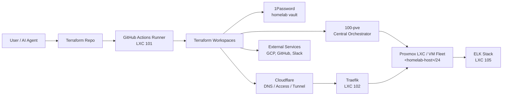

# Terraform Homelab Infrastructure / Terraform Homelab 인프라

[](https://www.terraform.io)
[](LICENSE)
[](.github/workflows)
[](https://scorecard.dev)
[](https://www.proxmox.com/)
[](Makefile)

> English version follows Korean content / 한국어 다음에 영어 버전이 이어집니다.

---

## Overview / 개요

Infrastructure-as-code monorepo for `jclee.me`. Provisions a Proxmox LXC/VM fleet, networking, monitoring, and external services via **21 Terraform workspaces** with 1Password secret injection and GitHub Actions CI/CD.

`jclee.me`를 위한 Infrastructure-as-Code 모노레포입니다. 21개의 Terraform 워크스페이스를 통해 Proxmox LXC/VM 플릿, 네트워킹, 모니터링 및 외부 서비스를 프로비저닝하며, 1Password 시크릿 주입과 GitHub Actions CI/CD로 운영됩니다.

---

## Features / 주요 기능

### Infrastructure Provisioning / 인프라 프로비저닝

- **21 Terraform workspaces** across 4 tiers (Tier 0 core, Tier 1 infra, Tier 2 VMs, Tier 3 external/cloud)
- **Proxmox LXC/VM fleet** managed as code (22 LXCs, 4 VMs across `<homelab-host>/24` subnet)
- **Single Source of Truth (SSoT)** in `100-pve/envs/prod/hosts.tf` for all host definitions

### Configuration Management / 구성 관리

- **Template-driven rendering** via `modules/proxmox/config-renderer/` — config files are NEVER hand-edited
- **Terraform modules** for reusable LXC (`modules/proxmox/lxc`), VM (`modules/proxmox/vm`), and config templates
- **Cloud-init** support for both LXC and VM provisioning

### Secret Management / 시크릿 관리

- **1Password integration** via `modules/shared/onepassword-secrets/` — 12 vault items, 48 keys
- **Zero hardcoded secrets** — all secrets injected at apply time from 1Password
- **Dynamic secret rotation** support through module variable mapping

### CI/CD Automation / CI/CD 자동화

- **33 GitHub Actions workflows** covering PR lifecycle, security scanning, releases, and issue management
- **Automated PR workflows**: review, checks, merge, label, and fix
- **Operational workflows**: downstream health checks, CI auto-heal, release management
- **Bot integration**: PR-Agent for automated code review (via qodo-ai/pr-agent)

### Multi-Cloud Support / 멀티 클라우드 지원

- **Proxmox VE** on-prem cluster management (LXC 101–123, VM 201–204)
- **Cloudflare** DNS, Access, and Tunnel management
- **Google Cloud Platform** workspace (400-gcp)
- **GitHub** repository and organization management

---

## Architecture / 아키텍처


```mermaid
flowchart LR
    Agent["User / AI Agent"] --> Repo["Terraform Repo"]
    Repo --> CI["GitHub Actions Runner<br/>LXC 101"]
    CI --> TF["Terraform Workspaces"]
    TF --> PVE["100-pve<br/>Central Orchestrator"]
    PVE --> Fleet["Proxmox LXC / VM Fleet<br/>&lt;homelab-host&gt;/24"]
    TF --> OP["1Password<br/>homelab vault"]
    TF --> CF["Cloudflare<br/>DNS / Access / Tunnel"]
    Fleet --> ELK["ELK Stack<br/>LXC 105"]
    CF --> Traefik["Traefik<br/>LXC 102"]
    Traefik --> Fleet
    TF --> Ext["External Services<br/>GCP, GitHub, Slack"]
```

### Workspace Tiers / 워크스페이스 계층

| Tier | Workspaces | Description |
|------|------------|-------------|
| 0 (core) | `100-pve` | Central orchestrator — provisions all LXC/VM lifecycle |
| 1 (infra) | `101-runner`, `102-traefik`, `105-elk`, `108-archon` | Consume `remote_state` from 100-pve |
| 2 (apps) | `107-supabase`, `110-n8n`, `112-mcphub`, `200-oc`, `215-synology`, `220-youtube` | Application workspaces |
| 3 (external) | `300-cloudflare`, `301-github`, `310-safetywallet`, `320-slack` | No Proxmox dependency |
| 4 (cloud) | `400-gcp` | Google Cloud Platform |
| Independent | `80-jclee` | Personal workspace |

### Module Structure / 모듈 구조

```
modules/
├── proxmox/
│   ├── lxc/              # LXC container resource
│   ├── vm/               # VM resource
│   ├── lxc-config/       # LXC configuration templates
│   ├── vm-config/        # VM configuration templates
│   └── config-renderer/  # Central config rendering engine
└── shared/
    └── onepassword-secrets/  # 1Password vault integration
```

### Config Pipeline / 구성 파이프라인

```
hosts.tf (SSoT) → module.hosts → onepassword_secrets + config_renderer
  → templatefile(.tftpl) → configs/ → SSH deploy to /opt/{service}/
```

---

## Automation Inventory / 자동화 인벤토리

### GitHub Actions Workflows / GitHub Actions 워크플로

| Workflow File | Purpose |
|---------------|---------|
| `01_branch-to-pr.yml` | Branch creation and PR linking |
| `02_issue-to-branch.yml` | Issue-driven branch creation |
| `03_pr-checks.yml` | PR validation checks |
| `04_actionlint.yml` | GitHub Actions workflow linting |
| `05_gitleaks.yml` | Secret scanning in commits |
| `06_codeql.yml` | CodeQL security analysis |
| `07_dependency-review.yml` | Dependency vulnerability review |
| `08_scorecard.yml` | OpenSSF Scorecard assessment |
| `09_semantic-pr.yml` | Semantic PR title validation |
| `10_pr-review.yml` | Automated PR review |
| `12_dependabot-auto-merge.yml` | Dependabot PR auto-merge |
| `13_pr-auto-merge.yml` | General PR auto-merge |
| `14_bot-auto-fix.yml` | Bot-initiated fixes |
| `15_merged-pr-cleanup.yml` | Post-merge cleanup |
| `jclee-bot App issue-management` | Issue lifecycle management |
| `19_issue-backfill.yml` | Issue metadata backfill |
| `20_readme-gen.yml` | README generation |
| `21_docs-sync.yml` | Documentation synchronization |
| `24_release-notes.yml` | Release note generation |
| `25_release-publish.yml` | Release publishing |
| `29_downstream-health-check.yml` | Downstream service health |
| `37_ci-failure-issues.yml` | CI failure issue creation |
| `42_reusable-docs-sync.yml` | Reusable docs sync workflow |
| `jclee-bot App issue-management` | Reusable issue management |
| `44_reusable-pr-checks.yml` | Reusable PR checks |
| `45_reusable-gitleaks.yml` | Reusable gitleaks scan |
| `60_ci-auto-heal.yml` | CI self-healing automation |
| `91_issue-classification.yml` | Issue classification |
| `auto-merge.yml` | Auto-merge logic |
| `ci.yml` | Main CI pipeline |
| `labeler.yml` | PR/issue label management |
| `welcome.yml` | New contributor welcome |
| `security/11_pr-review.yml` | Security-focused PR review |

### Automation Tools / 자동화 도구

| Tool | Version | Purpose |
|------|---------|---------|
| [PR-Agent](https://qodo-ai/pr-agent) | latest | Automated AI-powered PR code review |
| [Gitleaks](https://github.com/gitleaks/gitleaks) | latest | Secret scanning |
| [Actionlint](https://github.com/rhysd/actionlint) | latest | Workflow linting |
| [tfsec](https://github.com/aquasecurity/tfsec) | latest | Terraform security scanning |
| [Checkov](https://github.com/bridgecrewio/checkov) | latest | Terraform compliance checking |

---

## Quick Start / 빠른 시작

### Prerequisites / 사전 요구사항

- Terraform `>= 1.7, < 2.0` (1.10.5 recommended)
- 1Password CLI (`op`) configured with access to `homelab` vault
- GitHub CLI (`gh`) for workflow interactions
- SSH access to Proxmox host

### Initial Setup / 초기 설정

```bash
# Clone repository
git clone https://github.com/jclee941/.github
cd terraform-homelab

# Install pre-commit hooks
make pre-commit-install

# Initialize a workspace
make init SVC=100-pve

# Plan changes
make plan SVC=100-pve
```

### View Available Workspaces / 사용 가능한 워크스페이스 확인

```bash
make help
```

---

## Local Development / 로컬 개발

### Makefile Targets / Makefile 타겟

| Target | Description |
|--------|-------------|
| `make init SVC=<workspace>` | Initialize Terraform workspace |
| `make plan SVC=<workspace>` | Create Terraform plan |
| `make apply SVC=<workspace>` | Apply Terraform plan (CI/CD 권장) |
| `make fmt SVC=<workspace>` | Format Terraform files |
| `make lint SVC=<workspace>` | Lint Terraform code |
| `make validate SVC=<workspace>` | Validate Terraform syntax |
| `make test SVC=<workspace>` | Run all tests |
| `make test-unit SVC=<workspace>` | Run unit tests |
| `make test-integration SVC=<workspace>` | Run integration tests |
| `make drift-check SVC=<workspace>` | Check state drift |
| `make docs SVC=<workspace>` | Generate documentation |

### Workspace Aliases / 워크스페이스 별칭

| Alias | Workspace | Description |
|-------|-----------|-------------|
| `pve` | `100-pve` | Proxmox VE orchestrator |
| `runner` | `101-runner` | GitHub Actions runner |
| `traefik` | `102-traefik` | Traefik reverse proxy |
| `elk` | `105-elk` | Elasticsearch/Logstash/Kibana |
| `archon` | `108-archon` | Archon service |
| `n8n` | `110-n8n` | n8n workflow automation |
| `mcphub` | `112-mcphub` | MCP Hub |
| `oc` | `200-oc` | Custom cloud workspace |
| `synology` | `215-synology` | Synology NAS |
| `youtube` | `220-youtube` | YouTube automation |
| `cloudflare` | `300-cloudflare` | Cloudflare DNS |
| `github` | `301-github` | GitHub management |
| `slack` | `320-slack` | Slack integration |
| `gcp` | `400-gcp` | Google Cloud Platform |

### Examples / 사용 예시

```bash
# Plan for a specific service
make plan SVC=elk

# Format all Terraform files
make fmt SVC=traefik

# Run tests for n8n workspace
make test SVC=n8n

# Check drift for Proxmox
make drift-check SVC=pve

# Lint the cloudflare workspace
make lint SVC=cloudflare
```

---

## Commands Reference / 명령어 참조

### Terraform Commands / Terraform 명령어

```bash
# Workspace initialization
cd 100-pve && terraform init

# Plan generation
terraform plan -out=tfplan

# Format code
terraform fmt -recursive

# Validate syntax
terraform validate

# Show state
terraform show

# Import existing resource
terraform import <resource> <id>
```

### Pre-commit Hooks / Pre-commit 훅

```bash
# Install hooks
make pre-commit-install

# Run manually
make pre-commit-run
```

### CI/CD Commands / CI/CD 명령어

```bash
# Trigger workflow dispatch
gh workflow run ci.yml -f service=100-pve

# Check workflow status
gh run list --workflow=ci.yml

# View logs
gh run view <run-id> --log
```

---

## Repository Structure / 저장소 구조

```
terraform-homelab/
├── 100-pve/                      # Tier 0: Central Proxmox orchestrator
│   ├── terraform/                 # Terraform configuration
│   │   ├── main.tf               # Main resource definitions
│   │   ├── locals.tf             # Local values and sizing
│   │   ├── variables.tf          # Input variables
│   │   ├── outputs.tf            # Output values
│   │   ├── firewall.tf           # Proxmox firewall rules
│   │   ├── storage.tf            # Storage configuration
│   │   ├── lxc_configs.tf        # LXC configurations
│   │   ├── vm_configs.tf         # VM configurations
│   │   ├── backup_jobs.tf        # Backup job definitions
│   │   ├── secrets.tf            # Secret references
│   │   ├── data.tf               # Data sources
│   │   ├── checks.tf             # Resource checks
│   │   ├── versions.tf           # Provider versions
│   │   └── configs/              # Rendered configurations
│   └── README.md
├── 101-runner/                   # GitHub Actions runner host
├── 102-traefik/                  # Traefik reverse proxy
├── 105-elk/                      # ELK stack (Elasticsearch, Logstash, Kibana)
├── 108-archon/                   # Archon service
├── 110-n8n/                      # n8n workflow automation
├── 112-mcphub/                   # MCP Hub
├── 200-oc/                       # OC workspace
├── 215-synology/                 # Synology NAS management
├── 220-youtube/                  # YouTube automation
├── 300-cloudflare/               # Cloudflare DNS/Access/Tunnel
├── 301-github/                   # GitHub organization management
├── 310-safetywallet/             # Safety wallet integration
├── 320-slack/                    # Slack integration
├── 400-gcp/                      # Google Cloud Platform
├── modules/                      # Reusable Terraform modules
│   ├── proxmox/
│   │   ├── lxc/                  # LXC resource module
│   │   ├── vm/                   # VM resource module
│   │   ├── lxc-config/           # LXC config module
│   │   ├── vm-config/            # VM config module
│   │   └── config-renderer/      # Config rendering module
│   └── shared/
│       └── onepassword-secrets/  # 1Password integration module
├── .github/
│   └── workflows/                # 33 GitHub Actions workflows
├── docs/                         # Architecture docs, ADRs, runbooks
├── Makefile                      # Development commands
├── AGENTS.md                     # AI agent knowledge base
├── ARCHITECTURE.md               # Full architecture reference
├── CODE_STYLE.md                 # Coding conventions
├── CONTRIBUTING.md               # Contribution guidelines
├── DEPENDENCY_MAP.md             # Module dependency graph
└── README.md                     # This file
```

---

## Contribution Guide / 기여 가이드

### Getting Started / 시작하기

1. **Fork** the repository
2. **Create a branch** from `master`:

   ```bash
   gh pr create --base master --head your-branch
   ```

3. **Make changes** following the [CODE_STYLE.md](CODE_STYLE.md) conventions
4. **Test** your changes:

   ```bash
   make validate SVC=<affected-workspace>
   make test SVC=<affected-workspace>
   ```

5. **Commit** using semantic commit messages
6. **Open a PR** with a clear description

### Code Style / 코드 스타일

- Follow naming conventions in `CODE_STYLE.md`
- Use Terraform fmt before committing
- Add/update tests for new resources
- Update documentation for user-facing changes

### Workflow Guidelines / 워크플로 가이드라인

- **DO**: Use issue-driven branches (`02_issue-to-branch.yml`)
- **DO**: Enable all PR checks before requesting review
- **DO**: Keep workspaces independent when possible
- **DON'T**: Hardcode secrets or IPs (use placeholders)
- **DON'T**: Edit rendered configs directly (edit templates instead)

### Documentation Updates / 문서 업데이트

- Update `AGENTS.md` for AI agent knowledge
- Update `ARCHITECTURE.md` for structural changes
- Update `DEPENDENCY_MAP.md` when module dependencies change
- Sync docs via `21_docs-sync.yml` workflow

---

## External Links / 외부 링크

| Resource | URL |
|----------|-----|
| PR-Agent | <https://qodo-ai/pr-agent> |
| CLIProxy API | <https://cliproxy.jclee.me/v1> |
| Bot Service | <https://bot.jclee.me> |
| OpenSSF Scorecard | <https://scorecard.dev> |

---

## License / 라이선스

This project is licensed under the MIT License. See [LICENSE](LICENSE) for details.

본 프로젝트는 MIT 라이선스 하에 제공됩니다. 자세한 내용은 [LICENSE](LICENSE)를 참조하세요.
