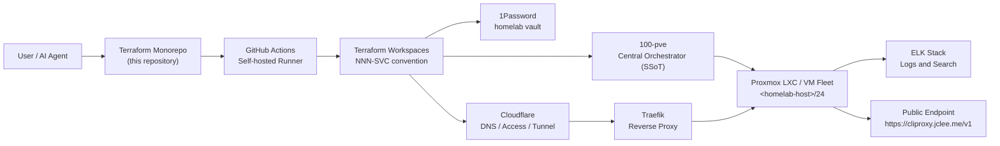

# Terraform Homelab Infrastructure / Terraform Homelab 인프라

> **Bilingual README** — Korean precedes English.
> **이중 언어 README** — 한국어 본문이 영어보다 먼저 옵니다.
>
> Generated by `gpt-5.5` (fallback: `minimax-m3` via CLIProxyAPI).

## Badges / 배지

| Category | Detail |
| --- | --- |
| Infrastructure as Code | Terraform `1.10.5` (`>= 1.7, < 2.0`) |
| Workspace Convention | Flat `NNN-SVC` (e.g. `100-pve`, `105-elk`, `300-cloudflare`) |
| CI/CD | 14 GitHub Actions workflows (`.github/workflows/`) |
| Secret Backend | 1Password `homelab` vault |
| Security | CodeQL, Gitleaks, Dependency Review, OpenSSF Scorecard |
| Review Automation | [qodo-ai/pr-agent](https://github.com/qodo-ai/pr-agent), Dependabot auto-merge |
| Documentation | README auto-gen, release notes, docs sync |
| Public Endpoint | `https://cliproxy.jclee.me/v1` |
| Documentation Mirror | `https://bot.jclee.me` |
| License | MIT |

---

# 한국어

## 1. 개요

이 저장소는 `jclee.me` 호멜랩(homelab)과 관련 외부 서비스를 코드로 관리하기 위한 **Infrastructure-as-Code 모노레포**입니다. Proxmox LXC/VM 플릿, 네트워크, 모니터링 스택, 그리고 Cloudflare·GitHub·Slack 같은 외부 서비스를 Terraform 워크스페이스로 프로비저닝하며, 1Password 시크릿 주입과 GitHub Actions 기반 CI/CD를 사용합니다.

- **도메인**: `jclee.me`
- **내부 서브넷**: `<homelab-host>/24` (LXC/VM 플릿)
- **Terraform 버전**: `1.10.5` (`>= 1.7, < 2.0`)
- **공개 엔드포인트**: `https://cliproxy.jclee.me/v1`
- **워크스페이스 규칙**: 평탄(flat) `NNN-SVC` 컨벤션
  - `1-255` = 내부 인프라 (Proxmox LXC/VM, 예: `<homelab-host>`)
  - `300+` = 외부 서비스 (Cloudflare, GitHub, Slack 등)
  - `400+` = 퍼블릭 클라우드 (GCP 등)
- **핵심 오케스트레이터**: `100-pve` — 모든 LXC/VM 라이프사이클의 단일 진실 공급원(SSOT)
- **워크스페이스 수**: 21개 (`80` 물리 호스트, `100s` Proxmox 인프라, `200s` VM 앱, `300s` 외부, `400s` 클라우드)

이 README는 자동화 인벤토리, 저장소 구조, 로컬 개발 절차, 명령어 레퍼런스, 기여 가이드를 한 곳에서 확인할 수 있도록 작성되었습니다.

## 2. 주요 기능

### 2.1 Infrastructure as Code
- Terraform 기반 **서비스별 워크스페이스** (예: `105-elk/terraform/`, `112-mcphub/`, `300-cloudflare/`)
- 평탄한 `NNN-SVC` 디렉터리 컨벤션과 `Makefile`의 단축 별칭(`pve`, `elk`, `mcphub`, `cloudflare` 등)
- `templates/*.tftpl` → 렌더링된 설정 파일 파이프라인 (`config-renderer` 모듈)
- 로컬 상태 백엔드, `.tfstate`를 git에 커밋, GitHub Actions 동시성(concurrency) 그룹으로 `apply` 직렬화
- `terraform test`로 유닛/통합/워크스페이스 테스트 수행

### 2.2 GitHub Automation
- **14개의 GitHub Actions 워크플로우**로 PR 검사, 리뷰, 보안 분석, 자동 병합, 자동 수정, 문서 동기화, 릴리스 발행, 다운스트림 헬스 체크, CI 자동 복구까지 전 영역 자동화
- [qodo-ai/pr-agent](https://github.com/qodo-ai/pr-agent) 기반 AI PR 리뷰어
- Dependabot PR 자동 병합 및 일반 PR 자동 병합 정책
- 이슈 → 브랜치, 브랜치 → PR 워크플로우 자동화
- 병합된 PR 정리, 릴리스 노트/릴리스 발행, CI 실패 이슈 자동 생성, 다운스트림 헬스 체크 봇 운영

### 2.3 Secrets & Security
- **1Password `homelab` 볼트** (12개 아이템, 48개 키) — `modules/shared/onepassword-secrets` 모듈로 주입
- **CodeQL** 정적 분석, **Gitleaks** 시크릿 누출 스캔, **Dependency Review**, **OpenSSF Scorecard**
- 시크릿은 코드 저장소 외부에 보관되며 `module.onepassword_secrets.secrets["key"]` 형태로만 참조

### 2.4 Observability
- **ELK 스택**(`105-elk`) — Filebeat → Logstash → Elasticsearch → Kibana, ILM 정책으로 로그 보존 관리
- **Promtail 제거 스크립트**(Go) 등 운영 도구 내장
- 모든 워크스페이스가 `filebeat.yml` 템플릿으로 중앙 로깅에 연동

### 2.5 Edge & Ingress
- **Traefik**(`102-traefik`) — 리버스 프록시, Cloudflare Tunnel 연동
- **Cloudflare Access / Tunnel / DNS**(`300-cloudflare`) — Zero Trust 엣지 보안

## 3. 아키텍처


```mermaid
flowchart LR
  Agent["User / AI Agent"] --> Repo["Terraform Monorepo<br/>(this repository)"]
  Repo --> CI["GitHub Actions<br/>Self-hosted Runner"]
  CI --> TF["Terraform Workspaces<br/>NNN-SVC convention"]
  TF --> PVE["100-pve<br/>Central Orchestrator (SSoT)"]
  PVE --> Fleet["Proxmox LXC / VM Fleet<br/>&lt;homelab-host&gt;/24"]
  TF --> OP["1Password<br/>homelab vault"]
  TF --> CF["Cloudflare<br/>DNS / Access / Tunnel"]
  Fleet --> ELK["ELK Stack<br/>Logs and Search"]
  CF --> Traefik["Traefik<br/>Reverse Proxy"]
  Traefik --> Fleet
  Fleet --> Public["Public Endpoint<br/>https://cliproxy.jclee.me/v1"]
```

### 3.1 워크스페이스 계층

| 계층 | 워크스페이스 | 적용 순서 |
| --- | --- | --- |
| 0 (Core) | `100-pve` | **최우선** — 모든 LXC/VM을 프로비저닝 |
| 1 (Infra) | `102-traefik`, `105-elk`, `108-archon` | **두 번째 (병렬)** — `100-pve`의 `remote_state` 소비 |
| 독립(Independent) | `300-cloudflare`, `301-github`, `320-slack`, `400-gcp` | **순서 무관** — Proxmox 의존성 없음 |
| 템플릿 전용 | 10개 워크스페이스 | `.tf` 파일 없음 — `100-pve`가 템플릿 렌더링 |

### 3.2 설정 파이프라인

```
hosts.tf (SSoT)
    └─► module.hosts
          ├─► module.onepassword_secrets  (1Password homelab vault)
          └─► module.config_renderer      (templatefile)
                └─► configs/ (rendered)
                      └─► SSH deploy → /opt/{service}/
```

## 4. 저장소 구조

이 저장소는 평탄한 `NNN-SVC` 디렉터리 컨벤션을 따릅니다. 다음은 현재 인스펙션에 포함된 최상위 레이아웃입니다 (다른 워크스페이스는 `Makefile`의 별칭을 통해 접근).

```text
.
├── AGENTS.md                # AI/에이전트용 프로젝트 지식 베이스
├── ARCHITECTURE.md          # 전체 아키텍처 레퍼런스
├── CODE_STYLE.md            # 명명·파일 구성·변수·템플릿 규약
├── CONTRIBUTING.md          # 기여 절차
├── DEPENDENCY_MAP.md        # 모듈 의존성 그래프 + 템플릿 인벤토리
├── LICENSE                  # MIT 라이선스
├── Makefile                 # Terraform/Make 단축 명령 (SVC= 별칭)
├── OWNERS                   # GitHub CODEOWNERS
├── OWNERS_ALIASES           # 별칭 → 사용자 매핑
├── README.md                # 본 문서
├── build.env                # 빌드 환경 변수
│
├── 103-coredns/             # CoreDNS (Tier 1 인프라)
│   ├── AGENTS.md
│   ├── README.md
│   └── templates/           # Corefile, docker-compose, filebeat 템플릿
│
├── 105-elk/                 # ELK 스택 (Tier 1 인프라)
│   ├── AGENTS.md
│   ├── docker-compose.yml
│   ├── ilm-policy.json
│   ├── scripts/             # Go 운영 도구 (remove-promtail, setup-ilm, setup-watcher)
│   ├── config/              # 렌더링된 설정 (filebeat, logstash, ILM)
│   ├── templates/           # *.tftpl 원본 템플릿
│   └── terraform/           # Terraform 모듈 (main.tf, variables.tf 등)
│
├── 112-mcphub/              # MCP Hub (Tier 1 인프라)
│   ├── AGENTS.md
│   ├── Dockerfile.{dev-browser,playwright,proxmox}
│   ├── README.md
│   ├── mcp_servers.json
│   ├── validate_mcps.py
│   ├── patches/n8n/         # n8n 라이선스 패치
│   ├── op-mcp-server/       # 1Password MCP 서버
│   ├── config/              # filebeat, 패치 스크립트
│   └── templates/           # docker-compose, mcp_settings 템플릿
│
└── 300-cloudflare/          # Cloudflare (외부)
    ├── AGENTS.md
    ├── README.md
    ├── access.tf            # Cloudflare Access 정책
    ├── checks.tf
    ├── dns.tf               # DNS 레코드
    ├── identity-provider.tf # IdP 연동
    ├── locals.tf
    ├── logpush.tf
    ├── main.tf
    ├── onepassword.tf
    └── outputs*.tf          # homelab / jclee / synology / 기본 출력
```

### 4.1 `Makefile` 단축 별칭

| 별칭 | 디렉터리 | 비고 |
| --- | --- | --- |
| `jclee` | `80-jclee` | |
| `pve` | `100-pve` | 기본값 |
| `runner` | `101-runner` | |
| `traefik` | `102-traefik/terraform` | 중첩 `terraform/` 자동 해석 |
| `elk` | `105-elk/terraform` | |
| `supabase` | `107-supabase` | |
| `archon` | `108-archon/terraform` | |
| `n8n` | `110-n8n` | |
| `mcphub` | `112-mcphub` | |
| `oc` | `200-oc` | |
| `synology` | `215-synology` | |
| `youtube` | `220-youtube` | |
| `cloudflare` | `300-cloudflare` | |
| `github` | `301-github` | |
| `safetywallet` | `310-safetywallet` | |
| `slack` | `320-slack` | |
| `gcp` | `400-gcp` | |

## 5. 자동화 인벤토리

### 5.1 GitHub Actions 워크플로우 (`.github/workflows/`)

총 **14개**의 워크플로우가 다음 영역을 커버합니다.

| # | 워크플로우 파일 | 영역 | 트리거 / 역할 |
| --- | --- | --- | --- |
| 1 | `01_branch-to-pr.yml` | 브랜치 → PR | 브랜치 생성 시 PR 자동 오픈 |
| 2 | `02_issue-to-branch.yml` | 이슈 → 브랜치 | 이슈 라벨/지정으로 브랜치 자동 생성 |
| 3 | `10_pr-review.yml` | PR 리뷰 | [qodo-ai/pr-agent](https://github.com/qodo-ai/pr-agent) 기반 AI 코드 리뷰 |
| 4 | `11_security-pr-review.yml` | 보안 리뷰 | 보안 관점의 PR 리뷰 (CodeQL/Gitleaks 연동) |
| 5 | `12_dependabot-auto-merge.yml` | 자동 병합 | Dependabot PR 자동 병합 |
| 6 | `13_pr-auto-merge.yml` | 자동 병합 | 일반 PR 자동 병합 정책 (라벨/체크 기반) |
| 7 | `14_bot-auto-fix.yml` | 자동 수정 | 봇이 lint/포맷 실패를 자동 커밋 |
| 8 | `15_merged-pr-cleanup.yml` | 정리 | 병합된 PR의 브랜치/원격 추적 정리 |
| 9 | `19_issue-backfill.yml` | 이슈 백필 | 누락된 이슈 자동 생성 |
| 10 | `24_release-notes.yml` | 릴리스 노트 | 릴리스 노트 초안 자동 작성 |
| 11 | `25_release-publish.yml` | 릴리스 발행 | GitHub Release 자동 발행/배포 |
| 12 | `29_downstream-health-check.yml` | 헬스 체크 | 다운스트림 서비스/엔드포인트 헬스 체크 |
| 13 | `37_ci-failure-issues.yml` | CI 자동 복구 | CI 실패를 이슈로 자동 생성 |
| 14 | `ci.yml` | 핵심 CI | `fmt` → `validate` → `lint` → `plan` → `test` 파이프라인 |

### 5.2 Go 자동화 도구

저장소 최상위에는 전용 Go 자동화 바이너리(`scripts/`)는 **포함되어 있지 않습니다**. Go로 작성된 운영 스크립트는 각 워크스페이스 내부에 모듈식으로 위치합니다.

- `105-elk/scripts/remove-promtail.go` — Promtail 정리
- `105-elk/scripts/setup-ilm.go` — Elasticsearch ILM 정책 적용
- `105-elk/scripts/setup-watcher.go` — Elasticsearch Watcher 설정
- `112-mcphub/config/entrypoint-patch.go` — mcphub 진입점 패치

### 5.3 보안·품질 도구

| 도구 | 역할 | 위치 |
| --- | --- | --- |
| CodeQL | 정적 분석 | GitHub Actions |
| Gitleaks | 시크릿 누출 스캔 | GitHub Actions / pre-commit |
| Dependency Review | 의존성 변경 검토 | GitHub Actions |
| OpenSSF Scorecard | 보안 성숙도 평가 | GitHub Actions |
| pre-commit | 로컬 훅 | `pre-commit-install`, `pre-commit-run` |

## 6. 빠른 시작

### 6.1 사전 요구사항

- Terraform `>= 1.7, < 2.0` (테스트 환경: `1.10.5`)
- `make`, `git`, `ssh`
- 1Password CLI (`op`) + `homelab` 볼트 접근 권한
- GitHub personal access token (필요 시)

### 6.2 클론 & 초기화

```bash
git clone https://github.com/<owner>/terraform.git
cd terraform
make setup
```

`make setup`은 로컬 환경을 준비합니다 (자세한 내용은 `Makefile` 참조).

### 6.3 워크스페이스 선택

`SVC` 변수로 워크스페이스를 지정하거나 단축 별칭을 사용합니다.

```bash
# 단축 별칭
make plan SVC=pve
make plan SVC=elk
make plan SVC=cloudflare

# 전체 경로
make plan SVC=100-pve
make plan SVC=105-elk/terraform
make plan SVC=300-cloudflare
```

## 7. 로컬 개발

### 7.1 일상의 워크플로우

1. 브랜치를 생성합니다 (예: `feat/105-elk-add-heatmap`).
2. `make init SVC=elk`로 Terraform을 초기화합니다.
3. `make plan SVC=elk`로 변경 사항을 미리 봅니다.
4. 로컬에서 `make fmt validate lint SVC=elk`를 실행합니다.
5. 커밋 후 PR을 오픈합니다 — `10_pr-review.yml`이 자동으로 AI 리뷰를 게시합니다.
6. 리뷰/체크 통과 후 `13_pr-auto-merge.yml`이 자동으로 병합합니다.
7. `master` 병합 시 `ci.yml`이 `plan → test → apply`까지 수행합니다.

### 7.2 시크릿 추가/회전

1. `modules/shared/onepassword-secrets/main.tf`의 키 매핑을 업데이트합니다.
2. 1Password `homelab` 볼트에 새 항목을 추가/수정합니다.
3. `module.onepassword_secrets.secrets["new_key"]` 형태로 코드에서 참조합니다.
4. PR을 열고 자동 리뷰 → 자동 병합 흐름을 따릅니다.

### 7.3 새 LXC/VM 추가

1. `100-pve/locals.tf`에서 사이즈/리소스를 정의합니다.
2. `100-pve/envs/prod/hosts.tf`에 호스트 항목(VMID, IP, 역할, 포트)을 추가합니다 (SSoT).
3. 필요한 워크스페이스 `templates/*.tftpl`을 업데이트합니다.
4. `make plan SVC=pve`로 검증한 뒤 PR을 올립니다.

### 7.4 Pre-commit

```bash
make pre-commit-install
make pre-commit-run
```

## 8. 명령어 레퍼런스

`Makefile`은 다음 타겟을 제공합니다 (모두 `SVC` 변수로 워크스페이스를 받음).

| 타겟 | 설명 |
| --- | --- |
| `help` | 사용 가능한 타겟 목록 출력 |
| `setup` | 로컬 개발 환경 준비 |
| `init` | Terraform 초기화 (`terraform init`) |
| `plan` | Terraform 플랜 생성 (`terraform plan -out=tfplan`) |
| `apply` | Terraform 적용 — **DISABLED (CI/CD를 통해서만 적용)** |
| `verify` | 상태/리소스 검증 |
| `validate` | Terraform 구성 검증 (`terraform validate`) |
| `fmt` | Terraform 코드 포맷팅 (`terraform fmt`) |
| `lint` | Terraform 린트 |
| `lint-go` | Go 코드 린트 |
| `drift-check` | 실제 인프라와 상태 간 드리프트 검사 |
| `backup` | 상태 백업 |
| `test` | 전체 테스트 실행 |
| `test-unit` | 유닛 테스트만 실행 |
| `test-integration` | 통합 테스트만 실행 |
| `test-workspace` | 워크스페이스 테스트만 실행 |
| `docs` | 문서 생성 |
| `pre-commit-install` | pre-commit 훅 설치 |
| `pre-commit-run` | pre-commit 훅 수동 실행 |

> **경고**: 수동 `apply`는 의도적으로 비활성화되어 있습니다. 모든 변경은 PR → 자동 병합 → CI `apply` 파이프라인을 통해 적용됩니다.

## 9. 기여 가이드

1. 이슈를 먼저 생성하거나 기존 이슈를 할당받습니다.
2. `02_issue-to-branch.yml`이 브랜치를 자동 생성하면 체크아웃합니다.
3. 변경 후 `make fmt validate lint test SVC=<svc>`를 로컬에서 통과시킵니다.
4. 커밋 컨벤션(예: `feat:`, `fix:`, `chore:`, `docs:`)을 따릅니다.
5. PR을 올리면 `10_pr-review.yml`이 AI 리뷰를 게시하고, 필요 시 `14_bot-auto-fix.yml`이 사소한 수정(Lint/포맷)을 자동 커밋합니다.
6. 모든 체크가 통과하면 `13_pr-auto-merge.yml`이 자동으로 병합합니다.
7. 병합 후 `15_merged-pr-cleanup.yml`이 정리 작업을 수행합니다.

자세한 규약은 [`CONTRIBUTING.md`](./CONTRIBUTING.md), [`CODE_STYLE.md`](./CODE_STYLE.md), [`ARCHITECTURE.md`](./ARCHITECTURE.md), [`DEPENDENCY_MAP.md`](./DEPENDENCY_MAP.md)를 참조하세요.

---

# English

## 1. Overview

This repository is an **Infrastructure-as-Code monorepo** that manages the `jclee.me` homelab and its associated external services. It provisions a Proxmox LXC/VM fleet, networking, the observability stack, and external services (Cloudflare, GitHub, Slack, etc.) via Terraform workspaces, with secrets injected from 1Password and CI/CD driven by GitHub Actions.

- **Domain**: `jclee.me`
- **Internal subnet**: `<homelab-host>/24` (LXC/VM fleet)
- **Terraform version**: `1.10.5` (`>= 1.7, < 2.0`)
- **Public endpoint**: `https://cliproxy.jclee.me/v1`
- **Workspace convention**: flat `NNN-SVC`
  - `1-255` = internal infrastructure (Proxmox LXC/VM, e.g. `<homelab-host>`)
  - `300+` = external services (Cloudflare, GitHub, Slack, etc.)
  - `400+` = public cloud (GCP, etc.)
- **Central orchestrator**: `100-pve` — single source of truth (SSoT) for all LXC/VM lifecycles
- **Workspace count**: 21 (`80` physical, `100s` Proxmox infra, `200s` VM apps, `300s` external, `400s` cloud)

This README centralizes the automation inventory, repository layout, local development procedure, command reference, and contribution guide.

## 2. Features

### 2.1 Infrastructure as Code
- Terraform **per-service workspaces** (e.g. `105-elk/terraform/`, `112-mcphub/`, `300-cloudflare/`)
- Flat `NNN-SVC` directory convention with short aliases in the `Makefile` (`pve`, `elk`, `mcphub`, `cloudflare`, ...)
- `templates/*.tftpl` → rendered config pipeline via the `config-renderer` module
- Local state backend, `.tfstate` committed to git, CI concurrency groups serialize `apply`
- `terraform test` covers unit, integration, and workspace tests

### 2.2 GitHub Automation
- **14 GitHub Actions workflows** covering the entire lifecycle: PR inspection, AI review, security analysis, auto-merge, auto-fix, doc sync, release publishing, downstream health checks, and CI failure recovery
- AI code reviewer powered by [qodo-ai/pr-agent](https://github.com/qodo-ai/pr-agent)
- Auto-merge policies for Dependabot and standard PRs
- Issue-to-branch and branch-to-PR automation
- Merged-PR cleanup, release notes/release publishing, automatic CI-failure issue creation, downstream health check bot

### 2.3 Secrets & Security
- **1Password `homelab` vault** (12 items, 48 keys), injected via `modules/shared/onepassword-secrets`
- **CodeQL** static analysis, **Gitleaks** secret scanning, **Dependency Review**, **OpenSSF Scorecard**
- Secrets live outside the code repo; only `module.onepassword_secrets.secrets["key"]` references are used

### 2.4 Observability
- **ELK stack** (`105-elk`): Filebeat → Logstash → Elasticsearch → Kibana, with ILM-based retention
- Built-in Go operational scripts (e.g. Promtail removal)
- Every workspace ships a `filebeat.yml` template that ships logs to the central ELK pipeline

### 2.5 Edge & Ingress
- **Traefik** (`102-traefik`) — reverse proxy, Cloudflare Tunnel integration
- **Cloudflare Access / Tunnel / DNS** (`300-cloudflare`) — Zero Trust edge security

## 3. Architecture


```mermaid
flowchart LR
  Agent["User / AI Agent"] --> Repo["Terraform Monorepo<br/>(this repository)"]
  Repo --> CI["GitHub Actions<br/>Self-hosted Runner"]
  CI --> TF["Terraform Workspaces<br/>NNN-SVC convention"]
  TF --> PVE["100-pve<br/>Central Orchestrator (SSoT)"]
  PVE --> Fleet["Proxmox LXC / VM Fleet<br/>&lt;homelab-host&gt;/24"]
  TF --> OP["1Password<br/>homelab vault"]
  TF --> CF["Cloudflare<br/>DNS / Access / Tunnel"]
  Fleet --> ELK["ELK Stack<br/>Logs and Search"]
  CF --> Traefik["Traefik<br/>Reverse Proxy"]
  Traefik --> Fleet
  Fleet --> Public["Public Endpoint<br/>https://cliproxy.jclee.me/v1"]
```

### 3.1 Workspace Tiers

| Tier | Workspaces | Apply Order |
| --- | --- | --- |
| 0 (Core) | `100-pve` | **First** — provisions all LXC/VMs |
| 1 (Infra) | `102-traefik`, `105-elk`, `108-archon` | **Second (parallel)** — consume `remote_state` from `100-pve` |
| Independent | `300-cloudflare`, `301-github`, `320-slack`, `400-gcp` | **Any order** — no Proxmox dependency |
| Template-only | 10 workspaces | No `.tf` files — templates rendered by `100-pve` |

### 3.2 Configuration Pipeline

```
hosts.tf (SSoT)
    └─► module.hosts
          ├─► module.onepassword_secrets  (1Password homelab vault)
          └─► module.config_renderer      (templatefile)
                └─► configs/ (rendered)
                      └─► SSH deploy → /opt/{service}/
```

## 4. Repository Structure

The repo follows the flat `NNN-SVC` convention. The following is the actual top-level layout covered by this inspection (other workspaces are reachable through the `Makefile` aliases).

```text
.
├── AGENTS.md                # AI/agent knowledge base
├── ARCHITECTURE.md          # Full architecture reference
├── CODE_STYLE.md            # Naming, file organization, variables, template conventions
├── CONTRIBUTING.md          # Contribution procedure
├── DEPENDENCY_MAP.md        # Module dependency graph + template inventory
├── LICENSE                  # MIT License
├── Makefile                 # Terraform/Make shortcuts (SVC= alias)
├── OWNERS                   # GitHub CODEOWNERS
├── OWNERS_ALIASES           # Alias → user mapping
├── README.md                # This document
├── build.env                # Build environment variables
│
├── 103-coredns/             # CoreDNS (Tier 1 infra)
│   ├── AGENTS.md
│   ├── README.md
│   └── templates/           # Corefile, docker-compose, filebeat templates
│
├── 105-elk/                 # ELK stack (Tier 1 infra)
│   ├── AGENTS.md
│   ├── docker-compose.yml
│   ├── ilm-policy.json
│   ├── scripts/             # Go operational tools (remove-promtail, setup-ilm, setup-watcher)
│   ├── config/              # Rendered configs (filebeat, logstash, ILM)
│   ├── templates/           # *.tftpl source templates
│   └── terraform/           # Terraform module (main.tf, variables.tf, etc.)
│
├── 112-mcphub/              # MCP Hub (Tier 1 infra)
│   ├── AGENTS.md
│   ├── Dockerfile.{dev-browser,playwright,proxmox}
│   ├── README.md
│   ├── mcp_servers.json
│   ├── validate_mcps.py
│   ├── patches/n8n/         # n8n license patches
│   ├── op-mcp-server/       # 1Password MCP server
│   ├── config/              # filebeat, patch scripts
│   └── templates/           # docker-compose, mcp_settings templates
│
└── 300-cloudflare/          # Cloudflare (external)
    ├── AGENTS.md
    ├── README.md
    ├── access.tf            # Cloudflare Access policies
    ├── checks.tf
    ├── dns.tf               # DNS records
    ├── identity-provider.tf # IdP integration
    ├── locals.tf
    ├── logpush.tf
    ├── main.tf
    ├── onepassword.tf
    └── outputs*.tf          # homelab / jclee / synology / default outputs
```

### 4.1 `Makefile` Aliases

| Alias | Directory | Notes |
| --- | --- | --- |
| `jclee` | `80-jclee` | |
| `pve` | `100-pve` | default |
| `runner` | `101-runner` | |
| `traefik` | `102-traefik/terraform` | nested `terraform/` resolved automatically |
| `elk` | `105-elk/terraform` | |
| `supabase` | `107-supabase` | |
| `archon` | `108-archon/terraform` | |
| `n8n` | `110-n8n` | |
| `mcphub` | `112-mcphub` | |
| `oc` | `200-oc` | |
| `synology` | `215-synology` | |
| `youtube` | `220-youtube` | |
| `cloudflare` | `300-cloudflare` | |
| `github` | `301-github` | |
| `safetywallet` | `310-safetywallet` | |
| `slack` | `320-slack` | |
| `gcp` | `400-gcp` | |

## 5. Automation Inventory

### 5.1 GitHub Actions Workflows (`.github/workflows/`)

A total of **14** workflows cover the following areas.

| # | Workflow File | Area | Trigger / Role |
| --- | --- | --- | --- |
| 1 | `01_branch-to-pr.yml` | Branch → PR | Auto-open a PR when a branch is created |
| 2 | `02_issue-to-branch.yml` | Issue → Branch | Create a branch from an issue label/assignee |
| 3 | `10_pr-review.yml` | PR Review | AI code review via [qodo-ai/pr-agent](https://github.com/qodo-ai/pr-agent) |
| 4 | `11_security-pr-review.yml` | Security Review | Security-focused PR review (CodeQL/Gitleaks integration) |
| 5 | `12_dependabot-auto-merge.yml` | Auto-Merge | Auto-merge Dependabot PRs |
| 6 | `13_pr-auto-merge.yml` | Auto-Merge | Auto-merge standard PRs (label/check driven) |
| 7 | `14_bot-auto-fix.yml` | Auto-Fix | Bot commits lint/format fixes automatically |
| 8 | `15_merged-pr-cleanup.yml` | Cleanup | Cleanup of merged PR branches and remote tracking |
| 9 | `19_issue-backfill.yml` | Issue Backfill | Auto-create missing issues |
| 10 | `24_release-notes.yml` | Release Notes | Auto-draft release notes |
| 11 | `25_release-publish.yml` | Release Publish | Auto-publish GitHub Releases |
| 12 | `29_downstream-health-check.yml` | Health Check | Downstream service/endpoint health checks |
| 13 | `37_ci-failure-issues.yml` | CI Auto-Recovery | File CI failures as issues automatically |
| 14 | `ci.yml` | Core CI | `fmt` → `validate` → `lint` → `plan` → `test` pipeline |

### 5.2 Go Automation Tools

There are **no standalone Go automation binaries** at the repository root (`scripts/`). Go-based operational scripts live **inside each workspace** as modules:

- `105-elk/scripts/remove-promtail.go` — Promtail cleanup
- `105-elk/scripts/setup-ilm.go` — Apply Elasticsearch ILM policies
- `105-elk/scripts/setup-watcher.go` — Configure Elasticsearch Watcher
- `112-mcphub/config/entrypoint-patch.go` — mcphub entrypoint patching

### 5.3 Security & Quality Tooling

| Tool | Role | Location |
| --- | --- | --- |
| CodeQL | Static analysis | GitHub Actions |
| Gitleaks | Secret leak scan | GitHub Actions / pre-commit |
| Dependency Review | Dependency change review | GitHub Actions |
| OpenSSF Scorecard | Security maturity scoring | GitHub Actions |
| pre-commit | Local hooks | `pre-commit-install`, `pre-commit-run` |

## 6. Quick Start

### 6.1 Prerequisites

- Terraform `>= 1.7, < 2.0` (tested on `1.10.5`)
- `make`, `git`, `ssh`
- 1Password CLI (`op`) with access to the `homelab` vault
- GitHub personal access token (when required)

### 6.2 Clone & Initialize

```bash
git clone https://github.com/<owner>/terraform.git
cd terraform
make setup
```

`make setup` prepares the local environment (see `Makefile` for details).

### 6.3 Select a Workspace

Use the `SVC` variable with either a short alias or a full path:

```bash
# Short aliases
make plan SVC=pve
make plan SVC=elk
make plan SVC=cloudflare

# Full paths
make plan SVC=100-pve
make plan SVC=105-elk/terraform
make plan SVC=300-cloudflare
```

## 7. Local Development

### 7.1 Day-to-Day Workflow

1. Create a branch (e.g. `feat/105-elk-add-heatmap`).
2. `make init SVC=elk` to initialize Terraform.
3. `make plan SVC=elk` to preview changes.
4. Run `make fmt validate lint SVC=elk` locally.
5. Push and open a PR — `10_pr-review.yml` will automatically post an AI review.
6. After checks pass, `13_pr-auto-merge.yml` merges the PR automatically.
7. On merge to `master`, `ci.yml` runs `plan → test → apply`.

### 7.2 Adding/Rotating Secrets

1. Update the key mapping in `modules/shared/onepassword-secrets/main.tf`.
2. Add/edit the item in the 1Password `homelab` vault.
3. Reference it as `module.onepassword_secrets.secrets["new_key"]` in code.
4. Open a PR and follow the auto-review → auto-merge flow.

### 7.3 Adding a New LXC/VM

1. Define sizing/resources in `100-pve/locals.tf`.
2. Add the host entry (VMID, IP, role, ports) to `100-pve/envs/prod/hosts.tf` (SSoT).
3. Update any required `templates/*.tftpl` in the target workspace.
4. Verify with `make plan SVC=pve` and open a PR.

### 7.4 Pre-commit

```bash
make pre-commit-install
make pre-commit-run
```

## 8. Commands Reference

The `Makefile` exposes the following targets. All targets accept the `SVC` variable to select a workspace.

| Target | Description |
| --- | --- |
| `help` | Print available targets |
| `setup` | Prepare the local dev environment |
| `init` | Terraform init (`terraform init`) |
| `plan` | Terraform plan (`terraform plan -out=tfplan`) |
| `apply` | Terraform apply — **DISABLED (use CI/CD)** |
| `verify` | State/resource verification |
| `validate` | Terraform config validation (`terraform validate`) |
| `fmt` | Terraform formatting (`terraform fmt`) |
| `lint` | Terraform lint |
| `lint-go` | Go lint |
| `drift-check` | Detect drift between state and live infrastructure |
| `backup` | State backup |
| `test` | Run the full test suite |
| `test-unit` | Run unit tests only |
| `test-integration` | Run integration tests only |
| `test-workspace` | Run workspace tests only |
| `docs` | Generate documentation |
| `pre-commit-install` | Install pre-commit hooks |
| `pre-commit-run` | Run pre-commit hooks manually |

> **Warning**: Manual `apply` is intentionally disabled. All changes must go through the PR → auto-merge → CI `apply` pipeline.

## 9. Contributing

1. Open or claim an issue first.
2. `02_issue-to-branch.yml` will auto-create a branch — check it out.
3. After changes, run `make fmt validate lint test SVC=<svc>` locally.
4. Follow commit conventions (e.g. `feat:`, `fix:`, `chore:`, `docs:`).
5. Open the PR. `10_pr-review.yml` posts an AI review and, when applicable, `14_bot-auto-fix.yml` auto-commits trivial fixes (lint/format).
6. Once all checks pass, `13_pr-auto-merge.yml` merges the PR automatically.
7. `15_merged-pr-cleanup.yml` performs post-merge cleanup.

See [`CONTRIBUTING.md`](./CONTRIBUTING.md), [`CODE_STYLE.md`](./CODE_STYLE.md), [`ARCHITECTURE.md`](./ARCHITECTURE.md), and [`DEPENDENCY_MAP.md`](./DEPENDENCY_MAP.md) for full conventions.

---

## External Links / 외부 링크

- Review automation: [qodo-ai/pr-agent](https://github.com/qodo-ai/pr-agent)
- Public endpoint: <https://cliproxy.jclee.me/v1>
- Documentation mirror: <https://bot.jclee.me>

## License

MIT — see [`LICENSE`](./LICENSE).