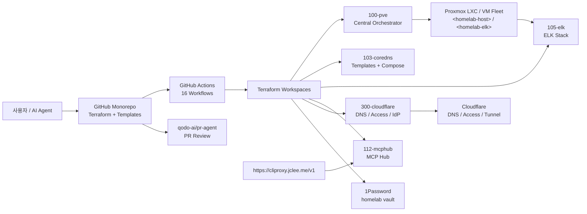
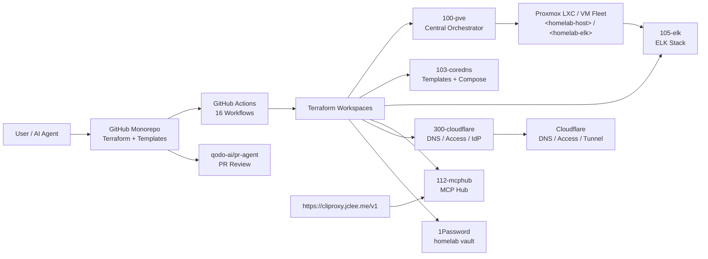

# Terraform Homelab Infrastructure / Terraform Homelab 인프라

> **Bilingual README** — English follows Korean.
> **이중 언어 README** — 한국어 다음에 영어 버전이 이어집니다.

## Badges / 배지

| Badge | Status |
| --- | --- |
| Infrastructure as Code | Terraform 1.10.5 (>= 1.7, < 2.0) |
| Automation | 16 GitHub Actions workflows |
| Security | CodeQL, Gitleaks, Dependency Review, OpenSSF Scorecard |
| Review Automation | qodo-ai/pr-agent, semantic PR checks, auto-fix, auto-merge |
| Documentation | README generation, docs sync, release notes |
| Public Endpoint | `https://cliproxy.jclee.me/v1` |
| License | MIT |

---

# 한국어

## 1. 개요

이 저장소는 `jclee.me` 호멜랩(homelab) 및 관련 외부 서비스를 코드로 관리하기 위한 **Infrastructure-as-Code 모노레포**입니다. Proxmox LXC/VM 플릿, 네트워크, 모니터링, 외부 서비스를 Terraform 워크스페이스로 프로비저닝하며, 1Password 시크릿 주입과 GitHub Actions 기반 CI/CD를 사용합니다.

- **도메인**: `jclee.me`
- **Terraform**: `1.10.5` (`>= 1.7, < 2.0`)
- **공개 엔드포인트**: `https://cliproxy.jclee.me/v1`
- **저장소 구조 규칙**: 평탄(flat) `NNN-SVC` 컨벤션 (예: `100-pve`, `105-elk`, `300-cloudflare`)
  - `1-255` = 내부 인프라 (Proxmox LXC/VM)
  - `300+` = 외부 서비스 (Cloudflare, AWS 등)
- **핵심 디렉터리**: `100-pve`(중앙 오케스트레이터), 서비스별 워크스페이스, `modules/`, `templates/`, `.github/workflows/`

이 README는 자동화 인벤토리, 저장소 구조, 로컬 개발 절차, 명령어 레퍼런스, 기여 가이드를 한 곳에서 확인할 수 있도록 작성되었습니다.

## 2. 주요 기능

### 2.1 Infrastructure as Code
- Terraform 기반 서비스별 워크스페이스(`100-pve`, `105-elk`, `112-mcphub`, `300-cloudflare` 등)
- 평탄한 `NNN-SVC` 디렉터리 컨벤션과 `Makefile`의 단축 별칭(`pve`, `elk`, `mcphub`, `cloudflare` 등) 지원
- `templates/*.tftpl` → `configs/` 렌더링 파이프라인 (`config-renderer` 모듈)
- 로컬 상태 백엔드, `.tfstate`를 git에 커밋, CI 동시성 그룹으로 apply 직렬화

### 2.2 GitHub Automation
- **16개의 GitHub Actions 워크플로우**로 PR 검사, 리뷰, 보안 분석, 자동 병합, 문서 동기화, 릴리스 발행, CI 자동 복구까지 전 영역 자동화
- PR-Agent(`qodo-ai/pr-agent`) 기반 자동 PR 리뷰
- Dependabot PR 자동 병합, 일반 PR 자동 병합
- Gitleaks, CodeQL, Dependency Review, OpenSSF Scorecard를 통한 공급망 보안
- README 자동 생성, 릴리스 노트/릴리스 발행, 다운스트림 헬스 체크

### 2.3 Security and Compliance
- 1Password `homelab` 볼트의 시크릿 주입 (모듈: `modules/shared/onepassword-secrets`)
- Gitleaks로 시크릿 하드코딩 방지
- CodeQL 정적 분석, Dependency Review 의존성 점검
- OpenSSF Scorecard 기반 공급망 보안 점검
- Cloudflare Access / Identity Provider 구성 관리

### 2.4 Observability
- ELK 스택 (Elasticsearch + Logstash + Kibana) 기반 로그 수집·검색
- Filebeat(노드 에이전트) + Logstash(파이프라인) + ILM 정책 + Watcher 설정
- `105-elk/templates/logstash.conf.tftpl` 파이프라인 템플릿
- ILM 정책 관리 유틸리티 (Go, stdlib-only)

### 2.5 MCP Hub
- MCP(Multi-Cloud Proxy) 허브 컨테이너 빌드(`Dockerfile.playwright`, `Dockerfile.proxmox`, `Dockerfile.dev-browser`)
- `validate_mcps.py`로 `mcp_servers.json` 스키마 검증
- 1Password Connect 통합(`op-mcp-server/`)
- n8n 라이선스 패치(`patches/n8n/`)

## 3. 아키텍처

아래 다이어그램은 사용자(또는 AI 에이전트)부터 GitHub → CI → Terraform → Proxmox 플릿 → ELK/Cloudflare/MCP Hub 까지의 흐름을 보여줍니다.


```mermaid
flowchart LR
  Dev["사용자 / AI Agent"]
  Repo["GitHub Monorepo<br/>Terraform + Templates"]
  CI["GitHub Actions<br/>16 Workflows"]
  TF["Terraform Workspaces"]
  PVE["100-pve<br/>Central Orchestrator"]
  DNS_ws["103-coredns<br/>Templates + Compose"]
  ELK_ws["105-elk<br/>ELK Stack"]
  MCP_ws["112-mcphub<br/>MCP Hub"]
  CF_ws["300-cloudflare<br/>DNS / Access / IdP"]
  Fleet["Proxmox LXC / VM Fleet<br/>&lt;homelab-host&gt; / &lt;homelab-elk&gt;"]
  OP["1Password<br/>homelab vault"]
  CDN["Cloudflare<br/>DNS / Access / Tunnel"]
  PRReview["qodo-ai/pr-agent<br/>PR Review"]
  Public["https://cliproxy.jclee.me/v1"]

  Dev --> Repo
  Repo --> CI
  CI --> TF
  TF --> PVE
  TF --> DNS_ws
  TF --> ELK_ws
  TF --> MCP_ws
  TF --> CF_ws
  PVE --> Fleet
  TF --> OP
  Fleet --> ELK_ws
  CF_ws --> CDN
  Repo --> PRReview
  Public --> MCP_ws
```

### 워크스페이스 티어

| 티어 | 디렉터리 | 역할 |
| --- | --- | --- |
| 0 (Core) | `100-pve` | 모든 LXC/VM 라이프사이클을 관리하는 중앙 오케스트레이터 |
| 1 (Infra) | `103-coredns`, `105-elk`, `112-mcphub` | `100-pve`의 `remote_state`를 소비하는 인프라 서비스 |
| External | `300-cloudflare` | Proxmox에 의존하지 않는 외부 서비스 (Cloudflare DNS/Access/IdP/Logpush) |
| Template-only | (해당 없음) | `.tf` 파일이 없고 `100-pve`가 템플릿만 렌더링 |

### 컨피그 파이프라인

```text
hosts.tf (SSoT) → module.hosts → onepassword_secrets + config_renderer
  → templatefile(.tftpl) → configs/ → SSH deploy to /opt/{service}/
```

## 4. 자동화 인벤토리

### 4.1 GitHub Actions 워크플로우 (16개)

| 파일 | 카테고리 | 목적 |
| --- | --- | --- |
| `01_branch-to-branch.yml` | Issue→Branch | 브랜치를 이슈에 자동 연결 |
| `02_issue-to-branch.yml` | Issue→Branch | 이슈로부터 작업 브랜치 자동 생성 |
| `10_pr-review.yml` | PR Review | `qodo-ai/pr-agent` 기반 자동 PR 리뷰 |
| `11_security-pr-review.yml` | PR Review (보안) | 보안 관점의 PR 리뷰 |
| `12_dependabot-auto-merge.yml` | Auto-Merge | Dependabot PR 자동 병합 |
| `13_pr-auto-merge.yml` | Auto-Merge | 조건을 만족하는 PR 자동 병합 |
| `14_bot-auto-fix.yml` | Auto-Fix | 리뷰 지적 사항 자동 수정 |
| `15_merged-pr-cleanup.yml` | Cleanup | 병합된 PR의 브랜치/리소스 정리 |
| `19_issue-backfill.yml` | Issue Ops | 누락된 이슈 메타데이터 백필 |
| `24_release-notes.yml` | Release | 릴리스 노트 자동 생성 |
| `25_release-publish.yml` | Release | GitHub Release 발행 |
| `29_downstream-health-check.yml` | Health | 다운스트림 서비스 헬스 체크 |
| `37_ci-failure-issues.yml` | CI Ops | CI 실패를 이슈로 자동 생성 |
| `60_ci-auto-heal.yml` | CI Auto-Heal | 알려진 CI 실패 패턴 자동 복구 |
| `91_issue-classification.yml` | Issue Ops | 이슈 자동 분류/라벨링 |
| `ci.yml` | CI | 메인 CI (lint, validate, plan) |

> 모든 워크플로우 파일은 실제 디스크 이름(숫자 prefix 포함)을 사용합니다.

### 4.2 운영 도구

| 종류 | 개수 | 비고 |
| --- | --- | --- |
| Go 운영 스크립트 | 0 | 현재 저장소 트리에는 없음 (향후 `scripts/` 추가 가능, stdlib-only 정책 유지) |
| Python 유틸리티 | 1 | `112-mcphub/validate_mcps.py` — `mcp_servers.json` 스키마 검증 |
| Terraform 모듈 | 2 카테고리 | `modules/proxmox/{lxc,vm,lxc-config,vm-config,config-renderer}`, `modules/shared/onepassword-secrets` |

## 5. 저장소 구조

현재 저장소의 실제 최상위 레이아웃은 다음과 같습니다.

```text
terraform/
├── AGENTS.md                       # AI 에이전트용 프로젝트 지식 베이스
├── ARCHITECTURE.md                 # 전체 아키텍처 레퍼런스
├── CODE_STYLE.md                   # 명명/파일/변수/템플릿 컨벤션
├── CONTRIBUTING.md                 # 기여 절차
├── DEPENDENCY_MAP.md               # 모듈 의존성 그래프 + 템플릿 인벤토리
├── LICENSE                         # 라이선스 (MIT)
├── Makefile                        # 평탄 NNN-SVC 컨벤션 + 별칭 맵
├── OWNERS                          # 코드 오너십
├── OWNERS_ALIASES                  # 오너 별칭
├── README.md                       # 이 문서
├── build.env                       # 빌드 환경 변수
│
├── 103-coredns/                    # CoreDNS 설정 템플릿
│   ├── AGENTS.md
│   ├── README.md
│   └── templates/
│       ├── AGENTS.md
│       ├── Corefile.tftpl
│       ├── docker-compose.yml.tftpl
│       └── filebeat.yml.tftpl
│
├── 105-elk/                        # ELK 스택 + Terraform 워크스페이스
│   ├── AGENTS.md
│   ├── docker-compose.yml
│   ├── ilm-policy.json
│   ├── scripts/                    # ILM/Watcher 설정 Go 유틸
│   │   ├── remove-promtail
│   │   ├── remove-promtail.go
│   │   ├── setup-ilm.go
│   │   └── setup-watcher.go
│   ├── config/                     # 렌더링된/예제 컨피그
│   │   ├── AGENTS.md
│   │   ├── Dockerfile.logstash
│   │   ├── filebeat.yml
│   │   ├── ilm-policy.json
│   │   ├── logstash.conf
│   │   └── logstash.yml
│   ├── templates/                  # *.tftpl 원본
│   │   ├── AGENTS.md
│   │   ├── Dockerfile.logstash.tftpl
│   │   ├── docker-compose.yml.tftpl
│   │   ├── filebeat.yml.tftpl
│   │   ├── ilm-policy.json.tftpl
│   │   ├── logstash.conf.tftpl
│   │   ├── logstash.yml.tftpl
│   │   └── setup-ilm.sh.tftpl
│   └── terraform/                  # Terraform 워크스페이스 (ALIAS_elk)
│       ├── AGENTS.md
│       ├── README.md
│       ├── checks.tf
│       ├── main.tf
│       ├── onepassword.tf
│       ├── outputs.tf
│       ├── providers.tf
│       ├── validation.tf
│       ├── variables.tf
│       └── versions.tf
│
├── 112-mcphub/                     # MCP Hub (Multi-Cloud Proxy)
│   ├── AGENTS.md
│   ├── Dockerfile.dev-browser
│   ├── Dockerfile.playwright
│   ├── Dockerfile.proxmox
│   ├── README.md
│   ├── mcp_servers.json
│   ├── validate_mcps.py
│   ├── patches/n8n/
│   │   ├── license-state.js
│   │   └── license.js
│   ├── op-mcp-server/              # 1Password MCP 서버
│   │   ├── AGENTS.md
│   │   ├── index.mjs
│   │   ├── package-lock.json
│   │   └── package.json
│   ├── config/
│   │   ├── AGENTS.md
│   │   ├── entrypoint-patch.go
│   │   ├── filebeat.yml
│   │   ├── patch-placeholder.cjs
│   │   └── patch-sdk-schema.cjs
│   └── templates/
│       ├── AGENTS.md
│       ├── docker-compose-op-connect.yml.tftpl
│       ├── docker-compose.yml.tftpl
│       ├── filebeat.yml.tftpl
│       └── mcp_settings.json.tftpl
│
└── 300-cloudflare/                 # Cloudflare DNS/Access/IdP/Logpush
    ├── AGENTS.md
    ├── README.md
    ├── access.tf
    ├── checks.tf
    ├── dns.tf
    ├── identity-provider.tf
    ├── locals.tf
    ├── logpush.tf
    ├── main.tf
    ├── onepassword.tf
    ├── outputs-homelab.tf
    ├── outputs-jclee.tf
    ├── outputs-synology.tf
    └── outputs.tf
```

> `Makefile`은 위 디렉터리 외에 `jclee`, `pve`, `runner`, `traefik`, `supabase`, `archon`, `n8n`, `oc`, `synology`, `youtube`, `github`, `safetywallet`, `slack`, `gcp` 등 추가 워크스페이스 별칭을 정의합니다. 현재 저장소에는 일부 워크스페이스만 커밋되어 있으며, 나머지는 모노레포의 다른 영역에 속합니다.

### 어디서 무엇을 봐야 하는가

| 작업 | 위치 |
| --- | --- |
| 새 LXC/VM 추가 | `100-pve/locals.tf` (사이징) + `envs/prod/hosts.tf` (호스트 엔트리) |
| 서비스 컨피그 수정 | `{NNN}-{svc}/templates/*.tftpl` → `100-pve`가 렌더링 |
| 시크릿 추가/회전 | `modules/shared/onepassword-secrets/main.tf` + 1Password 볼트 |
| 새 Traefik 라우트 | `102-traefik/templates/*.yml.tftpl` |
| ELK 파이프라인 | `105-elk/templates/logstash.conf.tftpl` |
| Cloudflare DNS/터널 | `300-cloudflare/main.tf` |
| MCP 서버 설정 | `112-mcphub/mcp_servers.json` (검증: `validate_mcps.py`) |
| CI/CD 워크플로우 | `.github/workflows/` |
| 아키텍처 결정 | `docs/adr/` (append-only, supersede with new ADR) |

## 6. 빠른 시작

### 6.1 사전 요구사항

- Terraform `1.10.5` (`>= 1.7, < 2.0`)
- 1Password CLI + `homelab` 볼트 접근 권한
- Proxmox API 토큰 (시크릿)
- Git, Make, OpenTofu 호환 도구

### 6.2 첫 사용

```bash
# 저장소 클론
git clone <repository-url>
cd terraform

# 워크스페이스 목록 확인
make help

# 기본 워크스페이스(pve) 초기화
make init SVC=pve

# 플랜 확인 (apply는 CI/CD에서만 실행)
make plan SVC=pve
```

## 7. 로컬 개발

### 7.1 평탄 NNN-SVC 컨벤션

- 디렉터리 이름은 `NNN-{service}` 형식 (예: `100-pve`, `105-elk`, `300-cloudflare`)
- `1-255` = 내부 인프라, `300+` = 외부 서비스
- `Makefile`의 `ALIAS_` 맵을 통해 짧은 별칭 사용 가능 (`pve`, `elk`, `mcphub`, `cloudflare` 등)
- 별칭이 정의되지 않은 경우 `SVC` 값을 디렉터리 경로로 직접 사용

### 7.2 시크릿 처리

1Password 볼트 `homelab` → `modules/shared/onepassword-secrets` 모듈을 통해 주입합니다.

```hcl
# 사용 예시
secrets = module.onepassword_secrets.secrets
```

### 7.3 컨피그 렌더링

```text
templates/{svc}/*.tftpl
  ↓ templatefile()
configs/{svc}/   (NEVER hand-edit)
  ↓ SSH deploy
/opt/{svc}/      (target host)
```

## 8. 명령어 레퍼런스

`Makefile`은 다음 타겟을 제공합니다.

| 타겟 | 설명 |
| --- | --- |
| `help` | 사용 가능한 타겟과 설명 출력 |
| `init` | Terraform 초기화 (`SVC=pve` 기본) |
| `plan` | Terraform 플랜 생성 (`-out=tfplan`) |
| `apply` | **수동 apply는 비활성화** — CI/CD를 통해 배포 |
| `verify` | Terraform 검증 |
| `lint` | Terraform lint |
| `lint-go` | Go 코드 lint |
| `fmt` | 포맷팅 (`terraform fmt`) |
| `validate` | Terraform validate |
| `drift-check` | 실제 인프라와 상태 간 드리프트 점검 |
| `backup` | 상태 백업 |
| `test` | 전체 테스트 실행 |
| `test-unit` | 단위 테스트 |
| `test-integration` | 통합 테스트 |
| `test-workspace` | 워크스페이스 테스트 |
| `docs` | 문서 생성/동기화 |
| `pre-commit-install` | pre-commit 훅 설치 |
| `pre-commit-run` | pre-commit 훅 실행 |
| `setup` | 개발 환경 셋업 |

### 사용 예시

```bash
# 단축 별칭 사용
make plan SVC=elk
make plan SVC=mcphub
make plan SVC=cloudflare

# 전체 경로 직접 사용
make plan SVC=105-elk/terraform
make plan SVC=112-mcphub

# 사용 가능한 워크스페이스 확인 (잘못된 SVC 지정 시 출력됨)
make help
```

## 9. 기여 가이드

1. **브랜치 생성**: `02_issue-to-branch.yml`이 이슈에서 브랜치를 자동 생성합니다.
2. **커밋 규칙**: Conventional Commits를 따릅니다.
3. **PR 검사**: 다음이 자동으로 실행됩니다.
   - `10_pr-review.yml` — PR-Agent 자동 리뷰
   - `11_security-pr-review.yml` — 보안 리뷰
   - `ci.yml` — lint/validate/plan
   - Gitleaks, CodeQL, Dependency Review, OpenSSF Scorecard
4. **자동 병합**: 조건 충족 시 `13_pr-auto-merge.yml`이 자동 병합합니다.
5. **자동 수정**: 리뷰 지적은 `14_bot-auto-fix.yml`이 자동 패치를 제안합니다.
6. **정리**: 병합 후 `15_merged-pr-cleanup.yml`이 브랜치/리소스를 정리합니다.

자세한 절차는 [`CONTRIBUTING.md`](./CONTRIBUTING.md), [`CODE_STYLE.md`](./CODE_STYLE.md), [`ARCHITECTURE.md`](./ARCHITECTURE.md)를 참조하세요.

### 코드 오너십

- [`OWNERS`](./OWNERS) 및 [`OWNERS_ALIASES`](./OWNERS_ALIASES) 파일 참조
- 리뷰어 지정은 CODEOWNERS 규칙을 따릅니다

## 10. 외부 링크

- 공개 엔드포인트: `https://cliproxy.jclee.me/v1`
- 봇 대시보드: `https://bot.jclee.me`
- PR 리뷰 도구: [`qodo-ai/pr-agent`](https://github.com/qodo-ai/pr-agent)

---

# English

## 1. Overview

This repository is an **Infrastructure-as-Code monorepo** that manages the `jclee.me` homelab and related external services. It provisions the Proxmox LXC/VM fleet, networking, monitoring, and external services through Terraform workspaces, with 1Password secret injection and GitHub Actions CI/CD.

- **Domain**: `jclee.me`
- **Terraform**: `1.10.5` (`>= 1.7, < 2.0`)
- **Public Endpoint**: `https://cliproxy.jclee.me/v1`
- **Repository Layout**: flat `NNN-SVC` convention (e.g. `100-pve`, `105-elk`, `300-cloudflare`)
  - `1-255` = internal infrastructure (Proxmox LXC/VM)
  - `300+` = external services (Cloudflare, AWS, etc.)
- **Core Directories**: `100-pve` (central orchestrator), per-service workspaces, `modules/`, `templates/`, `.github/workflows/`

This README centralizes the automation inventory, repository structure, local development workflow, command reference, and contribution guide.

## 2. Features

### 2.1 Infrastructure as Code
- Terraform workspaces per service (`100-pve`, `105-elk`, `112-mcphub`, `300-cloudflare`, etc.)
- Flat `NNN-SVC` directory convention with `Makefile` short aliases (`pve`, `elk`, `mcphub`, `cloudflare`, …)
- `templates/*.tftpl` → `configs/` render pipeline (via `config-renderer` module)
- Local state backend, `.tfstate` committed to git, CI concurrency groups serialize applies

### 2.2 GitHub Automation
- **16 GitHub Actions workflows** covering PR checks, reviews, security scanning, auto-merge, doc sync, release publishing, and CI auto-heal
- PR-Agent (`qodo-ai/pr-agent`) automated PR reviews
- Dependabot and general PR auto-merge
- Gitleaks, CodeQL, Dependency Review, OpenSSF Scorecard for supply-chain security
- README auto-generation, release notes/publishing, downstream health checks

### 2.3 Security and Compliance
- 1Password `homelab` vault secret injection (`modules/shared/onepassword-secrets`)
- Gitleaks for hardcoded-secret prevention
- CodeQL static analysis, Dependency Review
- OpenSSF Scorecard supply-chain checks
- Cloudflare Access and Identity Provider configuration management

### 2.4 Observability
- ELK stack (Elasticsearch + Logstash + Kibana) for log collection/search
- Filebeat (node agent) + Logstash (pipeline) + ILM policy + Watcher setup
- `105-elk/templates/logstash.conf.tftpl` pipeline template
- ILM policy management utilities (Go, stdlib-only)

### 2.5 MCP Hub
- MCP (Multi-Cloud Proxy) hub container builds (`Dockerfile.playwright`, `Dockerfile.proxmox`, `Dockerfile.dev-browser`)
- `validate_mcps.py` validates `mcp_servers.json` schema
- 1Password Connect integration (`op-mcp-server/`)
- n8n license patches (`patches/n8n/`)

## 3. Architecture

The diagram below shows the flow from User/AI Agent through GitHub → CI → Terraform → Proxmox fleet → ELK / Cloudflare / MCP Hub.


```mermaid
flowchart LR
  Dev["User / AI Agent"]
  Repo["GitHub Monorepo<br/>Terraform + Templates"]
  CI["GitHub Actions<br/>16 Workflows"]
  TF["Terraform Workspaces"]
  PVE["100-pve<br/>Central Orchestrator"]
  DNS_ws["103-coredns<br/>Templates + Compose"]
  ELK_ws["105-elk<br/>ELK Stack"]
  MCP_ws["112-mcphub<br/>MCP Hub"]
  CF_ws["300-cloudflare<br/>DNS / Access / IdP"]
  Fleet["Proxmox LXC / VM Fleet<br/>&lt;homelab-host&gt; / &lt;homelab-elk&gt;"]
  OP["1Password<br/>homelab vault"]
  CDN["Cloudflare<br/>DNS / Access / Tunnel"]
  PRReview["qodo-ai/pr-agent<br/>PR Review"]
  Public["https://cliproxy.jclee.me/v1"]

  Dev --> Repo
  Repo --> CI
  CI --> TF
  TF --> PVE
  TF --> DNS_ws
  TF --> ELK_ws
  TF --> MCP_ws
  TF --> CF_ws
  PVE --> Fleet
  TF --> OP
  Fleet --> ELK_ws
  CF_ws --> CDN
  Repo --> PRReview
  Public --> MCP_ws
```

### Workspace Tiers

| Tier | Directory | Role |
| --- | --- | --- |
| 0 (Core) | `100-pve` | Central orchestrator managing all LXC/VM lifecycle |
| 1 (Infra) | `103-coredns`, `105-elk`, `112-mcphub` | Consume `remote_state` from `100-pve` |
| External | `300-cloudflare` | No Proxmox dependency — DNS / Access / IdP / Logpush |
| Template-only | (none in this slice) | No `.tf` files; `100-pve` renders templates only |

### Config Pipeline

```text
hosts.tf (SSoT) → module.hosts → onepassword_secrets + config_renderer
  → templatefile(.tftpl) → configs/ → SSH deploy to /opt/{service}/
```

## 4. Automation Inventory

### 4.1 GitHub Actions Workflows (16)

| File | Category | Purpose |
| --- | --- | --- |
| `01_branch-to-branch.yml` | Issue→Branch | Link branches to issues automatically |
| `02_issue-to-branch.yml` | Issue→Branch | Create working branches from issues |
| `10_pr-review.yml` | PR Review | Automated PR review via `qodo-ai/pr-agent` |
| `11_security-pr-review.yml` | PR Review (Security) | Security-focused PR review |
| `12_dependabot-auto-merge.yml` | Auto-Merge | Auto-merge Dependabot PRs |
| `13_pr-auto-merge.yml` | Auto-Merge | Auto-merge qualifying PRs |
| `14_bot-auto-fix.yml` | Auto-Fix | Auto-patch review findings |
| `15_merged-pr-cleanup.yml` | Cleanup | Clean up branches/resources after merge |
| `19_issue-backfill.yml` | Issue Ops | Backfill missing issue metadata |
| `24_release-notes.yml` | Release | Auto-generate release notes |
| `25_release-publish.yml` | Release | Publish GitHub Releases |
| `29_downstream-health-check.yml` | Health | Downstream service health checks |
| `37_ci-failure-issues.yml` | CI Ops | Open issues for CI failures |
| `60_ci-auto-heal.yml` | CI Auto-Heal | Auto-recover known CI failure patterns |
| `91_issue-classification.yml` | Issue Ops | Auto-classify / label issues |
| `ci.yml` | CI | Main CI (lint, validate, plan) |

> All workflow file names use the actual on-disk names, including the numeric prefix.

### 4.2 Operational Tools

| Kind | Count | Notes |
| --- | --- | --- |
| Go operational scripts | 0 | Not present in current tree (future `scripts/` must remain stdlib-only) |
| Python utilities | 1 | `112-mcphub/validate_mcps.py` — `mcp_servers.json` schema validator |
| Terraform modules | 2 categories | `modules/proxmox/{lxc,vm,lxc-config,vm-config,config-renderer}`, `modules/shared/onepassword-secrets` |

## 5. Repository Structure

The actual top-level layout of the current repository:

```text
terraform/
├── AGENTS.md                       # Project knowledge base for AI agents
├── ARCHITECTURE.md                 # Full architecture reference
├── CODE_STYLE.md                   # Naming / file / variable / template conventions
├── CONTRIBUTING.md                 # Contribution procedure
├── DEPENDENCY_MAP.md               # Module dependency graph + template inventory
├── LICENSE                         # MIT License
├── Makefile                        # Flat NNN-SVC convention + alias map
├── OWNERS                          # Code ownership
├── OWNERS_ALIASES                  # Owner aliases
├── README.md                       # This document
├── build.env                       # Build environment variables
│
├── 103-coredns/                    # CoreDNS configuration templates
│   ├── AGENTS.md
│   ├── README.md
│   └── templates/
│       ├── AGENTS.md
│       ├── Corefile.tftpl
│       ├── docker-compose.yml.tftpl
│       └── filebeat.yml.tftpl
│
├── 105-elk/                        # ELK stack + Terraform workspace
│   ├── AGENTS.md
│   ├── docker-compose.yml
│   ├── ilm-policy.json
│   ├── scripts/                    # ILM/Watcher setup Go utilities
│   │   ├── remove-promtail
│   │   ├── remove-promtail.go
│   │   ├── setup-ilm.go
│   │   └── setup-watcher.go
│   ├── config/                     # Rendered / example configs
│   │   ├── AGENTS.md
│   │   ├── Dockerfile.logstash
│   │   ├── filebeat.yml
│   │   ├── ilm-policy.json
│   │   ├── logstash.conf
│   │   └── logstash.yml
│   ├── templates/                  # *.tftpl sources
│   │   ├── AGENTS.md
│   │   ├── Dockerfile.logstash.tftpl
│   │   ├── docker-compose.yml.tftpl
│   │   ├── filebeat.yml.tftpl
│   │   ├── ilm-policy.json.tftpl
│   │   ├── logstash.conf.tftpl
│   │   ├── logstash.yml.tftpl
│   │   └── setup-ilm.sh.tftpl
│   └── terraform/                  # Terraform workspace (ALIAS_elk)
│       ├── AGENTS.md
│       ├── README.md
│       ├── checks.tf
│       ├── main.tf
│       ├── onepassword.tf
│       ├── outputs.tf
│       ├── providers.tf
│       ├── validation.tf
│       ├── variables.tf
│       └── versions.tf
│
├── 112-mcphub/                     # MCP Hub (Multi-Cloud Proxy)
│   ├── AGENTS.md
│   ├── Dockerfile.dev-browser
│   ├── Dockerfile.playwright
│   ├── Dockerfile.proxmox
│   ├── README.md
│   ├── mcp_servers.json
│   ├── validate_mcps.py
│   ├── patches/n8n/
│   │   ├── license-state.js
│   │   └── license.js
│   ├── op-mcp-server/              # 1Password MCP server
│   │   ├── AGENTS.md
│   │   ├── index.mjs
│   │   ├── package-lock.json
│   │   └── package.json
│   ├── config/
│   │   ├── AGENTS.md
│   │   ├── entrypoint-patch.go
│   │   ├── filebeat.yml
│   │   ├── patch-placeholder.cjs
│   │   └── patch-sdk-schema.cjs
│   └── templates/
│       ├── AGENTS.md
│       ├── docker-compose-op-connect.yml.tftpl
│       ├── docker-compose.yml.tftpl
│       ├── filebeat.yml.tftpl
│       └── mcp_settings.json.tftpl
│
└── 300-cloudflare/                 # Cloudflare DNS / Access / IdP / Logpush
    ├── AGENTS.md
    ├── README.md
    ├── access.tf
    ├── checks.tf
    ├── dns.tf
    ├── identity-provider.tf
    ├── locals.tf
    ├── logpush.tf
    ├── main.tf
    ├── onepassword.tf
    ├── outputs-homelab.tf
    ├── outputs-jclee.tf
    ├── outputs-synology.tf
    └── outputs.tf
```

> The `Makefile` declares additional workspace aliases (`jclee`, `pve`, `runner`, `traefik`, `supabase`, `archon`, `n8n`, `oc`, `synology`, `youtube`, `github`, `safetywallet`, `slack`, `gcp`). Only a subset of these is committed in the current slice; the rest belong to the broader monorepo.

### Where to Look

| Task | Location |
| --- | --- |
| Add new LXC/VM | `100-pve/locals.tf` (sizing) + `envs/prod/hosts.tf` (host entry) |
| Modify service config | `{NNN}-{svc}/templates/*.tftpl` → rendered by `100-pve` |
| Add/rotate secret | `modules/shared/onepassword-secrets/main.tf` + 1Password vault |
| New Traefik route | `102-traefik/templates/*.yml.tftpl` |
| ELK pipeline | `105-elk/templates/logstash.conf.tftpl` |
| Cloudflare DNS / tunnel | `300-cloudflare/main.tf` |
| MCP server config | `112-mcphub/mcp_servers.json` (validate via `validate_mcps.py`) |
| CI/CD workflows | `.github/workflows/` |
| Architecture decisions | `docs/adr/` (append-only, supersede with new ADR) |

## 6. Quick Start

### 6.1 Prerequisites

- Terraform `1.10.5` (`>= 1.7, < 2.0`)
- 1Password CLI + access to the `homelab` vault
- Proxmox API token (as a secret)
- Git, Make, OpenTofu-compatible tooling

### 6.2 First Use

```bash
# Clone the repository
git clone <repository-url>
cd terraform

# List available targets
make help

# Initialize the default workspace (pve)
make init SVC=pve

# Generate a plan (apply runs only via CI/CD)
make plan SVC=pve
```

## 7. Local Development

### 7.1 Flat NNN-SVC Convention

- Directory names follow `NNN-{service}` (e.g. `100-pve`, `105-elk`, `300-cloudflare`)
- `1-255` = internal infrastructure, `300+` = external services
- `Makefile` `ALIAS_` map provides short aliases (`pve`, `elk`, `mcphub`, `cloudflare`, …)
- If no alias is defined, `SVC` is used as the directory path directly

### 7.2 Secret Handling

Secrets are injected from the 1Password `homelab` vault via `modules/shared/onepassword-secrets`:

```hcl
# Example usage
secrets = module.onepassword_secrets.secrets
```

### 7.3 Config Rendering

```text
templates/{svc}/*.tftpl
  ↓ templatefile()
configs/{svc}/   (NEVER hand-edit)
  ↓ SSH deploy
/opt/{svc}/      (target host)
```

## 8. Commands Reference

The `Makefile` provides the following targets.

| Target | Description |
| --- | --- |
| `help` | List available targets with descriptions |
| `init` | Initialize Terraform (default `SVC=pve`) |
| `plan` | Create Terraform plan (`-out=tfplan`) |
| `apply` | **Manual apply is disabled** — deploy via CI/CD |
| `verify` | Terraform verification |
| `lint` | Terraform lint |
| `lint-go` | Go lint |
| `fmt` | Formatting (`terraform fmt`) |
| `validate` | Terraform validate |
| `drift-check` | Compare real infra vs state for drift |
| `backup` | State backup |
| `test` | Run all tests |
| `test-unit` | Unit tests |
| `test-integration` | Integration tests |
| `test-workspace` | Workspace tests |
| `docs` | Generate / sync documentation |
| `pre-commit-install` | Install pre-commit hooks |
| `pre-commit-run` | Run pre-commit hooks |
| `setup` | Bootstrap developer environment |

### Usage Examples

```bash
# Short aliases
make plan SVC=elk
make plan SVC=mcphub
make plan SVC=cloudflare

# Full paths
make plan SVC=105-elk/terraform
make plan SVC=112-mcphub

# Discover available workspaces (printed on invalid SVC)
make help
```

## 9. Contribution Guide

1. **Create a branch**: `02_issue-to-branch.yml` auto-creates branches from issues.
2. **Commit conventions**: Follow Conventional Commits.
3. **PR checks** (run automatically):
   - `10_pr-review.yml` — PR-Agent automated review
   - `11_security-pr-review.yml` — security review
   - `ci.yml` — lint / validate / plan
   - Gitleaks, CodeQL, Dependency Review, OpenSSF Scorecard
4. **Auto-merge**: `13_pr-auto-merge.yml` merges qualifying PRs.
5. **Auto-fix**: `14_bot-auto-fix.yml` proposes automated patches for review findings.
6. **Cleanup**: `15_merged-pr-cleanup.yml` cleans up after merge.

See [`CONTRIBUTING.md`](./CONTRIBUTING.md), [`CODE_STYLE.md`](./CODE_STYLE.md), and [`ARCHITECTURE.md`](./ARCHITECTURE.md) for full procedures.

### Code Ownership

- See [`OWNERS`](./OWNERS) and [`OWNERS_ALIASES`](./OWNERS_ALIASES)
- Reviewer assignment follows the CODEOWNERS rules

## 10. External Links

- Public endpoint: `https://cliproxy.jclee.me/v1`
- Bot dashboard: `https://bot.jclee.me`
- PR review tool: [`qodo-ai/pr-agent`](https://github.com/qodo-ai/pr-agent)

---

## License

This project is licensed under the MIT License. See [`LICENSE`](./LICENSE).

---

<sub>README generated by <strong>gpt-5.5</strong> with fallback to <strong>minimax-m3</strong> via <code>https://cliproxy.jclee.me/v1</code>.</sub>