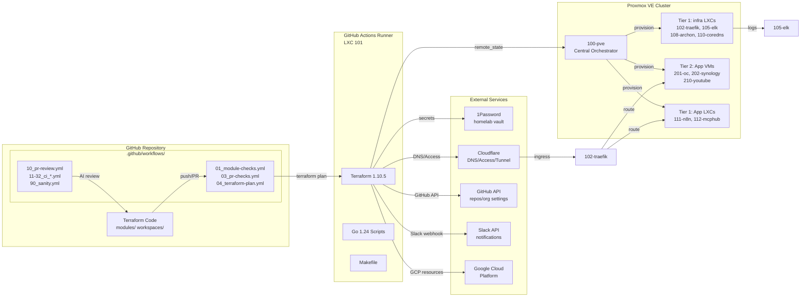

# Terraform Homelab Infrastructure / Terraform Homelab 인프라

[](https://www.terraform.io)
[](LICENSE)
[](.github/workflows)
[](https://scorecard.dev)

> English below / 아래 한국어

Infrastructure-as-code monorepo for `jclee.me`. Provisions a Proxmox LXC/VM fleet, networking, monitoring, and external services via Terraform workspaces with 1Password secret injection and GitHub Actions CI/CD.

`jclee.me`를 위한 Infrastructure-as-Code 모노레포입니다. Terraform 워크스페이스를 통해 Proxmox LXC/VM 플릿, 네트워킹, 모니터링 및 외부 서비스를 프로비저닝하며, 1Password 시크릿 주입과 GitHub Actions CI/CD로 운영됩니다.

---

## Table of Contents / 목차

- [Features](#features--주요-기능)
- [Architecture](#architecture--아키텍처)
- [Automation Inventory](#automation-inventory--자동화-인벤토리)
- [Quick Start](#quick-start--빠른-시작)
- [Local Development](#local-development--로컬-개발)
- [Commands Reference](#commands-reference--명령어-참조)
- [Contribution Guide](#contribution-guide--기여-가이드)

---

## Features / 주요 기능

### Infrastructure Provisioning / 인프라 프로비저닝

- **21 Terraform workspaces** across 4 tiers (Tier 0 core, Tier 1 infra, Tier 2 VMs, Tier 3 external/cloud)
- **Proxmox LXC/VM fleet** managed as code (22 LXCs, 4 VMs across <homelab-host>/24 subnet)
- **Single Source of Truth (SSoT)** in `100-pve/envs/prod/hosts.tf` for all host definitions

### Configuration Management / 구성 관리

- **Template-driven config pipeline**: `hosts.tf` → module rendering → `.tftpl` templates → rendered configs → SSH deploy
- **6 reusable modules** under `modules/proxmox/` and `modules/shared/`
- **1Password integration** for secret management (homelab vault, 12 items, 48 keys)

### Networking & Security / 네트워킹 및 보안

- **Traefik** reverse proxy (LXC 102) with dynamic routing
- **CoreDNS** for internal DNS resolution
- **Cloudflare** DNS, Access, and Tunnel management
- **Zero-trust Access** via Cloudflare Access policies

### Monitoring & Observability / 모니터링 및 가시성

- **ELK Stack** (Elasticsearch, Logstash, Kibana) for log aggregation and search
- **Log retention** and pipeline management

### CI/CD Automation / CI/CD 자동화

- **32 GitHub Actions workflows** covering plan, apply, destroy, validation, testing, security scanning, documentation, and state management
- **Concurrency groups** to serialize applies per workspace
- **PR automation** with `pr-agent` for intelligent code review

---

## Architecture / 아키텍처


```mermaid
flowchart LR
  subgraph GitHub["GitHub Repository"]
    subgraph Workflows[".github/workflows/"]
      PR["10_pr-review.yml\n11-32_ci_*.yml\n90_sanity.yml"]
      CI["01_module-checks.yml\n03_pr-checks.yml\n04_terraform-plan.yml"]
    end
    RepoCode["Terraform Code\nmodules/ workspaces/"]
  end

  subgraph Runner["GitHub Actions Runner\nLXC 101"]
    TF["Terraform 1.10.5"]
    Go["Go 1.24 Scripts"]
    Make["Makefile"]
  end

  subgraph Proxmox["Proxmox VE Cluster"]
    PVE["100-pve\nCentral Orchestrator"]
    LXC_Fleet["Tier 1: infra LXCs\n102-traefik, 105-elk\n108-archon, 110-coredns"]
    VM_Fleet["Tier 2: App VMs\n201-oc, 202-synology\n210-youtube"]
    LXC_Apps["Tier 1: App LXCs\n111-n8n, 112-mcphub"]
  end

  subgraph External["External Services"]
    OP["1Password\nhomelab vault"]
    CF["Cloudflare\nDNS/Access/Tunnel"]
    GH["GitHub API\nrepos/org settings"]
    SL["Slack API\nnotifications"]
    GCP["Google Cloud\nPlatform"]
  end

  RepoCode -->|push/PR| CI
  PR -->|AI review| RepoCode
  CI -->|terraform plan| TF
  TF -->|remote_state| PVE
  PVE -->|provision| LXC_Fleet
  PVE -->|provision| VM_Fleet
  PVE -->|provision| LXC_Apps
  TF -->|secrets| OP
  TF -->|DNS/Access| CF
  TF -->|GitHub API| GH
  TF -->|Slack webhook| SL
  TF -->|GCP resources| GCP
  LXC_Fleet -->|logs| 105-elk
  CF -->|ingress| 102-traefik
  102-traefik -->|route| VM_Fleet
  102-traefik -->|route| LXC_Apps
```

### Workspace Tiers / 워크스페이스 계층

| Tier | Prefix | Workspaces | Description |
|------|--------|------------|-------------|
| 0 (Core) | `100` | `100-pve` | Central orchestrator; provisions all LXC/VM lifecycle |
| 1 (Infra) | `10x` | `102-traefik`, `105-elk`, `108-archon`, `110-coredns`, `111-n8n`, `112-mcphub` | Shared infrastructure services |
| 2 (VMs) | `2xx` | `201-oc`, `202-synology`, `210-youtube` | VM-based applications |
| 3 (External) | `3xx` | `300-cloudflare`, `301-github`, `320-safetywallet`, `321-slack` | External cloud/services |
| Cloud | `400` | `400-gcp` | Google Cloud Platform resources |

---

## Automation Inventory / 자동화 인벤토리

### GitHub Actions Workflows / GitHub Actions 워크플로우

All workflows are located in `.github/workflows/` with numeric prefixes for execution ordering.

#### Pull Request Automation / PR 자동화

| Workflow File | Purpose |
|--------------|---------|
| `10_pr-review.yml` | AI-powered PR review using [qodo-ai/pr-agent](https://github.com/qodo-ai/pr-agent) |
| `03_pr-checks.yml` | Runs validation, fmt, docs-check on PR events |

#### CI (Continuous Integration) / CI (지속적 통합)

| Workflow File | Purpose |
|--------------|---------|
| `01_module-checks.yml` | Terraform module linting and validation |
| `11_ci_terraform.yml` | Main Terraform plan/apply workflow |
| `12_ci_terraform_destroy.yml` | Terraform destroy workflow |
| `13_ci_terraform_validate.yml` | `terraform validate` on all workspaces |
| `14_ci_terraform_fmt.yml` | `terraform fmt` check (recursive) |
| `15_ci_terraform_docs.yml` | Auto-generate/update Terraform documentation |
| `16_ci_terraform_test.yml` | Unit, integration, workspace, and module tests |
| `17_ci_terraform_security_scan.yml` | tfsec and checkov security scanning |
| `18_ci_terraform_dependency_list.yml` | Generate/update dependency lists |
| `19_ci_terraform_graph.yml` | Generate Terraform dependency graphs |
| `20_ci_terraform_provider_lock.yml` | Manage provider lock files |
| `21_ci_terraform_provider_upgrade.yml` | Upgrade Terraform providers |
| `22_ci_terraform_module_version.yml` | Check module version consistency |
| `23_ci_terraform_workspace_sync.yml` | Sync workspace configuration |
| `24_ci_terraform_workspace_validate.yml` | Validate all workspace configurations |
| `25_ci_terraform_workspace_list.yml` | List all workspaces with details |
| `26_ci_terraform_workspace_output.yml` | Fetch and display workspace outputs |
| `27_ci_terraform_workspace_refresh.yml` | Refresh Terraform state |
| `28_ci_terraform_state_pull.yml` | Pull state from remote |
| `29_ci_terraform_state_push.yml` | Push state to remote |
| `30_ci_terraform_import.yml` | Import existing resources |
| `31_ci_terraform_output_raw.yml` | Raw output from workspaces |
| `32_ci_terraform_output_json.yml` | JSON-formatted outputs |

#### Operational Workflows / 운영 워크플로우

| Workflow File | Purpose |
|--------------|---------|
| `00_pre.yml` | Pre-flight checks before other workflows |
| `04_terraform-plan.yml` | Manual Terraform plan trigger |
| `04_terraform-plan-multi.yml` | Multi-workspace plan |
| `05_terraform-apply.yml` | Manual Terraform apply trigger |
| `06_terraform-destroy.yml` | Manual Terraform destroy trigger |
| `90_sanity.yml` | Sanity checks on push to master |
| `91_ci_trigger.yml` | Cross-repository CI triggering |

### Tools & Dependencies / 도구 및 의존성

| Tool | Version | Purpose |
|------|---------|---------|
| [Terraform](https://www.terraform.io) | 1.10.5 | Infrastructure as Code |
| [Go](https://go.dev) | 1.24 | Operational scripts |
| [pr-agent](https://github.com/qodo-ai/pr-agent) | latest | AI-powered PR review |
| [tfsec](https://github.com/aquasecurity/tfsec) | latest | Terraform security scanning |
| [checkov](https://github.com/bridgecrewio/checkov) | latest | Terraform compliance scanning |
| [terraform-docs](https://github.com/terraform-docs/terraform-docs) | latest | Generate Terraform documentation |
| [Graphviz](https://graphviz.org) | latest | Generate dependency graphs |
| [make](https://www.gnu.org/software/make) | any | Command orchestration |

### Terraform Providers / Terraform 프로바이더

| Provider | Purpose |
|----------|---------|
| `proxmox` | Proxmox VE LXC/VM provisioning |
| `cloudflare` | DNS, Access, Tunnel management |
| `github` | GitHub repository/organization settings |
| `google` | Google Cloud Platform |
| `local` | Local file generation |
| `terraform` | Remote state data sources |

---

## Quick Start / 빠른 시작

### Prerequisites / 사전 요구사항

- **Terraform** 1.10.5 (`>= 1.7, < 2.0`)
- **Go** 1.24 or later
- **make** build tool
- **SSH access** to Proxmox host `<homelab-host>`
- **1Password account** with access to `homelab` vault
- **GitHub personal access token** with repo scope

### Installation / 설치

```bash
# Clone the repository
git clone https://github.com/jclee/terraform.git
cd terraform

# Copy example variables file
cp terraform.tfvars.example terraform.tfvars

# Edit terraform.tfvars with your values:
# - Proxmox host IP/hostname
# - 1Password token
# - Cloudflare API token
# - GitHub token

# Validate configuration
make validate
```

### Basic Workflow / 기본 워크플로우

```bash
# View what would change
make plan

# Apply infrastructure (requires approval in CI)
make apply

# Destroy specific resource
make destroy TARGET=-target=module.vm_app

# Generate documentation
make docs
```

### Repository Structure / 저장소 구조

```
terraform/
├── 100-pve/                     # Tier 0: Central orchestrator workspace
│   └── envs/prod/hosts.tf       # SSoT for all host definitions
├── 101-supabase/                # Tier 1: Infrastructure workspace
├── 102-traefik/                 # Tier 1: Reverse proxy workspace
├── 105-elk/                     # Tier 1: Logging stack workspace
├── 108-archon/                  # Tier 1: Management UI workspace
├── 110-coredns/                 # Tier 1: DNS server workspace
├── 111-n8n/                     # Tier 1: Workflow automation workspace
├── 112-mcphub/                  # Tier 1: MCP hub workspace
├── 2xx-{svc}/                   # Tier 2: VM-based application workspaces
├── 3xx-{svc}/                   # Tier 3: External service workspaces
├── 400-gcp/                     # Cloud: GCP resources workspace
├── modules/                     # Reusable Terraform modules
│   ├── proxmox/lxc/
│   ├── proxmox/vm/
│   ├── proxmox/lxc-config/
│   ├── proxmox/vm-config/
│   ├── proxmox/config-renderer/
│   └── shared/onepassword-secrets/
├── tests/                       # Terraform test suites
├── scripts/                     # Go operational tooling (14 scripts)
├── docs/                        # Architecture docs, ADRs, runbooks
├── .github/workflows/            # 32 GitHub Actions workflows
├── Makefile                     # Command orchestration
├── ARCHITECTURE.md              # Full architecture reference
├── DEPENDENCY_MAP.md            # Module dependency graph
└── CODE_STYLE.md                # Naming and style conventions
```

---

## Local Development / 로컬 개발

### Environment Variables / 환경 변수

Create `terraform.tfvars` from the example:

```bash
cp terraform.tfvars.example terraform.tfvars
```

Required variables:

| Variable | Description |
|----------|-------------|
| `proxmox_host` | Proxmox VE host address |
| `proxmox_user` | Proxmox authentication user |
| `proxmox_password` | Proxmox authentication password |
| `proxmox_token_id` | Proxmox API token ID |
| `proxmox_token_secret` | Proxmox API token secret |
| `op_token` | 1Password Connect API token |
| `cloudflare_api_token` | Cloudflare API token |
| `github_token` | GitHub personal access token |

### Workspace Selection / 워크스페이스 선택

List available workspaces:

```bash
terraform workspace list
```

Select a workspace:

```bash
terraform workspace select 100-pve
```

### Running Locally / 로컬 실행

```bash
# Validate all configuration
make validate

# Check formatting
make fmt-check

# Run tests
make test

# Plan specific workspace
cd 100-pve && terraform plan

# Apply with auto-approve (use with caution)
cd 100-pve && terraform apply -auto-approve
```

---

## Commands Reference / 명령어 참조

All commands are orchestrated via `Makefile`:

### Documentation / 문서화

| Command | Description |
|---------|-------------|
| `make docs` | Generate/update Terraform documentation |
| `make docs-check` | Check if documentation is up-to-date |

### Code Quality / 코드 품질

| Command | Description |
|---------|-------------|
| `make fmt` | Format all Terraform files |
| `make fmt-check` | Check formatting without modifying |
| `make validate` | Validate all Terraform configurations |

### Testing / 테스트

| Command | Description |
|---------|-------------|
| `make test` | Run all tests |
| `make test-unit` | Run unit tests only |
| `make test-integration` | Run integration tests |
| `make test-work` | Run workspace tests |
| `make test-module` | Run module tests |

### Terraform Operations / Terraform 운영

| Command | Description |
|---------|-------------|
| `make plan` | Run terraform plan on current workspace |
| `make plan-verbose` | Run terraform plan with verbose output |
| `make apply` | Run terraform apply |
| `make apply-concurrency` | Apply with concurrency protection |
| `make destroy` | Run terraform destroy |
| `make clean` | Clean build artifacts |
| `make clean-targets` | Clean terraform target files |
| `make clean-state` | Clean .tfstate files |
| `make lock` | Generate provider lock files |
| `make state-pull` | Pull remote state |
| `make state-push` | Push local state to remote |
| `make state-list` | List resources in state |
| `make state-show` | Show specific resource in state |
| `make output-json` | Output workspace outputs as JSON |
| `make graph` | Generate dependency graph |
| `make graph-simple` | Generate simplified dependency graph |

### Provider Management / 프로바이더 관리

| Command | Description |
|---------|-------------|
| `make provider-lock` | Generate lock files for providers |
| `make provider-upgrade` | Upgrade provider versions |

### Release / 배포

| Command | Description |
|---------|-------------|
| `make release` | Create release (requires tag) |
| `make release-dry-run` | Preview release without creating |

### Maintenance / 유지보수

| Command | Description |
|---------|-------------|
| `make all-check` | Run all checks (fmt, validate, test, docs-check) |
| `make clean-workflows` | Clean workflow artifacts |
| `make shell` | Open terraform shell |

---

## Contribution Guide / 기여 가이드

### Workflow / 워크플로우

1. **Fork** the repository
2. **Create a feature branch**: `git checkout -b feature/your-feature-name`
3. **Make changes** following the [CODE_STYLE.md](CODE_STYLE.md) conventions
4. **Run checks**: `make all-check`
5. **Commit** with clear messages
6. **Push** to your fork
7. **Open a Pull Request** against `master`

### Adding a New LXC or VM / 새 LXC 또는 VM 추가

1. **Add host entry** to `100-pve/envs/prod/hosts.tf`
2. **Add sizing** in `100-pve/locals.tf` if needed
3. **Create workspace** directory (e.g., `NNN-{service}/`)
4. **Add templates** in `NNN-{service}/templates/` if configuration is needed
5. **Run validation**: `make validate`
6. **Plan changes**: `make plan`
7. **Open PR** with the changes

### Adding a New Module / 새 모듈 추가

1. Create module in `modules/{category}/{module-name}/`
2. Follow naming conventions in [CODE_STYLE.md](CODE_STYLE.md)
3. Add tests in `tests/` directory
4. Update [DEPENDENCY_MAP.md](DEPENDENCY_MAP.md)
5. Run: `make test-module MODULE={module-name}`

### Config Pipeline Flow / 구성 파이프라인 흐름

```
hosts.tf (SSoT) → module.hosts → onepassword_secrets + config_renderer
  → templatefile(.tftpl) → configs/ → SSH deploy to /opt/{service}/
```

### Architecture Decisions / 아키텍처 결정

- Document decisions in `docs/adr/` following ADR format
- ADRs are append-only; supersede with new ADR if changing direction

### Reporting Issues / 이슈 보고

1. Check existing issues before creating new ones
2. Include output of `make state-show` for resource-specific issues
3. Include relevant Terraform logs (`TF_LOG=TRACE`)
4. Specify workspace and environment

### Code Review Standards / 코드 리뷰 표준

- All PRs require `make all-check` passing
- PRs affecting infrastructure require review from maintainers
- Use `pr-agent` for automated review suggestions
- Main branch requires status checks passing before merge

---

## License / 라이선스

MIT License - see [LICENSE](LICENSE) file for details.

---

## Links / 링크

- [Terraform Documentation](https://www.terraform.io/docs)
- [Proxmox VE Documentation](https://pve.proxmox.com/wiki/Main_Page)
- [1Password Developer Documentation](https://developer.1password.com/)
- [Cloudflare API Documentation](https://developers.cloudflare.com/api/)
- [qodo-ai/pr-agent](https://github.com/qodo-ai/pr-agent) - AI PR review tool
