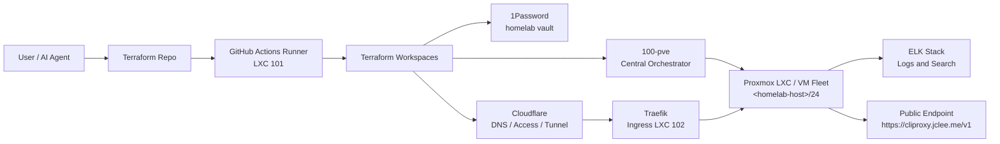

# Terraform Homelab Infrastructure / Terraform Homelab 인프라

> **Bilingual README** — Korean precedes English.
> **이중 언어 README** — 한국어 본문이 영어보다 먼저 옵니다.
>
> Generated by `gpt-5.5` (fallback: `minimax-m3` via CLIProxyAPI).
> README auto-sync target: `https://bot.jclee.me`

## Badges / 배지

| Category        | Detail                                                                                 |
| --------------- | -------------------------------------------------------------------------------------- |
| IaC             | Terraform `1.10.5` (`>= 1.7, < 2.0`)                                                   |
| Workspace Convention | Flat `NNN-SVC` (e.g. `100-pve`, `105-elk`, `300-cloudflare`)                       |
| CI/CD           | 14 GitHub Actions workflows (`.github/workflows/`)                                     |
| Secret Backend  | 1Password `homelab` vault (12 items, 48 keys)                                          |
| Review Automation | [qodo-ai/pr-agent](https://github.com/qodo-ai/pr-agent) + Dependabot auto-merge        |
| Security        | CodeQL, Gitleaks, Dependency Review, OpenSSF Scorecard                                 |
| Public Endpoint | `https://cliproxy.jclee.me/v1`                                                         |
| Docs Mirror     | `https://bot.jclee.me`                                                                 |
| License         | MIT                                                                                    |

---

# 한국어

## 1. 개요

이 저장소는 `jclee.me` 호멜랩(homelab)과 관련 외부 서비스를 코드로 관리하기 위한 **Infrastructure-as-Code 모노레포**입니다. Proxmox LXC/VM 플릿, 네트워크, 모니터링 스택, 그리고 Cloudflare · GitHub · Slack 같은 외부 서비스를 Terraform 워크스페이스로 프로비저닝하며, 1Password 시크릿 주입과 GitHub Actions 기반 CI/CD를 사용합니다.

- **도메인**: `jclee.me`
- **내부 서브넷**: `<homelab-host>/24` (LXC/VM 플릿)
- **Terraform 버전**: `1.10.5` (`>= 1.7, < 2.0`)
- **공개 엔드포인트**: `https://cliproxy.jclee.me/v1`
- **워크스페이스 규칙**: 평탄(flat) `NNN-SVC` 컨벤션
  - `1–255` = 내부 인프라 (Proxmox LXC/VM, 예: `<homelab-host>`)
  - `300+` = 외부 서비스 (Cloudflare, GitHub, Slack 등)
  - `400+` = 퍼블릭 클라우드 (GCP 등)
- **핵심 오케스트레이터**: `100-pve` — 모든 LXC/VM 라이프사이클의 단일 진실 공급원(SSOT)
- **워크스페이스 수**: 21개 (`80` 물리 호스트, `100s` Proxmox 인프라, `200s` VM 앱, `300s` 외부, `400s` 클라우드)

이 README는 자동화 인벤토리, 저장소 구조, 로컬 개발 절차, 명령어 레퍼런스, 기여 가이드를 한 곳에서 확인할 수 있도록 작성되었습니다.

## 2. 주요 기능

### 2.1 Infrastructure as Code

- Terraform 기반 **서비스별 워크스페이스** (예: `105-elk/terraform/`, `112-mcphub/`, `300-cloudflare/`)
- 평탄한 `NNN-SVC` 디렉터리 컨벤션과 `Makefile`의 단축 별칭 (`pve`, `elk`, `mcphub`, `cloudflare` 등)
- `templates/*.tftpl` → 렌더링된 설정 파일 파이프라인 (`config-renderer` 모듈)
- `remote_state` 기반 계층 간 의존성 관리
- `.tfstate`를 git에 커밋하는 로컬 백엔드 + CI 동시성 그룹 직렬화

### 2.2 시크릿 관리

- **1Password** `homelab` 볼트 (12 items · 48 keys)
- `modules/shared/onepassword-secrets/` 모듈로 표준화된 주입
- 코드베이스에 평문 시크릿 **제로** — 모든 자격증명은 1Password 경유

### 2.3 자동화 (CI/CD)

- 14개의 GitHub Actions 워크플로우 (브랜치/PR/릴리스/상태/문서 자동화)
- [qodo-ai/pr-agent](https://github.com/qodo-ai/pr-agent) 기반 AI PR 리뷰
- Dependabot 자동 머지, 머지 후 PR 정리
- 실패한 CI 자동 이슈 생성 및 릴리스 노트 자동화
- README 자동 생성/동기화 (대상: `https://bot.jclee.me`)

### 2.4 관측 가능성 (Observability)

- ELK 스택 (`105-elk/`) — Filebeat → Logstash → Elasticsearch + ILM
- 모든 컨테이너/서비스에서 Filebeat 로그 수집
- Logstash 파이프라인은 `templates/logstash.conf.tftpl`로 템플릿화

### 2.5 외부 서비스 통합

- **Cloudflare** (`300-cloudflare/`): DNS, Access, Tunnel, Logpush, Identity Provider
- **GitHub** (`301-github/`): 저장소/팀/권한 관리
- **Slack** (`320-slack/`): 알림/웹훅
- **GCP** (`400-gcp/`): 퍼블릭 클라우드 리소스

## 3. 아키텍처


```mermaid
flowchart LR
  Agent["User / AI Agent"] --> Repo["Terraform Repo"]
  Repo --> CI["GitHub Actions Runner<br/>LXC 101"]
  CI --> TF["Terraform Workspaces"]
  TF --> PVE["100-pve<br/>Central Orchestrator"]
  PVE --> Fleet["Proxmox LXC / VM Fleet<br/>&lt;homelab-host&gt;/24"]
  TF --> OP["1Password<br/>homelab vault"]
  TF --> CF["Cloudflare<br/>DNS / Access / Tunnel"]
  Fleet --> ELK["ELK Stack<br/>Logs and Search"]
  CF --> Traefik["Traefik<br/>Ingress LXC 102"]
  Traefik --> Fleet
  Fleet --> Public["Public Endpoint<br/>https://cliproxy.jclee.me/v1"]
```

핵심 흐름:

1. 사용자/AI 에이전트가 변경 사항을 push 하면 GitHub Actions Runner (`LXC 101`)가 워크플로우를 실행합니다.
2. Terraform 워크스페이스는 1Password `homelab` 볼트에서 시크릿을 주입받아 Proxmox/Cloudflare/GCP에 적용합니다.
3. `100-pve`는 모든 LXC/VM의 SSOT이며, `templates/*.tftpl`을 렌더링해 SSH로 `/opt/{service}/`에 배포합니다.
4. Traefik(LXC 102)이 인그레스를 처리하고, ELK 스택이 로그/이벤트를 수집합니다.
5. 외부 트래픽은 `https://cliproxy.jclee.me/v1` 공개 엔드포인트로 노출됩니다.

자세한 아키텍처 결정은 `docs/adr/`, 런북은 `docs/runbooks/`, 모듈 의존성은 `DEPENDENCY_MAP.md`를 참조하세요.

## 4. 자동화 인벤토리

### 4.1 GitHub Actions 워크플로우 (14)

`.github/workflows/` 디렉터리의 실제 파일명(숫자 prefix 포함)을 기준으로 분류한 인벤토리입니다.

| 카테고리        | 파일                          | 목적                                                                 |
| --------------- | ----------------------------- | -------------------------------------------------------------------- |
| PR / Review     | `10_pr-review.yml`            | [qodo-ai/pr-agent](https://github.com/qodo-ai/pr-agent) AI 리뷰       |
| PR / Review     | `11_security-pr-review.yml`   | 보안 중심 PR 리뷰 (CodeQL/Gitleaks/Dependency Review)                 |
| PR / Review     | `12_dependabot-auto-merge.yml`| Dependabot PR 자동 머지 (패치/마이너 정책)                            |
| PR / Review     | `13_pr-auto-merge.yml`        | 라벨/체크 기반 일반 PR 자동 머지                                       |
| PR / Review     | `14_bot-auto-fix.yml`         | 봇이 감지한 경미한 이슈 자동 수정                                      |
| PR / Review     | `15_merged-pr-cleanup.yml`    | 머지된 PR의 브랜치/댓글 정리                                          |
| Issue → Code    | `01_branch-to-pr.yml`         | 브랜치에서 PR로 자동 승격                                             |
| Issue → Code    | `02_issue-to-branch.yml`      | 이슈에서 작업 브랜치 자동 생성                                        |
| Issue → Code    | `19_issue-backfill.yml`       | 기존 항목/이슈 백필                                                   |
| Issue → Code    | `37_ci-failure-issues.yml`    | CI 실패 → 이슈 자동 생성                                              |
| Release         | `24_release-notes.yml`        | 릴리스 노트 자동 생성                                                 |
| Release         | `25_release-publish.yml`      | 릴리스 퍼블리시/배포                                                   |
| Health          | `29_downstream-health-check.yml`| 다운스트림 의존성 헬스 체크                                          |
| CI (core)       | `ci.yml`                      | 메인 CI 파이프라인 (lint, plan, validate)                              |

### 4.2 Go 자동화 도구 (0)

현재 Go 기반 운영 도구는 등록되어 있지 않습니다 (`scripts/` 도입 예정 시 `AGENTS.md`의 컨벤션을 따르세요 — stdlib-only, `scripts/<name>.go` + `scripts/<name>` 심볼릭 링크).

### 4.3 저장소 내 보조 자동화

| 위치                                  | 종류           | 목적                                                   |
| ------------------------------------- | -------------- | ------------------------------------------------------ |
| `Makefile`                            | Make 타겟     | 워크스페이스 별칭 해석 + `terraform`/`pre-commit` 래퍼 |
| `100-pve/`                            | Terraform 모듈 | LXC/VM 라이프사이클 오케스트레이션 + 템플릿 렌더링       |
| `modules/proxmox/config-renderer/`    | Terraform 모듈 | `.tftpl` → 실파일 변환                                  |
| `modules/shared/onepassword-secrets/` | Terraform 모듈 | 1Password → 시크릿 맵 노출                              |
| `112-mcphub/validate_mcps.py`         | Python 스크립트 | MCP 서버 설정 검증                                     |
| `112-mcphub/op-mcp-server/index.mjs`  | Node.js        | 1Password MCP 서버 어댑터                              |

## 5. 빠른 시작 (Quick Start)

```bash
# 1. 저장소 클론
git clone <repo-url> terraform && cd terraform

# 2. 필수 도구 설치
#    - terraform (1.10.5)
#    - op (1Password CLI) — 1Password에 로그인
#    - pre-commit (lint hook)

# 3. 1Password 인증
op signin

# 4. 워크스페이스 초기화 (예: ELK)
make init SVC=elk

# 5. Plan 확인 (CI/CD로 적용)
make plan SVC=elk
```

> ⚠️ **로컬 `apply`는 비활성화**되어 있습니다. 모든 적용은 `master` 브랜치 push를 통해 CI/CD에서 실행됩니다.

## 6. 로컬 개발

### 6.1 Pre-commit

```bash
make pre-commit-install
make pre-commit-run
```

### 6.2 Lint / Format

```bash
make lint              # terraform fmt + validate + tflint
make lint-go           # (예약) Go 정적 분석
make fmt               # terraform fmt -recursive
```

### 6.3 테스트

```bash
make test-unit         # terraform test (unit)
make test-integration  # terraform test (integration)
make test-workspace    # 워크스페이스 단위 검증
```

### 6.4 문서

```bash
make docs              # README/ADR/런북 생성/동기화
```

### 6.5 새 LXC/VM 추가 절차

1. `100-pve/locals.tf`에 사이즈/리소스 정의
2. `100-pve/envs/prod/hosts.tf`에 호스트 엔트리 추가 (SSoT)
3. `templates/*.tftpl` 작성 또는 기존 템플릿 수정
4. `make plan SVC=pve`로 검증
5. PR 생성 → CI에서 `plan` → 리뷰 → 머지 → CI에서 `apply`

## 7. 명령어 레퍼런스

`Makefile`은 `SVC` 변수로 워크스페이스를 선택합니다. 단축 별칭은 자동 해석됩니다.

| 별칭           | 디렉터리                       | 티어 |
| -------------- | ------------------------------ | ---- |
| `jclee`        | `80-jclee`                     | 0    |
| `pve` (기본)   | `100-pve`                      | 0    |
| `runner`       | `101-runner`                   | 1    |
| `traefik`      | `102-traefik/terraform`        | 1    |
| `coredns`      | `103-coredns`                  | 1    |
| `elk`          | `105-elk/terraform`            | 1    |
| `supabase`     | `107-supabase`                 | 1    |
| `archon`       | `108-archon/terraform`         | 1    |
| `n8n`          | `110-n8n`                      | 1    |
| `mcphub`       | `112-mcphub`                   | 1    |
| `oc`           | `200-oc`                       | 2    |
| `synology`     | `215-synology`                 | 2    |
| `youtube`      | `220-youtube`                  | 2    |
| `cloudflare`   | `300-cloudflare`               | 외부 |
| `github`       | `301-github`                   | 외부 |
| `safetywallet` | `310-safetywallet`             | 외부 |
| `slack`        | `320-slack`                    | 외부 |
| `gcp`          | `400-gcp`                      | 클라우드 |

| 타겟                  | 설명                                                   |
| --------------------- | ------------------------------------------------------ |
| `make init`           | Terraform 초기화 (`SVC=100-pve`)                       |
| `make plan`           | Plan 파일 생성 (`-out=tfplan`)                          |
| `make apply`          | **비활성화** — CI/CD 사용                              |
| `make verify`         | Plan 검증                                               |
| `make validate`       | `terraform validate`                                    |
| `make fmt`            | `terraform fmt -recursive`                             |
| `make lint`           | 포맷 + 검증 + tflint                                    |
| `make lint-go`        | Go 정적 분석                                            |
| `make backup`         | tfstate 백업                                            |
| `make drift-check`    | 실제 인프라와 plan 비교                                 |
| `make test`           | 전체 테스트                                             |
| `make test-unit`      | 단위 테스트                                             |
| `make test-integration`| 통합 테스트                                             |
| `make test-workspace` | 워크스페이스 단위 검증                                  |
| `make docs`           | 문서 생성/동기화                                        |
| `make pre-commit-install` | pre-commit 훅 설치                                  |
| `make pre-commit-run`     | pre-commit 훅 수동 실행                              |
| `make setup`          | 개발 환경 초기 설정                                     |
| `make help`           | 사용 가능한 타겟 목록                                   |

## 8. 기여 가이드

### 8.1 브랜치 전략

- `master`: 항상 배포 가능한 상태
- `NNN-short-name`: 기능/버그픽스 브랜치
- `issue/NNN-slug`: 이슈 기반 작업 (자동 생성: `02_issue-to-branch.yml`)
- `bot/...`: 자동화 봇이 생성한 브랜치

### 8.2 PR 워크플로우

1. 브랜치 생성 (`02_issue-to-branch.yml` 또는 수동)
2. 커밋 후 push → 자동으로 PR 생성 (`01_branch-to-pr.yml`)
3. `10_pr-review.yml`이 [qodo-ai/pr-agent](https://github.com/qodo-ai/pr-agent) 리뷰 자동 게시
4. `11_security-pr-review.yml`로 보안 체크
5. 라벨/체크 충족 시 `13_pr-auto-merge.yml`이 자동 머지
6. Dependabot PR은 `12_dependabot-auto-merge.yml`이 정책에 따라 처리
7. 머지 후 `15_merged-pr-cleanup.yml`이 잔여 정리

### 8.3 커밋 컨벤션

- 변경 의도가 명확한 영문/한글 커밋 메시지
- `100-pve` SSOT(`envs/prod/hosts.tf`) 변경 시 단일 커밋에 집중
- `templates/*.tftpl` 변경 시 렌더링된 `configs/` 갱신은 CI에서 자동 처리

### 8.4 보안

- 1Password 외 시크릿 커밋 **금지** (Gitleaks가 차단)
- `OWNERS` / `OWNERS_ALIASES`를 통한 책임 영역 명시
- CI 실패는 `37_ci-failure-issues.yml`이 자동으로 이슈화

### 8.5 문서

- `AGENTS.md`: 자동 생성된 프로젝트 지식 베이스 (push 시 갱신)
- `ARCHITECTURE.md`: 아키텍처 레퍼런스
- `CODE_STYLE.md`: 명명/파일 구조/변수/템플릿 컨벤션
- `DEPENDENCY_MAP.md`: 모듈 의존성 그래프 + 템플릿 인벤토리
- `docs/adr/`: ADR (append-only, supersede via new ADR)

---

# English

## 1. Overview

This repository is a **Terraform monorepo** that provisions the `jclee.me` homelab and its adjacent external services. It manages a Proxmox LXC/VM fleet, networking, an observability stack, and external services (Cloudflare, GitHub, Slack, GCP) via Terraform workspaces, with 1Password secret injection and a GitHub Actions CI/CD pipeline.

- **Domain**: `jclee.me`
- **Internal subnet**: `<homelab-host>/24` (LXC/VM fleet)
- **Terraform**: `1.10.5` (`>= 1.7, < 2.0`)
- **Public endpoint**: `https://cliproxy.jclee.me/v1`
- **Workspace convention**: flat `NNN-SVC`
  - `1–255` = internal infra (Proxmox LXC/VM, e.g. `<homelab-host>`)
  - `300+` = external services (Cloudflare, GitHub, Slack, etc.)
  - `400+` = public cloud (GCP, etc.)
- **Core orchestrator**: `100-pve` — single source of truth for all LXC/VM lifecycle
- **Workspace count**: 21 (`80s` physical, `100s` Proxmox infra, `200s` VM apps, `300s` external, `400s` cloud)

This README centralizes the automation inventory, repository structure, local development workflow, command reference, and contribution guide.

## 2. Features

### 2.1 Infrastructure as Code

- Per-service **Terraform workspaces** (e.g. `105-elk/terraform/`, `112-mcphub/`, `300-cloudflare/`)
- Flat `NNN-SVC` directory convention plus short aliases in the `Makefile` (`pve`, `elk`, `mcphub`, `cloudflare`, …)
- `templates/*.tftpl` → rendered config pipeline (`config-renderer` module)
- `remote_state` for inter-tier dependencies
- Local backend with `.tfstate` committed to git; CI concurrency groups serialize applies

### 2.2 Secret Management

- **1Password** `homelab` vault (12 items, 48 keys)
- Standardized injection via `modules/shared/onepassword-secrets/`
- **Zero plaintext secrets** in the repository — all credentials are sourced from 1Password

### 2.3 Automation (CI/CD)

- 14 GitHub Actions workflows (branch/PR/release/health/docs)
- [qodo-ai/pr-agent](https://github.com/qodo-ai/pr-agent) AI review
- Dependabot auto-merge, merged-PR cleanup
- CI failure → issue auto-creation, release notes automation
- README auto-generation/sync (target: `https://bot.jclee.me`)

### 2.4 Observability

- ELK stack (`105-elk/`) — Filebeat → Logstash → Elasticsearch + ILM
- Filebeat collection from every container/service
- Logstash pipeline templated via `templates/logstash.conf.tftpl`

### 2.5 External Service Integrations

- **Cloudflare** (`300-cloudflare/`): DNS, Access, Tunnel, Logpush, Identity Provider
- **GitHub** (`301-github/`): repository/team/permission management
- **Slack** (`320-slack/`): notifications and webhooks
- **GCP** (`400-gcp/`): public cloud resources

## 3. Architecture


```mermaid
flowchart LR
  Agent["User / AI Agent"] --> Repo["Terraform Repo"]
  Repo --> CI["GitHub Actions Runner<br/>LXC 101"]
  CI --> TF["Terraform Workspaces"]
  TF --> PVE["100-pve<br/>Central Orchestrator"]
  PVE --> Fleet["Proxmox LXC / VM Fleet<br/>&lt;homelab-host&gt;/24"]
  TF --> OP["1Password<br/>homelab vault"]
  TF --> CF["Cloudflare<br/>DNS / Access / Tunnel"]
  Fleet --> ELK["ELK Stack<br/>Logs and Search"]
  CF --> Traefik["Traefik<br/>Ingress LXC 102"]
  Traefik --> Fleet
  Fleet --> Public["Public Endpoint<br/>https://cliproxy.jclee.me/v1"]
```

End-to-end flow:

1. A user or AI agent pushes a change; the GitHub Actions Runner (LXC 101) executes the workflows.
2. Terraform workspaces pull secrets from the 1Password `homelab` vault and apply to Proxmox/Cloudflare/GCP.
3. `100-pve` is the SSOT for all LXC/VM lifecycle and renders `templates/*.tftpl`, deploying them via SSH to `/opt/{service}/`.
4. Traefik (LXC 102) handles ingress; the ELK stack ingests logs and events.
5. Public traffic is exposed at `https://cliproxy.jclee.me/v1`.

For deeper context see `docs/adr/` (decisions), `docs/runbooks/` (ops), and `DEPENDENCY_MAP.md` (module graph).

## 4. Automation Inventory

### 4.1 GitHub Actions Workflows (14)

Inventory of real on-disk files under `.github/workflows/`, numeric prefix preserved.

| Category       | File                              | Purpose                                                              |
| -------------- | --------------------------------- | -------------------------------------------------------------------- |
| PR / Review    | `10_pr-review.yml`                | [qodo-ai/pr-agent](https://github.com/qodo-ai/pr-agent) AI review     |
| PR / Review    | `11_security-pr-review.yml`       | Security-focused review (CodeQL/Gitleaks/Dependency Review)          |
| PR / Review    | `12_dependabot-auto-merge.yml`    | Dependabot PR auto-merge (patch/minor policy)                        |
| PR / Review    | `13_pr-auto-merge.yml`            | Label/check-driven auto-merge for general PRs                        |
| PR / Review    | `14_bot-auto-fix.yml`             | Automated fixes for minor issues detected by the bot                 |
| PR / Review    | `15_merged-pr-cleanup.yml`        | Branch/comment cleanup after merge                                   |
| Issue → Code   | `01_branch-to-pr.yml`             | Promote a branch to a PR automatically                               |
| Issue → Code   | `02_issue-to-branch.yml`          | Auto-create a working branch from an issue                           |
| Issue → Code   | `19_issue-backfill.yml`           | Backfill existing items/issues                                       |
| Issue → Code   | `37_ci-failure-issues.yml`        | Auto-open issues on CI failure                                       |
| Release        | `24_release-notes.yml`            | Auto-generate release notes                                          |
| Release        | `25_release-publish.yml`          | Release publish/deploy                                               |
| Health         | `29_downstream-health-check.yml`  | Health check of downstream dependencies                             |
| CI (core)      | `ci.yml`                          | Main CI pipeline (lint, plan, validate)                              |

### 4.2 Go Automation Tools (0)

No Go-based operational tools are registered yet. When introducing one, follow `AGENTS.md` conventions: stdlib-only, paired `scripts/<name>.go` + `scripts/<name>` symlink.

### 4.3 In-Repo Supporting Automation

| Location                                  | Kind            | Purpose                                                  |
| ----------------------------------------- | --------------- | -------------------------------------------------------- |
| `Makefile`                                | Make targets    | Workspace alias resolution + `terraform`/`pre-commit` wrapper |
| `100-pve/`                                | Terraform       | LXC/VM lifecycle orchestration + template rendering      |
| `modules/proxmox/config-renderer/`        | Terraform       | `.tftpl` → real-file rendering                           |
| `modules/shared/onepassword-secrets/`     | Terraform       | Expose 1Password values as a secrets map                 |
| `112-mcphub/validate_mcps.py`             | Python          | MCP server config validation                             |
| `112-mcphub/op-mcp-server/index.mjs`      | Node.js         | 1Password MCP server adapter                             |

## 5. Quick Start

```bash
# 1. Clone
git clone <repo-url> terraform && cd terraform

# 2. Install prerequisites
#    - terraform (1.10.5)
#    - op (1Password CLI) — sign in
#    - pre-commit

# 3. Authenticate to 1Password
op signin

# 4. Initialize a workspace (e.g. ELK)
make init SVC=elk

# 5. Plan (apply is CI/CD only)
make plan SVC=elk
```

> ⚠️ **Local `apply` is disabled.** All applies are executed from CI/CD on push to `master`.

## 6. Local Development

### 6.1 Pre-commit

```bash
make pre-commit-install
make pre-commit-run
```

### 6.2 Lint / Format

```bash
make lint              # terraform fmt + validate + tflint
make lint-go           # (reserved) Go static analysis
make fmt               # terraform fmt -recursive
```

### 6.3 Tests

```bash
make test-unit         # terraform test (unit)
make test-integration  # terraform test (integration)
make test-workspace    # per-workspace validation
```

### 6.4 Docs

```bash
make docs              # Generate/sync README/ADRs/runbooks
```

### 6.5 Adding a New LXC/VM

1. Define sizing/resources in `100-pve/locals.tf`.
2. Add the host entry in `100-pve/envs/prod/hosts.tf` (SSoT).
3. Author or update `templates/*.tftpl`.
4. Validate with `make plan SVC=pve`.
5. Open a PR → CI plans → review → merge → CI applies.

## 7. Commands Reference

The `Makefile` selects a workspace via the `SVC` variable. Short aliases resolve automatically.

| Alias           | Directory                       | Tier   |
| --------------- | ------------------------------- | ------ |
| `jclee`         | `80-jclee`                      | 0      |
| `pve` (default) | `100-pve`                       | 0      |
| `runner`        | `101-runner`                    | 1      |
| `traefik`       | `102-traefik/terraform`         | 1      |
| `coredns`       | `103-coredns`                   | 1      |
| `elk`           | `105-elk/terraform`             | 1      |
| `supabase`      | `107-supabase`                  | 1      |
| `archon`        | `108-archon/terraform`          | 1      |
| `n8n`           | `110-n8n`                       | 1      |
| `mcphub`        | `112-mcphub`                    | 1      |
| `oc`            | `200-oc`                        | 2      |
| `synology`      | `215-synology`                  | 2      |
| `youtube`       | `220-youtube`                   | 2      |
| `cloudflare`    | `300-cloudflare`                | external |
| `github`        | `301-github`                    | external |
| `safetywallet`  | `310-safetywallet`              | external |
| `slack`         | `320-slack`                     | external |
| `gcp`           | `400-gcp`                       | cloud  |

| Target                    | Description                                                |
| ------------------------- | ---------------------------------------------------------- |
| `make init`               | Terraform init (`SVC=100-pve`)                             |
| `make plan`               | Produce plan file (`-out=tfplan`)                          |
| `make apply`              | **Disabled** — use CI/CD                                   |
| `make verify`             | Plan verification                                          |
| `make validate`           | `terraform validate`                                       |
| `make fmt`                | `terraform fmt -recursive`                                 |
| `make lint`               | fmt + validate + tflint                                    |
| `make lint-go`            | Go static analysis                                         |
| `make backup`             | tfstate backup                                             |
| `make drift-check`        | Compare live infra with plan                               |
| `make test`               | Full test suite                                            |
| `make test-unit`          | Unit tests                                                 |
| `make test-integration`   | Integration tests                                          |
| `make test-workspace`     | Per-workspace validation                                   |
| `make docs`               | Generate/sync docs                                         |
| `make pre-commit-install` | Install pre-commit hooks                                   |
| `make pre-commit-run`     | Run pre-commit hooks manually                              |
| `make setup`              | Initialize dev environment                                  |
| `make help`               | List available targets                                     |

## 8. Repository Structure

```text
.
├── AGENTS.md                       # Auto-generated project knowledge base
├── ARCHITECTURE.md                 # Architecture reference
├── CODE_STYLE.md                   # Naming / file-org / variable / template conventions
├── CONTRIBUTING.md                 # Contribution guide
├── DEPENDENCY_MAP.md               # Module dependency graph + template inventory
├── LICENSE                         # MIT
├── Makefile                        # Workspace alias resolver + terraform wrapper
├── OWNERS                          # Code ownership
├── OWNERS_ALIASES                  # Ownership aliases
├── README.md                       # This document
├── build.env                       # Build-time env vars
├── .github/
│   └── workflows/                  # 14 GitHub Actions workflows (see §4.1)
│       ├── 01_branch-to-pr.yml
│       ├── 02_issue-to-branch.yml
│       ├── 10_pr-review.yml
│       ├── 11_security-pr-review.yml
│       ├── 12_dependabot-auto-merge.yml
│       ├── 13_pr-auto-merge.yml
│       ├── 14_bot-auto-fix.yml
│       ├── 15_merged-pr-cleanup.yml
│       ├── 19_issue-backfill.yml
│       ├── 24_release-notes.yml
│       ├── 25_release-publish.yml
│       ├── 29_downstream-health-check.yml
│       ├── 37_ci-failure-issues.yml
│       └── ci.yml
├── 103-coredns/                    # Tier 1: CoreDNS
│   ├── AGENTS.md
│   ├── README.md
│   └── templates/
│       ├── AGENTS.md
│       ├── Corefile.tftpl
│       ├── docker-compose.yml.tftpl
│       └── filebeat.yml.tftpl
├── 105-elk/                        # Tier 1: ELK observability stack
│   ├── AGENTS.md
│   ├── docker-compose.yml
│   ├── ilm-policy.json
│   ├── scripts/
│   │   ├── remove-promtail
│   │   ├── remove-promtail.go
│   │   ├── setup-ilm.go
│   │   └── setup-watcher.go
│   ├── config/
│   │   ├── AGENTS.md
│   │   ├── Dockerfile.logstash
│   │   ├── filebeat.yml
│   │   ├── ilm-policy.json
│   │   ├── logstash.conf
│   │   └── logstash.yml
│   ├── templates/
│   │   ├── AGENTS.md
│   │   ├── Dockerfile.logstash.tftpl
│   │   ├── docker-compose.yml.tftpl
│   │   ├── filebeat.yml.tftpl
│   │   ├── ilm-policy.json.tftpl
│   │   ├── logstash.conf.tftpl
│   │   ├── logstash.yml.tftpl
│   │   └── setup-ilm.sh.tftpl
│   └── terraform/
│       ├── AGENTS.md
│       ├── README.md
│       ├── checks.tf
│       ├── main.tf
│       ├── onepassword.tf
│       ├── outputs.tf
│       ├── providers.tf
│       ├── validation.tf
│       ├── variables.tf
│       └── versions.tf
├── 112-mcphub/                     # Tier 1: MCP Hub (n8n + MCP servers)
│   ├── AGENTS.md
│   ├── Dockerfile.dev-browser
│   ├── Dockerfile.playwright
│   ├── Dockerfile.proxmox
│   ├── README.md
│   ├── mcp_servers.json
│   ├── validate_mcps.py
│   ├── patches/
│   │   └── n8n/
│   │       ├── license-state.js
│   │       └── license.js
│   ├── op-mcp-server/
│   │   ├── AGENTS.md
│   │   ├── index.mjs
│   │   ├── package-lock.json
│   │   └── package.json
│   ├── config/
│   │   ├── AGENTS.md
│   │   ├── entrypoint-patch.go
│   │   ├── filebeat.yml
│   │   ├── patch-placeholder.cjs
│   │   └── patch-sdk-schema.cjs
│   └── templates/
│       ├── AGENTS.md
│       ├── docker-compose-op-connect.yml.tftpl
│       ├── docker-compose.yml.tftpl
│       ├── filebeat.yml.tftpl
│       └── mcp_settings.json.tftpl
└── 300-cloudflare/                 # External: Cloudflare DNS / Access / Tunnel
    ├── AGENTS.md
    ├── README.md
    ├── access.tf
    ├── checks.tf
    ├── dns.tf
    ├── identity-provider.tf
    ├── locals.tf
    ├── logpush.tf
    ├── main.tf
    ├── onepassword.tf
    ├── outputs-homelab.tf
    ├── outputs-jclee.tf
    ├── outputs-synology.tf
    └── outputs.tf
```

## 9. Contribution Guide

### 9.1 Branch Strategy

- `master`: always deployable.
- `NNN-short-name`: feature/bugfix branch.
- `issue/NNN-slug`: issue-driven work (auto-generated by `02_issue-to-branch.yml`).
- `bot/...`: bot-generated branches.

### 9.2 PR Workflow

1. Create a branch (`02_issue-to-branch.yml` or manual).
2. Push → a PR is opened automatically (`01_branch-to-pr.yml`).
3. `10_pr-review.yml` posts an AI review via [qodo-ai/pr-agent](https://github.com/qodo-ai/pr-agent).
4. `11_security-pr-review.yml` runs security checks.
5. When labels/checks pass, `13_pr-auto-merge.yml` merges the PR.
6. Dependabot PRs are handled by `12_dependabot-auto-merge.yml` per policy.
7. `15_merged-pr-cleanup.yml` cleans up branches/comments post-merge.

### 9.3 Commit Conventions

- Clear, intent-driven messages (English or Korean).
- Keep changes to the `100-pve` SSOT (`envs/prod/hosts.tf`) in a single commit.
- When you edit a `templates/*.tftpl`, the rendered `configs/` is regenerated in CI.

### 9.4 Security

- **Never** commit secrets outside 1Password — Gitleaks will block the push.
- Responsibilities are declared in `OWNERS` / `OWNERS_ALIASES`.
- CI failures are auto-issued by `37_ci-failure-issues.yml`.

### 9.5 Documentation

- `AGENTS.md`: auto-generated project knowledge base (refreshed on push).
- `ARCHITECTURE.md`: architecture reference.
- `CODE_STYLE.md`: naming / file org / variable / template conventions.
- `DEPENDENCY_MAP.md`: module dependency graph + template inventory.
- `docs/adr/`: ADRs (append-only; supersede with a new ADR).
- `docs/runbooks/`: operational runbooks.

## 10. License

MIT — see `LICENSE`.