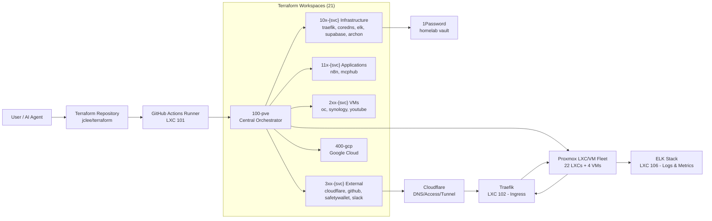

# Terraform Homelab Infrastructure / Terraform Homelab 인프라

[](https://www.terraform.io)
[](LICENSE)
[](.github/workflows)
[](https://scorecard.dev)
[](https://www.proxmox.com/)

> English version follows Korean content / 한국어 다음에 영어 버전이 이어집니다.

Infrastructure-as-code monorepo for `jclee.me`. Provisions a Proxmox LXC/VM fleet, networking, monitoring, and external services via 21 Terraform workspaces with 1Password secret injection and GitHub Actions CI/CD.

`jclee.me`를 위한 Infrastructure-as-Code 모노레포입니다. 21개의 Terraform 워크스페이스를 통해 Proxmox LXC/VM 플릿, 네트워킹, 모니터링 및 외부 서비스를 프로비저닝하며, 1Password 시크릿 주입과 GitHub Actions CI/CD로 운영됩니다.

---

## Table of Contents / 목차

- [Features / 주요 기능](#features--주요-기능)
- [Architecture / 아키텍처](#architecture--아키텍처)
- [Automation Inventory / 자동화 인벤토리](#automation-inventory--자동화-인벤토리)
- [Quick Start / 빠른 시작](#quick-start--빠른-시작)
- [Local Development / 로컬 개발](#local-development--로컬-개발)
- [Commands Reference / 명령어 참조](#commands-reference--명령어-참조)
- [Contribution Guide / 기여 가이드](#contribution-guide--기여-가이드)

---

## Features / 주요 기능

### Infrastructure Provisioning / 인프라 프로비저닝

- **21 Terraform workspaces** across 4 tiers (Tier 0 core, Tier 1 infra, Tier 2 VMs, Tier 3 external/cloud)
- **Proxmox LXC/VM fleet** managed as code (22 LXCs, 4 VMs across `<homelab-host>/24` subnet)
- **Single Source of Truth (SSoT)** in `100-pve/envs/prod/hosts.tf` for all host definitions

### Configuration Management / 구성 관리

- **Template-driven config pipeline**: `hosts.tf` → module rendering → `.tftpl` templates → rendered configs → SSH deploy
- **6 reusable modules** under `modules/proxmox/` and `modules/shared/`
- **1Password integration** for secret management (homelab vault, 12 items, 48 keys)

### Networking & Security / 네트워킹 및 보안

- **Traefik** reverse proxy (LXC 102) with dynamic configuration
- **Cloudflare** DNS, Access policies, and Tunnel management
- **Firewall rules** via Proxmox firewall API
- **Backup jobs** for critical services

### CI/CD Automation / CI/CD 자동화

- **32 GitHub Actions workflows** covering PR lifecycle, security scanning, release management, and downstream health checks
- **Automated dependency management** with Dependabot and semantic PR merging
- **PR review automation** using AI agents (qodo-ai/pr-agent)
- **Auto-healing CI** for self-correcting pipeline failures

---

## Architecture / 아키텍처


```mermaid
flowchart LR
    Agent["User / AI Agent"] --> Repo["Terraform Repository<br>jclee/terraform"]
    Repo --> CI["GitHub Actions Runner<br>LXC 101"]
    
    subgraph Terraform["Terraform Workspaces (21)"]
        direction TB
        TF_100["100-pve<br>Central Orchestrator"]
        TF_10x["10x-{svc} Infrastructure<br>traefik, coredns, elk, supabase, archon"]
        TF_11x["11x-{svc} Applications<br>n8n, mcphub"]
        TF_2xx["2xx-{svc} VMs<br>oc, synology, youtube"]
        TF_3xx["3xx-{svc} External<br>cloudflare, github, safetywallet, slack"]
        TF_400["400-gcp<br>Google Cloud"]
    end
    
    CI --> TF_100
    TF_100 --> TF_10x
    TF_100 --> TF_11x
    TF_100 --> TF_2xx
    TF_100 --> TF_3xx
    TF_100 --> TF_400
    
    TF_100 --> Fleet["Proxmox LXC/VM Fleet<br>22 LXCs + 4 VMs"]
    TF_10x --> OP["1Password<br>homelab vault"]
    TF_3xx --> CF["Cloudflare<br>DNS/Access/Tunnel"]
    
    Fleet --> ELK["ELK Stack<br>LXC 106 - Logs & Metrics"]
    Fleet --> Traefik["Traefik<br>LXC 102 - Ingress"]
    CF --> Traefik
    Traefik --> Fleet
```

### Workspace Tier Structure / 워크스페이스 티어 구조

| Tier | Workspaces | Description | Apply Order |
|------|------------|-------------|-------------|
| 0 (core) | `100-pve` | Central orchestrator — provisions all LXC/VM lifecycle | First |
| 1 (infra) | `102-traefik`, `105-elk`, `108-archon` | Core infrastructure services | Second (parallel) |
| 2 (apps) | `110-n8n`, `112-mcphub`, `200-oc`, `220-youtube` | Application workloads | Third |
| 3 (external) | `300-cloudflare`, `301-github`, `320-slack`, `400-gcp` | External/cloud integrations | Any order |
| Template-only | 10 workspaces | Config templates rendered by `100-pve` | No `.tf` files |

### Config Pipeline / 구성 파이프라인

```
hosts.tf (SSoT) → modules → onepassword_secrets + config_renderer
  → templatefile(.tftpl) → configs/rendered/ → SSH deploy to /opt/{service}/
```

---

## Automation Inventory / 자동화 인벤토리

### GitHub Actions Workflows / GitHub Actions 워크플로우

#### Pull Request Lifecycle / 풀 리퀘스트 라이프사이클

| Workflow File | Purpose |
|---------------|---------|
| `01_branch-to-pr.yml` | Branch creation → PR association |
| `03_pr-checks.yml` | Primary PR validation gate |
| `10_pr-review.yml` | AI-powered PR review (qodo-ai/pr-agent) |
| `13_pr-auto-merge.yml` | Auto-merge on CI green + review approval |
| `15_merged-pr-cleanup.yml` | Post-merge cleanup (branch, label, milestone) |
| `44_reusable-pr-checks.yml` | Reusable PR check logic |

#### Security Scanning / 보안 스캔

| Workflow File | Purpose |
|---------------|---------|
| `05_gitleaks.yml` | Secrets scanning in commits |
| `06_codeql.yml` | CodeQL static analysis |
| `07_dependency-review.yml` | Dependency vulnerability review |
| `08_scorecard.yml` | OpenSSF Scorecard security assessment |
| `45_reusable-gitleaks.yml` | Reusable gitleaks logic |

#### Issue Management / 이슈 관리

| Workflow File | Purpose |
|---------------|---------|
| `18_issue-management.yml` | Issue labeling, project board management |
| `19_issue-backfill.yml` | Backfill issues from PR descriptions |
| `37_ci-failure-issues.yml` | Auto-create issues on CI failures |
| `43_reusable-issue-management.yml` | Reusable issue management logic |

#### Release & Deployment / 릴리스 및 배포

| Workflow File | Purpose |
|---------------|---------|
| `24_release-notes.yml` | Auto-generate release notes |
| `25_release-publish.yml` | Publish releases with artifacts |
| `29_downstream-health-check.yml` | Health check after deployment |

#### Dependency Management / 의존성 관리

| Workflow File | Purpose |
|---------------|---------|
| `09_semantic-pr.yml` | Semantic PR title enforcement |
| `12_dependabot-auto-merge.yml` | Dependabot PR auto-merge |
| `14_bot-auto-fix.yml` | Bot-authored PR auto-approval |

#### Documentation / 문서화

| Workflow File | Purpose |
|---------------|---------|
| `20_readme-gen.yml` | Auto-generate README from repo structure |
| `21_docs-sync.yml` | Sync documentation across branches |
| `42_reusable-docs-sync.yml` | Reusable docs sync logic |

#### Operational / 운영

| Workflow File | Purpose |
|---------------|---------|
| `02_issue-to-branch.yml` | Issue → feature branch automation |
| `04_actionlint.yml` | Workflow file linting |
| `60_ci-auto-heal.yml` | Self-healing CI pipeline |
| `ci.yml` | Main CI pipeline |
| `auto-merge.yml` | Generic auto-merge logic |
| `labeler.yml` | PR label automation |
| `welcome.yml` | New contributor welcome message |

#### Security-Specific / 보안 전용

| Workflow File | Purpose |
|---------------|---------|
| `security/11_pr-review.yml` | Security-focused PR review |

### Terraform Modules / Terraform 모듈

| Module | Path | Purpose |
|--------|------|---------|
| `lxc` | `modules/proxmox/lxc/` | Proxmox LXC container provisioning |
| `vm` | `modules/proxmox/vm/` | Proxmox VM provisioning |
| `lxc-config` | `modules/proxmox/lxc-config/` | LXC configuration rendering |
| `vm-config` | `modules/proxmox/vm-config/` | VM configuration rendering |
| `config-renderer` | `modules/proxmox/config-renderer/` | Shared config template rendering |
| `onepassword-secrets` | `modules/shared/onepassword-secrets/` | 1Password vault integration |

---

## Quick Start / 빠른 시작

### Prerequisites / 사전 요구사항

- Terraform `>= 1.7, < 2.0` (tested with `1.10.5`)
- `make` (for Makefile targets)
- 1Password CLI (`op`) for local secret access
- GitHub CLI (`gh`) for PR/issue interactions

### Clone and Setup / 클론 및 설정

```bash
git clone https://github.com/jclee/terraform.git
cd terraform
```

### Local Terraform Operations / 로컬 Terraform 작업

```bash
# Initialize a workspace
make init SVC=100-pve

# Plan changes
make plan SVC=100-pve

# Note: apply is disabled — use CI/CD
```

### View Available Workspaces / 사용 가능한 워크스페이스 확인

```bash
# List all workspace directories
ls -d [0-9]*/

# Available SVC aliases in Makefile:
# jclee, pve, runner, traefik, elk, supabase, archon, n8n, mcphub,
# oc, synology, youtube, cloudflare, github, safetywallet, slack, gcp
```

---

## Local Development / 로컬 개발

### Environment Setup / 환경 설정

```bash
# Install pre-commit hooks
make pre-commit-install

# Run pre-commit checks
make pre-commit-run

# Run setup targets
make setup
```

### Development Workflow / 개발 워크플로우

1. **Create a branch** from `master`:

   ```bash
   git checkout -b feat/my-new-service
   ```

2. **Add infrastructure** in the appropriate workspace:

   - For new LXC/VM: Edit `100-pve/envs/prod/hosts.tf` (SSoT)
   - For new module: Add to `modules/proxmox/` or `modules/shared/`
   - For external service: Create new `3xx-{svc}/` directory

3. **Run validation**:

   ```bash
   make lint SVC=100-pve
   make validate SVC=100-pve
   make test SVC=100-pve
   ```

4. **Open a PR** — CI automatically runs all checks

### Testing / 테스트

```bash
# Unit tests
make test-unit

# Integration tests
make test-integration

# Workspace tests
make test-workspace SVC=100-pve

# Run all tests
make test
```

---

## Commands Reference / 명령어 참조

### Makefile Targets / Makefile 타겟

| Target | Description |
|--------|-------------|
| `make init SVC=<workspace>` | Initialize Terraform workspace |
| `make plan SVC=<workspace>` | Create Terraform plan |
| `make apply` | **Disabled** — deploy via CI/CD only |
| `make verify SVC=<workspace>` | Verify Terraform state |
| `make lint SVC=<workspace>` | Run Terraform linting |
| `make fmt SVC=<workspace>` | Format Terraform files |
| `make validate SVC=<workspace>` | Validate Terraform configs |
| `make drift-check SVC=<workspace>` | Check for infrastructure drift |
| `make test SVC=<workspace>` | Run all tests |
| `make test-unit` | Run unit tests |
| `make test-integration` | Run integration tests |
| `make test-workspace SVC=<workspace>` | Run workspace-specific tests |
| `make docs` | Generate documentation |
| `make pre-commit-install` | Install pre-commit hooks |
| `make pre-commit-run` | Run pre-commit hooks |
| `make setup` | Run setup tasks |
| `make help` | Show help message |

### Workspace Aliases / 워크스페이스 별칭

The `SVC` variable accepts both full paths and short aliases:

| Alias | Full Path | Description |
|-------|-----------|-------------|
| `pve` | `100-pve` | Central Proxmox orchestrator |
| `elk` | `105-elk/terraform` | ELK Stack |
| `traefik` | `102-traefik/terraform` | Traefik reverse proxy |
| `n8n` | `110-n8n` | n8n workflow automation |
| `mcphub` | `112-mcphub` | MCP Hub |
| `oc` | `200-oc` | OpenCast |
| `youtube` | `220-youtube` | YouTube downloader |
| `cloudflare` | `300-cloudflare` | Cloudflare management |
| `github` | `301-github` | GitHub repo management |
| `gcp` | `400-gcp` | Google Cloud Platform |

---

## Contribution Guide / 기여 가이드

### Getting Started / 시작하기

1. Fork the repository
2. Create a feature branch: `git checkout -b feat/your-feature-name`
3. Make your changes following the [CODE_STYLE.md](CODE_STYLE.md) conventions
4. Add tests if applicable
5. Submit a Pull Request

### Code Standards / 코드 표준

- Follow naming conventions in `CODE_STYLE.md`
- All Terraform code must pass `terraform fmt` and `terraform validate`
- Run `make lint` and `make test` before opening PR
- Commit messages should follow conventional commits

### Adding New Infrastructure / 새 인프라 추가

1. **LXC/VM**: Add entry to `100-pve/envs/prod/hosts.tf` with IP, VMID, role, and ports
2. **New module**: Create in `modules/proxmox/` or `modules/shared/`
3. **External service**: Create `3xx-{svc}/` workspace directory
4. **Update documentation**: Run `make docs` to regenerate docs

### Workflow Development / 워크플로우 개발

- Use `04_actionlint.yml` to validate workflow YAML syntax
- Reusable workflows live in `44_*.yml`, `45_*.yml`, `42_*.yml`, `43_*.yml`
- Security-related workflows are in `security/` directory
- Follow the numeric prefix convention for ordering

### Architecture Decision Records / 아키텍처 결정 기록

- ADR documents are in `docs/adr/`
- Append-only — supersede with new ADR when decisions change
- Runbooks for debugging are in `docs/runbooks/`

---

## Repository Structure / 저장소 구조

```
terraform/
├── 100-pve/                  # Tier 0: Central orchestrator
│   ├── terraform/            # Terraform configuration
│   ├── envs/prod/hosts.tf    # SSoT: all host definitions
│   └── configs/              # Rendered configurations
│       ├── lxc-103-coredns/  # CoreDNS LXC configs
│       └── rendered/         # Auto-rendered templates
├── 10x-{svc}/                # Tier 1: Infrastructure services
├── 11x-{svc}/                # Tier 2: Application workloads
├── 2xx-{svc}/                # Tier 2: VM-based services
├── 3xx-{svc}/                # Tier 3: External integrations
├── 400-gcp/                  # Google Cloud Platform
├── modules/
│   ├── proxmox/              # Proxmox modules (lxc, vm, configs)
│   └── shared/               # Shared modules (onepassword-secrets)
├── .github/workflows/        # 32 GitHub Actions workflows
├── docs/                     # Architecture docs, ADRs, runbooks
├── scripts/                  # Operational scripts
├── Makefile                  # Development commands
├── ARCHITECTURE.md           # Full architecture reference
├── DEPENDENCY_MAP.md         # Module dependency graph
├── CODE_STYLE.md             # Coding conventions
└── AGENTS.md                 # AI agent instructions
```

---

## External References / 외부 참고 자료

- **PR Agent**: [qodo-ai/pr-agent](https://github.com/qodo-ai/pr-agent) — AI PR review
- **Config Proxy API**: [cliproxy.jclee.me](https://cliproxy.jclee.me/v1) — External config API
- **Bot Endpoint**: [bot.jclee.me](https://bot.jclee.me) — Bot service endpoint
- **Proxmox**: [proxmox.com](https://www.proxmox.com/) — Virtualization platform
- **Terraform**: [terraform.io](https://www.terraform.io/) — IaC tool
- **1Password**: [1password.com](https://1password.com/) — Secret management
- **Cloudflare**: [cloudflare.com](https://www.cloudflare.com/) — DNS and security

---

## License / 라이선스

MIT License — see [LICENSE](LICENSE) file for details.
