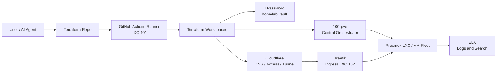
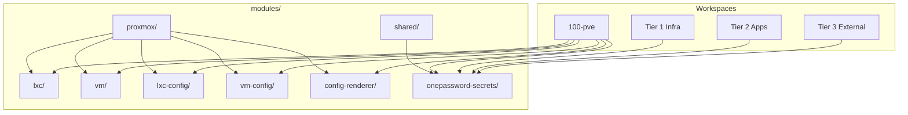

# Terraform Homelab Infrastructure / Terraform Homelab 인프라

[](https://www.terraform.io)
[](LICENSE)
[](.github/workflows)
[](https://scorecard.dev)
[](https://www.proxmox.com/)
[](Makefile)

> English version follows Korean content / 한국어 다음에 영어 버전이 이어집니다.

Infrastructure-as-code monorepo for `jclee.me`. Provisions a Proxmox LXC/VM fleet, networking, monitoring, and external services via 21 Terraform workspaces with 1Password secret injection and GitHub Actions CI/CD.

`jclee.me`를 위한 Infrastructure-as-Code 모노레포입니다. 21개의 Terraform 워크스페이스를 통해 Proxmox LXC/VM 플릿, 네트워킹, 모니터링 및 외부 서비스를 프로비저닝하며, 1Password 시크릿 주입과 GitHub Actions CI/CD로 운영됩니다.

---

## Table of Contents / 목차

- [Features / 주요 기능](#features--주요-기능)
- [Architecture / 아키텍처](#architecture--아키텍처)
- [Automation Inventory / 자동화 인벤토리](#automation-inventory--자동화-인벤토리)
- [Quick Start / 빠른 시작](#quick-start--빠른-시작)
- [Local Development / 로컬 개발](#local-development--로컬-개발)
- [Commands Reference / 명령어 참조](#commands-reference--명령어-참조)
- [Contribution Guide / 기여 가이드](#contribution-guide--기여-가이드)

---

## Features / 주요 기능

### Infrastructure Provisioning / 인프라 프로비저닝

- **21 Terraform workspaces** across 4 tiers (Tier 0 core, Tier 1 infra, Tier 2 VMs, Tier 3 external/cloud)
- **Proxmox LXC/VM fleet** managed as code (22 LXCs, 4 VMs across `<homelab-host>/24` subnet)
- **Single Source of Truth (SSoT)** in `100-pve/envs/prod/hosts.tf` for all host definitions

### Configuration Management / 구성 관리

- **Template-driven rendering** via `modules/proxmox/config-renderer` and `.tftpl` templates
- **Cloud-init** support for LXC and VM provisioning
- **Systemd service unit** file generation for containerized workloads
- **Docker Compose** orchestration templates for application stacks

### Secret Management / 시크릿 관리

- **1Password integration** via `modules/shared/onepassword-secrets`
- **12 secret items** with **48 keys** in the `homelab` vault
- Runtime secret injection through Terraform outputs

### CI/CD Automation / CI/CD 자동화

- **33 GitHub Actions workflows** covering the full development lifecycle
- **Automated PR workflows**: checks, review, merge, cleanup
- **Issue management**: backfill, classification, health checks
- **Release engineering**: versioning, publishing, downstream validation

### Monitoring & Observability / 모니터링 및的可观测性

- **ELK Stack integration** (Elasticsearch, Logstash, Kibana) on `<homelab-elk>`
- **Filebeat** log shipping for all containers
- **Traefik** reverse proxy with automated route management

---

## Architecture / 아키텍처


```mermaid
flowchart LR
    Agent["User / AI Agent"] --> Repo["Terraform Repo"]
    Repo --> CI["GitHub Actions Runner<br/>LXC 101"]
    CI --> TF["Terraform Workspaces"]
    TF --> PVE["100-pve<br/>Central Orchestrator"]
    PVE --> Fleet["Proxmox LXC / VM Fleet"]
    TF --> OP["1Password<br/>homelab vault"]
    TF --> CF["Cloudflare<br/>DNS / Access / Tunnel"]
    Fleet --> ELK["ELK<br/>Logs and Search"]
    CF --> Traefik["Traefik<br/>Ingress LXC 102"]
    Traefik --> Fleet
```

### Workspace Tiers / 워크스페이스 계층

| Tier | Workspaces | Description | Apply Order |
|------|------------|-------------|-------------|
| 0 (core) | `100-pve` | Central orchestrator — provisions all LXC/VM lifecycle | First |
| 1 (infra) | `102-traefik`, `105-elk`, `108-archon`, `107-supabase` | Core infrastructure services | Second (parallel) |
| 2 (apps) | `110-n8n`, `112-mcphub`, `80-jclee`, `101-runner` | Application workloads | Third |
| 3 (external) | `300-cloudflare`, `301-github`, `320-slack`, `310-safetywallet` | External cloud services | Any order |
| 4 (cloud) | `400-gcp` | Google Cloud Platform resources | Any order |

### Module Hierarchy / 모듈 계층


```mermaid
flowchart TD
    subgraph modules["modules/"]
        direction TB
        proxmox["proxmox/"]
        shared["shared/"]
        
        proxmox --> lxc["lxc/"]
        proxmox --> vm["vm/"]
        proxmox --> lxc_config["lxc-config/"]
        proxmox --> vm_config["vm-config/"]
        proxmox --> config_renderer["config-renderer/"]
        shared --> onepassword["onepassword-secrets/"]
    end
    
    subgraph workspaces["Workspaces"]
        100_pve["100-pve"]
        tier1["Tier 1 Infra"]
        tier2["Tier 2 Apps"]
        tier3["Tier 3 External"]
    end
    
    100_pve --> lxc
    100_pve --> vm
    100_pve --> lxc_config
    100_pve --> vm_config
    100_pve --> config_renderer
    100_pve --> onepassword
    tier1 --> onepassword
    tier2 --> onepassword
    tier3 --> onepassword
```

### Config Pipeline / 구성 파이프라인

```
hosts.tf (SSoT)
    │
    ▼
module.hosts
    │
    ├──► onepassword_secrets ──► runtime secrets
    │
    └──► config_renderer ──► templatefile(.tftpl)
                                   │
                                   ▼
                            configs/ (rendered)
                                   │
                                   ▼
                          SSH deploy to /opt/{service}/
```

---

## Automation Inventory / 자동화 인벤토리

### GitHub Actions Workflows / GitHub Actions 워크플로우

Total: **33 workflows** across `.github/workflows/` and `security/` directories.

#### Pull Request Workflows / 풀 리퀘스트 워크플로우

| Workflow File | Purpose |
|---------------|---------|
| `01_branch-to-pr.yml` | Creates PR from feature branch with auto-labeling |
| `03_pr-checks.yml` | Runs Terraform plan, validation, and tests on PRs |
| `04_actionlint.yml` | Lints all workflow files with actionlint |
| `05_gitleaks.yml` | Scans for leaked secrets in code |
| `06_codeql.yml` | GitHub CodeQL security analysis |
| `07_dependency-review.yml` | Reviews dependency changes for vulnerabilities |
| `08_scorecard.yml` | OpenSSF Scorecard security assessment |
| `09_semantic-pr.yml` | Validates conventional commit / semantic PR titles |
| `10_pr-review.yml` | AI-powered PR review via [CLIProxy](https://cliproxy.jclee.me/v1) |
| `13_pr-auto-merge.yml` | Auto-merges PRs meeting criteria |
| `14_bot-auto-fix.yml` | Applies auto-fixes from bot reviews |
| `15_merged-pr-cleanup.yml` | Cleans up branches after merge |
| `security/11_pr-review.yml` | Security-focused PR review |

#### Issue Management Workflows / 이슈 관리 워크플로우

| Workflow File | Purpose |
|---------------|---------|
| `02_issue-to-branch.yml` | Creates branch from issue for development |
| `18_issue-management.yml` | Manages issue lifecycle and labels |
| `19_issue-backfill.yml` | Backfills issue metadata and relationships |
| `37_ci-failure-issues.yml` | Creates issues for CI failures |
| `43_reusable-issue-management.yml` | Reusable issue management logic |
| `91_issue-classification.yml` | Classifies and routes issues |

#### Release & Deployment Workflows /リリース 및 배포 워크플로우

| Workflow File | Purpose |
|---------------|---------|
| `24_release-notes.yml` | Generates release notes from conventional commits |
| `25_release-publish.yml` | Publishes releases with artifact handling |
| `29_downstream-health-check.yml` | Validates downstream services after deployment |

#### Documentation Workflows / 문서화 워크플로우

| Workflow File | Purpose |
|---------------|---------|
| `20_readme-gen.yml` | Regenerates README from templates |
| `21_docs-sync.yml` | Syncs documentation across the repo |
| `42_reusable-docs-sync.yml` | Reusable documentation sync logic |

#### Dependency Management Workflows / 의존성 관리 워크플로우

| Workflow File | Purpose |
|---------------|---------|
| `12_dependabot-auto-merge.yml` | Auto-merges Dependabot PRs |
| `44_reusable-pr-checks.yml` | Reusable PR validation logic |
| `45_reusable-gitleaks.yml` | Reusable secret scanning logic |

#### Operational Workflows / 운영 워크플로우

| Workflow File | Purpose |
|---------------|---------|
| `60_ci-auto-heal.yml` | Auto-heals failing CI pipelines |
| `ci.yml` | Primary CI pipeline |
| `auto-merge.yml` | General auto-merge logic |
| `labeler.yml` | Auto-labels PRs based on paths |
| `welcome.yml` | Welcomes new contributors |

### Terraform Modules / Terraform 모듈

| Module Path | Purpose |
|-------------|---------|
| `modules/proxmox/lxc` | Proxmox LXC container resource |
| `modules/proxmox/vm` | Proxmox VM resource |
| `modules/proxmox/lxc-config` | LXC configuration and cloud-init |
| `modules/proxmox/vm-config` | VM configuration and cloud-init |
| `modules/proxmox/config-renderer` | Template rendering for service configs |
| `modules/shared/onepassword-secrets` | 1Password secret injection |

### Makefile Targets / Makefile 타겟

The `Makefile` provides workspace-abstracted commands for all 21 Terraform workspaces:

```makefile
SVC ?= 100-pve        # Default workspace
# Aliases: jclee, pve, runner, traefik, elk, supabase, archon, n8n, mcphub,
#           oc, synology, youtube, cloudflare, github, safetywallet, slack, gcp
```

---

## Quick Start / 빠른 시작

### Prerequisites / 사전 요구사항

- **Terraform** `>= 1.7, < 2.0` (tested with `1.10.5`)
- **Proxmox VE** `8.3` (for local infrastructure)
- **1Password CLI** (`op`) for secret access
- **Git** for version control

### Clone and Initialize / 클론 및 초기화

```bash
# Clone the repository
git clone https://github.com/jclee/terraform.git
cd terraform

# Initialize the default workspace (100-pve)
make init

# Or initialize a specific workspace
SVC=elk make init
SVC=traefik make init
```

### Plan Changes / 변경 계획

```bash
# Plan default workspace
make plan

# Plan specific workspace
SVC=pve make plan
SVC=cloudflare make plan
```

---

## Local Development / 로컬 개발

### Workspace Aliases / 워크스페이스 별칭

The Makefile supports short aliases for convenience:

| Alias | Workspace | Description |
|-------|-----------|-------------|
| `pve` | `100-pve` | Proxmox central orchestrator |
| `runner` | `101-runner` | GitHub Actions runner |
| `traefik` | `102-traefik/terraform` | Reverse proxy |
| `elk` | `105-elk/terraform` | ELK stack |
| `supabase` | `107-supabase` | Supabase |
| `archon` | `108-archon/terraform` | Archon service |
| `n8n` | `110-n8n` | n8n workflow automation |
| `mcphub` | `112-mcphub` | MCP Hub |
| `oc` | `200-oc` | Owncast |
| `synology` | `215-synology` | Synology NAS |
| `youtube` | `220-youtube` | YouTube backup |
| `cloudflare` | `300-cloudflare` | Cloudflare DNS/Access |
| `github` | `301-github` | GitHub repo management |
| `safetywallet` | `310-safetywallet` | SafetyWallet |
| `slack` | `320-slack` | Slack integration |
| `gcp` | `400-gcp` | Google Cloud Platform |

### Development Workflow / 개발 워크플로우

```bash
# 1. Create a feature branch from an issue
# (Use 02_issue-to-branch.yml workflow or manual)
git checkout -b feature/my-new-service

# 2. Make changes to the appropriate workspace
SVC=pve make plan

# 3. Validate and lint
make lint
make validate

# 4. Run tests
make test        # All tests
make test-unit   # Unit tests only

# 5. Commit using conventional commits
git commit -m "feat(pve): add new LXC for service"

# 6. Push and create PR
# (Handled by 01_branch-to-pr.yml workflow)
```

### Running Tests / 테스트 실행

```bash
# Run all tests
make test

# Run unit tests
make test-unit

# Run integration tests
make test-integration

# Run tests for specific workspace
SVC=pve make test

# Run workspace-specific tests
make test-workspace
```

---

## Commands Reference / 명령어 참조

### Terraform Commands / Terraform 명령어

| Command | Description |
|---------|-------------|
| `make init` | Initialize Terraform provider and backend |
| `make plan` | Create execution plan |
| `make apply` | Apply changes (disabled — use CI/CD) |
| `make verify` | Verify configuration |
| `make validate` | Validate HCL syntax |
| `make fmt` | Format Terraform files |
| `make drift-check` | Detect infrastructure drift |
| `make backup` | Backup state before changes |

### Testing Commands / 테스트 명령어

| Command | Description |
|---------|-------------|
| `make test` | Run all tests |
| `make test-unit` | Run unit tests only |
| `make test-integration` | Run integration tests |
| `make test-workspace` | Run workspace-specific tests |

### Quality Assurance / 품질 관리

| Command | Description |
|---------|-------------|
| `make lint` | Run all linters (Terraform, Go, etc.) |
| `make lint-go` | Lint Go code |
| `make docs` | Generate documentation |

### Pre-commit / Pre-commit

```bash
# Install pre-commit hooks
make pre-commit-install

# Run pre-commit hooks manually
make pre-commit-run
```

### Environment Variables / 환경 변수

| Variable | Default | Description |
|----------|---------|-------------|
| `SVC` | `100-pve` | Target workspace (path or alias) |
| `TF_DIR` | Derived from `SVC` | Resolved Terraform directory |

---

## Contribution Guide / 기여 가이드

### Branch Strategy / 브랜치 전략

- `master` — production-ready state, protected
- `feature/*` — feature branches from issues
- `bugfix/*` — bug fix branches from issues
- `docs/*` — documentation-only branches

### Commit Convention / 커밋 규칙

This project follows **Conventional Commits**:

```
<type>(<scope>): <subject>

Types: feat, fix, docs, style, refactor, test, chore, ci, ops
Scope: workspace or module name (e.g., pve, elk, traefik)
```

Examples:

```bash
git commit -m "feat(pve): add new LXC for coredns"
git commit -m "fix(elk): update logstash pipeline"
git commit -m "docs(readme): update architecture diagram"
git commit -m "ci(github): add new repository"
```

### Pull Request Process / 풀 리퀘스트 프로세스

1. **Create PR** from `feature/*` branch (automated via `01_branch-to-pr.yml`)
2. **Automated checks** run via `03_pr-checks.yml`:
   - Terraform plan
   - Validation
   - Unit tests
   - Integration tests
3. **AI Review** performed via [CLIProxy](https://cliproxy.jclee.me/v1) (`10_pr-review.yml`)
4. **Security scan** via `05_gitleaks.yml` and `06_codeql.yml`
5. **Auto-merge** if all checks pass (`13_pr-auto-merge.yml`)
6. **Cleanup** after merge (`15_merged-pr-cleanup.yml`)

### Adding a New Workspace / 새 워크스페이스 추가

1. Create directory with numeric prefix (e.g., `115-newapp/`)
2. Add `main.tf`, `variables.tf`, `outputs.tf`
3. Register alias in `Makefile` `ALIAS_*` map if needed
4. Add to appropriate tier in documentation
5. Create initial PR with workflow triggers

### Adding a New LXC/VM / 새 LXC/VM 추가

1. Edit `100-pve/locals.tf` for sizing definitions
2. Edit `100-pve/envs/prod/hosts.tf` for host entry (SSoT)
3. Create service config templates if needed
4. Run `SVC=pve make plan` to validate

### Adding Secrets / 시크릿 추가

1. Add secret to 1Password `homelab` vault
2. Update `modules/shared/onepassword-secrets/main.tf`
3. Reference via `module.onepassword_secrets.secrets["key"]`

### Module Development / 모듈 개발

1. Develop in `modules/proxmox/` or `modules/shared/`
2. Add tests in `*_test.tftest.hcl`
3. Update module documentation
4. Version and release

---

## Repository Structure / 저장소 구조

```
terraform/
├── .github/
│   ├── workflows/              # 33 GitHub Actions workflows
│   └── security/               # Security-specific workflows
├── modules/
│   ├── proxmox/                # Proxmox resource modules
│   │   ├── lxc/                # LXC container module
│   │   ├── vm/                 # VM module
│   │   ├── lxc-config/         # LXC configuration module
│   │   ├── vm-config/          # VM configuration module
│   │   └── config-renderer/     # Template rendering module
│   └── shared/                 # Shared modules
│       └── onepassword-secrets/ # 1Password integration
├── 100-pve/                     # Tier 0: Central orchestrator
├── 10x-{svc}/                   # Tier 1: Infrastructure services
├── 11x-{svc}/                   # Tier 1: Application services
├── 2xx-{svc}/                   # Tier 2: VM-based workloads
├── 3xx-{svc}/                   # Tier 3: External services
├── 400-gcp/                     # Tier 4: GCP resources
├── docs/                        # Architecture docs and runbooks
├── tests/                       # Terraform test suites
├── AGENTS.md                    # AI agent knowledge base
├── ARCHITECTURE.md              # Full architecture reference
├── CODE_STYLE.md                # Coding conventions
├── DEPENDENCY_MAP.md            # Module dependency graph
├── CONTRIBUTING.md              # Contribution guidelines
├── Makefile                     # Workspace-abstracted commands
└── README.md                    # This file
```

---

## External Integrations / 외부 통합

| Service | Integration | Documentation |
|---------|-------------|---------------|
| [CLIProxy](https://cliproxy.jclee.me/v1) | AI PR Review | `10_pr-review.yml` |
| [1Password](https://1password.com) | Secret Management | `modules/shared/onepassword-secrets/` |
| [Cloudflare](https://cloudflare.com) | DNS / Access / Tunnel | `300-cloudflare/` |
| [GitHub](https://github.com) | Repo Management | `301-github/` |
| [OpenSSF Scorecard](https://scorecard.dev) | Security Assessment | `08_scorecard.yml` |
| [HashiCorp Terraform](https://terraform.io) | IaC | All workspaces |

---

## License / 라이선스

This project is licensed under the MIT License. See [LICENSE](LICENSE) for details.

MIT 라이선스 하에 배포됩니다. 자세한 내용은 [LICENSE](LICENSE) 파일을 참조하세요.

---

## Badges Reference / 배지 참조

| Badge | Source |
|-------|--------|
| Terraform | `https://img.shields.io/badge/Terraform-1.10.5-7B42BC?logo=terraform` |
| GitHub Actions | `https://img.shields.io/badge/GitHub_Actions-33%20workflows-2088FF?logo=github-actions` |
| Scorecard | `https://img.shields.io/endpoint?url=https://api.scorecard.dev/projects/github.com/jclee/terraform/badge` |
| Proxmox VE | `https://img.shields.io/badge/Proxmox-VE_8.3-E57000?logo=proxmox` |
