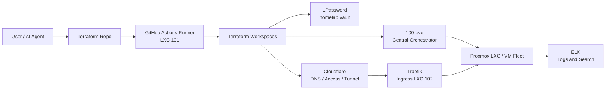

# Terraform Homelab Infrastructure / Terraform Homelab 인프라

[](https://www.terraform.io)
[](LICENSE)
[](.github/workflows)
[](https://scorecard.dev)
[](https://www.proxmox.com/)
[](Makefile)

> English version follows Korean content / 한국어 다음에 영어 버전이 이어집니다.

---

## Overview / 개요

Infrastructure-as-code monorepo for `jclee.me`. Provisions a Proxmox LXC/VM fleet, networking, monitoring, and external services via **21 Terraform workspaces** with 1Password secret injection and GitHub Actions CI/CD.

`jclee.me`를 위한 Infrastructure-as-Code 모노레포입니다. 21개의 Terraform 워크스페이스를 통해 Proxmox LXC/VM 플릿, 네트워킹, 모니터링 및 외부 서비스를 프로비저닝하며, 1Password 시크릿 주입과 GitHub Actions CI/CD로 운영됩니다.

---

## Features / 주요 기능

### Infrastructure Provisioning / 인프라 프로비저닝

- **21 Terraform workspaces** across 4 tiers (Tier 0 core, Tier 1 infra, Tier 2 VMs, Tier 3 external/cloud)
- **Proxmox LXC/VM fleet** managed as code (22 LXCs, 4 VMs across `<homelab-host>/24` subnet)
- **Single Source of Truth (SSoT)** in `100-pve/envs/prod/hosts.tf` for all host definitions

### Configuration Management / 구성 관리

- **Template-driven rendering** via `modules/proxmox/config-renderer/` — config files are NEVER hand-edited
- **Terraform modules** for reusable LXC (`modules/proxmox/lxc`), VM (`modules/proxmox/vm`), and config templates
- **Cloud-init** support for both LXC and VM provisioning

### Secret Management / 시크릿 관리

- **1Password integration** via `modules/shared/onepassword-secrets/` — 12 vault items, 48 keys
- **Zero hardcoded secrets** — all secrets injected at apply time from 1Password
- **Environment-specific overrides** via `build.env`

### CI/CD Automation / CI/CD 자동화

- **33 GitHub Actions workflows** covering PR checks, issue management, releases, and auto-healing
- **Automated dependency management** (Dependabot + custom auto-merge)
- **Reusable workflow templates** for DRY pipeline configuration

---

## Architecture / 아키텍처


```mermaid
flowchart LR
    User["User / AI Agent"]
    Repo["Terraform Repo"]
    CI["GitHub Actions Runner<br/>LXC 101"]
    TF["Terraform Workspaces"]
    PVE["100-pve<br/>Central Orchestrator"]
    Fleet["Proxmox LXC / VM Fleet"]
    OP["1Password<br/>homelab vault"]
    CF["Cloudflare<br/>DNS / Access / Tunnel"]
    ELK["ELK<br/>Logs and Search"]
    Traefik["Traefik<br/>Ingress LXC 102"]

    User --> Repo
    Repo --> CI
    CI --> TF
    TF --> PVE
    PVE --> Fleet
    TF --> OP
    TF --> CF
    Fleet --> ELK
    CF --> Traefik
    Traefik --> Fleet
```

### Workspace Tiers / 워크스페이스 계층

| Tier | Workspaces | Description |
|------|------------|-------------|
| 0 (core) | `100-pve` | Central orchestrator — provisions all LXC/VM lifecycle |
| 1 (infra) | `102-traefik`, `105-elk`, `108-archon` | Infrastructure services — consume `remote_state` from 100-pve |
| 2 (apps) | `110-n8n`, `112-mcphub`, `200-oc`, `220-youtube` | VM-based applications |
| 3 (external) | `300-cloudflare`, `301-github`, `320-slack`, `400-gcp` | External cloud services — no Proxmox dependency |

---

## Repository Structure / 저장소 구조

```text
/
├── AGENTS.md                    # AI agent knowledge base
├── ARCHITECTURE.md              # Full architecture reference
├── CODE_STYLE.md                # Naming, file org, variable conventions
├── CONTRIBUTING.md              # Contribution guidelines
├── DEPENDENCY_MAP.md            # Module dependency graph
├── LICENSE                      # MIT License
├── Makefile                     # Workspace management CLI
├── OWNERS                       # CODEOWNERS reference
├── OWNERS_ALIASES               # Team aliases
├── README.md                    # This file
├── build.env                    # Environment build config
│
├── .github/
│   └── workflows/               # 33 GitHub Actions workflows
│       ├── 01_branch-to-pr.yml
│       ├── 02_issue-to-branch.yml
│       ├── 03_pr-checks.yml
│       ├── 04_actionlint.yml
│       ├── 05_gitleaks.yml
│       ├── 06_codeql.yml
│       ├── 07_dependency-review.yml
│       ├── 08_scorecard.yml
│       ├── 09_semantic-pr.yml
│       ├── 10_pr-review.yml
│       ├── 11_pr-review.yml           # security/ directory
│       ├── 12_dependabot-auto-merge.yml
│       ├── 13_pr-auto-merge.yml
│       ├── 14_bot-auto-fix.yml
│       ├── 15_merged-pr-cleanup.yml
│       ├── 18_issue-management.yml
│       ├── 19_issue-backfill.yml
│       ├── 20_readme-gen.yml
│       ├── 21_docs-sync.yml
│       ├── 24_release-notes.yml
│       ├── 25_release-publish.yml
│       ├── 29_downstream-health-check.yml
│       ├── 37_ci-failure-issues.yml
│       ├── 42_reusable-docs-sync.yml
│       ├── 43_reusable-issue-management.yml
│       ├── 44_reusable-pr-checks.yml
│       ├── 45_reusable-gitleaks.yml
│       ├── 60_ci-auto-heal.yml
│       ├── 91_issue-classification.yml
│       ├── auto-merge.yml
│       ├── ci.yml
│       ├── labeler.yml
│       └── welcome.yml
│
├── modules/
│   ├── AGENTS.md
│   ├── proxmox/
│   │   ├── AGENTS.md
│   │   ├── vm/                  # VM module
│   │   ├── lxc/                 # LXC module
│   │   ├── vm-config/           # VM config templates
│   │   ├── lxc-config/          # LXC config templates
│   │   └── config-renderer/      # Central config renderer
│   └── shared/
│       ├── AGENTS.md
│       └── onepassword-secrets/  # 1Password integration
│
├── 100-pve/                     # Tier 0: Central orchestrator
│   ├── terraform/
│   │   ├── main.tf
│   │   ├── locals.tf
│   │   ├── variables.tf
│   │   ├── outputs.tf
│   │   ├── data.tf
│   │   ├── checks.tf
│   │   ├── backup_jobs.tf
│   │   ├── firewall.tf
│   │   ├── lxc_configs.tf
│   │   ├── secrets.tf
│   │   ├── storage.tf
│   │   ├── vm_configs.tf
│   │   ├── versions.tf
│   │   └── configs/              # Rendered outputs (NEVER hand-edit)
│   └── AGENTS.md
│
├── 102-traefik/terraform/
├── 105-elk/terraform/
├── 108-archon/terraform/
├── 110-n8n/
├── 112-mcphub/
├── 200-oc/
├── 215-synology/
├── 220-youtube/
├── 300-cloudflare/
├── 301-github/
├── 310-safetywallet/
├── 320-slack/
└── 400-gcp/
```

---

## Automation Inventory / 자동화 인벤토리

### GitHub Actions Workflows / GitHub Actions 워크플로우

#### Pull Request Workflows / 풀 리퀘스트 워크플로우

| Workflow File | Purpose |
|---------------|---------|
| `03_pr-checks.yml` | Core PR validation: terraform fmt, validate, plan |
| `04_actionlint.yml` | GitHub Actions YAML syntax validation |
| `05_gitleaks.yml` | Secret scanning via gitleaks |
| `06_codeql.yml` | CodeQL static analysis |
| `07_dependency-review.yml` | Dependency vulnerability review |
| `08_scorecard.yml` | OpenSSF Scorecard security assessment |
| `09_semantic-pr.yml` | Semantic PR title validation |
| `10_pr-review.yml` | AI-powered PR review via pr-agent |
| `11_pr-review.yml` | Security-focused PR review |
| `44_reusable-pr-checks.yml` | Reusable PR check workflow |
| `45_reusable-gitleaks.yml` | Reusable secret scan workflow |

#### Auto-Merge Workflows / 자동 병합 워크플로우

| Workflow File | Purpose |
|---------------|---------|
| `12_dependabot-auto-merge.yml` | Auto-merge Dependabot PRs |
| `13_pr-auto-merge.yml` | Auto-merge passing PRs after review |
| `auto-merge.yml` | Generic auto-merge handler |

#### Issue Management Workflows / 이슈 관리 워크플로우

| Workflow File | Purpose |
|---------------|---------|
| `02_issue-to-branch.yml` | Create branch from issue |
| `18_issue-management.yml` | Issue lifecycle management |
| `19_issue-backfill.yml` | Backfill issue metadata |
| `37_ci-failure-issues.yml` | Auto-create issues from CI failures |
| `43_reusable-issue-management.yml` | Reusable issue management |
| `91_issue-classification.yml` | Auto-classify issues |

#### Documentation Workflows / 문서화 워크플로우

| Workflow File | Purpose |
|---------------|---------|
| `20_readme-gen.yml` | Auto-generate README from templates |
| `21_docs-sync.yml` | Sync documentation across repos |
| `42_reusable-docs-sync.yml` | Reusable docs sync workflow |

#### Release Workflows / 릴리스 워크플로우

| Workflow File | Purpose |
|---------------|---------|
| `24_release-notes.yml` | Generate release notes |
| `25_release-publish.yml` | Publish releases |

#### Repository Maintenance / 저장소 유지보수

| Workflow File | Purpose |
|---------------|---------|
| `01_branch-to-pr.yml` | Bridge branch to PR |
| `14_bot-auto-fix.yml` | Bot-triggered auto-fixes |
| `15_merged-pr-cleanup.yml` | Cleanup after PR merge |
| `60_ci-auto-heal.yml` | Auto-heal failing CI |
| `ci.yml` | Main CI pipeline |
| `labeler.yml` | Auto-label PRs/Issues |
| `welcome.yml` | Welcome new contributors |
| `29_downstream-health-check.yml` | Monitor downstream services |

### No Go Automation Tools / Go 자동화 도구 없음

This repository does not include any Go-based automation tools. All operational scripts are written in shell or use Terraform built-ins.

---

## Quick Start / 빠른 시작

### Prerequisites / 사전 요구사항

- Terraform `>= 1.7, < 2.0` (1.10.5 recommended)
- GitHub CLI (`gh`)
- 1Password CLI (`op`) for local secret access
- Make

### Clone and Setup /克隆 및 설정

```bash
git clone https://github.com/jclee940/terraform-homelab.git
cd terraform-homelab
make setup
```

### Workspace Management / 워크스페이스 관리

```bash
# List all workspaces
make help

# Initialize a workspace (default: 100-pve)
make init SVC=100-pve

# Plan changes for a workspace
make plan SVC=100-pve

# Use workspace aliases
make plan SVC=pve          # → 100-pve
make plan SVC=elk          # → 105-elk/terraform
make plan SVC=traefik      # → 102-traefik/terraform
make plan SVC=n8n          # → 110-n8n
make plan SVC=cloudflare   # → 300-cloudflare
```

### Workspace Aliases / 워크스페이스 별칭

| Alias | Workspace Path |
|-------|---------------|
| `jclee` | `80-jclee` |
| `pve` | `100-pve` |
| `runner` | `101-runner` |
| `traefik` | `102-traefik/terraform` |
| `elk` | `105-elk/terraform` |
| `supabase` | `107-supabase` |
| `archon` | `108-archon/terraform` |
| `n8n` | `110-n8n` |
| `mcphub` | `112-mcphub` |
| `oc` | `200-oc` |
| `synology` | `215-synology` |
| `youtube` | `220-youtube` |
| `cloudflare` | `300-cloudflare` |
| `github` | `301-github` |
| `safetywallet` | `310-safetywallet` |
| `slack` | `320-slack` |
| `gcp` | `400-gcp` |

---

## Commands Reference / 명령어 참조

```makefile
# Terraform operations
make init                  # Initialize workspace (SVC=100-pve)
make plan                  # Create Terraform plan
make apply                 # DISABLED — use CI/CD
make validate              # Validate Terraform configuration
make fmt                   # Format Terraform files
make drift-check          # Detect configuration drift

# Testing
make test                  # Run all tests
make test-unit            # Run unit tests
make test-integration      # Run integration tests
make test-workspace       # Test specific workspace

# Documentation
make docs                  # Generate documentation

# Pre-commit
make pre-commit-install    # Install pre-commit hooks
make pre-commit-run        # Run pre-commit hooks

# Setup
make setup                # Initial setup (SVC-aware)
make help                 # Show all available commands
```

---

## Local Development / 로컬 개발

### Environment Variables / 환경 변수

Copy `build.env.example` to `build.env` and configure:

```bash
OP_SERVICE_ACCOUNT_TOKEN=<1password-service-account-token>
TF_VAR_proxmox_api_token=<proxmox-api-token>
```

### Adding a New LXC or VM / 새 LXC 또는 VM 추가

1. **Update SSoT** — Add host entry in `100-pve/envs/prod/hosts.tf`

2. **Configure sizing** — Add to `100-pve/locals.tf`

3. **Create service config** (if needed) — Add template in `{workspace}/templates/`

4. **Render configs** — CI renders via `modules/proxmox/config-renderer/`

5. **Apply via CI/CD** — Push to trigger workflow

### Module Development / 모듈 개발

```bash
# Test LXC module
cd modules/proxmox/lxc
terraform init
terraform validate

# Test VM module
cd modules/proxmox/vm
terraform init
terraform validate

# Test 1Password integration
cd modules/shared/onepassword-secrets
terraform init
terraform validate
```

### Config Pipeline / 구성 파이프라인

```
hosts.tf (SSoT) → module.hosts → onepassword_secrets + config_renderer
  → templatefile(.tftpl) → configs/ → SSH deploy to /opt/{service}/
```

**Important:** Config files in `configs/` directories are rendered output — **NEVER hand-edit**. All modifications must go through the template pipeline.

---

## Contribution Guide / 기여 가이드

### Branch Strategy / 브랜치 전략

1. **Create branch from issue** — Use `02_issue-to-branch.yml` workflow or手动
2. **Make changes** — Follow `CODE_STYLE.md` conventions
3. **Submit PR** — Ensure all checks pass
4. **Code review** — AI review via `10_pr-review.yml`
5. **Merge** — Auto-merge after approval

### Naming Conventions / 명명 규칙

- **Workspaces**: `NNN-{service}` (e.g., `100-pve`, `105-elk`)
- **LXCs**: `lxc-NNN-{service}` (e.g., `lxc-102-traefik`)
- **VMs**: `vm-NNN-{service}` (e.g., `vm-200-oc`)
- **Files**: `kebab-case` (e.g., `backup-jobs.tf`, `lxc-configs.tf`)

### Config Rules / 구성 규칙

1. **Never hardcode secrets** — Use 1Password via `modules/shared/onepassword-secrets/`
2. **Never hand-edit rendered configs** — Modify templates only
3. **Always use SSoT** — Single Source of Truth in `100-pve/envs/prod/hosts.tf`
4. **Follow workspace tiers** — Apply order matters

### Commit Messages / 커밋 메시지

Follow [Conventional Commits](https://www.conventionalcommits.org/):

```
feat(lxc): add coredns instance
fix(vm): correct disk size for youtube
docs(readme): update workspace list
chore(deps): bump terraform version
```

### PR Title Convention / PR 제목 규칙

Use semantic titles validated by `09_semantic-pr.yml`:

- `feat:`, `fix:`, `docs:`, `style:`, `refactor:`, `chore:`, `test:`

---

## Architecture Reference / 아키텍처 참고 자료

| Document | Description |
|----------|-------------|
| `ARCHITECTURE.md` | Full architecture reference |
| `DEPENDENCY_MAP.md` | Module dependency graph |
| `CODE_STYLE.md` | Coding conventions |
| `AGENTS.md` | AI agent knowledge base |
| `docs/adr/` | Architecture Decision Records |
| `docs/runbooks/` | Operational runbooks |

---

## Security / 보안

### Secret Management / 시크릿 관리

- All secrets stored in 1Password `homelab` vault (12 items, 48 keys)
- Access via `modules/shared/onepassword-secrets/` module
- Secret scanning enforced via `05_gitleaks.yml` and `45_reusable-gitleaks.yml`

### Security Scanning / 보안 스캐닝

| Workflow | Tool |
|----------|------|
| `05_gitleaks.yml` | gitleaks |
| `06_codeql.yml` | GitHub CodeQL |
| `07_dependency-review.yml` | Dependency Review Action |
| `08_scorecard.yml` | OpenSSF Scorecard |

### Hardcoded Secret Prevention / 하드코딩된 시크릿 방지

- `05_gitleaks.yml` blocks commits containing secrets
- `.gitattributes` ensures `.tfstate` files are not committed (handled via `100-pve` terraform state)
- All secrets use 1Password reference pattern: `op://homelab/...`

---

## External Integrations / 외부 통합

### 1Password

- **Vault**: `homelab`
- **Module**: `modules/shared/onepassword-secrets/`
- **Access Pattern**: `module.onepassword_secrets.secrets["key"]`

### Cloudflare

- **Service**: `300-cloudflare/`
- **Scope**: DNS, Access, Tunnel management

### GitHub

- **Service**: `301-github/`
- **Scope**: Repository management

### External Monitoring

- **Endpoint**: `https://cliproxy.jclee.me/v1`
- **AI Review**: [qodo-ai/pr-agent](https://github.com/qodo-ai/pr-agent) via `10_pr-review.yml`

---

## License / 라이선스

MIT License — see [LICENSE](LICENSE) for details.

---

## Support / 지원

- **Docs**: See `docs/runbooks/` for operational guidance
- **Issues**: Open an issue for bugs or feature requests
- **ADRs**: Architecture decisions documented in `docs/adr/`
