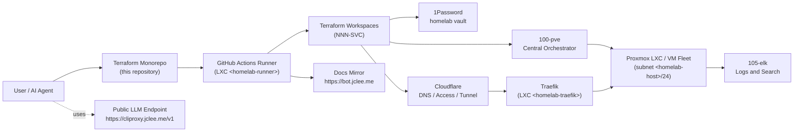

# Terraform Homelab Infrastructure / Terraform Homelab 인프라

> **Bilingual README** — 한국어 본문이 영어보다 먼저 옵니다. (Korean precedes English.)
>
> README auto-sync target: <https://bot.jclee.me>
> Public LLM endpoint: <https://cliproxy.jclee.me/v1>
> Generated by `gpt-5.5` (fallback: `minimax-m3` via CLIProxyAPI)

## Badges / 배지

| Category             | Detail                                                                                 |
| -------------------- | -------------------------------------------------------------------------------------- |
| IaC                  | Terraform `1.10.5` (`>= 1.7, < 2.0`)                                                   |
| Workspace Convention | Flat `NNN-SVC` (e.g. `100-pve`, `105-elk`, `300-cloudflare`)                           |
| CI/CD                | 14 GitHub Actions workflows under `.github/workflows/` — mutating flows owned by **jclee-bot** |
| Secret Backend       | 1Password `homelab` vault (12 items, 48 keys)                                          |
| Review Automation    | [qodo-ai/pr-agent](https://github.com/qodo-ai/pr-agent) + Dependabot auto-merge        |
| Security             | CodeQL · Gitleaks · Dependency Review · OpenSSF Scorecard                              |
| Internal Subnet      | `<homelab-host>/24` (RFC1918 — never published)                                        |
| Public Endpoint      | <https://cliproxy.jclee.me/v1>                                                         |
| Docs Mirror          | <https://bot.jclee.me>                                                                 |
| License              | MIT                                                                                    |

---

# 한국어

## 1. 개요

이 저장소는 `jclee.me` 호멜랩과 관련 외부 서비스를 코드로 관리하기 위한 **Infrastructure-as-Code 모노레포**입니다. Proxmox LXC/VM 플릿, 네트워크, 모니터링 스택, 그리고 Cloudflare · GitHub · Slack 같은 외부 서비스를 **Terraform 워크스페이스** 단위로 프로비저닝하며, 1Password 시크릿 주입과 GitHub Actions 기반 CI/CD로 완전 자동화되어 있습니다.

- **도메인**: `jclee.me`
- **내부 서브넷**: `<homelab-host>/24` (RFC1918 — 공개 저장소에 절대 게시하지 않음)
- **Terraform**: `1.10.5` (`>= 1.7, < 2.0`)
- **워크스페이스 컨벤션**: `NNN-SVC` 평면 구조 (예: `100-pve`, `105-elk`, `300-cloudflare`)
- **상태 백엔드**: 로컬 백엔드, `.tfstate`를 git에 커밋, CI 동시성 그룹이 apply 직렬화

> **보안 경고**: RFC1918 사설 IP 대역과 LXC 컨테이너 번호는 공개 저장소에 커밋하지 마세요. 모든 예시에서 `<homelab-host>`, `<homelab-elk>`, `<homelab-runner>` 같은 플레이스홀더를 사용합니다.

## 2. 주요 기능 (Features)

- **평면 NNN-SVC 워크스페이스 컨벤션**: 1–255는 내부 인프라, 300+는 외부 서비스. 디렉터리명만 보고도 티어와 의존 관계가 명확합니다.
- **Tier 0 오케스트레이터 (`100-pve`)**: 모든 LXC/VM 라이프사이클을 단일 진실 공급원(SSOT)인 `envs/prod/hosts.tf`에서 관리합니다.
- **템플릿 기반 구성 렌더링**: `*.tftpl` 파일은 `config-renderer` 모듈이 렌더링하여 SSH로 `/opt/{service}/`에 배포합니다.
- **1Password 시크릿 주입**: `modules/shared/onepassword-secrets` 모듈이 `homelab` 볼트에서 12개 아이템 · 48개 키를 안전하게 주입합니다.
- **로컬 상태 + Git 커밋**: `.tfstate`는 git에 커밋되며, CI 동시성 그룹이 apply를 직렬화합니다.
- **qodo-ai/pr-agent 리뷰 자동화**: PR마다 자동 리뷰가 실행되며, Dependabot PR은 자동 머지됩니다.
- **완전 자동화 배포**: `master` 브랜치에 push하면 PR을 거쳐 안전하게 apply됩니다 (수동 `terraform apply`는 차단됨).
- **ADR / 런북 / 의존성 맵**: 모든 결정과 운영 지식은 `docs/adr/`, `docs/runbooks/`, `DEPENDENCY_MAP.md`에 기록됩니다.

## 3. 아키텍처 (Architecture)

다음 다이어그램은 사용자 트리거부터 실제 Proxmox 플릿까지의 전체 흐름을 보여줍니다. 노드 라벨 안의 각괄호(`<...>`)는 플레이스홀더이며 실제 사설 IP/LXC 번호를 노출하지 않습니다. Mermaid 렌더링 호환을 위해 모든 각괄호는 HTML 엔티티(`&lt;`, `&gt;`)로 이스케이프했습니다.


```mermaid
flowchart LR
  Agent["User / AI Agent"] --> Repo["Terraform Monorepo<br/>(this repository)"]
  Repo --> CI["GitHub Actions Runner<br/>(LXC &lt;homelab-runner&gt;)"]
  CI --> TF["Terraform Workspaces<br/>(NNN-SVC)"]
  TF --> PVE["100-pve<br/>Central Orchestrator"]
  PVE --> Fleet["Proxmox LXC / VM Fleet<br/>(subnet &lt;homelab-host&gt;/24)"]
  TF --> OP["1Password<br/>homelab vault"]
  TF --> CF["Cloudflare<br/>DNS / Access / Tunnel"]
  Fleet --> ELK["105-elk<br/>Logs and Search"]
  CF --> Traefik["Traefik<br/>(LXC &lt;homelab-traefik&gt;)"]
  Traefik --> Fleet
  CI --> DocMirror["Docs Mirror<br/>https://bot.jclee.me"]
  Agent -.uses.-> Public["Public LLM Endpoint<br/>https://cliproxy.jclee.me/v1"]
```

핵심 흐름 요약:

1. **사용자 / AI 에이전트**가 `master` 브랜치에 push 하거나 PR을 엽니다.
2. **GitHub Actions Runner (`<homelab-runner>`)**가 워크플로를 실행합니다.
3. **Terraform 워크스페이스**가 티어 순서대로 plan/apply 됩니다 (Tier 0 → Tier 1 → 외부).
4. **`100-pve`** 오케스트레이터가 Proxmox 플릿 전체의 라이프사이클을 관리합니다.
5. **1Password `homelab` 볼트**에서 시크릿이 주입되고, **Cloudflare**가 DNS / Access / Tunnel을 갱신합니다.
6. **Traefik (`<homelab-traefik>`)**이 인그레스를 처리하고, **ELK (`105-elk`)**가 로그를 수집·검색합니다.
7. 결과는 <https://bot.jclee.me> 문서 미러로 자동 동기화됩니다.

## 4. 저장소 구조 (Repository Structure)

```text
/
├── AGENTS.md                 # AI 에이전트 / 자동화 지식 베이스
├── ARCHITECTURE.md           # 전체 아키텍처 레퍼런스
├── CODE_STYLE.md             # 명명, 파일 구조, 변수, 템플릿 규약
├── CONTRIBUTING.md           # 기여 가이드
├── DEPENDENCY_MAP.md         # 모듈 의존 그래프 + 템플릿 인벤토리
├── LICENSE                   # MIT
├── Makefile                  # 통합 작업 진입점 (plan/apply/lint/...)
├── OWNERS                    # GitHub 코드 오너십
├── OWNERS_ALIASES            # 오너 별칭
├── README.md                 # 이 문서
├── build.env                 # 빌드 환경 변수
├── 103-coredns/              # CoreDNS 워크스페이스 (templates/)
├── 105-elk/                  # ELK 스택 워크스페이스 (scripts/, config/, templates/, terraform/)
├── 112-mcphub/               # MCP Hub 워크스페이스 (config/, templates/, op-mcp-server/, patches/)
└── 300-cloudflare/           # Cloudflare 외부 워크스페이스 (*.tf)
```

> 위 트리는 저장소 최상위 레이아웃의 **실제 모습**입니다. 표시되지 않은 디렉터리(예: `_bot-scripts/`)는 실제 존재하지 않으며, 절대 생성하지 마세요. (해당 이름은 일시적인 CI 체크아웃 경로로만 사용됩니다.) `Makefile`의 `ALIAS_*` 매크로는 더 많은 워크스페이스 단축명을 노출하지만, 위 트리는 이 스냅샷에 실제로 존재하는 항목만 보여줍니다.

## 5. jclee-bot 자동화 영역 (jclee-bot Automation Surfaces)

저장소 내 **상태를 변경하는 모든 자동화(mutation automation)**는 `jclee-bot` GitHub App이 소유합니다. PR 리뷰 봇이나 알림 봇과 달리, `jclee-bot`은 **Terraform 워크플로를 트리거**하고 **실제 인프라에 변경을 가하는 유일한 신뢰된 실행자**입니다.

### 5.1 jclee-bot이 소유하는 변경 자동화 (App-owned)

| 영역 | 설명 |
| ---- | ---- |
| Terraform plan/apply 트리거 | PR / `master` push에 반응해 `.github/workflows/` 의 plan·apply 워크플로 실행 |
| 브랜치 → PR 자동화 | 새 브랜치를 감지해 PR을 자동 생성 |
| 이슈 → 브랜치 자동화 | `jclee-bot에의해자동화됨` 라벨이 붙은 이슈에서 작업 브랜치를 자동 생성 |
| PR 자동 머지 | 조건(라벨/체크 통과) 충족 시 PR을 자동 머지 |
| Dependabot PR 자동 머지 | 의존성 업데이트 PR 머지 |
| 머지된 PR 정리 | 머지 후 임시 브랜치 / 리소스 정리 |
| 릴리스 노트 / 게시 | 변경 사항을 릴리스 노트로 변환하고 게시 |
| 다운스트림 헬스 체크 | 적용 후 외부 서비스(Cloudflare, GitHub 등) 헬스 체크 |
| CI 실패 이슈 자동 생성 | CI 실패를 자동으로 이슈로 등록 |
| bot-auto-fix | 자동 수정 패치 PR 생성 |

> **이슈 라벨 규약**: `jclee-bot에의해자동화됨` 라벨이 붙은 이슈만 `jclee-bot`이 자동으로 작업 브랜치를 생성합니다. 그 외 이슈는 사람이 직접 브랜치를 만들어야 합니다.

### 5.2 사람의 결정이 필요한 영역 (Human-owned)

- 새 워크스페이스 / 모듈 추가
- 새 티어 도입 (예: 5xx 추가)
- 보안 정책 / 1Password 볼트 구조 변경
- 워크플로 권한 / `jclee-bot` 권한 재설정
- 시크릿 회전 / 볼트 마이그레이션

### 5.3 외부 봇 (서드파티)

- **qodo-ai/pr-agent**: PR 코드리뷰 자동화 (권한: 읽기/코멘트, **변경 없음**)
- **Dependabot**: 의존성 업데이트 PR 자동 생성 (`jclee-bot`이 머지를 소유)

> **권한 분리 원칙**: `jclee-bot`은 mutation 전용, `qodo-ai/pr-agent`은 리뷰 전용입니다. 두 권한을 단일 App에 합치지 마세요.

## 6. Go 도구 (Go Tools)

현재 이 저장소에는 **저장소 차원의 Go 자동화 도구가 0개** 등록되어 있습니다. `105-elk/scripts/*.go` 같은 파일은 **ELK 워크스페이스 내부 운영 스크립트**이며 저장소 전체의 Go 도구 인벤토리에는 포함되지 않습니다. 향후 저장소 차원의 Go 도구(예: 마이그레이션 도구, 상태 검사기, 시크릿 회전 도우미 등)가 추가될 경우 본 섹션을 갱신해 주세요.

## 7. 빠른 시작 (Quick Start)

### 7.1 사전 요구사항 (Prerequisites)

- Terraform `1.10.5` (`>= 1.7, < 2.0`)
- `make`
- `git`
- 1Password CLI (`op`) — 시크릿 주입용
- Proxmox API 토큰 (1Password `homelab` 볼트에 보관)

### 7.2 저장소 클론 (Clone)

```bash
git clone <this-repo-url>
cd <repo-dir>
```

### 7.3 워크스페이스 선택

`Makefile`의 단축 별칭을 사용하면 빠르게 워크스페이스를 전환할 수 있습니다.

```bash
# 단축 별칭 사용
make SVC=elk plan          # → 105-elk/terraform
make SVC=cloudflare plan   # → 300-cloudflare

# 또는 전체 경로 사용
make SVC=100-pve plan
```

### 7.4 첫 plan 실행

```bash
make SVC=elk init
make SVC=elk plan
```

> **주의**: 수동 `make apply`는 **차단**되어 있습니다. 모든 적용은 `jclee-bot`이 트리거하는 GitHub Actions를 통해서만 수행됩니다.

## 8. 로컬 개발 (Local Development)

### 8.1 작업 흐름 (Workflow)

1. 브랜치 생성: `git checkout -b feat/<topic>`
2. 코드 수정 (워크스페이스 디렉터리 또는 모듈)
3. 로컬에서 `make SVC=<svc> plan` 으로 검증
4. `pre-commit` 훅 설치: `make pre-commit-install`
5. `git commit` 후 PR 오픈
6. `qodo-ai/pr-agent` 리뷰 확인
7. CI 통과 + 승인 후 머지 → `jclee-bot`이 자동 apply

### 8.2 코드 스타일 (Code Style)

- 명명 규칙, 변수 구조, 템플릿 컨벤션은 `CODE_STYLE.md` 참조
- Terraform은 `terraform fmt` + `terraform validate` 통과 필수
- 모든 시크릿은 1Password `homelab` 볼트 경유 (평문 커밋 금지)
- 모듈 간 의존 관계 변경 시 `DEPENDENCY_MAP.md` 갱신

### 8.3 디버깅 / 트러블슈팅

- **CI 실패**: `37_ci-failure-issues.yml` 워크플로가 자동 이슈를 생성합니다.
- **Apply 실패**: `.github/workflows/` 의 failure 로그와 `docs/runbooks/` 참조
- **모듈 의존성**: `DEPENDENCY_MAP.md` 에서 모듈 간 의존 관계 확인
- **상태 드리프트**: `make SVC=<svc> drift-check` 로 진단

## 9. 명령어 레퍼런스 (Commands Reference)

`Makefile` 은 통합 진입점입니다. 모든 타겟은 `SVC=<workspace>` 를 받아 해당 워크스페이스 디렉터리로 위임합니다.

| 명령 | 설명 |
| ---- | ---- |
| `make help` | 사용 가능한 모든 타겟과 설명 출력 |
| `make init SVC=<svc>` | Terraform 초기화 |
| `make plan SVC=<svc>` | Terraform plan 생성 (`-out=tfplan`) |
| `make apply SVC=<svc>` | **차단됨** — CI/CD를 통해서만 apply 가능 |
| `make verify SVC=<svc>` | `terraform verify` |
| `make lint SVC=<svc>` | `tflint` 등 정적 분석 |
| `make fmt SVC=<svc>` | `terraform fmt -recursive` |
| `make validate SVC=<svc>` | `terraform validate` |
| `make drift-check SVC=<svc>` | 상태 드리프트 검사 |
| `make test` | 전체 테스트 (`test-unit` + `test-integration` + `test-workspace`) |
| `make test-unit` | 단위 테스트 |
| `make test-integration` | 통합 테스트 |
| `make test-workspace` | 워크스페이스 테스트 |
| `make backup` | 상태 백업 |
| `make docs` | 문서 빌드 / 동기화 |
| `make pre-commit-install` | pre-commit 훅 설치 |
| `make pre-commit-run` | pre-commit 훅 수동 실행 |

사용 가능한 단축 별칭: `jclee pve runner traefik elk supabase archon n8n mcphub oc synology youtube cloudflare github safetywallet slack gcp`

## 10. 기여 가이드 (Contribution Guide)

1. 이슈 생성 → 작업 명세 합의 (복잡한 변경의 경우)
2. `feat/<topic>` 또는 `fix/<topic>` 브랜치 생성
3. 로컬에서 `make SVC=<svc> plan` 통과 확인
4. `pre-commit` 훅 통과 확인
5. PR 오픈 → `qodo-ai/pr-agent` 리뷰 확인
6. 승인 + CI 통과 후 머지
7. `jclee-bot`이 자동으로 apply

자세한 규칙은 `CONTRIBUTING.md`, `CODE_STYLE.md`, `ARCHITECTURE.md` 를 참조하세요. ADR(아키텍처 결정 기록)은 `docs/adr/` 에 append-only 로 작성하며, 기존 결정을 폐기할 경우 새 ADR로 supersede 합니다.

## 11. 라이선스 (License)

이 프로젝트는 MIT 라이선스 하에 배포됩니다. 자세한 내용은 `LICENSE` 파일을 참조하세요.

---

# English

## 1. Overview

This repository is an **Infrastructure-as-Code monorepo** for managing the `jclee.me` homelab and related external services. It provisions the Proxmox LXC/VM fleet, networking, monitoring stack, and external services (Cloudflare, GitHub, Slack, etc.) through **Terraform workspaces**, with 1Password secret injection and a fully automated GitHub Actions CI/CD pipeline.

- **Domain**: `jclee.me`
- **Internal Subnet**: `<homelab-host>/24` (RFC1918 — never published)
- **Terraform**: `1.10.5` (`>= 1.7, < 2.0`)
- **Workspace Convention**: flat `NNN-SVC` (e.g. `100-pve`, `105-elk`, `300-cloudflare`)
- **State Backend**: local backend, `.tfstate` committed to git, CI concurrency groups serialize applies

> **Security Warning**: Never commit RFC1918 private IP ranges or LXC container numbers. Use placeholders like `<homelab-host>`, `<homelab-elk>`, `<homelab-runner>` in all examples.

## 2. Features

- **Flat NNN-SVC workspace convention**: 1–255 = internal infra, 300+ = external services. Tiers and dependencies are obvious from the directory name.
- **Tier 0 orchestrator (`100-pve`)**: Manages the entire LXC/VM lifecycle from a single source of truth — `envs/prod/hosts.tf`.
- **Template-based config rendering**: `*.tftpl` files are rendered by the `config-renderer` module and SSH-deployed to `/opt/{service}/`.
- **1Password secret injection**: `modules/shared/onepassword-secrets` safely injects 12 items · 48 keys from the `homelab` vault.
- **Local state + Git commit**: `.tfstate` is committed to git; CI concurrency groups serialize applies.
- **qodo-ai/pr-agent review automation**: Every PR gets an automated review; Dependabot PRs are auto-merged.
- **Fully automated deployment**: Pushing to `master` triggers a safe apply through a PR (manual `terraform apply` is blocked).
- **ADRs / runbooks / dependency map**: All decisions and operational knowledge are captured in `docs/adr/`, `docs/runbooks/`, and `DEPENDENCY_MAP.md`.

## 3. Architecture

The following diagram shows the full flow from user trigger to the actual Proxmox fleet. All angle-bracket placeholders (`<...>`) in node labels are redacted; no real private IPs or LXC numbers are exposed. For Mermaid rendering compatibility, all angle brackets are escaped as HTML entities (`&lt;`, `&gt;`).


```mermaid
flowchart LR
  Agent["User / AI Agent"] --> Repo["Terraform Monorepo<br/>(this repository)"]
  Repo --> CI["GitHub Actions Runner<br/>(LXC &lt;homelab-runner&gt;)"]
  CI --> TF["Terraform Workspaces<br/>(NNN-SVC)"]
  TF --> PVE["100-pve<br/>Central Orchestrator"]
  PVE --> Fleet["Proxmox LXC / VM Fleet<br/>(subnet &lt;homelab-host&gt;/24)"]
  TF --> OP["1Password<br/>homelab vault"]
  TF --> CF["Cloudflare<br/>DNS / Access / Tunnel"]
  Fleet --> ELK["105-elk<br/>Logs and Search"]
  CF --> Traefik["Traefik<br/>(LXC &lt;homelab-traefik&gt;)"]
  Traefik --> Fleet
  CI --> DocMirror["Docs Mirror<br/>https://bot.jclee.me"]
  Agent -.uses.-> Public["Public LLM Endpoint<br/>https://cliproxy.jclee.me/v1"]
```

Flow summary:

1. **User / AI Agent** pushes to `master` or opens a PR.
2. **GitHub Actions Runner (`<homelab-runner>`)** executes workflows.
3. **Terraform Workspaces** plan/apply in tier order (Tier 0 → Tier 1 → external).
4. **`100-pve`** orchestrator manages the entire Proxmox fleet lifecycle.