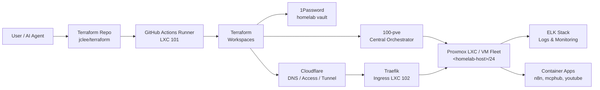

# Terraform Homelab Infrastructure / Terraform Homelab 인프라

[](https://www.terraform.io)
[](LICENSE)
[](.github/workflows)
[](https://scorecard.dev)
[](https://www.proxmox.com/)
[](Makefile)

> English version follows Korean content / 한국어 다음에 영어 버전이 이어집니다.

Infrastructure-as-code monorepo for `jclee.me`. Provisions a Proxmox LXC/VM fleet, networking, monitoring, and external services via 21 Terraform workspaces with 1Password secret injection and GitHub Actions CI/CD.

`jclee.me`를 위한 Infrastructure-as-Code 모노레포입니다. 21개의 Terraform 워크스페이스를 통해 Proxmox LXC/VM 플릿, 네트워킹, 모니터링 및 외부 서비스를 프로비저닝하며, 1Password 시크릿 주입과 GitHub Actions CI/CD로 운영됩니다.

---

## Table of Contents / 목차

- [Features / 주요 기능](#features--주요-기능)
- [Architecture / 아키텍처](#architecture--아키텍처)
- [Automation Inventory / 자동화 인벤토리](#automation-inventory--자동화-인벤토리)
- [Quick Start / 빠른 시작](#quick-start--빠른-시작)
- [Local Development / 로컬 개발](#local-development--로컬-개발)
- [Commands Reference / 명령어 참조](#commands-reference--명령어-참조)
- [Contribution Guide / 기여 가이드](#contribution-guide--기여-가이드)

---

## Features / 주요 기능

### Infrastructure Provisioning / 인프라 프로비저닝

- **21 Terraform workspaces** across 4 tiers (Tier 0 core, Tier 1 infra, Tier 2 VMs, Tier 3 external/cloud)
- **Proxmox LXC/VM fleet** managed as code (22 LXCs, 4 VMs across `<homelab-host>/24` subnet)
- **Single Source of Truth (SSoT)** in `100-pve/envs/prod/hosts.tf` for all host definitions

### Configuration Management / 구성 관리

- **Template-driven config pipeline**: `hosts.tf` → module rendering → `.tftpl` templates → rendered configs → SSH deploy
- **6 reusable modules**: `proxmox/lxc`, `proxmox/vm`, `proxmox/lxc-config`, `proxmox/vm-config`, `proxmox/config-renderer`, `shared/onepassword-secrets`

### Secret Management / 시크릿 관리

- **1Password integration** via `onepassword-secrets` module (12 items, 48+ keys)
- **Zero hardcoded secrets** in Terraform state or git

### CI/CD Automation / CI/CD 자동화

- **33 GitHub Actions workflows** covering PR lifecycle, issue management, releases, and security scanning
- **Automated PR workflows**: branch creation, review assignment, checks, merge, cleanup
- **Health monitoring**: downstream services, CI failure tracking, auto-heal

---

## Architecture / 아키텍처


```mermaid
flowchart LR
    Agent["User / AI Agent"] --> Repo["Terraform Repo<br/>jclee/terraform"]
    Repo --> CI["GitHub Actions Runner<br/>LXC 101"]
    CI --> TF["Terraform<br/>Workspaces"]
    TF --> PVE["100-pve<br/>Central Orchestrator"]
    PVE --> Fleet["Proxmox LXC / VM Fleet<br/>&lt;homelab-host&gt;/24"]
    TF --> OP["1Password<br/>homelab vault"]
    TF --> CF["Cloudflare<br/>DNS / Access / Tunnel"]
    Fleet --> ELK["ELK Stack<br/>Logs & Monitoring"]
    CF --> Traefik["Traefik<br/>Ingress LXC 102"]
    Traefik --> Fleet
    Fleet --> Apps["Container Apps<br/>n8n, mcphub, youtube"]
```

### Workspace Tiers / 워크스페이스 티어

| Tier | Workspaces | Description |
| ---- | ---------- | ----------- |
| 0 (core) | `100-pve` | Central orchestrator — provisions all LXC/VM lifecycle |
| 1 (infra) | `102-traefik`, `105-elk`, `108-archon`, `110-n8n`, `112-mcphub` | Infrastructure services — consume `remote_state` from 100-pve |
| 2 (apps) | `200-oc`, `215-synology`, `220-youtube` | VM-based applications |
| 3 (external) | `300-cloudflare`, `301-github`, `310-safetywallet`, `320-slack` | External cloud services |
| 4 (cloud) | `400-gcp` | Google Cloud Platform |

### Module Architecture / 모듈 아키텍처

```
modules/
├── proxmox/
│   ├── lxc/              # LXC container resource
│   ├── vm/               # VM resource
│   ├── lxc-config/       # LXC cloud-init + systemd templates
│   ├── vm-config/        # VM cloud-init + systemd templates
│   └── config-renderer/  # Generic config file renderer
└── shared/
    └── onepassword-secrets/  # 1Password vault access
```

---

## Automation Inventory / 자동화 인벤토리

### GitHub Actions Workflows / GitHub Actions 워크플로우

**33 workflow files** organized by function:

#### PR Lifecycle / PR 라이프사이클

| Workflow File | Description |
| ------------- | ----------- |
| `01_branch-to-pr.yml` | Create PR from branch with auto-labeling |
| `02_issue-to-branch.yml` | Create branch from issue |
| `03_pr-checks.yml` | PR validation checks (terraform fmt, validate, plan) |
| `04_actionlint.yml` | Workflow syntax validation |
| `05_gitleaks.yml` | Secret scanning |
| `06_codeql.yml` | Code quality analysis |
| `07_dependency-review.yml` | Dependency vulnerability review |
| `08_scorecard.yml` | Security scorecard |
| `09_semantic-pr.yml` | Semantic PR title validation |
| `10_pr-review.yml` | AI-powered PR review (pr-agent) |
| `11_pr-review.yml` (security/) | Security-specific PR review |
| `13_pr-auto-merge.yml` | Auto-merge on approve |
| `14_bot-auto-fix.yml` | Auto-fix for bot-detected issues |
| `15_merged-pr-cleanup.yml` | Post-merge cleanup (branch delete, label sync) |

#### Issue Management / 이슈 관리

| Workflow File | Description |
| ------------- | ----------- |
| `18_issue-management.yml` | Issue lifecycle automation |
| `19_issue-backfill.yml` | Backfill issue metadata |
| `37_ci-failure-issues.yml` | Create issue on CI failure |
| `91_issue-classification.yml` | Classify and route issues |

#### Release Management / 릴리스 관리

| Workflow File | Description |
| ------------- | ----------- |
| `24_release-notes.yml` | Generate release notes |
| `25_release-publish.yml` | Publish release |

#### Documentation / 문서

| Workflow File | Description |
| ------------- | ----------- |
| `20_readme-gen.yml` | Auto-generate README |
| `21_docs-sync.yml` | Sync documentation |
| `42_reusable-docs-sync.yml` | Reusable docs sync workflow |

#### Dependency Management / 의존성 관리

| Workflow File | Description |
| ------------- | ----------- |
| `12_dependabot-auto-merge.yml` | Auto-merge Dependabot PRs |

#### Health & Monitoring / 상태 모니터링

| Workflow File | Description |
| ------------- | ----------- |
| `29_downstream-health-check.yml` | Check downstream services |
| `60_ci-auto-heal.yml` | Auto-heal CI failures |

#### Reusable Workflows / 재사용 가능한 워크플로우

| Workflow File | Description |
| ------------- | ----------- |
| `44_reusable-pr-checks.yml` | Reusable PR checks |
| `45_reusable-gitleaks.yml` | Reusable gitleaks scan |
| `43_reusable-issue-management.yml` | Reusable issue management |

#### Utility / 유틸리티

| Workflow File | Description |
| ------------- | ----------- |
| `auto-merge.yml` | Generic auto-merge |
| `ci.yml` | Main CI workflow |
| `labeler.yml` | PR label management |
| `welcome.yml` | Welcome message for contributors |

### Makefile Targets / Makefile 타겟

```makefile
# Terraform operations
make init              # Initialize Terraform workspace
make plan              # Create Terraform plan
make apply             # Apply Terraform plan (disabled - use CI/CD)
make verify           # Verify configuration
make validate          # Validate Terraform files

# Code quality
make lint              # Run all linters
make lint-go           # Lint Go code (if any)
make fmt               # Format code

# Testing
make test              # Run all tests
make test-unit         # Run unit tests
make test-integration  # Run integration tests
make test-workspace    # Run workspace tests

# Documentation
make docs              # Generate documentation

# Pre-commit
make pre-commit-install   # Install pre-commit hooks
make pre-commit-run       # Run pre-commit hooks

# Setup
make setup             # Initial setup
make drift-check       # Check for state drift

# Service workspace (SVC=100-pve default)
make backup            # Backup state
```

**Workspace alias support:**

| Alias | Workspace | Description |
| ----- | --------- | ----------- |
| `jclee` | `80-jclee` | Personal workspace |
| `pve` | `100-pve` | Proxmox core |
| `runner` | `101-runner` | GitHub Actions runner |
| `traefik` | `102-traefik/terraform` | Reverse proxy |
| `elk` | `105-elk/terraform` | ELK stack |
| `supabase` | `107-supabase` | Supabase |
| `archon` | `108-archon/terraform` | Archon |
| `n8n` | `110-n8n` | n8n workflow |
| `mcphub` | `112-mcphub` | MCP Hub |
| `oc` | `200-oc` | Owncast |
| `synology` | `215-synology` | Synology |
| `youtube` | `220-youtube` | YouTube services |
| `cloudflare` | `300-cloudflare` | Cloudflare |
| `github` | `301-github` | GitHub management |
| `safetywallet` | `310-safetywallet` | Safety wallet |
| `slack` | `320-slack` | Slack integration |
| `gcp` | `400-gcp` | Google Cloud |

**Usage example:**

```bash
# Target default workspace (100-pve)
make plan

# Target specific workspace
SVC=105-elk make plan
SVC=traefik make init
```

---

## Quick Start / 빠른 시작

### Prerequisites / 사전 조건

- Terraform `>= 1.7, < 2.0`
- GitHub CLI (`gh`)
- 1Password CLI (`op`) — for local secret access
- SSH access to `<homelab-host>`

### Clone and Setup / 클론 및 설정

```bash
git clone https://github.com/jclee/terraform.git
cd terraform
make setup
```

### Initialize Workspace / 워크스페이스 초기화

```bash
# Default (100-pve)
make init

# Specific workspace
SVC=105-elk make init
```

### Plan Changes / 변경 사항 계획

```bash
make plan
```

---

## Local Development / 로컬 개발

### Environment Setup / 환경 설정

```bash
# Install pre-commit hooks
make pre-commit-install

# Run pre-commit checks
make pre-commit-run

# Format code
make fmt

# Lint
make lint
```

### Testing / 테스트

```bash
# Unit tests
make test-unit

# Integration tests
make test-integration

# Workspace tests
make test-workspace

# All tests
make test
```

### Config Pipeline / 구성 파이프라인

1. Edit `100-pve/envs/prod/hosts.tf` (SSoT)
2. Module renders templates via `config-renderer`
3. Outputs to `100-pve/configs/rendered/`
4. CI deploys via SSH to `/opt/{service}/`

**Never hand-edit rendered configs** — they are regenerated on every apply.

---

## Commands Reference / 명령어 참조

### Terraform Commands / Terraform 명령어

| Command | Description |
| ------- | ----------- |
| `make init` | Initialize Terraform provider and modules |
| `make plan` | Generate execution plan |
| `make apply` | Apply changes (disabled locally) |
| `make verify` | Verify configuration consistency |
| `make validate` | Validate Terraform syntax |
| `make drift-check` | Compare state with actual infrastructure |

### Code Quality / 코드 품질

| Command | Description |
| ------- | ----------- |
| `make fmt` | Format HCL and Go files |
| `make lint` | Run all linters |
| `make lint-go` | Lint Go code |

### Service-Specific / 서비스별

```bash
# Backup
make backup

# Specific workspace
SVC=300-cloudflare make init
SVC=301-github make plan
```

### CI/CD Workflows / CI/CD 워크플로우

**PR Creation:**

1. Push branch → `01_branch-to-pr.yml` creates PR
2. PR opened → `03_pr-checks.yml` runs validation
3. Review requested → `10_pr-review.yml` AI review

**PR Merge:**

1. Approved + passing → `13_pr-auto-merge.yml` merges
2. Merged → `15_merged-pr-cleanup.yml` cleanup

**Issue Management:**

1. Issue created → `18_issue-management.yml` triages
2. CI failure → `37_ci-failure-issues.yml` creates issue
3. Release → `24_release-notes.yml` + `25_release-publish.yml`

---

## Contribution Guide / 기여 가이드

### Workflow / 작업 흐름

1. **Fork and branch**: Create feature branch from `master`
2. **Commit**: Follow [CODE_STYLE.md](CODE_STYLE.md) conventions
3. **Push**: Open PR via `01_branch-to-pr.yml` or manually
4. **Review**: AI review via `10_pr-review.yml`, human review required
5. **Merge**: Auto-merge on approval, or manual
6. **Cleanup**: `15_merged-pr-cleanup.yml` handles branch deletion

### Naming Conventions / 명명 규칙

- **Workspaces**: `NNN-{service}` (e.g., `100-pve`, `105-elk`)
- **Modules**: `modules/{provider}/{resource}` (e.g., `modules/proxmox/lxc`)
- **Templates**: `*.tftpl` extension
- **Workflows**: `NN_{description}.yml` prefix for ordering

### Adding New Infrastructure / 새 인프라 추가

1. Add host entry to `100-pve/envs/prod/hosts.tf`
2. Define sizing in `100-pve/locals.tf`
3. Create/update `.tftpl` templates in service workspace
4. PR triggers `03_pr-checks.yml` validation
5. Merge applies changes via CI

### Secret Management / 시크릿 관리

1. Add secret to 1Password `homelab` vault
2. Reference via `module.onepassword_secrets.secrets["key"]`
3. Never commit raw secrets or `.tfstate` with secrets

### Documentation / 문서

- Update `ARCHITECTURE.md` for architecture changes
- Update `DEPENDENCY_MAP.md` for module changes
- Update `AGENTS.md` for agent knowledge
- Run `make docs` to regenerate docs

### Security / 보안

- Run `make lint` before commit
- Scan secrets with `05_gitleaks.yml`
- Review dependencies via `07_dependency-review.yml`
- Check scorecard via `08_scorecard.yml`

---

## License / 라이선스

MIT License. See [LICENSE](LICENSE) for details.

---

## Support / 지원

- **Issues**: Use GitHub Issues for bugs and feature requests
- **Documentation**: See [ARCHITECTURE.md](ARCHITECTURE.md) and [docs/](docs/)
- **Discussion**: GitHub Discussions for questions

---

*This README is auto-generated. Last update: 2026-03-24*
