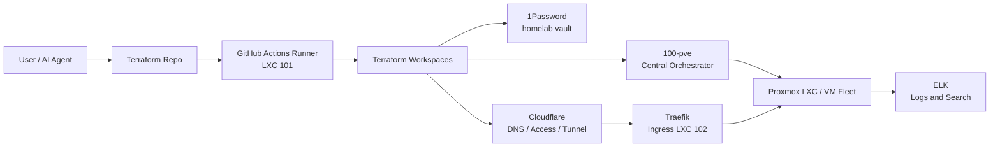

<think>
The user wants me to generate a comprehensive README.md for a Terraform homelab infrastructure repository. Let me analyze the provided information:

1. **Project Structure**: A monorepo with Terraform workspaces, modules, and GitHub Actions workflows
2. **Workflow Files**: 32 total workflow files
3. **Makefile**: With various targets for terraform operations
4. **Current README.md**: Already has good content about the project
5. **AGENTS.md**: Contains project knowledge base and structure

Key details:
- Domain: jclee.me
- Subnet: 192.168.50.0/24
- Terraform: 1.10.5
- 21 workspaces across 4 tiers
- 6 modules
- 32 GitHub Actions workflows
- Proxmox infrastructure (LXC/VM fleet)

The user wants:
- Bilingual (Korean and English)
- Professional technical documentation
- Markdown format
- Sections: title, badges, overview, features, architecture, automation inventory (workflows + tools), quick start, local development, commands reference, contribution guide
- Be specific about automation - list workflow names and tool names

Let me create a comprehensive README that covers all these requirements.
</think>

```markdown
# Terraform Homelab Infrastructure / Terraform Homelab 인프라

[](https://www.terraform.io)
[](LICENSE)
[](https://github.com/jclee/terraform/actions)
[](https://scorecard.dev)

---

## Overview / 개요

Infrastructure-as-code monorepo for `jclee.me`. Provisions a Proxmox LXC/VM fleet, networking, monitoring, and external services via Terraform workspaces with 1Password secret injection and GitHub Actions CI/CD.

`jclee.me`를 위한 Infrastructure-as-Code 모노레포입니다. Terraform 워크스페이스를 통해 Proxmox LXC/VM 플릿, 네트워킹, 모니터링 및 외부 서비스를 프로비저닝하며, 1Password 시크릿 주입과 GitHub Actions CI/CD를 활용합니다.

| Property | Value |
|----------|-------|
| **Domain** | `jclee.me` |
| **Subnet** | `192.168.50.0/24` |
| **Terraform** | `1.10.5` (`>= 1.7, < 2.0`) |
| **Workspaces** | 21 workspaces across 4 tiers |
| **Modules** | 6 reusable modules |
| **Workflows** | 32 GitHub Actions workflows |
| **CI Runner** | LXC 101 (GitHub Actions self-hosted) |

---

## Features / 주요 기능

- **Proxmox Fleet Management** — Full LXC and VM lifecycle management via `100-pve` workspace
- **Multi-Tier Architecture** — 4-tier workspace organization (Core → Infra → VM Apps → External/Cloud)
- **1Password Integration** — Secrets managed via `modules/shared/onepassword-secrets`
- **Template-Driven Configs** — Cloud-init and systemd service templates rendered at apply time
- **GitHub Actions CI/CD** — 32 workflows covering PR checks, merges, releases, and security
- **Drift Detection** — Continuous health monitoring with auto-healing capabilities
- **ELK Stack Integration** — Centralized logging with Filebeat collectors per service
- **Traefik Reverse Proxy** — Automatic route registration via template rendering
- **Cloudflare DNS/Access/Tunnel** — External DNS and access policies as code

---

## Architecture / 아키텍처

### Workspace Tiers / 워크스페이스 계층

| Tier | Workspaces | Description |
|------|-----------|-------------|
| **Tier 0: Core** | `100-pve` | Central orchestrator. Provisions all LXC/VM lifecycle. Must apply first. |
| **Tier 1: Infra** | `102-traefik`, `105-elk`, `108-archon` | Infrastructure services consuming `remote_state` from `100-pve` |
| **Tier 2: Apps** | `110-n8n`, `112-mcphub`, `220-youtube` | Application workspaces |
| **Tier 3: External** | `300-cloudflare`, `301-github`, `320-slack`, `400-gcp` | External services, no Proxmox dependency |
| **Template-Only** | 10+ workspaces | Templates rendered by `100-pve`, no standalone `.tf` files |

### Module Inventory / 모듈 인벤토리

| Module | Path | Purpose |
|--------|------|---------|
| `proxmox/lxc` | `modules/proxmox/lxc/` | LXC container provisioning |
| `proxmox/vm` | `modules/proxmox/vm/` | Virtual machine provisioning |
| `proxmox/lxc-config` | `modules/proxmox/lxc-config/` | LXC cloud-init and config rendering |
| `proxmox/vm-config` | `modules/proxmox/vm-config/` | VM cloud-init and config rendering |
| `proxmox/config-renderer` | `modules/proxmox/config-renderer/` | Shared template rendering logic |
| `shared/onepassword-secrets` | `modules/shared/onepassword-secrets/` | 1Password vault integration |

### Config Pipeline / 설정 파이프라인

```
hosts.tf (SSoT) → module.hosts → onepassword_secrets + config_renderer
  → templatefile(.tftpl) → configs/ → SSH deploy to /opt/{service}/
```

### System Topology / 시스템 토폴로지


```mermaid
flowchart LR
  Agent["User / AI Agent"] --> Repo["Terraform Repo"]
  Repo --> CI["GitHub Actions Runner\nLXC 101"]
  CI --> TF["Terraform Workspaces"]
  TF --> PVE["100-pve\nCentral Orchestrator"]
  PVE --> Fleet["Proxmox LXC / VM Fleet"]
  TF --> OP["1Password\nhomelab vault"]
  TF --> CF["Cloudflare\nDNS / Access / Tunnel"]
  Fleet --> ELK["ELK\nLogs and Search"]
  CF --> Traefik["Traefik\nIngress LXC 102"]
  Traefik --> Fleet
```

---

## Automation Inventory / 자동화 인벤토리

### GitHub Actions Workflows / GitHub Actions 워크플로우

Total: **32 workflows** in `.github/workflows/`

#### Pull Request Workflows / PR 워크플로우

| File | Purpose |
|------|---------|
| `01_branch-to-pr.yml` | Convert feature branch to pull request |
| `02_issue-to-branch.yml` | Create branch from issue |
| `03_pr-checks.yml` | Master workflow orchestrating all PR checks |
| `04_actionlint.yml` | Lint GitHub Actions workflow files |
| `05_gitleaks.yml` | Scan for secrets/credentials in code |
| `06_codeql.yml` | CodeQL static analysis |
| `07_dependency-review.yml` | Review dependency changes for vulnerabilities |
| `08_scorecard.yml` | OpenSSF Scorecard security assessment |
| `09_semantic-pr.yml` | Enforce semantic PR title format |
| `10_pr-review.yml` | Request review from CODEOWNERS |
| `13_pr-auto-merge.yml` | Auto-merge approved PRs |
| `14_bot-auto-fix.yml` | Auto-fix linting/formatting issues |
| `44_reusable-pr-checks.yml` | Reusable workflow for PR checks |
| `45_reusable-gitleaks.yml` | Reusable workflow for gitleaks scan |
| `security/11_pr-review.yml` | Security-focused PR review |

#### Merge & Cleanup Workflows / 병합 및 정리 워크플로우

| File | Purpose |
|------|---------|
| `12_dependabot-auto-merge.yml` | Auto-merge Dependabot PRs |
| `15_merged-pr-cleanup.yml` | Cleanup after PR merge |
| `auto-merge.yml` | Generic auto-merge handler |

#### Release Workflows / 릴리스 워크플로우

| File | Purpose |
|------|---------|
| `24_release-notes.yml` | Generate release notes |
| `25_release-publish.yml` | Publish release artifacts |

#### Issue Management / 이슈 관리 워크플로우

| File | Purpose |
|------|---------|
| `18_issue-management.yml` | Issue lifecycle management |
| `19_issue-backfill.yml` | Backfill issue metadata |
| `37_ci-failure-issues.yml` | Create issues from CI failures |
| `43_reusable-issue-management.yml` | Reusable issue management workflow |

#### Documentation Workflows / 문서화 워크플로우

| File | Purpose |
|------|---------|
| `20_readme-gen.yml` | Auto-regenerate module READMEs |
| `21_docs-sync.yml` | Sync documentation across repos |
| `42_reusable-docs-sync.yml` | Reusable documentation sync |

#### Health & Monitoring / 상태 모니터링 워크플로우

| File | Purpose |
|------|---------|
| `29_downstream-health-check.yml` | Check downstream service health |
| `60_ci-auto-heal.yml` | Auto-heal CI failures |

#### CI Workflows / CI 워크플로우

| File | Purpose |
|------|---------|
| `ci.yml` | Primary CI pipeline |
| `labeler.yml` | Auto-label issues/PRs based on paths |
| `welcome.yml` | Welcome new contributors |

### Makefile Commands / Makefile 명령어

| Command | Description |
|---------|-------------|
| `make init SVC=<ws>` | Initialize Terraform workspace |
| `make plan SVC=<ws>` | Create Terraform plan |
| `make apply` | **Disabled** — Deploy via CI/CD only |
| `make verify` | Verify configuration |
| `make lint` | Run all linters |
| `make fmt` | Format all Terraform files |
| `make validate SVC=<ws>` | Validate workspace |
| `make test` | Run all tests |
| `make test-unit` | Run unit tests |
| `make test-integration` | Run integration tests |
| `make test-workspace` | Run workspace-specific tests |
| `make docs` | Regenerate module READMEs |
| `make security` | Run security scan |
| `make drift-check` | Check for configuration drift |
| `make pre-commit-run` | Run pre-commit hooks |

### Workspace Aliases / 워크스페이스 별칭

| Alias | Workspace | Description |
|-------|-----------|-------------|
| `jclee` | `80-jclee` | Personal workspace |
| `pve` | `100-pve` | Proxmox core |
| `runner` | `101-runner` | CI runner |
| `traefik` | `102-traefik/terraform` | Reverse proxy |
| `elk` | `105-elk/terraform` | Logging stack |
| `supabase` | `107-supabase` | Supabase |
| `archon` | `108-archon/terraform` | Archon |
| `n8n` | `110-n8n` | n8n automation |
| `mcphub` | `112-mcphub` | MCP Hub |
| `oc` | `200-oc` | Owncast |
| `synology` | `215-synology` | Synology NAS |
| `youtube` | `220-youtube` | YouTube archiver |
| `cloudflare` | `300-cloudflare` | Cloudflare DNS |
| `github` | `301-github` | GitHub management |
| `safetywallet` | `310-safetywallet` | Safety wallet |
| `slack` | `320-slack` | Slack integration |
| `gcp` | `400-gcp` | Google Cloud Platform |

---

## Quick Start / 빠른 시작

### Prerequisites / 사전 요구사항

- Terraform `1.10.5` or compatible (`>= 1.7, < 2.0`)
- 1Password CLI (`op`) configured with access to `homelab` vault
- GitHub CLI (`gh`) for CI/CD interaction
- Access to Proxmox node at `192.168.50.2`

### Clone & Setup / 클론 및 설정

```bash
# Clone repository
git clone https://github.com/jclee/terraform.git
cd terraform

# Install pre-commit hooks
make pre-commit-install

# Format all Terraform files
make fmt

# Run all linters
make lint
```

### Plan a Workspace / 워크스페이스 플랜

```bash
# Plan core Proxmox workspace
make plan SVC=pve

# Plan traefik workspace
make plan SVC=traefik

# Plan using full path
make plan SVC=105-elk/terraform
```

---

## Local Development / 로컬 개발

### Development Workflow / 개발 워크플로우

```bash
# 1. Create a new branch from an issue
gh issue view 123  # Note issue number
make new-branch ISSUE=123

# 2. Make changes to desired workspace
vim 100-pve/locals.tf

# 3. Format and validate
make fmt
make validate SVC=pve

# 4. Run tests
make test-integration SVC=pve

# 5. Push and create PR
git push -u origin feature/123-add-new-lxc
gh pr create
```

### Adding a New LXC/VM / 새 LXC/VM 추가

1. **Add host entry** to `100-pve/envs/prod/hosts.tf`
2. **Configure sizing** in `100-pve/locals.tf`
3. **Add secrets** to 1Password vault `homelab`
4. **Plan and review** `make plan SVC=pve`
5. **Push to trigger CI** for automated validation

### Config Template Development / 설정 템플릿 개발

Config templates are stored in each workspace's `templates/` directory:

| Service | Template Path |
|---------|---------------|
| Cloud-init (VM) | `modules/proxmox/vm-config/templates/cloud-init.yaml.tftpl` |
| Cloud-init (LXC) | `modules/proxmox/lxc-config/templates/cloud-init-lxc.yaml.tftpl` |
| Systemd (VM) | `modules/proxmox/vm-config/templates/systemd.service.tftpl` |
| Systemd (LXC) | `modules/proxmox/lxc-config/templates/lxc-systemd.service.tftpl` |

---

## Commands Reference / 명령어 참조

### Terraform Operations / Terraform 작업

```bash
# Initialize workspace
make init SVC=pve

# Create plan
make plan SVC=pve

# Validate configuration
make validate SVC=pve

# Format code
make fmt

# Lint all code
make lint

# Run all tests
make test

# Run unit tests only
make test-unit

# Run integration tests only
make test-integration
```

### CI/CD Operations / CI/CD 작업

```bash
# Trigger CI manually
gh workflow run ci.yml

# Check workflow status
gh run list

# View workflow logs
gh run view <run-id> --log

# Re-run failed workflow
gh run rerun <run-id>
```

### Documentation / 문서화

```bash
# Regenerate all module READMEs
make docs

# Sync documentation
gh workflow run 21_docs-sync.yml
```

---

## Documentation Map / 문서 지도

| Document | Purpose |
|----------|---------|
| [ARCHITECTURE.md](ARCHITECTURE.md) | Full system topology and service relationships |
| [DEPENDENCY_MAP.md](DEPENDENCY_MAP.md) | Module dependency graph and template inventory |
| [CODE_STYLE.md](CODE_STYLE.md) | Naming conventions, file organization, and variable standards |
| [CONTRIBUTING.md](CONTRIBUTING.md) | Contribution guidelines |
| [AGENTS.md](AGENTS.md) | AI agent knowledge base |
| [modules/*/AGENTS.md](modules/) | Per-module knowledge bases |
| [docs/documentation-inventory.md](docs/documentation-inventory.md) | Documentation ownership and status |
| [docs/runbooks/](docs/runbooks/) | Operational procedures and incident response guides |
| [docs/adr/](docs/adr/) | Architecture Decision Records (append-only) |

---

## Contribution Guide / 기여 가이드

### Getting Started / 시작하기

1. Fork the repository
2. Create a feature branch from an issue: `make new-branch ISSUE=<number>`
3. Make your changes following [CODE_STYLE.md](CODE_STYLE.md)
4. Add tests for new functionality
5. Ensure all checks pass: `make lint && make test`
6. Submit a pull request with a semantic title

### Commit Message Format / 커밋 메시지 형식

```
<type>(<scope>): <description>

[optional body]
```

Types: `feat`, `fix`, `docs`, `style`, `refactor`, `test`, `chore`

### PR Checklist / PR 체크리스트

- [ ] Title follows semantic format: `feat(scope): description`
- [ ] All tests pass in CI
- [ ] Linting passes: `make lint`
- [ ] Documentation updated if needed
- [ ] No secrets committed (verified by `gitleaks`)
- [ ] CODEOWNERS review requested

### Security / 보안

- **Never commit secrets** — Use 1Password vault
- **Secrets rotation** — Update in 1Password, then trigger re-apply
- **Secret access** — `module.onepassword_secrets.secrets["key"]`
- **Vulnerability scanning** — Enabled via `07_dependency-review.yml` and `08_scorecard.yml`

---

## License / 라이선스

This project is licensed under the MIT License. See [LICENSE](LICENSE) for details.

---

## Support / 지원

- **Issues**: [GitHub Issues](https://github.com/jclee/terraform/issues)
- **Documentation**: [docs/](docs/) directory
- **Runbooks**: [docs/runbooks/](docs/runbooks/)
- **ADR**: [docs/adr/](docs/adr/) for architectural decisions

---

*Auto-generated on push. Last update: 2026-03-24*
```