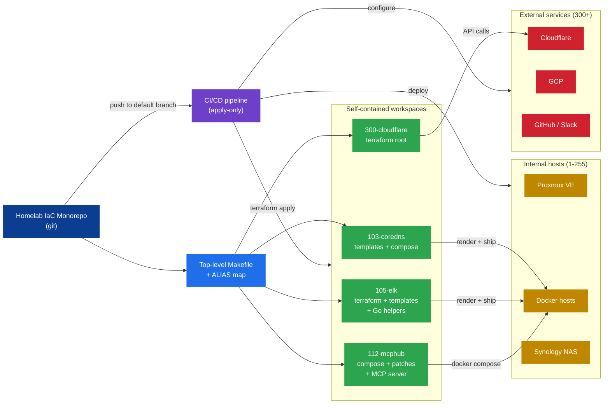

# Homelab Infrastructure Monorepo / 홈랩 인프라 모노레포

> **Manual `apply` is disabled. All changes deploy through CI/CD.**
> **수동 `apply`는 비활성화되어 있습니다. 모든 변경 사항은 CI/CD를 통해 배포됩니다.**

A monorepo of self-contained infrastructure-as-code (IaC) workspaces for a personal homelab and a small set of external (cloud) integrations. Every workspace is named with a flat `NNN-SERVICE` identifier and managed through a single top-level `Makefile`.

개인 홈랩과 소규모 외부(클라우드) 통합을 위한 독립형 인프라스트럭처-코드(IaC) 워크스페이스 모노레포입니다. 각 워크스페이스는 `NNN-SERVICE` 형식의 평탄한(flat) 식별자로 명명되며, 최상위 `Makefile` 하나로 전부 제어합니다.

---

## Table of Contents / 목차

- [Overview / 개요](#overview--개요)
- [Features / 주요 기능](#features--주요-기능)
- [Architecture / 아키텍처](#architecture--아키텍처)
- [Repository Layout / 저장소 구성](#repository-layout--저장소-구성)
- [Workspaces / 워크스페이스](#workspaces--워크스페이스)
- [Numbering Convention / 번호 규칙](#numbering-규칙)
- [Quick Start / 빠른 시작](#quick-start--빠른-시작)
- [Configuration / 설정](#configuration--설정)
- [Commands Reference / 명령어 참조](#commands-reference--명령어-참조)
- [Local Development / 로컬 개발](#local-development--로컬-개발)
- [Testing / 테스트](#testing--테스트)
- [Contributing / 기여 방법](#contributing--기여-방법)
- [License / 라이선스](#license--라이선스)
- [Additional Documentation / 추가 문서](#additional-문서)

---

## Overview / 개요

This repository hosts every piece of IaC used to run the homelab and its satellite integrations. There are **no application sources** here — only the manifests, Terraform modules, templates, and helper scripts needed to deploy them.

이 저장소는 홈랩과 위성 통합을 운영하는 데 필요한 모든 IaC를 한곳에 모아둔 곳입니다. 여기에는 **애플리케이션 소스는 없으며**, 배포에 필요한 매니페스트, Terraform 모듈, 템플릿, 보조 스크립트만 포함됩니다.

Each workspace is a self-contained deployment unit. Three flavors are supported:

| Flavor / 종류 | Purpose / 용도 | Examples / 예시 |
| --- | --- | --- |
| **Terraform root** | Provision external APIs (Cloudflare, GitHub, GCP, Slack, …) and bootstrap local hosts. / 외부 API 프로비저닝 및 로컬 호스트 부트스트랩 | `300-cloudflare/` |
| **Terraform under nested dir** | Same as above, but the workspace keeps its Terraform in a `terraform/` subdirectory so templates and configs can sit alongside. / 동일하지만, 템플릿과 구성을 같은 위치에 두기 위해 Terraform을 `terraform/` 하위 디렉터리에 보관 | `105-elk/terraform/` |
| **Templates + Compose** | Render `docker-compose.yml`, `Corefile`, `filebeat.yml`, etc. from `.tftpl` files and ship them to a target host. / `.tftpl` 파일로부터 `docker-compose.yml`, `Corefile`, `filebeat.yml` 등을 렌더링하여 대상 호스트로 전달 | `103-coredns/`, `112-mcphub/` |

A single top-level `Makefile` resolves short aliases (`elk`, `mcphub`, `cloudflare`, …) to their workspace directories, validates they exist, and dispatches to `terraform init|plan|validate|…` or `docker compose …` as appropriate.

최상위 `Makefile` 하나가 짧은 별칭(`elk`, `mcphub`, `cloudflare`, …)을 해당 워크스페이스 디렉터리로 매핑하고, 존재 여부를 검증한 뒤 `terraform init|plan|validate|…` 또는 `docker compose …`로 위임합니다.

---

## Features / 주요 기능

- **Single-entry monorepo.** One `git clone` gives you every homelab and cloud workspace. / 단일 진입점 모노레포. 한 번의 `git clone`으로 홈랩과 클라우드 워크스페이스를 모두 가져옵니다.
- **Flat `NNN-SERVICE` naming.** Predictable ordering in file listings and a built-in semantic split: `1–255` for internal infrastructure, `300+` for external integrations. / 평탄한 `NNN-SERVICE` 명명 규칙. 파일 목록 정렬이 예측 가능하며, `1–255`는 내부 인프라, `300+`는 외부 통합이라는 의미적 구분이 내장되어 있습니다.
- **Alias-aware Makefile.** Short names (`make SVC=elk plan`) resolve to full paths automatically; nested `terraform/` directories are honoured transparently. / 별칭을 인식하는 Makefile. 짧은 이름(`make SVC=elk plan`)이 자동으로 전체 경로로 해석되며, 중첩된 `terraform/` 디렉터리도 투명하게 처리됩니다.
- **CI/CD-only `apply`.** The `apply` target is intentionally a no-op at the local level to enforce a reviewable, reproducible pipeline. / CI/CD 전용 `apply`. `apply` 타겟은 로컬에서 의도적으로 무효화되어, 검토 가능한 재현 가능한 파이프라인을 강제합니다.
- **Template-driven deployments.** Most internal workspaces emit `docker-compose.yml`, `Corefile`, `filebeat.yml`, etc. from `.tftpl` files via Terraform's `templatefile()`. / 템플릿 기반 배포. 대부분의 내부 워크스페이스는 Terraform의 `templatefile()`을 통해 `.tftpl` 파일로부터 `docker-compose.yml`, `Corefile`, `filebeat.yml` 등을 생성합니다.
- **1Password-backed secrets.** Sensitive values are sourced through the 1Password Terraform provider; secrets never live in the repo. / 1Password 기반 시크릿. 민감한 값은 1Password Terraform 공급자를 통해 가져오며, 시크릿은 저장소에 절대 저장되지 않습니다.
- **Multi-language helpers.** Go programs (`setup-ilm.go`, `remove-promtail.go`, `setup-watcher.go`, `entrypoint-patch.go`), a Node/ESM MCP server (`op-mcp-server/index.mjs`), and Python scripts (`validate_mcps.py`) ship alongside the manifests they support. / 다국어 보조 스크립트. Go 프로그램, Node/ESM MCP 서버, Python 스크립트가 해당 매니페스트와 함께 제공됩니다.
- **Container image builds in-repo.** Custom Dockerfiles (`Dockerfile.logstash`, `Dockerfile.dev-browser`, `Dockerfile.playwright`, `Dockerfile.proxmox`) are part of the workspace that owns them. / 저장소 내 컨테이너 이미지 빌드. 커스텀 Dockerfile은 해당 워크스페이스의 일부입니다.

---

## Architecture / 아키텍처

The repository is intentionally boring: a tree of self-contained workspaces with one shared Makefile front-end and one CI/CD back-end. There are no inter-workspace imports; each workspace owns its own `terraform.tfstate`, container images, and configuration.

이 저장소는 의도적으로 단순합니다. 자체 완비된 워크스페이스 트리, 공유 Makefile 프런트엔드, 그리고 단일 CI/CD 백엔드로 구성됩니다. 워크스페이스 간 import는 없으며, 각 워크스페이스는 자체 `terraform.tfstate`, 컨테이너 이미지, 설정을 소유합니다.


```mermaid
flowchart LR
    classDef repo fill:#0b3d91,stroke:#0b3d91,color:#fff
    classDef mk fill:#1f6feb,stroke:#1f6feb,color:#fff
    classDef ws fill:#2da44e,stroke:#2da44e,color:#fff
    classDef int fill:#bf8700,stroke:#bf8700,color:#fff
    classDef ext fill:#cf222e,stroke:#cf222e,color:#fff
    classDef cicd fill:#6e40c9,stroke:#6e40c9,color:#fff

    Repo["Homelab IaC Monorepo<br/>(git)"]:::repo
    Mk["Top-level Makefile<br/>+ ALIAS map"]:::mk

    subgraph Workspaces["Self-contained workspaces"]
        W1["103-coredns<br/>templates + compose"]:::ws
        W2["105-elk<br/>terraform + templates<br/>+ Go helpers"]:::ws
        W3["112-mcphub<br/>compose + patches<br/>+ MCP server"]:::ws
        W4["300-cloudflare<br/>terraform root"]:::ws
    end

    CICD["CI/CD pipeline<br/>(apply-only)"]:::cicd

    subgraph Internal["Internal hosts (1-255)"]
        I1["Proxmox VE"]:::int
        I2["Docker hosts"]:::int
        I3["Synology NAS"]:::int
    end

    subgraph External["External services (300+)"]
        E1["Cloudflare"]:::ext
        E2["GCP"]:::ext
        E3["GitHub / Slack"]:::ext
    end

    Repo --> Mk
    Mk --> W1
    Mk --> W2
    Mk --> W3
    Mk --> W4

    W1 -- "render + ship" --> I2
    W2 -- "render + ship" --> I2
    W3 -- "docker compose" --> I2
    W4 -- "API calls" --> E1

    Repo -- "push to default branch" --> CICD
    CICD -- "terraform apply" --> Workspaces
    CICD -- "deploy" --> Internal
    CICD -- "configure" --> External
```

Key properties of this design:

- **No cross-workspace coupling.** A workspace can be deleted without breaking its neighbours. / 워크스페이스 간 결합 없음. 한 워크스페이스를 삭제해도 다른 워크스페이스에 영향을 주지 않습니다.
- **Makefile is the only entry point.** Both humans and CI invoke the same targets. / Makefile이 유일한 진입점. 사람과 CI 모두 동일한 타겟을 호출합니다.
- **State is per-workspace.** Terraform state, rendered templates, and lock files live next to the workspace, not in a shared store. / 상태는 워크스페이스별로 관리됩니다. Terraform 상태, 렌더링된 템플릿, 잠금 파일은 공유 저장소가 아닌 워크스페이스 옆에 위치합니다.
- **Secrets never enter git.** 1Password is the single source of truth for tokens, keys, and passwords. / 시크릿은 git에 절대 들어가지 않습니다. 1Password가 토큰, 키, 비밀번호의 단일 진실 공급원입니다.

---

## Repository Layout / 저장소 구성

The actual top-level layout of this repository:

```
.
├── AGENTS.md
├── ARCHITECTURE.md
├── CODE_STYLE.md
├── CONTRIBUTING.md
├── DEPENDENCY_MAP.md
├── LICENSE
├── Makefile
├── OWNERS
├── OWNERS_ALIASES
├── README.md
├── build.env
├── 103-coredns/          # CoreDNS recursive resolver stack
├── 105-elk/              # ELK observability stack (logs)
├── 112-mcphub/           # Model Context Protocol hub + patched runtimes
└── 300-cloudflare/       # Cloudflare DNS / Access / Logpush / Identity
```

Each numbered directory is one workspace. Some workspaces (such as `105-elk`) ship their Terraform configuration under a nested `terraform/` subdirectory; the Makefile is aware of this and resolves the path automatically.

각 번호 매겨진 디렉터리가 하나의 워크스페이스입니다. 일부 워크스페이스(예: `105-elk`)는 Terraform 구성을 중첩된 `terraform/` 하위 디렉터리에 보관하며, Makefile이 이를 인식하여 자동으로 경로를 해석합니다.

### Per-workspace contents / 워크스페이스별 내용

| Workspace / 워크스페이스 | Flavor / 종류 | Notable files / 주요 파일 |
| --- | --- | --- |
| `103-coredns/` | templates | `templates/Corefile.tftpl`, `templates/docker-compose.yml.tftpl`, `templates/filebeat.yml.tftpl` |
| `105-elk/` | hybrid | `docker-compose.yml`, `ilm-policy.json`, `scripts/setup-ilm.go`, `scripts/remove-promtail.go`, `scripts/setup-watcher.go`, `config/Dockerfile.logstash`, `config/logstash.conf`, `terraform/main.tf`, `terraform/onepassword.tf`, `terraform/validation.tf` |
| `112-mcphub/` | hybrid | `Dockerfile.dev-browser`, `Dockerfile.playwright`, `Dockerfile.proxmox`, `mcp_servers.json`, `validate_mcps.py`, `patches/n8n/license.js`, `patches/n8n/license-state.js`, `op-mcp-server/index.mjs`, `config/entrypoint-patch.go`, `config/patch-sdk-schema.cjs` |
| `300-cloudflare/` | terraform | `access.tf`, `dns.tf`, `identity-provider.tf`, `logpush.tf`, `main.tf`, `onepassword.tf`, `outputs.tf` (plus split audiences: `outputs-homelab.tf`, `outputs-jclee.tf`, `outputs-synology.tf`) |

---

## Workspaces / 워크스페이스

The Makefile's `ALIAS_*` map enumerates every workspace currently recognised. Aliases whose target directory is not present in this checkout are still registered, so that pulling on a different machine surfaces them automatically.

Makefile의 `ALIAS_*` 맵은 현재 인식되는 모든 워크스페이스를 나열합니다. 대상 디렉터리가 이 체크아웃에 없는 별칭도 등록되어, 다른 머신에서 풀할 때 자동으로 표시됩니다.

| Alias / 별칭 | Path / 경로 | Scope / 범위 |
| --- | --- | --- |
| `jclee` | `80-jclee` | internal |
| `pve` | `100-pve` | internal |
| `runner` | `101-runner` | internal |
| `traefik` | `102-traefik/terraform` | internal |
| (none) | `103-coredns` | internal |
| `elk` | `105-elk/terraform` | internal |
| `supabase` | `107-supabase` | internal |
| `archon` | `108-archon/terraform` | internal |
| `n8n` | `110-n8n` | internal |
| `mcphub` | `112-mcphub` | internal |
| `oc` | `200-oc` | internal |
| `synology` | `215-synology` | internal |
| `youtube` | `220-youtube` | internal |
| `cloudflare` | `300-cloudflare` | external |
| `github` | `301-github` | external |
| `safetywallet` | `310-safetywallet` | external |
| `slack` | `320-slack` | external |
| `gcp` | `400-gcp` | external |

> Only the workspaces whose directories are present in this checkout are listed in [Repository Layout](#repository-layout--저장소-구성). Aliases that resolve to non-existent directories will be rejected by the `check_svc_dir` guard with a helpful list of available workspaces.
>
> 이 체크아웃에 디렉터리가 존재하는 워크스페이스만 [저장소 구성](#repository-layout--저장소-구성)에 나열됩니다. 존재하지 않는 디렉터리로 해석되는 별칭은 `check_svc_dir` 가드에 의해 사용 가능한 워크스페이스 목록과 함께 거부됩니다.

### Workspace responsibilities / 워크스페이스별 책임

- **`103-coredns`** — CoreDNS recursive resolver deployed as a small `docker compose` stack. Templates emit the upstream `Corefile`, the Compose file, and the `filebeat` shipper config. / `docker compose` 스택으로 배포되는 CoreDNS 재귀 리졸버. 템플릿이 업스트림 `Corefile`, Compose 파일, `filebeat` 수집기 설정을 생성합니다.
- **`105-elk`** — Elasticsearch + Logstash + Kibana stack. The `terraform/` workspace renders the Compose file from `templates/`, manages ILM policies via `scripts/setup-ilm.go`, watches stack health with `scripts/setup-watcher.go`, and cleans up Promtail via `scripts/remove-promtail.go`. The custom `config/Dockerfile.logstash` builds a Logstash image with the pipelines from `config/logstash.conf` and `config/logstash.yml`. / Elasticsearch + Logstash + Kibana 스택. `terraform/` 워크스페이스는 `templates/`로부터 Compose 파일을 렌더링하고, `scripts/setup-ilm.go`로 ILM 정책을 관리하며, `scripts/setup-watcher.go`로 스택 상태를 감시하고, `scripts/remove-promtail.go`로 Promtail을 정리합니다. 커스텀 `config/Dockerfile.logstash`는 `config/logstash.conf` 및 `config/logstash.yml`의 파이프라인이 포함된 Logstash 이미지를 빌드합니다.
- **`112-mcphub`** — Model Context Protocol hub. Ships patched runtimes (e.g. `patches/n8n/license.js` and `license-state.js` to flip n8n's license state) and three custom Dockerfiles: `dev-browser` (development browser image), `playwright` (Playwright harness), and `proxmox` (Proxmox API client). `validate_mcps.py` validates `mcp_servers.json`. `op-mcp-server/` exposes 1Password items to MCP-aware agents. `config/entrypoint-patch.go` and `config/patch-sdk-schema.cjs` rewrite container entrypoints and SDK schemas at compose-up time. / MCP(Model Context Protocol) 허브. 패치된 런타임(예: n8n의 라이선스 상태를 토글하는 `patches/n8n/license.js` 및 `license-state.js`)과 세 개의 커스텀 Dockerfile(`dev-browser`, `playwright`, `proxmox`)을 제공합니다. `validate_mcps.py`는 `mcp_servers.json`을 검증합니다. `op-mcp-server/`는 1Password 항목을 MCP 인식 에이전트에 노출합니다. `config/entrypoint-patch.go` 및 `config/patch-sdk-schema.cjs`는 compose-up 시점에 컨테이너 진입점과 SDK 스키마를 재작성합니다.
- **`300-cloudflare`** — Terraform root for the Cloudflare account. Manages Access policies (`access.tf`), DNS records (`dns.tf`), the identity provider (`identity-provider.tf`), Logpush jobs (`logpush.tf`), and emits three audiences of outputs (`outputs-homelab.tf`, `outputs-jclee.tf`, `outputs-synology.tf`). Secrets come from 1Password via `onepassword.tf`; cross-workspace checks live in `checks.tf` and `validation.tf`. / Cloudflare 계정의 Terraform 루트. Access 정책(`access.tf`), DNS 레코드(`dns.tf`), ID 제공자(`identity-provider.tf`), Logpush 작업(`logpush.tf`)을 관리하며, 세 그룹의 출력(`outputs-homelab.tf`, `outputs-jclee.tf`, `outputs-synology.tf`)을 내보냅니다. 시크릿은 `onepassword.tf`를 통해 1Password에서 가져오며, 워크스페이스 간 검증은 `checks.tf` 및 `validation.tf`에 있습니다.

---

## Numbering Convention / 번호 규칙

> **1–255 = internal infrastructure. 300+ = external (cloud) integrations.**

- The leading three-digit number sorts workspaces lexicographically (`10*` precedes `20*`, which precedes `30*`), so `ls` produces a sensible ordering.
- The `ALIAS_*` map translates short names (`SVC=elk`) to full paths so contributors do not have to memorise numbers.
- Aliases that resolve through a nested `terraform/` subdirectory (e.g. `traefik`, `elk`, `archon`) are written with the `/terraform` suffix in the map; the Makefile does not append it again.
- `200–255` is informally reserved for "personal" internal workspaces (media, backups, etc.) so the boundary between "infra" and "personal" stays visible.

---

## Quick Start / 빠른 시작

### Prerequisites / 사전 요구 사항

- `git`
- `make`
- `terraform` ≥ 1.5
- `docker` + `docker compose` v2
- `go` ≥ 1.21 — only required if you want to build the helper programs under `105-elk/scripts/` and `112-mcphub/config/`
- `node` ≥ 20 — only required to run `112-mcphub/op-mcp-server/`
- `python` ≥ 3.10 — only required for `112-mcphub/validate_mcps.py`
- A 1Password account and service-account token (read by `onepassword_item.*` resources)

### First-time setup / 초기 설정

```bash
git clone <repo-url> homelab
cd homelab

# Pick a workspace and initialise it
make SVC=cloudflare init
make SVC=cloudflare plan

# Pick a different workspace using an alias
make SVC=elk plan
make SVC=mcphub plan
```

All Terraform `apply` invocations from a local checkout are blocked by the Makefile. Push to the default branch and let CI/CD perform the apply.

로컬 체크아웃에서의 모든 Terraform `apply` 호출은 Makefile에 의해 차단됩니다. 기본 브랜치에 푸시하면 CI/CD가 apply를 수행합니다.

---

## Configuration / 설정

### `build.env`

A shared environment file consumed by both Makefile targets and CI jobs. Common keys include image tags, registry endpoints, and feature flags. Source it before running custom workflows:

```bash
set -a
. ./build.env
set +a
```

### Per-workspace variables / 워크스페이스별 변수

Each Terraform workspace declares its own inputs in `variables.tf`. Because secrets are sourced from 1Password, you will not see token variables here — instead, the `onepassword_item.*` resources fetch them by name. Refer to `DEPENDENCY_MAP.md` for a workspace-by-workspace inventory of required 1Password items.

각 Terraform 워크스페이스는 자체 입력을 `variables.tf`에 선언합니다. 시크릿은 1Password에서 가져오므로 토큰 변수는 여기에 보이지 않습니다. 대신 `onepassword_item.*` 리소스가 이름으로 가져옵니다. 필요한 1Password 항목의 워크스페이스별 목록은 `DEPENDENCY_MAP.md`를 참조하세요.

### Template variables / 템플릿 변수

`.tftpl` files in `*/templates/` are rendered with `templatefile(path, vars)` and the variables defined at the top of the Terraform `locals.tf` block. They typically include:

- container image tag and registry
- upstream resolver / gateway addresses (use placeholders such as `<gateway-ip>` in the template body)
- 1Password vault UUID
- TLS SAN list

### Cross-workspace validation / 워크스페이스 간 검증

`checks.tf` and `validation.tf` files in Terraform workspaces enforce invariants that span resources within the workspace (e.g. "every Access application has a matching DNS record"). They run as part of `terraform plan`, so mistakes are caught before `apply`.

---

## Commands Reference / 명령어 참조

The full target list lives at the top of the `Makefile`. The most commonly used targets:

| Target / 타겟 | Purpose / 용도 |
| --- | --- |
| `make help` | Print the auto-generated help (every `##`-documented target). / 자동 생성된 도움말 출력 |
| `make init` | `terraform init` in `$(SVC)`. Default `SVC` is `100-pve`. / `$(SVC)`에서 `terraform init`. 기본 `SVC`는 `100-pve` |
| `make plan` | `terraform plan -out=tfplan`. / `terraform plan -out=tfplan` |
| `make apply` | **Blocked locally.** Push to the default branch instead. / **로컬에서 차단됨.** 기본 브랜치에 푸시하세요 |
| `make verify` | Run provider/format validation. / 공급자/포맷 검증 실행 |
| `make lint` | Run repo-wide linters. / 저장소 전체 린터 실행 |
| `make lint-go` | Run `go vet` and `gofmt -l` on the helper programs. / 헬퍼 프로그램에 대해 `go vet` 및 `gofmt -l` 실행 |
| `make backup` | Snapshot Terraform state and persistent volumes. / Terraform 상태 및 영구 볼륨 스냅샷 |
| `make fmt` | `terraform fmt -recursive` and `gofmt`. / `terraform fmt -recursive` 및 `gofmt` |
| `make validate` | `terraform validate` for the active workspace. / 활성 워크스페이스에 대해 `terraform validate` |
| `make drift-check` | Compare live state to committed configuration. / 실제 상태와 커밋된 구성 비교 |
| `make test` | Aggregate test runner. / 통합 테스트 러너 |
| `make test-unit` | Unit tests only (Go, Python, Node). / 단위 테스트만 (Go, Python, Node) |
| `make test-integration` | Integration tests only. / 통합 테스트만 |
| `make test-workspace SVC=<ws>` | Run the test suite scoped to one workspace. / 한 워크스페이스로 범위를 한정하여 테스트 실행 |
| `make docs` | Regenerate workspace READMEs from local headers. / 로컬 헤더로부터 워크스페이스 README 재생성 |
| `make pre-commit-install` | Install the pre-commit hooks. / pre-commit 훅 설치 |
| `make pre-commit-run` | Run the pre-commit hooks against the working tree. / 작업 트리에 대해 pre-commit 훅 실행 |
| `make setup` | One-shot bootstrap (installs toolchain, configures git hooks). / 일회성 부트스트랩 (툴체인 설치, git 훅 구성) |

### Selecting a workspace / 워크스페이스 선택

```bash
# Full path
make SVC=300-cloudflare plan

# Alias
make SVC=cloudflare plan

# Nested terraform directory
make SVC=elk plan          # resolves to 105-elk/terraform
make SVC=traefik plan      # resolves to 102-traefik/terraform
```

If the resolved directory does not exist, `check_svc_dir` aborts with a list of available workspaces.

해석된 디렉터리가 존재하지 않으면 `check_svc_dir`이 사용 가능한 워크스페이스 목록과 함께 중단합니다.

---

## Local Development / 로컬 개발

### Editing a workspace / 워크스페이스 편집

1. Pick the workspace and target: `make SVC=elk plan`.
2. Edit `*.tf`, `templates/*.tftpl`, or helper scripts.
3. Re-run `make SVC=elk plan` and inspect the diff.
4. Run `make SVC=elk fmt validate` to format and validate locally.
5. Commit on a branch and open a PR. CI will run `lint`, `validate`, and `drift-check`.
6. Merge to the default branch to trigger the gated `apply`.

### Working with helper programs / 보조 프로그램 작업

`105-elk/scripts/*.go` and `112-mcphub/config/*.go` are standalone Go programs that can be built and run independently of Terraform:

```bash
# Build the ELK ILM helper
cd 105-elk/scripts
go build -o setup-ilm ./setup-ilm.go

# Build the MCP entrypoint patcher
cd 112-mcphub/config
go build -o entrypoint-patch ./entrypoint-patch.go
```

`112-mcphub/validate_mcps.py` is a standalone Python script:

```bash
python3 112-mcphub/validate_mcps.py 112-mcphub/mcp_servers.json
```

`112-mcphub/op-mcp-server/` is a Node/ESM MCP server for 1Password:

```bash
cd 112-mcphub/op-mcp-server
npm install
node index.mjs
```

### Editing templates / 템플릿 편집

`.tftpl` files are plain text with Terraform's `${ ... }` interpolation syntax. Keep them small and re-run `make SVC=<ws> plan` to confirm the rendered file matches your intent. The rendered output appears in `terraform plan`'s diff for any `local_file` or `templatefile` usage.

`.tftpl` 파일은 Terraform의 `${ ... }` 보간 문법을 사용하는 일반 텍스트입니다. 작게 유지하고 `make SVC=<ws> plan`을 다시 실행하여 렌더링된 파일이 의도와 일치하는지 확인하세요. `local_file` 또는 `templatefile` 사용에 대한 렌더링 출력은 `terraform plan`의 diff에 나타납니다.

### Adding a runtime patch / 런타임 패치 추가

For `112-mcphub`, drop the patched source into `patches/<upstream>/` and wire it through `config/patch-sdk-schema.cjs` (Node) or `config/entrypoint-patch.go` (Go) so it is applied at container start.

---

## Testing / 테스트

| Target / 타겟 | Scope / 범위 |
| --- | --- |
| `make test-unit` | Pure-Go unit tests under `105-elk/scripts/` and `112-mcphub/config/`; pure-Python unit tests under `112-mcphub/`; Node tests under `112-mcphub/op-mcp-server/`. / Go, Python, Node 단위 테스트 |
| `make test-integration` | Container-level integration tests that bring up a Compose stack and assert its health. / Compose 스택을 띄우고 상태를 검증하는 컨테이너 수준 통합 테스트 |
| `make test-workspace SVC=elk` | Workspace-scoped tests, including `terraform validate`. / `terraform validate`를 포함한 워크스페이스 범위 테스트 |
| `make validate` | Cross-workspace `terraform validate` plus structural checks (e.g. every alias resolves). / 워크스페이스 간 `terraform validate` 및 구조 검사 |
| `make drift-check` | Read-only diff between declared config and live state. / 선언된 구성과 실제 상태의 읽기 전용 차이 |

CI runs the same targets in this order: `fmt` → `lint` → `validate` → `test-unit` → `test-integration` → `drift-check` → `plan` (no `apply`).

---

## Contributing / 기여 방법

1. Read [`CONTRIBUTING.md`](./CONTRIBUTING.md) and [`CODE_STYLE.md`](./CODE_STYLE.md).
2. Read [`ARCHITECTURE.md`](./ARCHITECTURE.md) for the design intent.
3. Read [`DEPENDENCY_MAP.md`](./DEPENDENCY_MAP.md) to understand what 1Password items your workspace will need.
4. Create a feature branch off the default branch.
5. Keep each PR scoped to **one workspace** unless a change crosses workspace boundaries by design.
6. Run `make pre-commit-run` before pushing.
7. Open a PR. The `OWNERS` / `OWNERS_ALIASES` files drive required reviewers.

### Adding a new workspace / 새 워크스페이스 추가

1. Pick the next free number in the correct range (`1–255` for internal, `300+` for external).
2. Create `NNN-NAME/` with at minimum a `README.md` and either `main.tf` or `docker-compose.yml`.
3. Add an `ALIAS_<short> := NNN-NAME` (or `.../terraform`) entry to the `Makefile`.
4. Run `make SVC=<your-alias> plan` to confirm the alias resolves.
5. Add the workspace to `DEPENDENCY_MAP.md`.

### Reviewer model / 리뷰어 모델

`OWNERS` lists individuals and `OWNERS_ALIASES