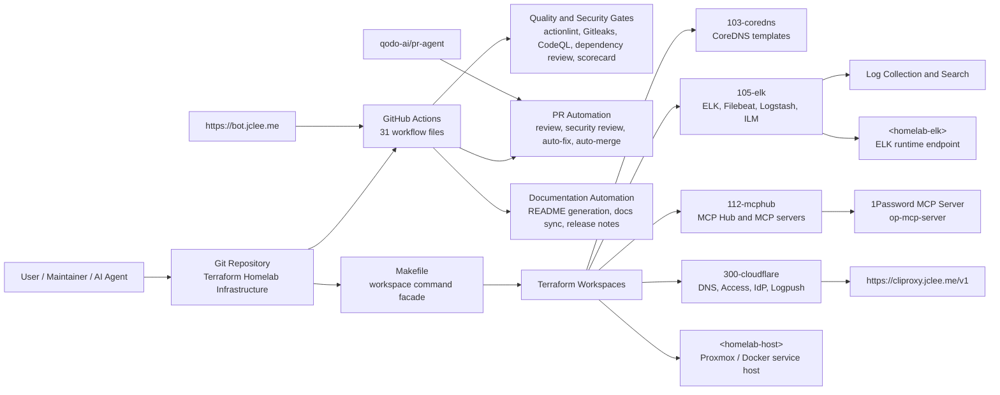

# Terraform Homelab Infrastructure / Terraform Homelab 인프라

## Badges / 배지

| Badge | Status |
| --- | --- |
| Infrastructure as Code | Terraform Homelab Monorepo |
| Automation | 31 GitHub Actions workflows |
| Security | CodeQL, Gitleaks, Dependency Review, OpenSSF Scorecard |
| Review Automation | Qodo PR-Agent, semantic PR checks, auto-fix, auto-merge |
| Documentation | README generation, docs sync, release notes |
| License | MIT |

> English version follows Korean content.  
> 한국어 다음에 영어 버전이 이어집니다.

---

# 한국어

## 개요

이 저장소는 `jclee.me` homelab 및 외부 서비스를 코드로 관리하기 위한 Infrastructure-as-Code 모노레포입니다. Terraform 기반 워크스페이스, 템플릿 렌더링, GitHub Actions 자동화, 1Password 기반 시크릿 주입, Cloudflare 구성, ELK 로그 수집, MCP Hub 구성 등을 포함합니다.

현재 제공된 저장소 구조 기준으로 다음 영역을 관리합니다.

- `103-coredns`: CoreDNS 설정 템플릿 및 Docker Compose 템플릿
- `105-elk`: ELK 스택, Logstash/Filebeat 구성, ILM/Watcher 설정 유틸리티, Terraform 구성
- `112-mcphub`: MCP Hub, Playwright/Proxmox/dev-browser Dockerfile, MCP 서버 검증 도구, 1Password MCP 서버
- `300-cloudflare`: Cloudflare Access, DNS, Identity Provider, Logpush, Terraform 구성
- `.github/workflows`: 31개 GitHub Actions 워크플로우 기반 CI/CD 및 운영 자동화

이 README는 저장소의 자동화, 구조, 개발 방법, 명령어, 기여 절차를 한 곳에서 확인할 수 있도록 작성되었습니다.

## 주요 기능

### Infrastructure as Code

- Terraform 기반 서비스별 워크스페이스 구성
- Cloudflare DNS, Access, Identity Provider, Logpush 관리
- ELK 스택 배포 및 로그 파이프라인 구성
- CoreDNS 및 MCP Hub 구성 파일 템플릿화
- 서비스별 `templates/*.tftpl` 기반 설정 렌더링

### GitHub Automation

- PR 검사, 리뷰, 보안 리뷰, semantic PR 검증
- Gitleaks, CodeQL, Dependency Review, OpenSSF Scorecard
- Dependabot 및 PR 자동 병합
- README 생성, 문서 동기화, 릴리스 노트/릴리스 발행
- CI 실패 이슈 생성 및 자동 복구 워크플로우
- Issue 분류, branch-to-PR, issue-to-branch 자동화

### Security and Compliance

- 시크릿 하드코딩 방지를 위한 Gitleaks
- 의존성 취약점 검토
- CodeQL 정적 분석
- OpenSSF Scorecard 기반 공급망 보안 점검
- Cloudflare Access 및 Identity Provider 구성 관리

### Observability

- ELK 기반 로그 수집 및 검색
- Filebeat 및 Logstash 구성 관리
- ILM 정책 관리
- Watcher 설정 유틸리티 포함

### MCP Hub

- MCP 서버 설정 검증
- Playwright, Proxmox, dev-browser용 Dockerfile 제공
- 1Password MCP 서버 Node.js 구현 포함
- n8n 패치 파일 및 SDK 스키마 패치 유틸리티 포함

## 아키텍처


```mermaid
flowchart LR
  User["User / Maintainer / AI Agent"] --> Repo["Git Repository<br/>Terraform Homelab Infrastructure"]
  Repo --> Actions["GitHub Actions<br/>31 workflow files"]
  Actions --> Checks["Quality and Security Gates<br/>actionlint, Gitleaks, CodeQL, dependency review, scorecard"]
  Actions --> PRAuto["PR Automation<br/>review, security review, auto-fix, auto-merge"]
  Actions --> Docs["Documentation Automation<br/>README generation, docs sync, release notes"]

  Repo --> Make["Makefile<br/>workspace command facade"]
  Make --> Terraform["Terraform Workspaces"]
  Terraform --> CoreDNS["103-coredns<br/>CoreDNS templates"]
  Terraform --> ELK["105-elk<br/>ELK, Filebeat, Logstash, ILM"]
  Terraform --> MCPHub["112-mcphub<br/>MCP Hub and MCP servers"]
  Terraform --> Cloudflare["300-cloudflare<br/>DNS, Access, IdP, Logpush"]

  ELK --> Logs["Log Collection and Search"]
  MCPHub --> OnePasswordMCP["1Password MCP Server<br/>op-mcp-server"]
  Cloudflare --> PublicEndpoint["https://cliproxy.jclee.me/v1"]
  Terraform --> HomelabHost["&lt;homelab-host&gt;<br/>Proxmox / Docker service host"]
  ELK --> HomelabELK["&lt;homelab-elk&gt;<br/>ELK runtime endpoint"]

  Bot["https://bot.jclee.me"] --> Actions
  Qodo["qodo-ai/pr-agent"] --> PRAuto
```

## 저장소 구조

제공된 실제 최상위 구조 기준입니다. CI의 임시 체크아웃 경로나 존재하지 않는 디렉터리는 포함하지 않습니다.

```text
/
├── AGENTS.md
├── ARCHITECTURE.md
├── CODE_STYLE.md
├── CONTRIBUTING.md
├── DEPENDENCY_MAP.md
├── LICENSE
├── Makefile
├── OWNERS
├── OWNERS_ALIASES
├── README.md
├── build.env
├── 103-coredns/
│   ├── AGENTS.md
│   ├── README.md
│   └── templates/
│       ├── AGENTS.md
│       ├── Corefile.tftpl
│       ├── docker-compose.yml.tftpl
│       └── filebeat.yml.tftpl
├── 105-elk/
│   ├── AGENTS.md
│   ├── docker-compose.yml
│   ├── ilm-policy.json
│   ├── scripts/
│   │   ├── remove-promtail
│   │   ├── remove-promtail.go
│   │   ├── setup-ilm.go
│   │   └── setup-watcher.go
│   ├── config/
│   │   ├── AGENTS.md
│   │   ├── Dockerfile.logstash
│   │   ├── filebeat.yml
│   │   ├── ilm-policy.json
│   │   ├── logstash.conf
│   │   └── logstash.yml
│   ├── templates/
│   │   ├── AGENTS.md
│   │   ├── Dockerfile.logstash.tftpl
│   │   ├── docker-compose.yml.tftpl
│   │   ├── filebeat.yml.tftpl
│   │   ├── ilm-policy.json.tftpl
│   │   ├── logstash.conf.tftpl
│   │   ├── logstash.yml.tftpl
│   │   └── setup-ilm.sh.tftpl
│   └── terraform/
│       ├── AGENTS.md
│       ├── README.md
│       ├── checks.tf
│       ├── main.tf
│       ├── onepassword.tf
│       ├── outputs.tf
│       ├── providers.tf
│       ├── validation.tf
│       ├── variables.tf
│       └── versions.tf
├── 112-mcphub/
│   ├── AGENTS.md
│   ├── Dockerfile.dev-browser
│   ├── Dockerfile.playwright
│   ├── Dockerfile.proxmox
│   ├── README.md
│   ├── mcp_servers.json
│   ├── validate_mcps.py
│   ├── patches/
│   │   └── n8n/
│   │       ├── license-state.js
│   │       └── license.js
│   ├── op-mcp-server/
│   │   ├── AGENTS.md
│   │   ├── index.mjs
│   │   ├── package-lock.json
│   │   └── package.json
│   ├── config/
│   │   ├── AGENTS.md
│   │   ├── entrypoint-patch.go
│   │   ├── filebeat.yml
│   │   ├── patch-placeholder.cjs
│   │   └── patch-sdk-schema.cjs
│   └── templates/
│       ├── AGENTS.md
│       ├── docker-compose-op-connect.yml.tftpl
│       ├── docker-compose.yml.tftpl
│       ├── filebeat.yml.tftpl
│       └── mcp_settings.json.tftpl
└── 300-cloudflare/
    ├── AGENTS.md
    ├── README.md
    ├── access.tf
    ├── checks.tf
    ├── dns.tf
    ├── identity-provider.tf
    ├── locals.tf
    ├── logpush.tf
    ├── main.tf
    ├── onepassword.tf
    ├── outputs-homelab.tf
    ├── outputs-jclee.tf
    ├── outputs-synology.tf
    └── outputs.tf
```

## 자동화 인벤토리

### GitHub Actions 워크플로우

이 저장소에는 31개의 워크플로우 파일이 있습니다. 파일명은 실제 on-disk 이름을 그대로 표기합니다.

| File | Purpose |
| --- | --- |
| `01_branch-to-pr.yml` | 브랜치 생성 또는 업데이트를 PR 흐름으로 연결 |
| `02_issue-to-branch.yml` | 이슈 기반 작업 브랜치 생성 자동화 |
| `03_pr-checks.yml` | PR 기본 검증 및 품질 게이트 |
| `04_actionlint.yml` | GitHub Actions workflow 문법 및 관례 검사 |
| `05_gitleaks.yml` | 시크릿 및 민감정보 누출 검사 |
| `06_codeql.yml` | CodeQL 기반 정적 보안 분석 |
| `07_dependency-review.yml` | 의존성 변경 및 취약점 검토 |
| `08_scorecard.yml` | OpenSSF Scorecard 공급망 보안 점검 |
| `09_semantic-pr.yml` | PR 제목 및 semantic convention 검증 |
| `10_pr-review.yml` | 자동 PR 리뷰 |
| `11_security-pr-review.yml` | 보안 관점의 자동 PR 리뷰 |
| `12_dependabot-auto-merge.yml` | Dependabot PR 자동 병합 정책 |
| `13_pr-auto-merge.yml` | 조건 충족 PR 자동 병합 |
| `14_bot-auto-fix.yml` | 봇 기반 자동 수정 제안 및 커밋 |
| `15_merged-pr-cleanup.yml` | 병합된 PR의 후처리 및 브랜치 정리 |
| `19_issue-backfill.yml` | 기존 이슈 메타데이터 보강 |
| `20_readme-gen.yml` | README 자동 생성 및 갱신 |
| `21_docs-sync.yml` | 문서 동기화 |
| `24_release-notes.yml` | 릴리스 노트 생성 |
| `25_release-publish.yml` | 릴리스 발행 |
| `29_downstream-health-check.yml` | 다운스트림 상태 점검 |
| `37_ci-failure-issues.yml` | CI 실패 시 이슈 생성 또는 갱신 |
| `42_reusable-docs-sync.yml` | 재사용 가능한 문서 동기화 workflow |
| `44_reusable-pr-checks.yml` | 재사용 가능한 PR 검사 workflow |
| `45_reusable-gitleaks.yml` | 재사용 가능한 Gitleaks workflow |
| `60_ci-auto-heal.yml` | CI 실패 자동 복구 시도 |
| `91_issue-classification.yml` | 이슈 자동 분류 |
| `auto-merge.yml` | 일반 자동 병합 workflow |
| `ci.yml` | 기본 CI workflow |
| `labeler.yml` | 라벨 자동 적용 |
| `welcome.yml` | 신규 이슈/PR 환영 메시지 자동화 |

### README 생성 자동화

README 생성 자동화는 다음 모델 구성을 사용합니다.

| Role | Model |
| --- | --- |
| Primary | `gpt-5.5` |
| Fallback | `minimax-m3` via CLIProxyAPI |
| Public endpoint | `https://cliproxy.jclee.me/v1` |

### 자동화 도구

#### 루트 Makefile

루트 `Makefile`은 Terraform 워크스페이스 작업을 위한 표준 진입점입니다.

지원되는 phony target:

- `init`
- `plan`
- `apply`
- `verify`
- `lint`
- `lint-go`
- `backup`
- `fmt`
- `validate`
- `drift-check`
- `test`
- `test-unit`
- `test-integration`
- `test-workspace`
- `docs`
- `pre-commit-install`
- `pre-commit-run`
- `setup`
- `help`

중요 정책:

- `apply`는 로컬 수동 실행이 비활성화되어 있습니다.
- 배포는 CI/CD를 통해 수행해야 합니다.
- `SVC` 변수로 대상 워크스페이스를 지정합니다.
- 별칭은 `elk`, `mcphub`, `cloudflare` 등으로 해석됩니다.

#### Go 자동화 도구

제공된 자동화 인벤토리 기준으로 루트 수준 Go automation tools는 없습니다.

| Category | Count |
| --- | ---: |
| Root Go automation tools | 0 |

다만 서비스 디렉터리 내부에는 운영 보조용 Go 파일이 포함되어 있습니다.

| Path | Purpose |
| --- | --- |
| `105-elk/scripts/remove-promtail.go` | Promtail 제거 보조 유틸리티 |
| `105-elk/scripts/setup-ilm.go` | Elasticsearch ILM 설정 보조 유틸리티 |
| `105-elk/scripts/setup-watcher.go` | Elasticsearch Watcher 설정 보조 유틸리티 |
| `112-mcphub/config/entrypoint-patch.go` | MCP Hub entrypoint 패치 보조 코드 |

#### Python / Node.js / JavaScript 도구

| Tool | Path | Purpose |
| --- | --- | --- |
| MCP validator | `112-mcphub/validate_mcps.py` | `mcp_servers.json` 검증 |
| 1Password MCP server | `112-mcphub/op-mcp-server/index.mjs` | 1Password MCP 서버 구현 |
| SDK schema patch | `112-mcphub/config/patch-sdk-schema.cjs` | SDK 스키마 패치 |
| Placeholder patch | `112-mcphub/config/patch-placeholder.cjs` | placeholder 패치 |
| n8n license patch | `112-mcphub/patches/n8n/license.js` | n8n 라이선스 관련 패치 |
| n8n license state patch | `112-mcphub/patches/n8n/license-state.js` | n8n 라이선스 상태 패치 |

## 빠른 시작

### 1. 저장소 준비

```bash
git clone <repository-url>
cd <repository-directory>
```

저장소 URL은 환경마다 다를 수 있으므로 실제 사용 중인 원격 저장소 주소를 사용하세요.

### 2. 필수 도구 확인

권장 도구:

- `terraform`
- `make`
- `git`
- `docker`
- `python3`
- `node`
- `npm`
- 1Password CLI 또는 CI에서 제공되는 1Password 연동

### 3. Terraform 초기화

예: ELK Terraform workspace 초기화

```bash
make init SVC=elk
```

동일 작업을 직접 실행하려면:

```bash
cd 105-elk/terraform
terraform init
```

### 4. Terraform plan 생성

```bash
make plan SVC=elk
```

Cloudflare workspace 예시:

```bash
make plan SVC=cloudflare
```

### 5. 로컬 apply 금지

```bash
make apply SVC=elk
```

이 명령은 정책상 실패하도록 구성되어 있습니다. 실제 변경 적용은 CI/CD를 통해 수행합니다.

### 6. MCP 서버 설정 검증

```bash
cd 112-mcphub
python3 validate_mcps.py
```

### 7. 1Password MCP server 의존성 설치

```bash
cd 112-mcphub/op-mcp-server
npm install
```

## 로컬 개발

### 개발 원칙

- Terraform 변경은 반드시 `terraform fmt`와 `terraform validate`를 통과해야 합니다.
- 시크릿, 토큰, 내부 주소, 개인 식별 정보는 커밋하지 않습니다.
- 서비스 런타임 설정은 가능한 경우 `templates/*.tftpl`에서 관리합니다.
- 생성된 파일과 템플릿 원본을 혼동하지 않도록 변경 위치를 명확히 합니다.
- GitHub Actions 변경 시 `04_actionlint.yml`의 검사를 통과해야 합니다.

### Terraform 작업 흐름

```bash
make init SVC=<workspace>
make fmt SVC=<workspace>
make validate SVC=<workspace>
make plan SVC=<workspace>
```

예시:

```bash
make init SVC=cloudflare
make fmt SVC=cloudflare
make validate SVC=cloudflare
make plan SVC=cloudflare
```

### ELK 작업 흐름

ELK 관련 파일:

- Runtime compose: `105-elk/docker-compose.yml`
- Runtime config: `105-elk/config/`
- Templates: `105-elk/templates/`
- Terraform: `105-elk/terraform/`
- Utility scripts: `105-elk/scripts/`

일반 작업:

```bash
cd 105-elk/terraform
terraform init
terraform validate
terraform plan
```

### CoreDNS 작업 흐름

CoreDNS 관련 파일:

- `103-coredns/templates/Corefile.tftpl`
- `103-coredns/templates/docker-compose.yml.tftpl`
- `103-coredns/templates/filebeat.yml.tftpl`

변경 시 확인할 항목:

- DNS zone 또는 upstream 변경 사항
- Docker Compose 렌더링 결과
- Filebeat 로그 수집 설정

### MCP Hub 작업 흐름

MCP Hub 관련 파일:

- `112-mcphub/mcp_servers.json`
- `112-mcphub/validate_mcps.py`
- `112-mcphub/templates/mcp_settings.json.tftpl`
- `112-mcphub/op-mcp-server/`

검증:

```bash
cd 112-mcphub
python3 validate_mcps.py
```

1Password MCP server 개발:

```bash
cd 112-mcphub/op-mcp-server
npm install
node index.mjs
```

### Cloudflare 작업 흐름

Cloudflare 관련 Terraform 파일:

- `300-cloudflare/access.tf`
- `300-cloudflare/dns.tf`
- `300-cloudflare/identity-provider.tf`
- `300-cloudflare/logpush.tf`
- `300-cloudflare/onepassword.tf`
- `300-cloudflare/outputs*.tf`

검증:

```bash
cd 300-cloudflare
terraform init
terraform validate
terraform plan
```

## 명령어 레퍼런스

### Makefile 기본 형식

```bash
make <target> SVC=<service-or-alias>
```

예시:

```bash
make plan SVC=elk
make validate SVC=cloudflare
```

### Workspace alias

`Makefile`에 정의된 alias는 다음과 같습니다.

| Alias | Resolved path |
| --- | --- |
| `jclee` | `80-jclee` |
| `pve` | `100-pve` |
| `runner` | `101-runner` |
| `traefik` | `102-traefik/terraform` |
| `elk` | `105-elk/terraform` |
| `supabase` | `107-supabase` |
| `archon` | `108-archon/terraform` |
| `n8n` | `110-n8n` |
| `mcphub` | `112-mcphub` |
| `oc` | `200-oc` |
| `synology` | `215-synology` |
| `youtube` | `220-youtube` |
| `cloudflare` | `300-cloudflare` |
| `github` | `301-github` |
| `safetywallet` | `310-safetywallet` |
| `slack` | `320-slack` |
| `gcp` | `400-gcp` |

주의: 위 alias 중 일부는 현재 제공된 프로젝트 구조에 포함되지 않을 수 있습니다. `Makefile`은 디렉터리 존재 여부를 확인한 뒤 없으면 실패합니다.

### Targets

| Target | Description |
| --- | --- |
| `make init SVC=<name>` | Terraform 초기화 |
| `make plan SVC=<name>` | Terraform plan 생성 |
| `make apply SVC=<name>` | 수동 apply 차단. CI/CD 사용 필요 |
| `make verify SVC=<name>` | 검증 작업 실행 |
| `make lint` | lint 실행 |
| `make lint-go` | Go lint 실행 |
| `make backup` | 백업 작업 |
| `make fmt SVC=<name>` | Terraform formatting |
| `make validate SVC=<name>` | Terraform validation |
| `make drift-check SVC=<name>` | drift 확인 |
| `make test` | 전체 테스트 |
| `make test-unit` | 단위 테스트 |
| `make test-integration` | 통합 테스트 |
| `make test-workspace SVC=<name>` | 특정 workspace 테스트 |
| `make docs` | 문서 생성 또는 갱신 |
| `make pre-commit-install` | pre-commit hook 설치 |
| `make pre-commit-run` | pre-commit hook 실행 |
| `make setup` | 로컬 개발 환경 설정 |
| `make help` | 사용 가능한 명령어 출력 |

## 기여 가이드

### 브랜치 및 PR

1. 이슈를 생성하거나 기존 이슈를 선택합니다.
2. 자동화가 제공되는 경우 `02_issue-to-branch.yml`을 통해 브랜치를 생성합니다.
3. 변경 사항을 작게 유지합니다.
4. PR 제목은 semantic convention을 따릅니다.
5. PR은 `03_pr-checks.yml`, `09_semantic-pr.yml`, 보안 검사, 리뷰 자동화를 통과해야 합니다.

### PR 체크리스트

- [ ] Terraform 파일을 변경한 경우 `terraform fmt`를 실행했습니다.
- [ ] Terraform 파일을 변경한 경우 `terraform validate` 또는 `make validate`를 실행했습니다.
- [ ] 민감정보를 커밋하지 않았습니다.
- [ ] 템플릿 변경 시 렌더링 결과와 영향 범위를 확인했습니다.
- [ ] GitHub Actions 변경 시 actionlint 통과를 고려했습니다.
- [ ] 문서가 필요한 변경이면 README 또는 관련 README를 갱신했습니다.
- [ ] Cloudflare, ELK, MCP Hub 변경 시 서비스별 README 또는 주석을 확인했습니다.

### 코드 소유권

- `OWNERS`와 `OWNERS_ALIASES`를 기준으로 리뷰 책임자를 확인합니다.
- 큰 구조 변경은 `ARCHITECTURE.md`, `DEPENDENCY_MAP.md`, `CODE_STYLE.md`와 일치해야 합니다.
- 기존 문서 `CONTRIBUTING.md`가 있으면 해당 정책을 우선합니다.

### 보안 정책

- 내부 IP 주소, 컨테이너 번호, 토큰, API 키, 쿠키, 세션 값은 커밋하지 않습니다.
- 예시에는 `<homelab-host>`, `<homelab-elk>`와 같은 placeholder를 사용합니다.
- 공개적으로 참조 가능한 endpoint가 필요한 경우 `https://cliproxy.jclee.me/v1`을 사용합니다.
- 시크릿은 1Password 또는 CI secret store를 통해 주입합니다.

---

# English

## Overview

This repository is an Infrastructure-as-Code monorepo for managing the `jclee.me` homelab and related external services. It combines Terraform workspaces, service templates, GitHub Actions automation, 1Password-backed secret injection, Cloudflare configuration, ELK logging, and MCP Hub configuration.

Based on the provided repository layout, this repo currently contains:

- `103-coredns`: CoreDNS configuration templates and Docker Compose templates
- `105-elk`: ELK stack, Logstash/Filebeat configuration, ILM/Watcher utilities, Terraform configuration
- `112-mcphub`: MCP Hub, Playwright/Proxmox/dev-browser Dockerfiles, MCP server validation, 1Password MCP server
- `300-cloudflare`: Cloudflare Access, DNS, Identity Provider, Logpush, Terraform configuration
- `.github/workflows`: 31 GitHub Actions workflow files for CI/CD and repository operations

This README is intended to be the central guide for automation, architecture, local development, commands, and contribution practices.

## Features

### Infrastructure as Code

- Service-oriented Terraform workspace layout
- Cloudflare DNS, Access, Identity Provider, and Logpush management
- ELK stack deployment and log pipeline configuration
- CoreDNS and MCP Hub configuration templating
- `templates/*.tftpl`-driven service configuration

### GitHub Automation

- PR checks, automated review, security review, and semantic PR validation
- Gitleaks, CodeQL, Dependency Review, and OpenSSF Scorecard
- Dependabot and PR auto-merge workflows
- README generation, documentation sync, release notes, and release publishing
- CI failure issue creation and CI auto-healing
- Issue classification, branch-to-PR, and issue-to-branch automation

### Security and Compliance

- Secret leak detection with Gitleaks
- Dependency vulnerability review
- Static analysis with CodeQL
- Supply-chain security checks with OpenSSF Scorecard
- Cloudflare Access and Identity Provider configuration as code

### Observability

- ELK-based log collection and search
- Filebeat and Logstash configuration management
- ILM policy management
- Watcher setup utilities

### MCP Hub

- MCP server configuration validation
- Dockerfiles for Playwright, Proxmox, and dev-browser environments
- Node.js-based 1Password MCP server
- n8n patch files and SDK schema patch utilities

## Architecture


```mermaid
flowchart LR
  UserEN["User / Maintainer / AI Agent"] --> RepoEN["Git Repository<br/>Terraform Homelab Infrastructure"]
  RepoEN --> ActionsEN["GitHub Actions<br/>31 workflow files"]
  ActionsEN --> ChecksEN["Quality and Security Gates<br/>actionlint, Gitleaks, CodeQL, dependency review, scorecard"]
  ActionsEN --> PRAutoEN["PR Automation<br/>review, security review, auto-fix, auto-merge"]
  ActionsEN --> DocsEN["Documentation Automation<br/>README generation, docs sync, release notes"]

  RepoEN --> MakeEN["Makefile<br/>workspace command facade"]
  MakeEN --> TerraformEN["Terraform Workspaces"]
  TerraformEN --> CoreDNSEN["103-coredns<br/>CoreDNS templates"]
  TerraformEN --> ELKEN["105-elk<br/>ELK, Filebeat, Logstash, ILM"]
  TerraformEN --> MCPHubEN["112-mcphub<br/>MCP Hub and MCP servers"]
  TerraformEN --> CloudflareEN["300-cloudflare<br/>DNS, Access, IdP, Logpush"]

  ELKEN --> LogsEN["Log Collection and Search"]
  MCPHubEN --> OnePasswordMCPEN["1Password MCP Server<br/>op-mcp-server"]
  CloudflareEN --> PublicEndpointEN["https://cliproxy.jclee.me/v1"]
  TerraformEN --> HomelabHostEN["&lt;homelab-host&gt;<br/>Proxmox / Docker service host"]
  ELKEN --> HomelabELKEN["&lt;homelab-elk&gt;<br/>ELK runtime endpoint"]

  BotEN["https://bot.jclee.me"] --> ActionsEN
  QodoEN["qodo-ai/pr-agent"] --> PRAutoEN
```

## Repository Structure

This tree reflects the actual top-level layout provided for this repository. Transient CI checkout paths and non-existent directories are intentionally excluded.

```text
/
├── AGENTS.md
├── ARCHITECTURE.md
├── CODE_STYLE.md
├── CONTRIBUTING.md
├── DEPENDENCY_MAP.md
├── LICENSE
├── Makefile
├── OWNERS
├── OWNERS_ALIASES
├── README.md
├── build.env
├── 103-coredns/
├── 105-elk/
├── 112-mcphub/
└── 300-cloudflare/
```

Key service directories:

| Path | Description |
| --- | --- |
| `103-coredns/` | CoreDNS templates and service README |
| `105-elk/` | ELK runtime files, templates, utility scripts, and Terraform workspace |
| `112-mcphub/` | MCP Hub configuration, Dockerfiles, validation, patches, and MCP server implementation |
| `300-cloudflare/` | Cloudflare Terraform workspace |
| `AGENTS.md` | Repository knowledge base for automation and agents |
| `ARCHITECTURE.md` | Architecture reference |
| `CODE_STYLE.md` | Code style and repository conventions |
| `CONTRIBUTING.md` | Contribution policy |
| `DEPENDENCY_MAP.md` | Dependency and relationship documentation |
| `OWNERS` | Ownership configuration |
| `OWNERS_ALIASES` | Owner alias mapping |
| `Makefile` | Local command facade |

## Automation Inventory

### GitHub Actions Workflows

This repository contains 31 workflow files. The names below are the real on-disk workflow filenames.

| File | Purpose |
| --- | --- |
| `01_branch-to-pr.yml` | Connect branch activity to pull request workflows |
| `02_issue-to-branch.yml` | Create work branches from issues |
| `03_pr-checks.yml` | Run standard PR validation and quality gates |
| `04_actionlint.yml` | Validate GitHub Actions workflow syntax and conventions |
| `05_gitleaks.yml` | Detect committed secrets and sensitive data |
| `06_codeql.yml` | Run CodeQL static security analysis |
| `07_dependency-review.yml` | Review dependency changes and vulnerabilities |
| `08_scorecard.yml` | Run OpenSSF Scorecard supply-chain checks |
| `09_semantic-pr.yml` | Validate semantic PR titles |
| `10_pr-review.yml` | Run automated PR review |
| `11_security-pr-review.yml` | Run automated security-focused PR review |
| `12_dependabot-auto-merge.yml` | Auto-merge eligible Dependabot PRs |
| `13_pr-auto-merge.yml` | Auto-merge eligible pull requests |
| `14_bot-auto-fix.yml` | Apply bot-generated fixes |
| `15_merged-pr-cleanup.yml` | Clean up after merged pull requests |
| `19_issue-backfill.yml` | Backfill issue metadata |
| `20_readme-gen.yml` | Generate and refresh README content |
| `21_docs-sync.yml` | Synchronize documentation |
| `24_release-notes.yml` | Generate release notes |
| `25_release-publish.yml` | Publish releases |
| `29_downstream-health-check.yml` | Check downstream service health |
| `37_ci-failure-issues.yml` | Create or update issues for CI failures |
| `42_reusable-docs-sync.yml` | Reusable documentation sync workflow |
| `44_reusable-pr-checks.yml` | Reusable PR checks workflow |
| `45_reusable-gitleaks.yml` | Reusable Gitleaks workflow |
| `60_ci-auto-heal.yml` | Attempt automated CI failure recovery |
| `91_issue-classification.yml` | Classify issues automatically |
| `auto-merge.yml` | General auto-merge workflow |
| `ci.yml` | Main CI workflow |
| `labeler.yml` | Apply labels automatically |
| `welcome.yml` | Welcome new contributors, issues, or PRs |

### README Generation Automation

README generation uses the following model setup.

| Role | Model |
| --- | --- |
| Primary | `gpt-5.5` |
| Fallback | `minimax-m3` via CLIProxyAPI |
| Public endpoint | `https://cliproxy.jclee.me/v1` |

### Automation Tools

#### Root Makefile

The root `Makefile` is the standard local command entry point for Terraform workspace operations.

Supported phony targets:

- `init`
- `plan`
- `apply`
- `verify`
- `lint`
- `lint-go`
- `backup`
- `fmt`
- `validate`
- `drift-check`
- `test`
- `test-unit`
- `test-integration`
- `test-workspace`
- `docs`
- `pre-commit-install`
- `pre-commit-run`
- `setup`
- `help`

Important behavior:

- Manual `apply` is disabled.
- Deployment should be performed through CI/CD.
- Use the `SVC` variable to select a target workspace.
- Aliases such as `elk`, `mcphub`, and `cloudflare` are resolved by the Makefile.

#### Go Automation Tools

According to the provided automation inventory, there are no root-level Go automation tools.

| Category | Count |
| --- | ---: |
| Root Go automation tools | 0 |

The repository does contain service-local Go files used as operational helpers.

| Path | Purpose |
| --- | --- |
| `105-elk/scripts/remove-promtail.go` | Helper utility for removing Promtail |
| `105-elk/scripts/setup-ilm.go` | Helper utility for Elasticsearch ILM setup |
| `105-elk/scripts/setup-watcher.go` | Helper utility for Elasticsearch Watcher setup |
| `112-mcphub/config/entrypoint-patch.go` | Helper code for MCP Hub entrypoint patching |

#### Python / Node.js / JavaScript Tools

| Tool | Path | Purpose |
| --- | --- | --- |
| MCP validator | `112-mcphub/validate_mcps.py` | Validate `mcp_servers.json` |
| 1Password MCP server | `112-mcphub/op-mcp-server/index.mjs` | Implement the 1Password MCP server |
| SDK schema patch | `112-mcphub/config/patch-sdk-schema.cjs` | Patch SDK schema behavior |
| Placeholder patch | `112-mcphub/config/patch-placeholder.cjs` | Patch placeholder behavior |
| n8n license patch | `112-mcphub/patches/n8n/license.js` | Patch n8n license behavior |
| n8n license state patch | `112-mcphub/patches/n8n/license-state.js` | Patch n8n license state behavior |

## Quick Start

### 1. Clone the repository

```bash
git clone <repository-url>
cd <repository-directory>
```

Use the actual remote URL for your environment.

### 2. Install prerequisites

Recommended tools:

- `terraform`
- `make`
- `git`
- `docker`
- `python3`
- `node`
- `npm`
- 1Password CLI or CI-provided 1Password integration

### 3. Initialize Terraform

Example for the ELK Terraform workspace:

```bash
make init SVC=elk
```

Equivalent direct command:

```bash
cd 105-elk/terraform
terraform init
```

### 4. Create a Terraform plan

```bash
make plan SVC=elk
```

Cloudflare example:

```bash
make plan SVC=cloudflare
```

### 5. Do not run local apply

```bash
make apply SVC=elk
```

This command is intentionally disabled by policy. Apply changes through CI/CD.

### 6. Validate MCP server configuration

```bash
cd 112-mcphub
python3 validate_mcps.py
```

### 7. Install 1Password MCP server dependencies

```bash
cd 112-mcphub/op-mcp-server
npm install
```

## Local Development

### Development Rules

- Terraform changes must pass `terraform fmt` and `terraform validate`.
- Do not commit secrets, tokens, internal addresses, or personal data.
- Prefer editing `templates/*.tftpl` when a service runtime file is generated from a template.
- Clearly distinguish generated files from source templates.
- GitHub Actions changes should pass the `04_actionlint.yml` workflow.

### Terraform Workflow

```bash
make init SVC=<workspace>
make fmt SVC=<workspace>
make validate SVC=<workspace>
make plan SVC=<workspace>
```

Example:

```bash
make init SVC=cloudflare
make fmt SVC=cloudflare
make validate SVC=cloudflare
make plan SVC=cloudflare
```

### ELK Workflow

Important ELK paths:

- Runtime compose: `105-elk/docker-compose.yml`
- Runtime config: `105-elk/config/`
- Templates: `105-elk/templates/`
- Terraform: `105-elk/terraform/`
- Utility scripts: `105-elk/scripts/`

Common validation flow:

```bash
cd 105-elk/terraform
terraform init
terraform validate
terraform plan
```

### CoreDNS Workflow

Important CoreDNS paths:

- `103-coredns/templates/Corefile.tftpl`
- `103-coredns/templates/docker-compose.yml.tftpl`
- `103-coredns/templates/filebeat.yml.tftpl`

When changing CoreDNS, review:

- DNS zone or upstream changes
- Docker Compose rendering impact
- Filebeat log collection settings

### MCP Hub Workflow

Important MCP Hub paths:

- `112-mcphub/mcp_servers.json`
- `112-mcphub/validate_mcps.py`
- `112-mcphub/templates/mcp_settings.json.tftpl`
- `112-mcphub/op-mcp-server/`

Validation:

```bash
cd 112-mcphub
python3 validate_mcps.py
```

1Password MCP server development:

```bash
cd 112-mcphub/op-mcp-server
npm install
node index.mjs
```

### Cloudflare Workflow

Important Cloudflare Terraform files:

- `300-cloudflare/access.tf`
- `300-cloudflare/dns.tf`
- `300-cloudflare/identity-provider.tf`
- `300-cloudflare/logpush.tf`
- `300-cloudflare/onepassword.tf`
- `300-cloudflare/outputs*.tf`

Validation:

```bash
cd 300-cloudflare
terraform init
terraform validate
terraform plan
```

## Commands Reference

### Makefile Syntax

```bash
make <target> SVC=<service-or-alias>
```

Examples:

```bash
make plan SVC=elk
make validate SVC=cloudflare
```

### Workspace Aliases

The `Makefile` defines the following aliases.

| Alias | Resolved path |
| --- | --- |
| `jclee` | `80-jclee` |
| `pve` | `100-pve` |
| `runner` | `101-runner` |
| `traefik` | `102-traefik/terraform` |
| `elk` | `105-elk/terraform` |
| `supabase` | `107-supabase` |
| `archon` | `108-archon/terraform` |
| `n8n` | `110-n8n` |
| `mcphub` | `112-mcphub` |
| `oc` | `200-oc` |
| `synology` | `215-synology` |
| `youtube` | `220-youtube` |
| `cloudflare` | `300-cloudflare` |
| `github` | `301-github` |
| `safetywallet` | `310-safetywallet` |
| `slack` | `320-slack` |
| `gcp` | `400-gcp` |

Some aliases may point to directories not included in the currently provided project structure. The `Makefile` validates that the target directory exists before running Terraform commands.

### Targets

| Target | Description |
| --- | --- |
| `make init SVC=<name>` | Initialize Terraform |
| `make plan SVC=<name>` | Create a Terraform plan |
| `make apply SVC=<name>` | Disabled for manual local use; use CI/CD |
| `make verify SVC=<name>` | Run verification tasks |
| `make lint` | Run lint checks |
| `make lint-go` | Run Go lint checks |
| `make backup` | Run backup task |
| `make fmt SVC=<name>` | Format Terraform files |
| `make validate SVC=<name>` | Validate Terraform files |
| `make drift-check SVC=<name>` | Check for infrastructure drift |
| `make test` | Run all tests |
| `make test-unit` | Run unit tests |
| `make test-integration` | Run integration tests |
| `make test-workspace SVC=<name>` | Test a specific workspace |
| `make docs` | Generate or refresh documentation |
| `make pre-commit-install` | Install pre-commit hooks |
| `make pre-commit-run` | Run pre-commit hooks |
| `make setup` | Set up local development environment |
| `make help` | Show available commands |

## Contribution Guide

### Branch and PR Flow

1. Create or choose an issue.
2. If automation is enabled, use `02_issue-to-branch.yml` to create a branch from the issue.
3. Keep changes small and focused.
4. Use a semantic PR title.
5. Ensure the PR passes `03_pr-checks.yml`, `09_semantic-pr.yml`, security checks, and review automation.

### PR Checklist

- [ ] Ran `terraform fmt` for Terraform changes.
- [ ] Ran `terraform validate` or `make validate` for Terraform changes.
- [ ] Did not commit secrets or sensitive data.
- [ ] Checked rendering impact for template changes.
- [ ] Considered actionlint requirements for GitHub Actions changes.
- [ ] Updated README or relevant service documentation when needed.
- [ ] Reviewed service-specific documentation for Cloudflare, ELK, or MCP Hub changes.

### Ownership

- Use `OWNERS` and `OWNERS_ALIASES` to identify reviewers.
- Large structural changes should remain consistent with `ARCHITECTURE.md`, `DEPENDENCY_MAP.md`, and `CODE_STYLE.md`.
- If `CONTRIBUTING.md` defines more specific rules, follow it first.

### Security Policy

- Do not commit internal IP addresses, container numbers, tokens, API keys, cookies, or session values.
- Use placeholders such as `<homelab-host>` and `<homelab-elk>` in documentation and examples.
- Use `https://cliproxy.jclee.me/v1` when a public endpoint example is required.
- Inject secrets through 1Password or CI secret storage.