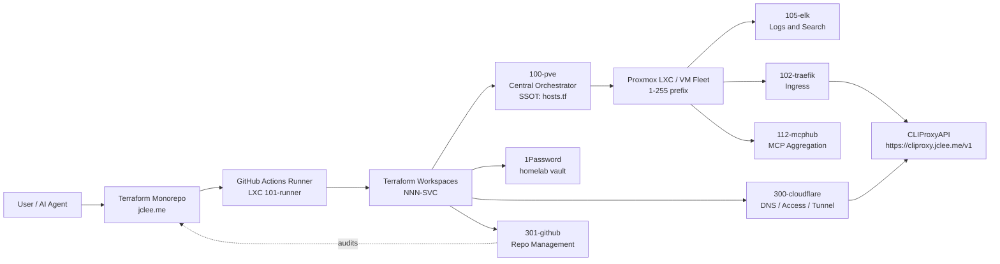

# Terraform Homelab Infrastructure / Terraform Homelab 인프라

> **Bilingual README** — English follows Korean.
> **이중 언어 README** — 한국어 다음에 영어 버전이 이어집니다.

## Badges / 배지

| Category | Detail |
| --- | --- |
| Infrastructure as Code | Terraform `1.10.5` (`>= 1.7, < 2.0`) |
| Workspace Convention | Flat `NNN-SVC` (e.g. `100-pve`, `105-elk`, `300-cloudflare`) |
| CI/CD | 16 GitHub Actions workflows |
| Secret Backend | 1Password `homelab` vault |
| Security | CodeQL, Gitleaks, Dependency Review, OpenSSF Scorecard |
| Review Automation | [qodo-ai/pr-agent](https://github.com/qodo-ai/pr-agent), Dependabot auto-merge |
| Documentation | README auto-gen, release notes, docs sync |
| Public Endpoint | `https://cliproxy.jclee.me/v1` |
| License | MIT |

---

# 한국어

## 1. 개요

이 저장소는 `jclee.me` 호멜랩(homelab)과 관련 외부 서비스를 코드로 관리하기 위한 **Infrastructure-as-Code 모노레포**입니다. Proxmox LXC/VM 플릿, 네트워크, 모니터링, 외부 서비스를 Terraform 워크스페이스로 프로비저닝하며, 1Password 시크릿 주입과 GitHub Actions 기반 CI/CD를 사용합니다.

- **도메인**: `jclee.me`
- **서브넷**: `<homelab-host>/24` (내부 LXC/VM)
- **Terraform 버전**: `1.10.5` (`>= 1.7, < 2.0`)
- **공개 엔드포인트**: `https://cliproxy.jclee.me/v1`
- **워크스페이스 규칙**: 평탄(flat) `NNN-SVC` 컨벤션
  - `1-255` = 내부 인프라 (Proxmox LXC/VM, 예: `<homelab-host>`)
  - `300+` = 외부 서비스 (Cloudflare, GitHub, Slack 등)
  - `400+` = 퍼블릭 클라우드 (GCP 등)
- **핵심 오케스트레이터**: `100-pve` — 모든 LXC/VM 라이프사이클의 단일 진실 공급원(SSOT)

이 README는 자동화 인벤토리, 저장소 구조, 로컬 개발 절차, 명령어 레퍼런스, 기여 가이드를 한 곳에서 확인할 수 있도록 작성되었습니다.

## 2. 주요 기능

### 2.1 Infrastructure as Code
- Terraform 기반 **서비스별 워크스페이스** (예: `105-elk/terraform/`, `112-mcphub/`, `300-cloudflare/`)
- 평탄한 `NNN-SVC` 디렉터리 컨벤션과 `Makefile`의 단축 별칭(`pve`, `elk`, `mcphub`, `cloudflare` 등)
- `templates/*.tftpl` → 렌더링된 설정 파일 파이프라인 (`config-renderer` 모듈)
- 로컬 상태 백엔드, `.tfstate`를 git에 커밋, GitHub Actions 동시성(concurrency) 그룹으로 `apply` 직렬화
- `terraform test`로 유닛/통합/워크스페이스 테스트 수행

### 2.2 GitHub Automation
- **16개의 GitHub Actions 워크플로우**로 PR 검사, 리뷰, 보안 분석, 자동 병합, 문서 동기화, 릴리스 발행, CI 자동 복구까지 전 영역 자동화
- [qodo-ai/pr-agent](https://github.com/qodo-ai/pr-agent) 기반 자동 PR 리뷰 (`10_pr-review.yml`)
- Dependabot PR 자동 병합 (`12_dependabot-auto-merge.yml`) 및 일반 PR 자동 병합 (`13_pr-auto-merge.yml`)
- Gitleaks, CodeQL, Dependency Review, OpenSSF Scorecard를 통한 공급망 보안
- README 자동 생성, 릴리스 노트/릴리스 발행, 다운스트림 헬스 체크

### 2.3 Security and Compliance
- 1Password `homelab` 볼트의 시크릿 주입 (`modules/shared/onepassword-secrets`)
- `onepassword.tf` 워크스페이스별 시크릿 매핑 (예: `300-cloudflare/onepassword.tf`)
- 시크릿은 절대 평문 커밋 금지 — pre-commit 훅으로 Gitleaks 차단
- 워크플로우 권한 최소 권한 원칙(`permissions:` 블록 명시)

### 2.4 Documentation
- 워크스페이스별 `AGENTS.md` 및 `README.md`로 컨텍스트 유지
- 루트 문서: `ARCHITECTURE.md`, `CODE_STYLE.md`, `CONTRIBUTING.md`, `DEPENDENCY_MAP.md`, `OWNERS`, `OWNERS_ALIASES`
- 릴리스 발행 시 자동 changelog (`24_release-notes.yml`, `25_release-publish.yml`)

## 3. 아키텍처


```mermaid
flowchart LR
    Agent["User / AI Agent"]
    Repo["Terraform Monorepo<br/>jclee.me"]
    CI["GitHub Actions Runner<br/>LXC 101-runner"]
    TF["Terraform Workspaces<br/>NNN-SVC"]
    PVE["100-pve<br/>Central Orchestrator<br/>SSOT: hosts.tf"]
    Fleet["Proxmox LXC / VM Fleet<br/>1-255 prefix"]
    OP["1Password<br/>homelab vault"]
    CF["300-cloudflare<br/>DNS / Access / Tunnel"]
    Traefik["102-traefik<br/>Ingress"]
    ELK["105-elk<br/>Logs and Search"]
    MCP["112-mcphub<br/>MCP Aggregation"]
    Proxy["CLIProxyAPI<br/>https://cliproxy.jclee.me/v1"]
    Bots["301-github<br/>Repo Management"]

    Agent --> Repo
    Repo --> CI
    CI --> TF
    TF --> PVE
    PVE --> Fleet
    TF --> OP
    TF --> CF
    TF --> Bots
    Fleet --> ELK
    Fleet --> Traefik
    Fleet --> MCP
    CF --> Proxy
    Traefik --> Proxy
    Bots -.audits.-> Repo
```

**핵심 흐름 요약**

1. `100-pve/envs/prod/hosts.tf`가 모든 LXC/VM의 IP, VMID, 역할, 포트를 정의 (SSOT).
2. `100-pve`의 모듈 그래프가 `onepassword_secrets`로 시크릿을 주입받고, `config-renderer`로 `templates/*.tftpl`을 렌더링.
3. 렌더링된 설정은 SSH를 통해 각 LXC/VM의 `/opt/{service}/`로 배포.
4. 외부 서비스(`300-cloudflare`, `301-github`, `320-slack`, `400-gcp`)는 Proxmox 의존성 없이 독립적으로 apply 가능.

## 4. 저장소 구조

루트 디렉터리 기준 실제 트리(일부 워크스페이스는 축약).

```text
.
├── AGENTS.md                     # AI 에이전트 지식 베이스
├── ARCHITECTURE.md               # 전체 아키텍처 레퍼런스
├── CODE_STYLE.md                 # 명명/파일/변수/템플릿 규약
├── CONTRIBUTING.md               # 기여 절차
├── DEPENDENCY_MAP.md             # 모듈 의존성 그래프 + 템플릿 인벤토리
├── LICENSE                       # MIT
├── Makefile                      # 워크스페이스 별칭 + Terraform 타깃
├── OWNERS                        # 코드 오너십
├── OWNERS_ALIASES                # 팀 별칭
├── README.md                     # 본 문서
├── build.env                     # 빌드 환경 변수
├── 103-coredns/                  # Tier 1: CoreDNS (template-only)
│   ├── AGENTS.md
│   ├── README.md
│   └── templates/                # Corefile, docker-compose, filebeat
├── 105-elk/                      # Tier 1: ELK 스택
│   ├── AGENTS.md
│   ├── docker-compose.yml
│   ├── ilm-policy.json
│   ├── config/                   # 렌더링된 설정 (read-only)
│   ├── scripts/                  # Go 운영 도구 (setup-ilm, setup-watcher, remove-promtail)
│   ├── templates/                # tftpl 원본
│   └── terraform/                # Terraform 워크스페이스 (checks/main/outputs/providers/variables/versions/onepassword/validation)
├── 112-mcphub/                   # Tier 1: MCP Hub 집계
│   ├── AGENTS.md
│   ├── Dockerfile.{dev-browser,playwright,proxmox}
│   ├── mcp_servers.json
│   ├── validate_mcps.py
│   ├── patches/                  # n8n 라이선스 패치
│   ├── op-mcp-server/            # Node.js 1Password MCP 서버
│   ├── config/                   # 진입점 패치, SDK 스키마 패치, filebeat
│   └── templates/                # docker-compose, filebeat, mcp_settings, 1Password Connect
└── 300-cloudflare/               # 외부: DNS / Access / Tunnel / Logpush
    ├── AGENTS.md
    ├── README.md
    ├── access.tf
    ├── checks.tf
    ├── dns.tf
    ├── identity-provider.tf
    ├── locals.tf
    ├── logpush.tf
    ├── main.tf
    ├── onepassword.tf
    └── outputs-{homelab,jclee,synology}.tf
```

> 참고: 루트에 보이는 디렉터리는 이 스냅샷 시점의 실제 디렉터리입니다. 모노레포에는 추가로 `100-pve`, `102-traefik`, `301-github`, `400-gcp` 등 다수의 워크스페이스가 존재하며, `Makefile`의 `ALIAS_*` 맵으로 단축 별칭을 제공합니다.

## 5. Automation Inventory / 자동화 인벤토리

### 5.1 GitHub Actions Workflows (16)

| # | 파일 | 분류 | 역할 |
| - | ---- | ---- | ---- |
| 01 | `01_branch-to-pr.yml` | Branch | 브랜치 → PR 자동화 |
| 02 | `02_issue-to-branch.yml` | Issue | 이슈 → 브랜치 자동 생성 |
| 03 | `10_pr-review.yml` | PR Review | [qodo-ai/pr-agent](https://github.com/qodo-ai/pr-agent) 자동 리뷰 |
| 04 | `11_security-pr-review.yml` | PR Review | 보안 관점 PR 리뷰 |
| 05 | `12_dependabot-auto-merge.yml` | Auto-merge | Dependabot PR 자동 병합 |
| 06 | `13_pr-auto-merge.yml` | Auto-merge | 일반 PR 자동 병합 (조건 충족 시) |
| 07 | `14_bot-auto-fix.yml` | Auto-fix | 봇 제안 자동 수정 적용 |
| 08 | `15_merged-pr-cleanup.yml` | Cleanup | 병합된 PR 브랜치 정리 |
| 09 | `19_issue-backfill.yml` | Issue | 누락 이슈 백필 |
| 10 | `24_release-notes.yml` | Release | 릴리스 노트 자동 생성 |
| 11 | `25_release-publish.yml` | Release | GitHub Release 발행 |
| 12 | `29_downstream-health-check.yml` | Health | 다운스트림 헬스 체크 |
| 13 | `37_ci-failure-issues.yml` | CI Auto-heal | CI 실패 → 이슈 자동 생성 |
| 14 | `60_ci-auto-heal.yml` | CI Auto-heal | CI 자동 복구 |
| 15 | `91_issue-classification.yml` | Issue | 이슈 자동 분류/라벨링 |
| 16 | `ci.yml` | CI | 메인 CI 파이프라인 |

### 5.2 Go Automation Tools (0)

이 저장소에는 루트의 Go 운영 도구가 없습니다. 도메인별 도구는 각 워크스페이스의 `scripts/`에 위치합니다(예: `105-elk/scripts/setup-ilm.go`, `105-elk/scripts/setup-watcher.go`, `105-elk/scripts/remove-promtail.go` — 모두 stdlib 전용).

## 6. Quick Start / 빠른 시작

### 6.1 사전 요구 사항
- Terraform `>= 1.7, < 2.0` (검증된 버전: `1.10.5`)
- GNU Make
- GitHub CLI (`gh`) — PR/이슈 자동화 검증용
- 1Password CLI (`op`) — 로컬에서 시크릿을 다룰 경우
- Proxmox API 토큰 + 1Password `homelab` 볼트 접근권

### 6.2 클론 & 초기화

```bash
git clone <repo-url> terraform
cd terraform
make init SVC=pve          # 100-pve 초기화
make plan SVC=pve          # 변경 사항 미리보기
```

수동 `apply`는 **비활성화**되어 있습니다. 모든 변경은 `master` 브랜치 푸시 후 CI/CD를 통해 적용됩니다.

## 7. 로컬 개발 절차

1. **워크스페이스 선택**: `SVC` 환경변수로 디렉터리 지정
   - 전체 경로: `SVC=105-elk/terraform`
   - 단축 별칭: `SVC=elk`, `SVC=cloudflare`, `SVC=mcphub`
2. **포맷/린트**: `make fmt SVC=<svc>`, `make lint SVC=<svc>`
3. **검증**: `make validate SVC=<svc>`
4. **계획**: `make plan SVC=<svc>`
5. **테스트**: `make test-unit SVC=<svc>` / `make test-integration SVC=<svc>`
6. **Pre-commit**: `make pre-commit-install` 후 `make pre-commit-run`
7. **PR 생성**: `git push` → GitHub에서 PR 오픈 → `10_pr-review.yml`이 자동 리뷰
8. **자동 병합**: 조건 충족 시 `13_pr-auto-merge.yml`이 자동 병합, 이후 `15_merged-pr-cleanup.yml`이 브랜치 정리

## 8. 명령어 레퍼런스 (Makefile)

| 타깃 | 설명 |
| ---- | ---- |
| `make plan SVC=<svc>` | Terraform plan (`-out=tfplan`) |
| `make apply SVC=<svc>` | **비활성화** — CI/CD로만 적용 |
| `make init SVC=<svc>` | Terraform 초기화 |
| `make verify SVC=<svc>` | `terraform verify` |
| `make validate SVC=<svc>` | `terraform validate` |
| `make fmt SVC=<svc>` | `terraform fmt -recursive` |
| `make lint SVC=<svc>` | `tflint` + 사용자 정의 검사 |
| `make lint-go` | Go 코드 린트 (해당 도구 있을 때) |
| `make backup` | `.tfstate` 백업 |
| `make drift-check SVC=<svc>` | 실제 인프라와 상태 비교 |
| `make test` | 전체 테스트 실행 |
| `make test-unit` | `terraform test` 유닛 테스트 |
| `make test-integration` | 통합 테스트 |
| `make test-workspace` | 워크스페이스 계약 테스트 |
| `make docs` | 문서 생성/동기화 |
| `make pre-commit-install` | pre-commit 훅 설치 |
| `make pre-commit-run` | pre-commit 훅 수동 실행 |
| `make setup` | 로컬 개발 환경 1회 셋업 |
| `make help` | 사용 가능한 타깃 목록 |

## 9. 기여 가이드

1. 이슈를 먼저 생성하거나 기존 이슈를 할당받습니다 (`91_issue-classification.yml`이 자동 라벨링).
2. `02_issue-to-branch.yml`이 추천하는 브랜치 이름 규칙을 따릅니다.
3. `CODE_STYLE.md`의 명명/변수/템플릿 규약을 준수합니다.
4. `DEPENDENCY_MAP.md`를 갱신하여 모듈 의존성 변경을 반영합니다.
5. `make fmt validate lint test-unit`을 모두 통과시킵니다.
6. PR을 열고 `10_pr-review.yml`, `11_security-pr-review.yml`의 자동 리뷰를 확인합니다.
7. 봇 제안을 수용할지 결정하고, `14_bot-auto-fix.yml`이 안전 패치를 자동 적용할 수도 있습니다.
8. 모든 체크가 통과하면 `13_pr-auto-merge.yml`이 자동 병합합니다.

자세한 절차는 `CONTRIBUTING.md`를 참고하세요.

## 10. 라이선스 & 참조

- **License**: MIT — `LICENSE` 파일 참고
- **PR Review Tool**: [qodo-ai/pr-agent](https://github.com/qodo-ai/pr-agent)
- **Public Endpoint**: `https://cliproxy.jclee.me/v1`
- **Bot Host**: `https://bot.jclee.me`
- **상위 문서**: `ARCHITECTURE.md`, `DEPENDENCY_MAP.md`, `CODE_STYLE.md`, `CONTRIBUTING.md`

---

# English

## 1. Overview

This repository is an **Infrastructure-as-Code monorepo** that provisions the `jclee.me` homelab and related external services. It manages a Proxmox LXC/VM fleet, networking, monitoring, and external services through Terraform workspaces, with secrets injected from 1Password and full CI/CD via GitHub Actions.

- **Domain**: `jclee.me`
- **Subnet**: `<homelab-host>/24` (internal LXC/VM)
- **Terraform**: `1.10.5` (`>= 1.7, < 2.0`)
- **Public Endpoint**: `https://cliproxy.jclee.me/v1`
- **Workspace Convention**: flat `NNN-SVC`
  - `1-255` = internal infrastructure (Proxmox LXC/VM, e.g. `<homelab-host>`)
  - `300+` = external services (Cloudflare, GitHub, Slack, etc.)
  - `400+` = public cloud (GCP, etc.)
- **Central Orchestrator**: `100-pve` — the single source of truth (SSOT) for every LXC/VM lifecycle.

## 2. Features

### 2.1 Infrastructure as Code
- Per-service Terraform workspaces (e.g. `105-elk/terraform/`, `112-mcphub/`, `300-cloudflare/`).
- Flat `NNN-SVC` directory convention with short aliases in the `Makefile` (`pve`, `elk`, `mcphub`, `cloudflare`, etc.).
- `templates/*.tftpl` → rendered config pipeline powered by the `config-renderer` module.
- Local state backend, `.tfstate` committed to git, GitHub Actions concurrency groups serialize `apply`.
- Unit / integration / workspace tests via `terraform test`.

### 2.2 GitHub Automation
- **16 GitHub Actions workflows** covering PR inspection, review, security analysis, auto-merge, documentation sync, release publishing, and CI auto-heal.
- Automated PR review powered by [qodo-ai/pr-agent](https://github.com/qodo-ai/pr-agent) (`10_pr-review.yml`).
- Dependabot PR auto-merge (`12_dependabot-auto-merge.yml`) and general PR auto-merge (`13_pr-auto-merge.yml`).
- Supply-chain security: Gitleaks, CodeQL, Dependency Review, OpenSSF Scorecard.
- Auto-generated READMEs, release notes, releases, and downstream health checks.

### 2.3 Security and Compliance
- 1Password `homelab` vault secrets injected through `modules/shared/onepassword-secrets`.
- Workspace-level `onepassword.tf` mapping (e.g. `300-cloudflare/onepassword.tf`).
- No plaintext secrets in git — Gitleaks pre-commit hook blocks leaks.
- Least-privilege `permissions:` blocks in every workflow.

### 2.4 Documentation
- Per-workspace `AGENTS.md` and `README.md` keep context local.
- Root docs: `ARCHITECTURE.md`, `CODE_STYLE.md`, `CONTRIBUTING.md`, `DEPENDENCY_MAP.md`, `OWNERS`, `OWNERS_ALIASES`.
- Auto-generated changelog on release (`24_release-notes.yml`, `25_release-publish.yml`).

## 3. Architecture


```mermaid
flowchart LR
    Agent["User / AI Agent"]
    Repo["Terraform Monorepo<br/>jclee.me"]
    CI["GitHub Actions Runner<br/>LXC 101-runner"]
    TF["Terraform Workspaces<br/>NNN-SVC"]
    PVE["100-pve<br/>Central Orchestrator<br/>SSOT: hosts.tf"]
    Fleet["Proxmox LXC / VM Fleet<br/>1-255 prefix"]
    OP["1Password<br/>homelab vault"]
    CF["300-cloudflare<br/>DNS / Access / Tunnel"]
    Traefik["102-traefik<br/>Ingress"]
    ELK["105-elk<br/>Logs and Search"]
    MCP["112-mcphub<br/>MCP Aggregation"]
    Proxy["CLIProxyAPI<br/>https://cliproxy.jclee.me/v1"]
    Bots["301-github<br/>Repo Management"]

    Agent --> Repo
    Repo --> CI
    CI --> TF
    TF --> PVE
    PVE --> Fleet
    TF --> OP
    TF --> CF
    TF --> Bots
    Fleet --> ELK
    Fleet --> Traefik
    Fleet --> MCP
    CF --> Proxy
    Traefik --> Proxy
    Bots -.audits.-> Repo
```

**Key flows**

1. `100-pve/envs/prod/hosts.tf` defines every LXC/VM IP, VMID, role, and port — the SSOT.
2. The `100-pve` module graph pulls secrets via `onepassword_secrets` and renders `templates/*.tftpl` through `config-renderer`.
3. Rendered configs are SSH-deployed to `/opt/{service}/` on each LXC/VM.
4. External workspaces (`300-cloudflare`, `301-github`, `320-slack`, `400-gcp`) apply independently — they have no Proxmox dependency.

## 4. Repository Structure

Actual top-level layout at the snapshot (some workspaces abbreviated).

```text
.
├── AGENTS.md                     # AI agent knowledge base
├── ARCHITECTURE.md               # Full architecture reference
├── CODE_STYLE.md                 # Naming / file / variable / template conventions
├── CONTRIBUTING.md               # Contribution procedure
├── DEPENDENCY_MAP.md             # Module dependency graph + template inventory
├── LICENSE                       # MIT
├── Makefile                      # Workspace aliases + Terraform targets
├── OWNERS                        # Code ownership
├── OWNERS_ALIASES                # Team aliases
├── README.md                     # This document
├── build.env                     # Build environment variables
├── 103-coredns/                  # Tier 1: CoreDNS (template-only)
│   ├── AGENTS.md
│   ├── README.md
│   └── templates/                # Corefile, docker-compose, filebeat
├── 105-elk/                      # Tier 1: ELK stack
│   ├── AGENTS.md
│   ├── docker-compose.yml
│   ├── ilm-policy.json
│   ├── config/                   # Rendered configs (read-only)
│   ├── scripts/                  # Go operational tooling (setup-ilm, setup-watcher, remove-promtail)
│   ├── templates/                # tftpl sources
│   └── terraform/                # Terraform workspace (checks/main/outputs/providers/variables/versions/onepassword/validation)
├── 112-mcphub/                   # Tier 1: MCP Hub aggregation
│   ├── AGENTS.md
│   ├── Dockerfile.{dev-browser,playwright,proxmox}
│   ├── mcp_servers.json
│   ├── validate_mcps.py
│   ├── patches/                  # n8n license patches
│   ├── op-mcp-server/            # Node.js 1Password MCP server
│   ├── config/                   # Entrypoint patch, SDK schema patch, filebeat
│   └── templates/                # docker-compose, filebeat, mcp_settings, 1Password Connect
└── 300-cloudflare/               # External: DNS / Access / Tunnel / Logpush
    ├── AGENTS.md
    ├── README.md
    ├── access.tf
    ├── checks.tf
    ├── dns.tf
    ├── identity-provider.tf
    ├── locals.tf
    ├── logpush.tf
    ├── main.tf
    ├── onepassword.tf
    └── outputs-{homelab,jclee,synology}.tf
```

> Note: only the directories visible at the snapshot are shown above. The monorepo contains additional workspaces such as `100-pve`, `102-traefik`, `301-github`, and `400-gcp`, all reachable via the `ALIAS_*` map in the `Makefile`.

## 5. Automation Inventory

### 5.1 GitHub Actions Workflows (16)

| # | File | Category | Purpose |
| - | ---- | -------- | ------- |
| 01 | `01_branch-to-pr.yml` | Branch | Branch → PR automation |
| 02 | `02_issue-to-branch.yml` | Issue | Issue → branch auto-creation |
| 03 | `10_pr-review.yml` | PR Review | Automated review via [qodo-ai/pr-agent](https://github.com/qodo-ai/pr-agent) |
| 04 | `11_security-pr-review.yml` | PR Review | Security-focused PR review |
| 05 | `12_dependabot-auto-merge.yml` | Auto-merge | Dependabot PR auto-merge |
| 06 | `13_pr-auto-merge.yml` | Auto-merge | General PR auto-merge (when conditions match) |
| 07 | `14_bot-auto-fix.yml` | Auto-fix | Apply safe bot suggestions |
| 08 | `15_merged-pr-cleanup.yml` | Cleanup | Clean up merged PR branches |
| 09 | `19_issue-backfill.yml` | Issue | Backfill missing issues |
| 10 | `24_release-notes.yml` | Release | Auto-generate release notes |
| 11 | `25_release-publish.yml` | Release | Publish GitHub Release |
| 12 | `29_downstream-health-check.yml` | Health | Downstream service health check |
| 13 | `37_ci-failure-issues.yml` | CI Auto-heal | CI failure → issue creation |
| 14 | `60_ci-auto-heal.yml` | CI Auto-heal | CI auto-recovery |
| 15 | `91_issue-classification.yml` | Issue | Auto-classify and label issues |
| 16 | `ci.yml` | CI | Main CI pipeline |

### 5.2 Go Automation Tools (0)

There are no root-level Go automation tools. Domain-specific helpers live under each workspace's `scripts/` directory (e.g. `105-elk/scripts/setup-ilm.go`, `105-elk/scripts/setup-watcher.go`, `105-elk/scripts/remove-promtail.go` — all stdlib-only).

## 6. Quick Start

### 6.1 Prerequisites
- Terraform `>= 1.7, < 2.0` (validated on `1.10.5`)
- GNU Make
- GitHub CLI (`gh`) — for verifying PR/issue automation
- 1Password CLI (`op`) — when handling secrets locally
- Proxmox API token and access to the `homelab` vault in 1Password

### 6.2 Clone & Initialize

```bash
git clone <repo-url> terraform
cd terraform
make init SVC=pve          # Initialize 100-pve
make plan SVC=pve          # Preview changes
```

Manual `apply` is **disabled**. All changes flow through CI/CD after pushing to `master`.

## 7. Local Development Workflow

1. **Pick a workspace** via the `SVC` variable
   - Full path: `SVC=105-elk/terraform`
   - Short alias: `SVC=elk`, `SVC=cloudflare`, `SVC=mcphub`
2. **Format & lint**: `make fmt SVC=<svc>`, `make lint SVC=<svc>`
3. **Validate**: `make validate SVC=<svc>`
4. **Plan**: `make plan SVC=<svc>`
5. **Test**: `make test-unit SVC=<svc>` / `make test-integration SVC=<svc>`
6. **Pre-commit**: `make pre-commit-install`, then `make pre-commit-run`
7. **Open PR**: `git push` → open a PR on GitHub → `10_pr-review.yml` auto-reviews
8. **Auto-merge**: if checks pass, `13_pr-auto-merge.yml` merges, then `15_merged-pr-cleanup.yml` tidies up

## 8. Command Reference (Makefile)

| Target | Description |
| ------ | ----------- |
| `make plan SVC=<svc>` | Terraform plan (`-out=tfplan`) |
| `make apply SVC=<svc>` | **Disabled** — apply via CI/CD only |
| `make init SVC=<svc>` | Terraform init |
| `make verify SVC=<svc>` | `terraform verify` |
| `make validate SVC=<svc>` | `terraform validate` |
| `make fmt SVC=<svc>` | `terraform fmt -recursive` |
| `make lint SVC=<svc>` | `tflint` + custom checks |
| `make lint-go` | Lint Go code (when present) |
| `make backup` | Backup `.tfstate` |
| `make drift-check SVC=<svc>` | Compare live infra with state |
| `make test` | Run all tests |
| `make test-unit` | `terraform test` unit tests |
| `make test-integration` | Integration tests |
| `make test-workspace` | Workspace contract tests |
| `make docs` | Generate / sync docs |
| `make pre-commit-install` | Install pre-commit hooks |
| `make pre-commit-run` | Run pre-commit hooks manually |
| `make setup` | One-time local dev environment setup |
| `make help` | List available targets |

## 9. Contributing

1. Open or claim an issue first — `91_issue-classification.yml` auto-labels it.
2. Follow the branch naming convention recommended by `02_issue-to-branch.yml`.
3. Follow the conventions in `CODE_STYLE.md` (naming, variables, templates).
4. Update `DEPENDENCY_MAP.md` whenever module dependencies change.
5. Pass `make fmt validate lint test-unit` locally.
6. Open the PR — `10_pr-review.yml` and `11_security-pr-review.yml` will review.
7. `14_bot-auto-fix.yml` may apply safe patches automatically.
8. When all checks pass, `13_pr-auto-merge.yml` merges the PR.

See `CONTRIBUTING.md` for the full procedure.

## 10. License & References

- **License**: MIT — see `LICENSE`
- **PR Review Tool**: [qodo-ai/pr-agent](https://github.com/qodo-ai/pr-agent)
- **Public Endpoint**: `https://cliproxy.jclee.me/v1`
- **Bot Host**: `https://bot.jclee.me`
- **Companion Docs**: `ARCHITECTURE.md`, `DEPENDENCY_MAP.md`, `CODE_STYLE.md`, `CONTRIBUTING.md`