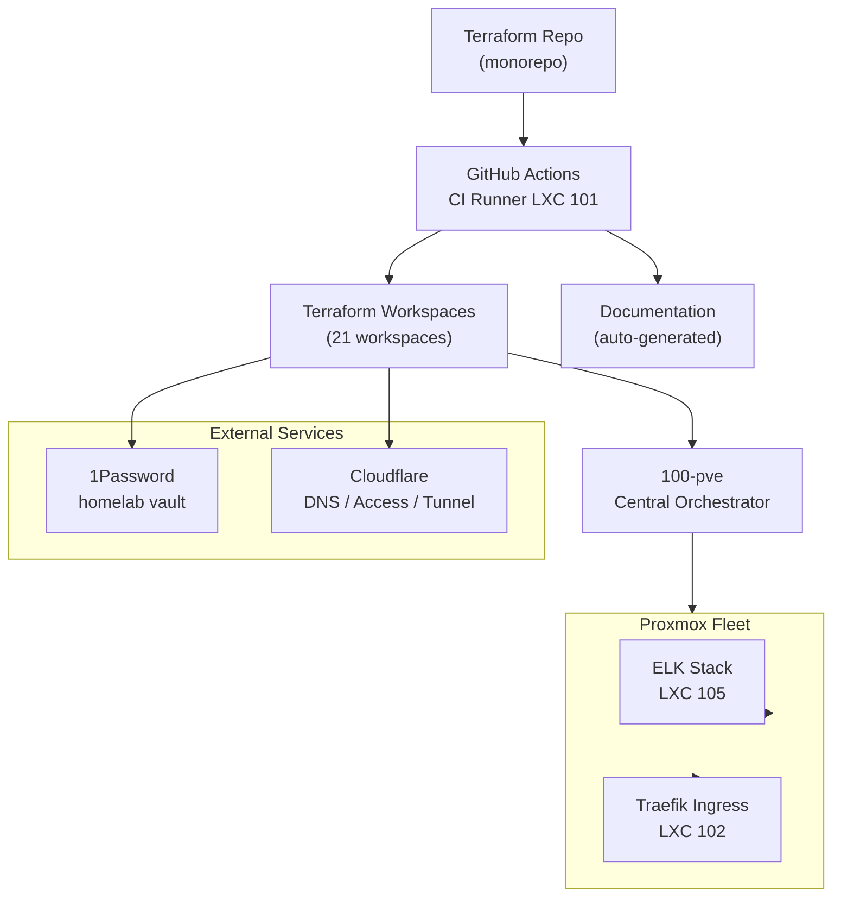

# Terraform Homelab Infrastructure / Terraform Homelab 인프라

[](https://www.terraform.io)
[](LICENSE)
[](.github/workflows)
[](https://scorecard.dev)
[](https://www.proxmox.com/)
[](Makefile)

> English version follows Korean content / 한국어 다음에 영어 버전이 이어집니다.

---

## Overview / 개요

Infrastructure-as-code monorepo for `jclee.me`. Provisions a Proxmox LXC/VM fleet, networking, monitoring, and external services via **21 Terraform workspaces** with 1Password secret injection and GitHub Actions CI/CD.

`jclee.me`를 위한 Infrastructure-as-Code 모노레포입니다. 21개의 Terraform 워크스페이스를 통해 Proxmox LXC/VM 플릿, 네트워킹, 모니터링 및 외부 서비스를 프로비저닝하며, 1Password 시크릿 주입과 GitHub Actions CI/CD로 운영됩니다.

---

## Features / 주요 기능

### Infrastructure Provisioning / 인프라 프로비저닝

- **21 Terraform workspaces** across 4 tiers (Tier 0 core, Tier 1 infra, Tier 2 VMs, Tier 3 external/cloud)
- **Proxmox LXC/VM fleet** managed as code (22 LXCs, 4 VMs across `<homelab-host>/24` subnet)
- **Single Source of Truth (SSoT)** in `100-pve/envs/prod/hosts.tf` for all host definitions

### Configuration Management / 구성 관리

- **Template-driven rendering** via `modules/proxmox/config-renderer/` — config files are NEVER hand-edited
- **Terraform modules** for reusable LXC (`modules/proxmox/lxc`), VM (`modules/proxmox/vm`), and config templates
- **Cloud-init** support for both LXC and VM provisioning

### Secret Management / 시크릿 관리

- **1Password integration** via `modules/shared/onepassword-secrets/` — 12 vault items, 48 keys
- **Zero hardcoded secrets** — all sensitive values injected at apply time

### CI/CD Automation / CI/CD 자동화

- **33 GitHub Actions workflows** covering PR checks, auto-merge, issue management, releases, and health monitoring
- **Automated code quality** — actionlint, gitleaks, CodeQL, dependency review, Scorecard
- **Auto-healing** — 60_ci-auto-heal.yml recovers from CI failures

### Observability / 모니터링

- **ELK stack** (Elasticsearch, Logstash, Kibana) for log aggregation and search
- **Filebeat** sidecar for service log shipping
- **Traefik** ingress with automatic Let’s Encrypt certificates

---

## Architecture / 아키텍처


```mermaid
flowchart TB
    Repo["Terraform Repo\n(monorepo)"] --> CI["GitHub Actions\nCI Runner LXC 101"]
    CI --> TF["Terraform Workspaces\n(21 workspaces)"]
    TF --> PVE["100-pve\nCentral Orchestrator"]
    PVE --> Fleet["Proxmox LXC/VM Fleet\n22 LXCs + 4 VMs"]
    Fleet --> ELK["ELK Stack\nLXC 105"]
    Fleet --> Traefik["Traefik Ingress\nLXC 102"]
    TF --> OP["1Password\nhomelab vault"]
    TF --> CF["Cloudflare\nDNS / Access / Tunnel"]
    CI --> Docs["Documentation\n(auto-generated)"]

    subgraph External["External Services"]
        CF
        OP
    end

    subgraph Fleet["Proxmox Fleet"]
        ELK
        Traefik
    end
```

### Workspace Tiers / 워크스페이스 계층

| Tier | Workspaces | Description |
|------|------------|-------------|
| 0 (core) | `100-pve` | Central orchestrator — provisions all LXC/VM lifecycle |
| 1 (infra) | `101-runner`, `102-traefik`, `105-elk`, `108-archon` | Infrastructure services — consume `remote_state` from `100-pve` |
| 2 (apps) | `110-n8n`, `112-mcphub`, `200-oc`, `215-synology`, `220-youtube` | VM-based applications |
| 3 (external) | `300-cloudflare`, `301-github`, `310-safetywallet`, `320-slack` | Cloud/external integrations |
| 4 (cloud) | `400-gcp` | Google Cloud Platform resources |

### Config Pipeline / 구성 파이프라인

```
hosts.tf (SSoT) → module.hosts → onepassword_secrets + config_renderer
  → templatefile(.tftpl) → configs/ → SSH deploy to /opt/{service}/
```

---

## Automation Inventory / 자동화 인벤토리

### GitHub Actions Workflows (33 total)

#### PR & Merge Automation

| Workflow File | Purpose |
|--------------|---------|
| `01_branch-to-pr.yml` | Create PR branch from feature branch |
| `02_issue-to-branch.yml` | Auto-create branch from issue |
| `03_pr-checks.yml` | Run all PR checks (lint, test, validate) |
| `10_pr-review.yml` | AI-powered PR review (qodo-ai/pr-agent) |
| `13_pr-auto-merge.yml` | Auto-merge PRs on green |
| `14_bot-auto-fix.yml` | Auto-fix lint/format issues |
| `15_merged-pr-cleanup.yml` | Cleanup after PR merge |

#### Code Quality & Security

| Workflow File | Purpose |
|--------------|---------|
| `04_actionlint.yml` | GitHub Actions workflow linting |
| `05_gitleaks.yml` | Secret scanning |
| `06_codeql.yml` | CodeQL static analysis |
| `07_dependency-review.yml` | Dependency vulnerability review |
| `08_scorecard.yml` | OpenSSF Scorecard assessment |
| `44_reusable-gitleaks.yml` | Reusable workflow for gitleaks |
| `45_reusable-pr-checks.yml` | Reusable workflow for PR checks |

#### Dependency Management

| Workflow File | Purpose |
|--------------|---------|
| `12_dependabot-auto-merge.yml` | Auto-merge Dependabot PRs |
| `09_semantic-pr.yml` | Enforce semantic PR titles |

#### Issue Management

| Workflow File | Purpose |
|--------------|---------|
| `18_issue-management.yml` | Issue lifecycle automation |
| `19_issue-backfill.yml` | Backfill issue metadata |
| `43_reusable-issue-management.yml` | Reusable issue management workflow |
| `91_issue-classification.yml` | Classify issues automatically |

#### Release & Documentation

| Workflow File | Purpose |
|--------------|---------|
| `20_readme-gen.yml` | Auto-generate README |
| `21_docs-sync.yml` | Sync documentation |
| `24_release-notes.yml` | Generate release notes |
| `25_release-publish.yml` | Publish releases |
| `42_reusable-docs-sync.yml` | Reusable docs sync workflow |

#### Health & Monitoring

| Workflow File | Purpose |
|--------------|---------|
| `29_downstream-health-check.yml` | Check downstream service health |
| `37_ci-failure-issues.yml` | Create issue on CI failure |
| `60_ci-auto-heal.yml` | Auto-heal CI failures |

#### Other

| Workflow File | Purpose |
|--------------|---------|
| `auto-merge.yml` | General auto-merge |
| `ci.yml` | Main CI pipeline |
| `labeler.yml` | Auto-label issues/PRs |
| `welcome.yml` | Welcome new contributors |
| `security/11_pr-review.yml` | Security-focused PR review |

### Terraform Modules

| Module | Purpose |
|--------|---------|
| `modules/proxmox/lxc` | LXC container provisioning |
| `modules/proxmox/vm` | VM provisioning |
| `modules/proxmox/lxc-config` | LXC configuration templates |
| `modules/proxmox/vm-config` | VM configuration templates |
| `modules/proxmox/config-renderer` | Template rendering pipeline |
| `modules/shared/onepassword-secrets` | 1Password secret injection |

---

## Quick Start / 빠른 시작

### Prerequisites

- Terraform `>= 1.7, < 2.0` (tested with 1.10.5)
- Make
- Access to Proxmox VE `<homelab-host>:8006`
- 1Password account with access to `homelab` vault

### Clone & Initialize

```bash
git clone https://github.com/jclee941/.github
cd terraform-homelab
```

### Initialize a Workspace

```bash
# Using service name (alias)
make SVC=pve init

# Using workspace number
make SVC=100-pve init

# Using full path
make SVC=100-pve init
```

### Plan Changes

```bash
make SVC=pve plan
```

---

## Local Development / 로컬 개발

### Available Workspace Aliases

| Alias | Workspace | Description |
|-------|-----------|-------------|
| `jclee` | `80-jclee` | Personal services |
| `pve` | `100-pve` | Proxmox core |
| `runner` | `101-runner` | GitHub Actions runner |
| `traefik` | `102-traefik/terraform` | Traefik ingress |
| `elk` | `105-elk/terraform` | ELK stack |
| `supabase` | `107-supabase` | Supabase |
| `archon` | `108-archon/terraform` | Archon |
| `n8n` | `110-n8n` | n8n workflow |
| `mcphub` | `112-mcphub` | MCP Hub |
| `oc` | `200-oc` | Owncast |
| `synology` | `215-synology` | Synology |
| `youtube` | `220-youtube` | YouTube upload bot |
| `cloudflare` | `300-cloudflare` | Cloudflare |
| `github` | `301-github` | GitHub management |
| `safetywallet` | `310-safetywallet` | Safety wallet |
| `slack` | `320-slack` | Slack integration |
| `gcp` | `400-gcp` | Google Cloud |

### Setup Pre-commit Hooks

```bash
make pre-commit-install
make pre-commit-run
```

### Run Tests

```bash
# Unit tests
make test-unit

# Integration tests
make test-integration

# All tests
make test

# Workspace validation
make test-workspace
```

---

## Commands Reference / 명령어 참조

| Command | Description |
|---------|-------------|
| `make SVC=<svc> init` | Initialize Terraform workspace |
| `make SVC=<svc> plan` | Create Terraform plan |
| `make SVC=<svc> apply` | **Disabled** — use CI/CD |
| `make SVC=<svc> validate` | Validate Terraform configuration |
| `make SVC=<svc> fmt` | Format Terraform files |
| `make SVC=<svc> lint` | Lint Terraform files |
| `make SVC=<svc> drift-check` | Check for configuration drift |
| `make test` | Run all tests |
| `make test-unit` | Run unit tests |
| `make test-integration` | Run integration tests |
| `make test-workspace` | Validate workspace structure |
| `make docs` | Generate documentation |
| `make pre-commit-install` | Install pre-commit hooks |
| `make pre-commit-run` | Run pre-commit hooks |
| `make setup` | Initial setup |

### Service Examples

```bash
# Plan for Proxmox
make SVC=pve plan

# Plan for ELK
make SVC=elk plan

# Plan for Cloudflare
make SVC=cloudflare plan

# Plan using full path
make SVC=100-pve plan
```

---

## Repository Structure / 저장소 구조

```
terraform-homelab/
├── 100-pve/                     # Tier 0: Proxmox central orchestrator
│   ├── terraform/                # Terraform configuration
│   ├── configs/                  # Rendered configs (auto-generated)
│   │   ├── lxc-103-coredns/     # CoreDNS LXC config
│   │   └── rendered/             # Rendered service configs
│   │       ├── traefik-elk.yml
│   │       ├── n8n/
│   │       ├── youtube/
│   │       └── mcphub/
│   └── envs/prod/hosts.tf        # SSoT: all host definitions
├── 80-jclee/                     # Personal services
├── 101-runner/                   # GitHub Actions runner LXC
├── 102-traefik/                  # Traefik ingress
├── 105-elk/                      # ELK stack
├── 107-supabase/                 # Supabase
├── 108-archon/                   # Archon
├── 110-n8n/                      # n8n workflow automation
├── 112-mcphub/                   # MCP Hub
├── 200-oc/                       # Owncast streaming
├── 215-synology/                 # Synology NAS integration
├── 220-youtube/                  # YouTube upload bot
├── 300-cloudflare/              # Cloudflare DNS/Access/Tunnel
├── 301-github/                   # GitHub repository management
├── 310-safetywallet/             # Safety wallet
├── 320-slack/                    # Slack integration
├── 400-gcp/                      # Google Cloud Platform
├── modules/
│   ├── proxmox/
│   │   ├── lxc/                  # LXC module
│   │   ├── vm/                   # VM module
│   │   ├── lxc-config/           # LXC config templates
│   │   ├── vm-config/            # VM config templates
│   │   └── config-renderer/      # Config rendering pipeline
│   └── shared/
│       └── onepassword-secrets/  # 1Password integration
├── .github/workflows/            # GitHub Actions workflows (33 files)
├── docs/                         # Architecture docs, ADRs, runbooks
├── tests/                        # Terraform test suites
├── scripts/                      # Operational scripts
├── Makefile                      # Development commands
├── ARCHITECTURE.md               # Full architecture reference
├── DEPENDENCY_MAP.md             # Module dependency graph
├── CODE_STYLE.md                 # Naming and style conventions
└── AGENTS.md                     # AI agent knowledge base
```

---

## Contribution Guide / 기여 가이드

### Workflow

1. **Create issue** — use issue templates or let `02_issue-to-branch.yml` auto-create branch
2. **Create branch** — `01_branch-to-pr.yml` or manual
3. **Make changes** — follow `CODE_STYLE.md` conventions
4. **Run checks** — `make pre-commit-run` locally
5. **Open PR** — enforce semantic PR titles (`09_semantic-pr.yml`)
6. **AI review** — `10_pr-review.yml` provides automated review
7. **Auto-merge** — `13_pr-auto-merge.yml` merges on green
8. **Cleanup** — `15_merged-pr-cleanup.yml` handles branch cleanup

### Adding a New LXC/VM

1. Add host entry to `100-pve/envs/prod/hosts.tf`
2. Add sizing to `100-pve/locals.tf`
3. Create config template in `modules/proxmox/lxc-config/templates/` or `modules/proxmox/vm-config/templates/`
4. Plan and apply via CI

### Config Pipeline

**NEVER hand-edit** files in `100-pve/configs/rendered/`. All configs are rendered from templates via `modules/proxmox/config-renderer/`.

### Secret Rotation

1. Update secret in 1Password `homelab` vault
2. Run `terraform apply` — secrets injected via `modules/shared/onepassword-secrets/`

### Documentation

- `ARCHITECTURE.md` — full architecture reference
- `DEPENDENCY_MAP.md` — module dependency graph
- `CODE_STYLE.md` — naming and style conventions
- `docs/adr/` — Architecture Decision Records (append-only)
- `docs/runbooks/` — operational runbooks

---

## Links / 링크

- **Infrastructure Dashboard**: <https://bot.jclee.me>
- **PR Agent**: <https://cliproxy.jclee.me/v1>
- **Proxmox VE**: `<homelab-host>:8006`
- **ELK Stack**: `<homelab-elk>:5601`
- **Traefik**: `<homelab-host>`

---

## License / 라이선스

MIT License — see [LICENSE](LICENSE)
