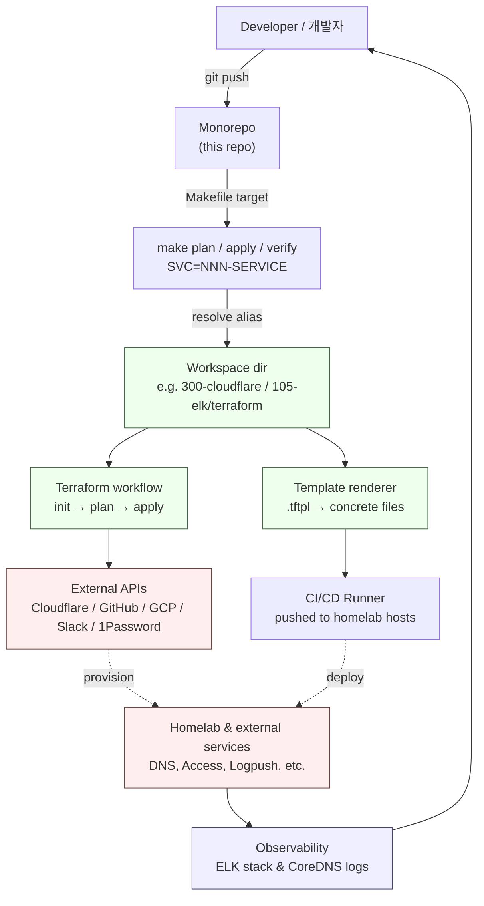

# Homelab Infrastructure Monorepo / 홈랩 인프라 모노레포

> **Manual `apply` is disabled. All changes deploy through CI/CD.**
> **수동 `apply`는 비활성화되어 있습니다. 모든 변경 사항은 CI/CD를 통해 배포됩니다.**

A monorepo of self-contained infrastructure-as-code (IaC) workspaces for a personal homelab and a small set of external (cloud) integrations. Every workspace is named with a flat `NNN-SERVICE` identifier and managed through a single top-level `Makefile`.

개인 홈랩과 소규모 외부(클라우드) 통합을 위한 독립형 인프라스트럭처-코드(IaC) 워크스페이스 모노레포입니다. 각 워크스페이스는 `NNN-SERVICE` 형식의 평탄한(flat) 식별자로 명명되며, 최상위 `Makefile` 하나로 전부 제어합니다.

---

## Table of Contents / 목차

- [Overview / 개요](#overview--개요)
- [Features / 주요 기능](#features--주요-기능)
- [Architecture / 아키텍처](#architecture--아키텍처)
- [Repository Layout / 저장소 구성](#repository-layout--저소-구성)
- [Workspaces / 워크스페이스](#workspaces--워크스페이스)
- [Numbering Convention / 번호 규칙](#numbering-convention--번호-규칙)
- [Quick Start / 빠른 시작](#quick-start--빠른-시작)
- [Configuration / 설정](#configuration--설정)
- [Commands Reference / 명령어 참조](#commands-reference--명령어-참조)
- [Local Development / 로컬 개발](#local-development--로컬-개발)
- [Testing / 테스트](#testing--테스트)
- [Contributing / 기여 방법](#contributing--기여-방법)
- [License / 라이선스](#license--라이선스)
- [Additional Documentation / 추가 문서](#additional-documentation--추가-문서)

---

## Overview / 개요

This repository hosts every piece of IaC used to run the homelab and its satellite integrations. There are **no app sources** here — only the manifests, Terraform modules, templates, and helper scripts needed to deploy them.

이 저장소는 홈랩과 위성 통합을 운영하는 데 필요한 모든 IaC를 한곳에 모아둔 곳입니다. 여기에는 **애플리케이션 소스는 없으며**, 배포에 필요한 매니페스트, Terraform 모듈, 템플릿, 보조 스크립트만 포함됩니다.

Each workspace is a self-contained deployment unit. Three flavors are supported:

| Flavor / 종류 | Purpose / 용도 | Examples / 예시 |
| --- | --- | --- |
| **Terraform** | Provision external APIs (Cloudflare, GitHub, GCP, Slack, …) and bootstrap local hosts. Some expose a nested `terraform/` directory. | `300-cloudflare/`, `105-elk/terraform/`, `112-mcphub/` |
| **Template bundle** | Render `.tftpl` files into concrete manifests that the runner pushes onto homelab hosts. | `103-coredns/templates/`, `105-elk/templates/`, `112-mcphub/templates/` |
| **Ops scripts** | Auxiliary Go/Python/MJS utilities (ILM setup, MCP validators, 1Password glue, etc.). | `105-elk/scripts/`, `112-mcphub/op-mcp-server/`, `112-mcphub/validate_mcps.py` |

---

## Features / 주요 기능

- **Single control plane** — one `Makefile` resolves any `NNN-SERVICE` workspace by name or short alias.
  **단일 제어 평면** — 하나의 `Makefile`이 `NNN-SERVICE` 워크스페이스를 이름 또는 짧은 별칭으로 해석합니다.
- **Flat `NNN-SERVICE` naming** — the numeric prefix encodes the network zone (1–255 internal, 300+ external).
  **평탄한 `NNN-SERVICE` 명명** — 숫자 접두사는 네트워크 영역을 인코딩합니다 (1–255 내부, 300+ 외부).
- **Workspace isolation** — every service has its own directory, `.tftpl` bundle, and (optionally) a `terraform/` subdir.
  **워크스페이스 격리** — 각 서비스는 자체 디렉터리, `.tftpl` 번들, 그리고 (선택적) `terraform/` 하위 디렉터리를 가집니다.
- **CI/CD-only deploys** — `make apply` is intentionally blocked; production changes flow through the pipeline.
  **CI/CD 전용 배포** — `make apply`는 의도적으로 차단되어 있으며, 프로덕션 변경은 파이프라인을 통해 흐릅니다.
- **Mixed-language helpers** — Go (Terraform pre-checks, 1Password glue), Python (MCP validation), and Node MJS (MCP server) live next to the manifests they support.
  **혼합 언어 헬퍼** — Go (Terraform 사전 점검, 1Password 글루), Python (MCP 검증), Node MJS (MCP 서버)가 지원 매니페스트 옆에 함께 있습니다.
- **Local dev container** — `112-mcphub` ships a `Dockerfile.playwright` / `Dockerfile.dev-browser` pair for browser-driven integration tests.
  **로컬 개발 컨테이너** — `112-mcphub`는 브라우저 기반 통합 테스트를 위한 `Dockerfile.playwright` / `Dockerfile.dev-browser` 페어를 제공합니다.

---

## Architecture / 아키텍처

The control flow goes: developer → git push → CI/CD pipeline → `make plan/apply SVC=<workspace>` → `Makefile` resolves alias → `terraform` (or template renderer) inside the workspace → external API or homelab host.

제어 흐름은 다음과 같습니다: 개발자 → git push → CI/CD 파이프라인 → `make plan/apply SVC=<workspace>` → `Makefile`이 별칭 해석 → 워크스페이스 내부의 `terraform` (또는 템플릿 렌더러) → 외부 API 또는 홈랩 호스트.


```mermaid
flowchart TD
    Dev["Developer / 개발자"] -->|git push| Repo["Monorepo<br/>(this repo)"]
    Repo -->|Makefile target| Make["make plan / apply / verify<br/>SVC=NNN-SERVICE"]
    Make -->|resolve alias| WS["Workspace dir<br/>e.g. 300-cloudflare / 105-elk/terraform"]

    WS --> TFL["Terraform workflow<br/>init &rarr; plan &rarr; apply"]
    WS --> TPL["Template renderer<br/>.tftpl &rarr; concrete files"]

    TFL --> Ext["External APIs<br/>Cloudflare / GitHub / GCP / Slack / 1Password"]
    TPL --> Runner["CI/CD Runner<br/>pushed to homelab hosts"]

    Ext -.provision.-> Hosts["Homelab &amp; external services<br/>DNS, Access, Logpush, etc."]
    Runner -.deploy.-> Hosts

    Hosts --> Obs["Observability<br/>ELK stack &amp; CoreDNS logs"]
    Obs --> Dev

    classDef ext fill:#eef,stroke:#446;
    classDef ws fill:#efe,stroke:#464;
    classDef host fill:#fee,stroke:#644;
    class Ext,Hosts host;
    class WS,TFL,TPL ws;
    class Obs ext;
```

> Mermaid note: any node label containing `<` or `>` (e.g. an `SVC=<workspace>` placeholder) is HTML-escaped as `&lt;…&gt;` to keep GitHub rendering safe.
> 머메이드 참고: `SVC=<workspace>` 같은 꺾쇠 기호가 들어간 노드 레이블은 GitHub 렌더링을 안전하게 유지하기 위해 `&lt;…&gt;`로 HTML 이스케이프됩니다.

---

## Repository Layout / 저장소 구성

The layout reflects the actual top-level entries in this repository. Workspace directories that exist on disk are described in the [Workspaces](#workspaces--워크스페이스) section.

레이아웃은 이 저장소의 실제 최상위 항목을 반영합니다. 디스크에 존재하는 워크스페이스 디렉터리는 [워크스페이스](#workspaces--워크스페이스) 섹션에서 설명합니다.

```text
.
├── Makefile                  # Top-level control plane / 최상위 제어 평면
├── build.env                 # Shared build-time environment
├── AGENTS.md                 # Agent / contributor operating manual
├── ARCHITECTURE.md           # Long-form architecture notes
├── CODE_STYLE.md             # Style guide
├── CONTRIBUTING.md           # How to contribute
├── DEPENDENCY_MAP.md         # Inter-workspace dependency map
├── LICENSE                   # Project license
├── OWNERS / OWNERS_ALIASES   # Ownership metadata
│
├── 103-coredns/              # CoreDNS workspace
│   ├── AGENTS.md
│   ├── README.md
│   └── templates/            # Corefile + docker-compose + filebeat
│
├── 105-elk/                  # ELK stack workspace
│   ├── AGENTS.md
│   ├── docker-compose.yml
│   ├── ilm-policy.json
│   ├── scripts/              # Go helpers: setup-ilm, setup-watcher, remove-promtail
│   ├── config/               # Static Logstash/ILM assets
│   ├── templates/            # .tftpl sources rendered by terraform
│   └── terraform/            # Inputs, providers, validation, outputs
│
├── 112-mcphub/               # MCP hub workspace
│   ├── AGENTS.md
│   ├── README.md
│   ├── Dockerfile.dev-browser
│   ├── Dockerfile.playwright
│   ├── Dockerfile.proxmox
│   ├── mcp_servers.json
│   ├── validate_mcps.py
│   ├── patches/              # n8n license patches
│   ├── op-mcp-server/        # 1Password-backed MCP server (Node MJS)
│   ├── config/               # entrypoint patch + filebeat + schema patches
│   └── templates/            # docker-compose, mcp_settings, filebeat
│
└── 300-cloudflare/           # Cloudflare external-API workspace
    ├── AGENTS.md
    ├── README.md
    ├── access.tf
    ├── checks.tf
    ├── dns.tf
    ├── identity-provider.tf
    ├── locals.tf
    ├── logpush.tf
    ├── main.tf
    ├── onepassword.tf
    ├── outputs.tf
    ├── outputs-homelab.tf
    ├── outputs-jclee.tf
    └── outputs-synology.tf
```

---

## Workspaces / 워크스페이스

The `Makefile` alias map is the canonical list of workspaces. Below is a quick reference; the directories shown in bold are physically present in this repository snapshot.

`Makefile`의 별칭 맵이 워크스페이스의 정식 목록입니다. 아래는 빠른 참조이며, 굵게 표시된 디렉터리는 이 저장소 스냅샷에 실제로 존재합니다.

| Alias / 별칭 | Path / 경로 | Zone / 영역 | Notes / 비고 |
| --- | --- | --- | --- |
| `jclee` | `80-jclee` | Personal | Owner/contact workspace. |
| `pve` | `100-pve` | Internal | Proxmox VE bootstrap. |
| `runner` | `101-runner` | Internal | CI/CD runner host. |
| `traefik` | `102-traefik/terraform` | Internal | Reverse proxy. |
| `coredns` | `103-coredns` | Internal | **CoreDNS — templates bundle present.** |
| `elk` | `105-elk/terraform` | Internal | **ELK stack — full `terraform/`, `config/`, `templates/`, `scripts/` layout present.** |
| `supabase` | `107-supabase` | Internal | Database / auth stack. |
| `archon` | `108-archon/terraform` | Internal | App with nested terraform dir. |
| `n8n` | `110-n8n` | Internal | Workflow automation. |
| `mcphub` | `112-mcphub` | Internal | **MCP hub — op-mcp-server, Dockerfiles, validate_mcps.py, templates, patches present.** |
| `oc` | `200-oc` | Internal | OpenShift / OKD. |
| `synology` | `215-synology` | Internal | Synology NAS. |
| `youtube` | `220-youtube` | Internal | Media stack. |
| `cloudflare` | `300-cloudflare` | External | **Cloudflare — DNS, Access, Logpush, IdP, 1Password, outputs split by consumer present.** |
| `github` | `301-github` | External | GitHub org settings. |
| `safetywallet` | `310-safetywallet` | External | App workspace. |
| `slack` | `320-slack` | External | Slack integration. |
| `gcp` | `400-gcp` | External | Google Cloud Platform. |

---

## Numbering Convention / 번호 규칙

The first octet of the numeric prefix is the **zone indicator**. It is used both as a sort key in `ls` and as a hint to humans (and to the CI runner) about which blast radius a change touches.

숫자 접두사의 첫 옥텟은 **영역 지표**입니다. 이는 `ls`에서의 정렬 키이자, 변경이触及하는 폭발 반경에 대한 사람(및 CI 러너)에게 힌트로 사용됩니다.

| Range / 범위 | Zone / 영역 | Notes / 비고 |
| --- | --- | --- |
| `1`–`255` | Internal homelab | Hosts on the lab subnet, e.g. `192.168.50.x`. |
| `300`–`399` | External (perimeter) | Cloudflare, GitHub. |
| `400`+ | Cloud (GCP, etc.) | Long-distance deploys. |

Two extra slots are reserved outside the numeric range:

숫자 범위 밖에는 두 개의 슬롯이 예약되어 있습니다:

- `80-*` — personal / owner-only workspaces.
  **소유자 전용** 워크스페이스.
- `0`–`79` — reserved for future categories.
  **향후 카테고리**를 위해 예약됨.

---

## Quick Start / 빠른 시작

Prerequisites / 사전 요구 사항:

- GNU Make
- Terraform (matching the version pinned in each workspace's `versions.tf`)
- `direnv` or a shell that sources `build.env` for shared environment variables
- (Optional) `pre-commit` for the local hooks described below

Typical first-run sequence for a new contributor:

새 기여자의 일반적인 첫 실행 순서:

```bash
# 1. Clone / 클론
git clone <repo-url> homelab && cd homelab

# 2. Install pre-commit hooks (optional but recommended) / 훅 설치 (선택)
make pre-commit-install

# 3. See available commands / 사용 가능한 명령어 확인
make help

# 4. Format and validate every workspace / 모든 워크스페이스 포맷·검증
make fmt
make validate

# 5. Pick a workspace and plan a change / 워크스페이스 선택 후 변경 계획
SVC=300-cloudflare make plan
```

> The plan output is intentionally committed (`tfplan`) for CI/CD to consume; do **not** run `apply` locally.
> 계획 출력은 CI/CD가 소비할 수 있도록 의도적으로 커밋됩니다(`tfplan`). 로컬에서 `apply`를 실행하지 마세요.

---

## Configuration / 설정

Most workspaces consume a `build.env` file at the repo root plus per-workspace `terraform.tfvars` files (out of scope of this repo — generated locally and never committed).

대부분의 워크스페이스는 저장소 루트의 `build.env` 파일과 워크스페이스별 `terraform.tfvars` 파일 (이 저장소 범위 밖 — 로컬에서 생성되며 커밋되지 않음)을 소비합니다.

Shared knobs in `build.env` / `build.env`의 공유 설정:

- `TF_IN_AUTOMATION` — set to `1` inside CI/CD so Terraform adopts non-interactive defaults.
  **CI/CD 내부에서** `1`로 설정하여 Terraform이 비대화형 기본값을 채택하도록 합니다.
- `TF_INPUT` — set to `0` to disable `terraform console` prompts in CI.
  **CI에서** `0`으로 설정하여 `terraform console` 프롬프트를 비활성화합니다.
- `CHECKPOINT_DISABLE` — disables Terraform's anonymous telemetry.
  Terraform의 익명 원격 측정 비활성화.

Per-workspace configuration surface / 워크스페이스별 설정 표면:

- `105-elk/terraform/variables.tf` — ELK stack sizing, retention, 1Password item references.
  **ELK 스택 크기, 보존 기간, 1Password 항목 참조.**
- `105-elk/config/ilm-policy.json` — Index Lifecycle Management policy (also a `.tftpl` source).
  **인덱스 수명 주기 관리 정책** (`.tftpl` 소스이기도 함).
- `300-cloudflare/*` — zone IDs, account ID, Access policies, Logpush jobs.
  **존 ID, 계정 ID, Access 정책, Logpush 작업.**
- `112-mcphub/mcp_servers.json` — declarative list of MCP servers; validated by `validate_mcps.py`.
  **MCP 서버 선언적 목록**; `validate_mcps.py`로 검증됨.

Sensitive values (API tokens, 1Password secrets) are pulled at apply-time through the `onepassword.tf` pattern. Do **not** commit `.tfvars` containing real values.

민감 값(API 토큰, 1Password 비밀)은 apply 시점에 `onepassword.tf` 패턴을 통해 가져옵니다. 실제 값이 포함된 `.tfvars`는 커밋하지 마세요.

---

## Commands Reference / 명령어 참조

The top-level `Makefile` is the only entry point. Run `make help` to print the live list; the table below summarizes the targets and what they expect.

최상위 `Makefile`이 유일한 진입점입니다. `make help`를 실행하면 실시간 목록이 출력됩니다. 아래 표는 타겟과 기대 입력을 요약합니다.

| Target / 타겟 | Purpose / 용도 | Required input / 필수 입력 | Side effect / 부작용 |
| --- | --- | --- | --- |
| `help` | List targets and descriptions. | — | None. |
| `init` | `terraform init` in the resolved workspace. | `SVC=<workspace>` | Downloads providers/modules. |
| `plan` | `terraform plan -out=tfplan`. | `SVC=<workspace>` | Writes `tfplan` for CI. |
| `apply` | **Disabled** — prints the CI/CD deploy instructions instead. | — | None (refuses to run). |
| `verify` | Run `terraform validate` + any workspace `checks.tf` sanity tests. | `SVC=<workspace>` | None. |
| `lint` | Aggregate linter runner (Go + Terraform fmt). | — | None. |
| `lint-go` | `gofmt` + `go vet` over every Go helper script. | — | None. |
| `fmt` | `terraform fmt -recursive` and `gofmt -s -w`. | — | Edits files in place. |
| `validate` | Combined `init` + `verify` sweep. | — | Provider downloads. |
| `drift-check` | `terraform plan -detailed-exitcode` to detect drift. | `SVC=<workspace>` | None. |
| `test` | Aggregator: runs `test-unit` + `test-integration` + `test-workspace`. | — | Depends on suite. |
| `test-unit` | Unit tests (Go). | — | None. |
| `test-integration` | Integration tests (Python / Node where present). | — | May spin up Docker. |
| `test-workspace` | Per-workspace self-tests (e.g. `validate_mcps.py`). | `SVC=<workspace>` | None. |
| `docs` | Regenerate workspace READMEs from `AGENTS.md`. | — | Edits files. |
| `backup` | Snapshot state files to the configured bucket. | `SVC=<workspace>` | Network I/O. |
| `setup` | First-time bootstrap (direnv, pre-commit). | — | Local. |
| `pre-commit-install` | Install the git hooks. | — | Local. |
| `pre-commit-run` | Run the git hooks against the working tree. | — | Local. |

### Workspace selection / 워크스페이스 선택

`SVC` accepts either the full directory name or any alias defined in the `ALIAS_*` block:

`SVC`는 전체 디렉터리 이름 또는 `ALIAS_*` 블록에 정의된 별칭을 모두 허용합니다:

```bash
SVC=300-cloudflare make plan      # full path
SVC=cloudflare      make plan     # alias
SVC=elk             make verify   # resolves to 105-elk/terraform
```

If `SVC` is unset, the default is `100-pve`.

`SVC`가 설정되지 않은 경우 기본값은 `100-pve`입니다.

---

## Local Development / 로컬 개발

1. **Install the toolchain** — `make setup` configures `direnv` to auto-load `build.env` and installs the pre-commit hooks.
   **도구체인 설치** — `make setup`이 `direnv`가 `build.env`를 자동 로드하도록 설정하고 pre-commit 훅을 설치합니다.
2. **Format before committing** — run `make fmt` (or let pre-commit do it).
   **커밋 전 포맷** — `make fmt`를 실행하세요 (또는 pre-commit이 처리하도록 두세요).
3. **Edit a single workspace** — keep the blast radius small; one workspace = one PR.
   **단일 워크스페이스 편집** — 폭발 반경을 작게 유지하세요. 한 워크스페이스 = 한 PR.
4. **Never commit secrets** — prefer the `onepassword` data sources over literal `tfvars`.
   **비밀은 커밋하지 마세요** — 리터럴 `tfvars`보다 `onepassword` 데이터 소스를 선호하세요.
5. **Run targeted checks** — `SVC=<workspace> make verify` plus the matching `test-workspace`.
   **타겟 검사 실행** — `SVC=<workspace> make verify` 및 일치하는 `test-workspace`.
6. **For `112-mcphub` browser work** — `docker build -f 112-mcphub/Dockerfile.dev-browser -t mcphub-dev .` and mount the workspace into `/workspace`.
   **`112-mcphub` 브라우저 작업** — `docker build -f 112-mcphub/Dockerfile.dev-browser -t mcphub-dev .`을 실행하고 워크스페이스를 `/workspace`에 마운트하세요.

---

## Testing / 테스트

| Target / 타겟 | Language / 언어 | What it covers / 범위 |
| --- | --- | --- |
| `make test-unit` | Go | `105-elk/scripts/*.go` helpers (ILM setup, watcher setup, promtail removal). |
| `make test-integration` | Python / Node | `112-mcphub/validate_mcps.py`, `112-mcphub/op-mcp-server/index.mjs`. |
| `make test-workspace` | Mixed | Workspace-specific smoke tests; honors `SVC=`. |
| `make verify` | Terraform | `terraform validate` + `checks.tf` invariant assertions. |
| `make drift-check` | Terraform | `terraform plan -detailed-exitcode` against the last applied state. |

Conventions / 규칙:

- Unit tests live next to the Go file (`*_test.go`).
  **단위 테스트**는 Go 파일 옆(`*_test.go`)에 있습니다.
- Integration tests that need a real browser use the Playwright dev image.
  **실제 브라우저가 필요한 통합 테스트**는 Playwright 개발 이미지를 사용합니다.
- Workspace smoke tests should be idempotent and side-effect free.
  **워크스페이스 스모크 테스트**는 멱등(idempotent)이며 부작용이 없어야 합니다.

---

## Contributing / 기여 방법

See [`CONTRIBUTING.md`](./CONTRIBUTING.md) for the canonical contribution flow. Highlights:

전체 기여 흐름은 [`CONTRIBUTING.md`](./CONTRIBUTING.md)를 참조하세요. 주요 사항:

- **Style** — read [`CODE_STYLE.md`](./CODE_STYLE.md) before sending a PR.
  **스타일** — PR을 보내기 전에 [`CODE_STYLE.md`](./CODE_STYLE.md)를 읽으세요.
- **Architecture context** — see [`ARCHITECTURE.md`](./ARCHITECTURE.md) and [`DEPENDENCY_MAP.md`](./DEPENDENCY_MAP.md).
  **아키텍처 컨텍스트** — [`ARCHITECTURE.md`](./ARCHITECTURE.md) 및 [`DEPENDENCY_MAP.md`](./DEPENDENCY_MAP.md)를 참조하세요.
- **Agent / automation contract** — see [`AGENTS.md`](./AGENTS.md) for how automated helpers and contributors are expected to interact with the repo.
  **에이전트 / 자동화 계약** — 자동화 도우미와 기여자가 저장소와 상호작용하는 방법에 대한 [`AGENTS.md`](./AGENTS.md)를 참조하세요.
- **Ownership** — `OWNERS` and `OWNERS_ALIASES` list the approvers per path.
  **소유권** — `OWNERS` 및 `OWNERS_ALIASES`는 경로별 승인자를 나열합니다.
- **PR rules** — one workspace per PR, run `make fmt validate verify` before pushing, and let CI/CD perform the `apply`.
  **PR 규칙** — PR당 하나의 워크스페이스, 푸시 전 `make fmt validate verify` 실행, `apply`는 CI/CD가 수행하도록 둡니다.

---

## License / 라이선스

See [`LICENSE`](./LICENSE). Unless stated otherwise, workspace-level assets inherit the repository license.

[`LICENSE`](./LICENSE)를 참조하세요. 별도로 명시되지 않는 한 워크스페이스 자산은 저장소 라이선스를 상속합니다.

---

## Additional Documentation / 추가 문서

- [`AGENTS.md`](./AGENTS.md) — operating manual for both human and automated contributors.
  **인간 및 자동화 기여자 모두를 위한 운영 매뉴얼.**
- [`ARCHITECTURE.md`](./ARCHITECTURE.md) — long-form architecture narrative.
  **장문 아키텍처 서술.**
- [`CODE_STYLE.md`](./CODE_STYLE.md) — language- and tool-specific style rules.
  **언어 및 도구별 스타일 규칙.**
- [`CONTRIBUTING.md`](./CONTRIBUTING.md) — pull-request workflow and review expectations.
  **PR 워크플로 및 리뷰 기대치.**
- [`DEPENDENCY_MAP.md`](./DEPENDENCY_MAP.md) — cross-workspace dependencies and ordering.
  **워크스페이스 간 종속성 및 순서.**
- Workspace-level docs: `103-coredns/README.md`, `105-elk/terraform/README.md`, `112-mcphub/README.md`, `300-cloudflare/README.md`.
  **워크스페이스 수준 문서.**