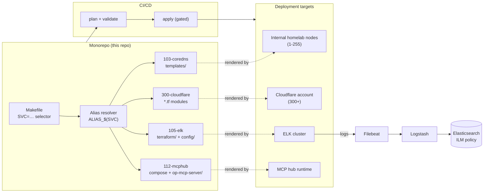

# Homelab Infrastructure Monorepo / 홈랩 인프라 모노레포

> **Manual apply is disabled. All changes deploy through CI/CD.**
> **수동 `apply`는 비활성화되어 있습니다. 모든 변경 사항은 CI/CD를 통해 배포됩니다.**

---

## Overview / 개요

This repository is a **monorepo of infrastructure-as-code workspaces** for a personal homelab and a small set of external (cloud) integrations. Each workspace is a self-contained Terraform and/or Docker Compose project named with a flat `NNN-SERVICE` identifier.

이 저장소는 **홈랩 및 소규모 외부(클라우드) 통합을 위한 인프라스트럭처-코드(Infrastructure-as-Code) 워크스페이스 모노레포**입니다. 각 워크스페이스는 `NNN-SERVICE` 형식의 평탄한(flat) 식별자로 명명된 독립적인 Terraform 및/또는 Docker Compose 프로젝트입니다.

**Numbering convention / 번호 규칙**

| Range / 범위 | Purpose / 용도 |
| --- | --- |
| `1`–`255` | Internal homelab services (e.g., `103-coredns`, `105-elk`, `112-mcphub`) / 홈랩 내부 서비스 |
| `300`+ | External / cloud services (e.g., `300-cloudflare`, `301-github`) / 외부 / 클라우드 서비스 |

Workspaces are managed through a top-level `Makefile` that resolves short aliases (e.g., `SVC=elk`) to their full directory paths.

워크스페이스는 최상위 `Makefile`을 통해 관리되며, 짧은 별칭(예: `SVC=elk`)을 전체 디렉터리 경로로 해석합니다.

---

## Features / 주요 기능

- **Unified workspace orchestration** — One `Makefile` drives every workspace via `SVC=…`.
- **Terraform + Docker Compose hybrid** — Some services use Terraform to render Compose files; others use plain Compose.
- **Template-driven configuration** — Reusable `.tftpl` files generate per-environment manifests.
- **1Password integration** — Secrets are fetched at apply time from a 1Password vault (see `onepassword.tf`).
- **Validation first** — `checks.tf` and `validation.tf` enforce invariants before any plan is accepted.
- **CI/CD-only deploys** — Local `apply` is intentionally disabled to keep state changes auditable.
- **Containerised log shipping** — Filebeat/Logstash pipelines in `105-elk` push logs to Elasticsearch with ILM policies.

- **통합 워크스페이스 오케스트레이션** — 단일 `Makefile`이 `SVC=…`로 모든 워크스페이스를 제어합니다.
- **Terraform + Docker Compose 하이브리드** — 일부 서비스는 Terraform으로 Compose 파일을 렌더링하고, 일부는 일반 Compose를 사용합니다.
- **템플릿 기반 설정** — 재사용 가능한 `.tftpl` 파일이 환경별 매니페스트를 생성합니다.
- **1Password 통합** — 비밀 정보는 `apply` 시점에 1Password 보관소에서 가져옵니다(`onepassword.tf` 참조).
- **검증 우선 정책** — `checks.tf` 및 `validation.tf`가 plan이 수락되기 전에 불변 조건을 강제합니다.
- **CI/CD 전용 배포** — 상태 변경의 감사 가능성을 유지하기 위해 로컬 `apply`는 의도적으로 비활성화되어 있습니다.
- **컨테이너화된 로그 전송** — `105-elk`의 Filebeat/Logstash 파이프라인이 ILM 정책과 함께 로그를 Elasticsearch로 전송합니다.

---

## Repository Structure / 저장소 구조

```
.
├── AGENTS.md                 # Agent / contributor operating rules
├── ARCHITECTURE.md           # Cross-workspace architecture notes
├── CODE_STYLE.md             # Style conventions
├── CONTRIBUTING.md           # How to propose changes
├── DEPENDENCY_MAP.md         # Inter-workspace dependencies
├── LICENSE
├── Makefile                  # Workspace entry point
├── OWNERS, OWNERS_ALIASES    # CODEOWNERS-style review routing
├── build.env                 # Shared build-time environment
│
├── 103-coredns/              # Internal CoreDNS resolver
│   ├── README.md
│   ├── templates/            # Corefile, Compose, Filebeat
│   └── AGENTS.md
│
├── 105-elk/                  # ELK logging stack
│   ├── docker-compose.yml
│   ├── ilm-policy.json
│   ├── scripts/              # Go helpers (setup-ilm, setup-watcher, …)
│   ├── config/               # Logstash / Filebeat configuration
│   ├── terraform/            # IaC for the stack
│   └── templates/            # Rendered-by-Terraform assets
│
├── 112-mcphub/               # MCP (Model Context Protocol) hub
│   ├── Dockerfile.dev-browser
│   ├── Dockerfile.playwright
│   ├── Dockerfile.proxmox
│   ├── mcp_servers.json
│   ├── validate_mcps.py
│   ├── patches/             # Upstream SDK / n8n patches
│   ├── op-mcp-server/       # 1Password-backed MCP server (Node)
│   ├── config/              # Patches, Filebeat, patch helpers
│   └── templates/           # Compose + MCP settings templates
│
└── 300-cloudflare/           # Cloudflare DNS / Access / Logpush
    ├── access.tf
    ├── checks.tf
    ├── dns.tf
    ├── identity-provider.tf
    ├── locals.tf
    ├── logpush.tf
    ├── main.tf
    ├── onepassword.tf
    ├── outputs*.tf           # Per-environment outputs
    ├── README.md
    └── AGENTS.md
```

> **Note / 참고** — Only directories present at the time of generation are listed. Some workspaces (e.g., `100-pve`, `107-supabase`) are referenced from the `Makefile` alias map but live elsewhere in the monorepo.
>
> 생성 시점에 존재하는 디렉터리만 나열되었습니다. 일부 워크스페이스(예: `100-pve`, `107-supabase`)는 `Makefile` 별칭 맵에서 참조되지만 모노레포의 다른 위치에 있습니다.

---

## Architecture / 아키텍처


```mermaid
flowchart LR
    subgraph Repo["Monorepo (this repo)"]
        MK["Makefile<br/>SVC=… selector"]
        MK --> AL["Alias resolver<br/>ALIAS_$(SVC)"]
        AL --> WS1["103-coredns<br/>templates/"]
        AL --> WS2["105-elk<br/>terraform/ + config/"]
        AL --> WS3["112-mcphub<br/>compose + op-mcp-server/"]
        AL --> WS4["300-cloudflare<br/>*.tf modules"]
    end

    subgraph CI["CI/CD"]
        PLAN["plan + validate"]
        APPLY["apply (gated)"]
    end

    subgraph Targets["Deployment targets"]
        T1["Internal homelab nodes<br/>(1-255)"]
        T2["Cloudflare account<br/>(300+)"]
        T3["ELK cluster"]
        T4["MCP hub runtime"]
    end

    WS2 -. rendered by .-> T3
    WS3 -. rendered by .-> T4
    WS1 -. rendered by .-> T1
    WS4 -. rendered by .-> T2
    Repo --> PLAN --> APPLY --> Targets
    T3 -->|logs| FB["Filebeat"]
    FB --> LS["Logstash"]
    LS --> ES[("Elasticsearch<br/>ILM policy")]
```

Key entry points / 주요 진입점:

- `Makefile` — single user-facing entry point for `init`, `plan`, `validate`, `fmt`, `test`, and friends.
- `105-elk/terraform/main.tf` — Terraform entry point for the logging stack.
- `300-cloudflare/main.tf` — Terraform entry point for Cloudflare.
- `112-mcphub/mcp_servers.json` — MCP server catalogue (validated by `validate_mcps.py`).
- `103-coredns/templates/Corefile.tftpl` — Corefile template rendered per environment.

---

## Quick Start / 빠른 시작

### Prerequisites / 사전 요구 사항

| Tool / 도구 | Version / 버전 | Purpose / 용도 |
| --- | --- | --- |
| `terraform` | ≥ 1.5 | Plan / apply infrastructure |
| `docker` + `docker compose` | recent | Local stack bring-up |
| `make` | any | Workspace orchestration |
| `gcloud` / `aws` / `op` | per workspace | Cloud + 1Password authentication |
| `pre-commit` | optional | Local hook runner |
| `go` (≥ 1.21) | for `105-elk/scripts/*.go` | Run Go helpers |

### Select a workspace and inspect / 워크스페이스 선택 및 점검

```bash
# List available aliases (also printed by 'make help')
make help

# Validate the ELK workspace
SVC=elk make validate

# Render plan for Cloudflare
SVC=cloudflare make plan

# Initialise a new workspace
SVC=coredns make init
```

> ⚠️ **`make apply` is intentionally disabled.** Push the change to the configured branch and let CI/CD run `terraform apply`.
>
> ⚠️ **`make apply`는 의도적으로 비활성화되어 있습니다.** 변경 사항을 설정된 브랜치에 푸시하고 CI/CD가 `terraform apply`를 실행하도록 하십시오.

---

## Configuration / 설정

Configuration is split into three layers:

설정은 세 계층으로 나뉩니다.

1. **Build-time** — `build.env` at the repository root, sourced by the Makefile.
2. **Workspace-time** — `variables.tf` (or `terraform.tfvars`) inside each workspace; for example `105-elk/terraform/variables.tf` and `300-cloudflare/variables.tf`.
3. **Secrets** — Resolved at apply time via 1Password. See each workspace's `onepassword.tf` (e.g., `105-elk/terraform/onepassword.tf`, `300-cloudflare/onepassword.tf`).

1. **빌드 타임** — 저장소 루트의 `build.env`이며, Makefile에서 소싱됩니다.
2. **워크스페이스 타임** — 각 워크스페이스 내부의 `variables.tf`(또는 `terraform.tfvars`). 예: `105-elk/terraform/variables.tf`, `300-cloudflare/variables.tf`.
3. **비밀** — apply 시점에 1Password을 통해 해석됩니다. 각 워크스페이스의 `onepassword.tf`를 참조하십시오(예: `105-elk/terraform/onepassword.tf`, `300-cloudflare/onepassword.tf`).

### Environment file example / 환경 파일 예시

```dotenv
# build.env
TF_VERSION=1.6.0
OP_VAULT=homelab
LOG_LEVEL=info
```

> Never commit secrets. `onepassword.tf` items are referenced by their UUID, not by plaintext.
>
> 비밀 정보를 커밋하지 마십시오. `onepassword.tf` 항목은 평문이 아닌 UUID로 참조됩니다.

---

## Commands Reference / 명령어 참조

The `Makefile` exposes the following top-level targets. The `SVC` variable selects the workspace (default: `100-pve`).

`Makefile`은 다음 최상위 타겟을 제공합니다. `SVC` 변수로 워크스페이스를 선택합니다(기본값: `100-pve`).

| Target / 타겟 | Purpose / 용도 |
| --- | --- |
| `make help` | Print the help banner with all targets. |
| `make init` | `terraform init` in the selected workspace. |
| `make plan` | `terraform plan -out=tfplan` in the selected workspace. |
| `make apply` | **Disabled.** Use CI/CD. / **비활성화됨.** CI/CD를 사용하세요. |
| `make verify` | Run additional workspace verifications. |
| `make validate` | `terraform validate` plus custom schema checks. |
| `make fmt` | Format Terraform sources. |
| `make lint` | Lint Terraform sources. |
| `make lint-go` | Lint the Go helpers under `105-elk/scripts/`. |
| `make drift-check` | Detect drift between state and live infra. |
| `make backup` | Snapshot state files before risky changes. |
| `make test` | Run the full test suite for the workspace. |
| `make test-unit` | Run unit tests only. |
| `make test-integration` | Run integration tests. |
| `make test-workspace` | Run workspace-shape tests (alias map, required files, …). |
| `make docs` | Regenerate workspace documentation. |
| `make pre-commit-install` | Install pre-commit hooks. |
| `make pre-commit-run` | Run all pre-commit hooks. |
| `make setup` | Bootstrap a fresh checkout. |
| `make drift-check` | Compare state to actual. |

### Workspace aliases / 워크스페이스 별칭

```
jclee  pve  runner  traefik  elk  supabase  archon  n8n
mcphub oc  synology youtube  cloudflare  github  safetywallet  slack  gcp
```

Example: `SVC=mcphub make plan` resolves to `112-mcphub` (which has its Terraform assets at the workspace root, not under `terraform/`).

예: `SVC=mcphub make plan`은 `112-mcphub`으로 해석됩니다(해당 워크스페이스는 `terraform/` 하위가 아닌 루트에 Terraform 자산을 둡니다).

---

## Local Development / 로컬 개발

1. **Clone the repository.**
   ```bash
   git clone <repository-url>
   cd <repository>
   ```
2. **Install pre-commit hooks (recommended).**
   ```bash
   make pre-commit-install
   ```
3. **Pick a workspace and initialise it.**
   ```bash
   SVC=elk make init
   ```
4. **Make a plan before any commit.**
   ```bash
   SVC=elk make plan
   ```
5. **Run the unit tests for the workspace.**
   ```bash
   SVC=elk make test-unit
   ```
6. **For Go helpers in `105-elk/scripts/`:**
   ```bash
   cd 105-elk/scripts
   go run setup-ilm.go
   go run setup-watcher.go
   ```
7. **For `112-mcphub` MCP validation:**
   ```bash
   cd 112-mcphub
   python validate_mcps.py
   ```
8. **For Compose-only flows (no Terraform):**
   ```bash
   cd 105-elk
   docker compose up -d
   ```

> The `Makefile` will refuse to run if the resolved `TF_DIR` does not exist. This is intentional — it forces you to add new workspaces to the alias map before referencing them.
>
> `Makefile`은 해석된 `TF_DIR`이 존재하지 않으면 실행을 거부합니다. 이는 의도된 동작이며, 새 워크스페이스를 참조하기 전에 별칭 맵에 먼저 추가하도록 강제합니다.

---

## Testing / 테스트

| Target / 타겟 | Scope / 범위 |
| --- | --- |
| `make test-unit` | Workspace-local unit tests. |
| `make test-integration` | Integration tests that may need live credentials. |
| `make test-workspace` | Meta-tests: alias map integrity, required files, schema checks. |
| `make validate` | `terraform validate` + custom schema checks. |
| `make drift-check` | Compares state against actual deployed resources. |
| `make lint` / `make lint-go` | Static analysis for Terraform and Go respectively. |

`112-mcphub/validate_mcps.py` is a Python validator for `mcp_servers.json`; it should be run whenever the catalogue changes.

`112-mcphub/validate_mcps.py`는 `mcp_servers.json`에 대한 Python 유효성 검사기입니다. 카탈로그가 변경될 때마다 실행해야 합니다.

CI pipelines run all of the above on every pull request.

CI 파이프라인은 모든 풀 리퀘스트에서 위 항목 전체를 실행합니다.

---

## Contributing / 기여 가이드

Contributions follow the workflow documented in [`CONTRIBUTING.md`](./CONTRIBUTING.md), with style guidance in [`CODE_STYLE.md`](./CODE_STYLE.md) and cross-workspace conventions in [`ARCHITECTURE.md`](./ARCHITECTURE.md) / [`DEPENDENCY_MAP.md`](./DEPENDENCY_MAP.md).

기여는 [`CONTRIBUTING.md`](./CONTRIBUTING.md)의 워크플로우를 따르며, 스타일은 [`CODE_STYLE.md`](./CODE_STYLE.md), 워크스페이스 간 규약은 [`ARCHITECTURE.md`](./ARCHITECTURE.md) / [`DEPENDENCY_MAP.md`](./DEPENDENCY_MAP.md)에 정리되어 있습니다.

Please note / 참고 사항:

- **Never run `apply` locally.** All state changes go through CI/CD.
  **로컬에서 `apply`를 실행하지 마십시오.** 모든 상태 변경은 CI/CD를 통해 진행됩니다.
- When you add a new workspace, register it in the `ALIAS_*` map at the top of the `Makefile` and document it in `DEPENDENCY_MAP.md`.
  새 워크스페이스를 추가할 때는 `Makefile` 상단의 `ALIAS_*` 맵에 등록하고 `DEPENDENCY_MAP.md`에 문서화하십시오.
- Reviewers are routed via `OWNERS` and `OWNERS_ALIASES`; respect the requested reviewers.
  리뷰어는 `OWNERS` 및 `OWNERS_ALIASES`를 통해 라우팅됩니다. 요청된 리뷰어를 존중하십시오.
- Avoid committing secrets — `onepassword.tf` lookups should be the only way to obtain credentials.
  비밀 정보를 커밋하지 마십시오. 자격 증명을 얻는 유일한 방법은 `onepassword.tf` 조회여야 합니다.

---

## License / 라이선스

See [`LICENSE`](./LICENSE) for the full text.

전체 내용은 [`LICENSE`](./LICENSE)를 참조하십시오.