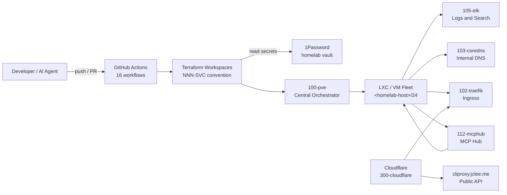

# Terraform Homelab Infrastructure / Terraform Homelab 인프라

> **Bilingual README** — English follows Korean.
> **이중 언어 README** — 한국어 다음에 영어 버전이 이어집니다.

## Badges / 배지

| Category | Detail |
| --- | --- |
| Infrastructure as Code | Terraform `1.10.5` (`>= 1.7, < 2.0`) |
| Workspace Convention | Flat `NNN-SVC` (e.g. `100-pve`, `105-elk`, `300-cloudflare`) |
| CI/CD | 16 GitHub Actions workflows |
| Secret Backend | 1Password `homelab` vault |
| Security | CodeQL, Gitleaks, Dependency Review, OpenSSF Scorecard |
| Review Automation | [qodo-ai/pr-agent](https://github.com/qodo-ai/pr-agent), Dependabot auto-merge |
| Documentation | README auto-gen, release notes, docs sync |
| Public Endpoint | `https://cliproxy.jclee.me/v1` |
| License | MIT |

---

# 한국어

## 1. 개요

이 저장소는 `jclee.me` 호멜랩(homelab)과 관련 외부 서비스를 코드로 관리하기 위한 **Infrastructure-as-Code 모노레포**입니다. Proxmox LXC/VM 플릿, 네트워크, 모니터링, 외부 서비스를 Terraform 워크스페이스로 프로비저닝하며, 1Password 시크릿 주입과 GitHub Actions 기반 CI/CD를 사용합니다.

- **도메인**: `jclee.me`
- **내부 서브넷**: `<homelab-host>/24` (LXC/VM 플릿)
- **Terraform 버전**: `1.10.5` (`>= 1.7, < 2.0`)
- **공개 엔드포인트**: `https://cliproxy.jclee.me/v1`
- **워크스페이스 규칙**: 평탄(flat) `NNN-SVC` 컨벤션
  - `1-255` = 내부 인프라 (Proxmox LXC/VM, 예: `<homelab-host>`)
  - `300+` = 외부 서비스 (Cloudflare, GitHub, Slack 등)
  - `400+` = 퍼블릭 클라우드 (GCP 등)
- **핵심 오케스트레이터**: `100-pve` — 모든 LXC/VM 라이프사이클의 단일 진실 공급원(SSOT)

이 README는 자동화 인벤토리, 저장소 구조, 로컬 개발 절차, 명령어 레퍼런스, 기여 가이드를 한 곳에서 확인할 수 있도록 작성되었습니다.

## 2. 주요 기능

### 2.1 Infrastructure as Code
- Terraform 기반 **서비스별 워크스페이스** (예: `105-elk/terraform/`, `112-mcphub/`, `300-cloudflare/`)
- 평탄한 `NNN-SVC` 디렉터리 컨벤션과 `Makefile`의 단축 별칭(`pve`, `elk`, `mcphub`, `cloudflare` 등)
- `templates/*.tftpl` → 렌더링된 설정 파일 파이프라인 (`config-renderer` 모듈)
- 로컬 상태 백엔드, `.tfstate`를 git에 커밋, GitHub Actions 동시성(concurrency) 그룹으로 `apply` 직렬화
- `terraform test`로 유닛/통합/워크스페이스 테스트 수행

### 2.2 GitHub Automation
- **16개의 GitHub Actions 워크플로우**로 PR 검사, 리뷰, 보안 분석, 자동 병합, 문서 동기화, 릴리스 발행, CI 자동 복구까지 전 영역 자동화
- [qodo-ai/pr-agent](https://github.com/qodo-ai/pr-agent) 기반 PR 리뷰, Dependabot 자동 병합
- 이슈 분류/백필/실패 알림, 릴리스 노트 자동화, 다운스트림 헬스 체크
- CodeQL, Gitleaks, OpenSSF Scorecard로 보안 게이트

### 2.3 Secret Management
- **1Password** `homelab` 볼트가 시크릿 단일 진실 공급원
- `modules/shared/onepassword-secrets` 모듈을 통해 `module.onepassword_secrets.secrets["key"]` 패턴으로 주입
- 시크릿 평문 커밋 금지, `.gitignore`로 `.tfvars` / `.env` 보호

### 2.4 Observability
- ELK 스택(Elasticsearch + Logstash + Kibana)으로 LXC/VM 로그 집계
- `103-coredns`로 내부 DNS 통합, Filebeat → Logstash → Elasticsearch 파이프라인
- ILM(인덱스 수명 주기 관리) 정책으로 디스크 사용량 자동 제어

### 2.5 AI Agent Support
- `112-mcphub`에 MCP(Model Context Protocol) 허브 운영
- Playwright 브라우저 자동화, Proxmox MCP, 1Password Connect 통합
- `https://cliproxy.jclee.me/v1`로 CLI 프록시 API 노출 (gpt-5.5 → minimax-m3 폴백)

## 3. 아키텍처


```mermaid
flowchart LR
  Dev["Developer / AI Agent"] -->|push / PR| GA["GitHub Actions<br/>16 workflows"]
  GA --> TF["Terraform Workspaces<br/>NNN-SVC convention"]
  TF -->|read secrets| OP["1Password<br/>homelab vault"]
  TF --> PVE["100-pve<br/>Central Orchestrator"]
  PVE --> Fleet["LXC / VM Fleet<br/>&lt;homelab-host&gt;/24"]
  Fleet --> ELK["105-elk<br/>Logs and Search"]
  Fleet --> DNS["103-coredns<br/>Internal DNS"]
  Fleet --> Traefik["102-traefik<br/>Ingress"]
  Fleet --> MCP["112-mcphub<br/>MCP Hub"]
  CF["Cloudflare<br/>300-cloudflare"] --> Traefik
  CF --> API["cliproxy.jclee.me<br/>Public API"]
  MCP --> Fleet
```

핵심 흐름:
1. **CI 흐름**: 개발자 push → GitHub Actions (LXC 101) → Terraform → 1Password 시크릿 → `100-pve` 오케스트레이터 → Proxmox LXC/VM 플릿
2. **수신 흐름**: 외부 트래픽 → Cloudflare (`300-cloudflare`) → Traefik (`102-traefik`) → 내부 서비스
3. **관측 흐름**: LXC/VM → Filebeat → Logstash → Elasticsearch (`105-elk`)
4. **AI 흐름**: MCP Hub (`112-mcphub`) → Playwright/Proxmox/1Password → AI 에이전트 (예: gpt-5.5)

## 4. 자동화 인벤토리

### 4.1 GitHub Actions Workflows (16)

| Workflow | File | Purpose |
| --- | --- | --- |
| Branch to PR | `01_branch-to-pr.yml` | 브랜치를 자동으로 PR로 변환 |
| Issue to Branch | `02_issue-to-branch.yml` | 이슈를 기반으로 작업 브랜치 생성 |
| PR Review | `10_pr-review.yml` | [qodo-ai/pr-agent](https://github.com/qodo-ai/pr-agent) 기반 자동 리뷰 |
| Security PR Review | `11_security-pr-review.yml` | 보안 관점의 PR 리뷰 |
| Dependabot Auto-Merge | `12_dependabot-auto-merge.yml` | Dependabot PR 자동 병합 |
| PR Auto-Merge | `13_pr-auto-merge.yml` | 라벨/조건 충족 시 PR 자동 병합 |
| Bot Auto-Fix | `14_bot-auto-fix.yml` | 리뷰/린트 지적사항을 봇이 자동 수정 |
| Merged PR Cleanup | `15_merged-pr-cleanup.yml` | 병합된 PR의 브랜치/리소스 정리 |
| Issue Backfill | `19_issue-backfill.yml` | 누락된 이슈를 백필 |
| Release Notes | `24_release-notes.yml` | 릴리스 노트 자동 생성 |
| Release Publish | `25_release-publish.yml` | 릴리스 아티팩트 발행 |
| Downstream Health Check | `29_downstream-health-check.yml` | 다운스트림 서비스 헬스 체크 |
| CI Failure Issues | `37_ci-failure-issues.yml` | CI 실패를 이슈로 자동 등록 |
| CI Auto-Heal | `60_ci-auto-heal.yml` | 알려진 CI 실패 패턴 자동 복구 |
| Issue Classification | `91_issue-classification.yml` | 들어오는 이슈 자동 분류/라벨링 |
| Main CI | `ci.yml` | 메인 CI 파이프라인 (lint, validate, plan) |

### 4.2 Go Automation Tools (0)

저장소 전역의 독립 실행형 Go 자동화 도구는 **0개**입니다. 다만 서비스 내부 보조 스크립트는 존재합니다:

- `105-elk/scripts/setup-ilm.go` — Elasticsearch ILM 정책 설정
- `105-elk/scripts/setup-watcher.go` — Watcher 등록
- `105-elk/scripts/remove-promtail.go` — 기존 Promtail 제거 (마이그레이션용)

## 5. 저장소 구조

저장소 최상위 구조(현재 스냅샷 기준):

```text
.
├── AGENTS.md                # AI 에이전트용 지식 베이스
├── ARCHITECTURE.md          # 상세 아키텍처 문서
├── CODE_STYLE.md            # 코딩/네이밍 컨벤션
├── CONTRIBUTING.md          # 기여 가이드
├── DEPENDENCY_MAP.md        # 모듈/템플릿 의존성 맵
├── LICENSE                  # MIT 라이선스
├── Makefile                 # 단축 별칭 + Terraform 타겟
├── OWNERS                   # 코드 오너십
├── OWNERS_ALIASES           # 오너 별칭
├── README.md                # 본 문서
├── build.env                # 빌드 환경 변수
├── 103-coredns/             # Tier 1: 내부 DNS
│   ├── templates/           # *.tftpl 템플릿 (Corefile, docker-compose, filebeat)
│   └── ...
├── 105-elk/                 # Tier 1: ELK 스택
│   ├── terraform/           # Terraform 워크스페이스
│   ├── templates/           # logstash, filebeat, ILM 템플릿
│   ├── config/              # 렌더링된 설정 (참고용)
│   ├── scripts/             # Go 보조 스크립트
│   └── docker-compose.yml
├── 112-mcphub/              # Tier 1: MCP 허브
│   ├── templates/           # docker-compose, mcp_settings 템플릿
│   ├── config/              # SDK 패치, entrypoint 패치
│   ├── op-mcp-server/       # 1Password MCP 서버 (Node.js)
│   ├── patches/n8n/         # n8n 라이선스 패치
│   ├── Dockerfile.*         # dev-browser, playwright, proxmox 이미지
│   └── mcp_servers.json     # MCP 서버 카탈로그
└── 300-cloudflare/          # 외부: Cloudflare DNS/Access/Tunnel
    ├── main.tf              # 메인 정의
    ├── dns.tf               # DNS 레코드
    ├── access.tf            # Zero Trust Access
    ├── identity-provider.tf # IdP
    ├── logpush.tf           # Logpush 작업
    ├── onepassword.tf       # 시크릿 주입
    ├── outputs*.tf          # 다중 출력 (homelab, jclee, synology)
    ├── checks.tf / locals.tf
    └── validation.tf / variables.tf / providers.tf
```

추가로 `Makefile`의 별칭으로 참조되는 워크스페이스(현재 스냅샷에는 미포함): `80-jclee`, `100-pve`, `101-runner`, `102-traefik`, `107-supabase`, `108-archon`, `110-n8n`, `200-oc`, `215-synology`, `220-youtube`, `301-github`, `310-safetywallet`, `320-slack`, `400-gcp`.

## 6. 빠른 시작

### 6.1 필수 도구

- Terraform `>= 1.7, < 2.0` (검증 완료 버전: `1.10.5`)
- `make`
- 1Password CLI (`op`) 및 `homelab` 볼트 접근 권한
- Proxmox API 토큰 (1Password에 저장)

### 6.2 첫 워크스페이스 plan

```bash
# 저장소 클론
git clone <repo-url> terraform-homelab
cd terraform-homelab

# 기본 워크스페이스(100-pve) plan
make plan SVC=100-pve

# 단축 별칭 사용
make plan SVC=pve

# 특정 워크스페이스 plan
make plan SVC=elk
make plan SVC=cloudflare
```

> **주의**: `make apply`는 의도적으로 비활성화되어 있습니다. 모든 변경은 CI/CD를 통해 배포됩니다.

## 7. 로컬 개발

### 7.1 브랜치 전략

- `master` — 프로덕션 상태
- `NNN-short-name` — 작업 브랜치 (예: `105-elk-ilm-tune`)
- `bot/...` — 봇 자동 수정 브랜치
- `dependabot/...` — Dependabot PR

### 7.2 PR 열기 절차

1. 기능 브랜치 생성
2. 변경 사항 커밋 (컨벤션은 `CONTRIBUTING.md` 참고)
3. `git push` 후 PR 생성
4. `02_issue-to-branch.yml` / `01_branch-to-pr.yml` 워크플로우가 자동 후크
5. `10_pr-review.yml` 자동 리뷰 대기
6. `11_security-pr-review.yml` 보안 리뷰 통과
7. 승인 후 `13_pr-auto-merge.yml` 자동 병합

### 7.3 새 워크스페이스 추가

1. `NNN-svcname/` 디렉터리 생성 (예: `104-newthing/`)
2. `Makefile`의 `ALIAS_*` 맵에 단축명 등록
3. `templates/*.tftpl` 작성
4. `terraform/` 하위에 `main.tf`, `variables.tf`, `outputs.tf`, `providers.tf` 작성
5. `100-pve/envs/prod/hosts.tf`에 호스트 정의 추가
6. `make plan SVC=newthing`으로 검증

## 8. 명령어 레퍼런스

| 명령 | 설명 |
| --- | --- |
| `make init SVC=<ws>` | Terraform init (기본: `100-pve`) |
| `make plan SVC=<ws>` | Terraform plan → `tfplan` 파일 생성 |
| `make apply` | **비활성화** — CI/CD 사용 |
| `make verify SVC=<ws>` | `terraform verify` |
| `make validate SVC=<ws>` | `terraform validate` |
| `make lint SVC=<ws>` | `tflint` 실행 |
| `make lint-go` | Go 코드 린트 (`gofmt`, `go vet`) |
| `make fmt` | Terraform / Go 포맷 일괄 적용 |
| `make drift-check SVC=<ws>` | 상태 드리프트 감지 |
| `make test` | Terraform 테스트 (unit + integration + workspace) |
| `make test-unit` | 유닛 테스트만 |
| `make test-integration` | 통합 테스트만 |
| `make test-workspace` | 워크스페이스 테스트만 |
| `make backup` | 상태 파일 백업 |
| `make docs` | 문서 생성/동기화 |
| `make pre-commit-install` | pre-commit 훅 설치 |
| `make pre-commit-run` | pre-commit 훅 수동 실행 |
| `make setup` | 초기 환경 설정 |
| `make help` | 사용 가능한 타겟 목록 |

사용 가능한 단축 별칭: `jclee`, `pve`, `runner`, `traefik`, `elk`, `supabase`, `archon`, `n8n`, `mcphub`, `oc`, `synology`, `youtube`, `cloudflare`, `github`, `safetywallet`, `slack`, `gcp`.

## 9. 기여 가이드

기여 전 다음 문서를 반드시 읽어 주세요:

- [`CONTRIBUTING.md`](./CONTRIBUTING.md) — PR 절차, 커밋 컨벤션
- [`CODE_STYLE.md`](./CODE_STYLE.md) — Terraform / Go / 템플릿 스타일
- [`ARCHITECTURE.md`](./ARCHITECTURE.md) — 시스템 구조 및 설계 결정
- [`DEPENDENCY_MAP.md`](./DEPENDENCY_MAP.md) — 모듈/템플릿 의존성
- [`AGENTS.md`](./AGENTS.md) — AI 에이전트용 지식 베이스

### 9.1 커밋 메시지 컨벤션

```
<type>(<scope>): <subject>

<scope> 예시: 100-pve, 105-elk, 300-cloudflare, workflows, docs
<type> 예시: feat, fix, chore, refactor, docs, test, ci
```

### 9.2 보안

- 시크릿은 절대 평문 커밋 금지 (Gitleaks가 차단)
- 1Password `homelab` 볼트에만 시크릿 저장
- CodeQL / Dependency Review / OpenSSF Scorecard 게이트 통과 필수

### 9.3 소유권

`OWNERS` / `OWNERS_ALIASES` 파일의 리뷰어 할당에 따라 자동 리뷰어 지정.

---

# English

## 1. Overview

This repository is an **Infrastructure-as-Code monorepo** that provisions the `jclee.me` homelab and related external services. It manages a Proxmox LXC/VM fleet, networking, monitoring, and external integrations via Terraform workspaces, with 1Password secret injection and a GitHub Actions CI/CD platform.

- **Domain**: `jclee.me`
- **Internal subnet**: `<homelab-host>/24` (LXC/VM fleet)
- **Terraform version**: `1.10.5` (`>= 1.7, < 2.0`)
- **Public endpoint**: `https://cliproxy.jclee.me/v1`
- **Workspace convention**: flat `NNN-SVC`
  - `1-255` — internal infra (Proxmox LXC/VM, e.g. `<homelab-host>`)
  - `300+` — external services (Cloudflare, GitHub, Slack, etc.)
  - `400+` — public cloud (GCP, etc.)
- **Core orchestrator**: `100-pve` — single source of truth for all LXC/VM lifecycles

This README centralizes the automation inventory, repo layout, local-dev workflow, command reference, and contribution guide.

## 2. Features

### 2.1 Infrastructure as Code
- Service-scoped **Terraform workspaces** (e.g. `105-elk/terraform/`, `112-mcphub/`, `300-cloudflare/`)
- Flat `NNN-SVC` directory convention with short aliases in the `Makefile` (`pve`, `elk`, `mcphub`, `cloudflare`, ...)
- `templates/*.tftpl` → rendered config pipeline (`config-renderer` module)
- Local state backend with `.tfstate` committed to git; CI concurrency groups serialize applies
- `terraform test` covers unit, integration, and workspace tests

### 2.2 GitHub Automation
- **16 GitHub Actions workflows** covering PR checks, review, security, auto-merge, docs sync, release publishing, and CI auto-heal
- [qodo-ai/pr-agent](https://github.com/qodo-ai/pr-agent) PR review; Dependabot auto-merge
- Issue classification/backfill/failure-alerting, auto-generated release notes, downstream health checks
- Security gates: CodeQL, Gitleaks, OpenSSF Scorecard

### 2.3 Secret Management
- **1Password** `homelab` vault is the single source of truth for secrets
- `modules/shared/onepassword-secrets` module exposes `module.onepassword_secrets.secrets["key"]`
- Plaintext secrets are forbidden in commits; `.tfvars` / `.env` are git-ignored

### 2.4 Observability
- ELK stack (Elasticsearch + Logstash + Kibana) aggregates LXC/VM logs
- `103-coredns` for internal DNS; Filebeat → Logstash → Elasticsearch pipeline
- ILM policies automatically control disk usage

### 2.5 AI Agent Support
- `112-mcphub` runs an MCP (Model Context Protocol) hub
- Playwright browser automation, Proxmox MCP, 1Password Connect integration
- Public CLI proxy API at `https://cliproxy.jclee.me/v1` (gpt-5.5 primary, minimax-m3 fallback)

## 3. Architecture


```mermaid
flowchart LR
  Dev["Developer / AI Agent"] -->|push / PR| GA["GitHub Actions<br/>16 workflows"]
  GA --> TF["Terraform Workspaces<br/>NNN-SVC convention"]
  TF -->|read secrets| OP["1Password<br/>homelab vault"]
  TF --> PVE["100-pve<br/>Central Orchestrator"]
  PVE --> Fleet["LXC / VM Fleet<br/>&lt;homelab-host&gt;/24"]
  Fleet --> ELK["105-elk<br/>Logs and Search"]
  Fleet --> DNS["103-coredns<br/>Internal DNS"]
  Fleet --> Traefik["102-traefik<br/>Ingress"]
  Fleet --> MCP["112-mcphub<br/>MCP Hub"]
  CF["Cloudflare<br/>300-cloudflare"] --> Traefik
  CF --> API["cliproxy.jclee.me<br/>Public API"]
  MCP --> Fleet
```

Key flows:
1. **CI flow**: developer push → GitHub Actions (LXC 101) → Terraform → 1Password secrets → `100-pve` orchestrator → Proxmox LXC/VM fleet
2. **Ingress flow**: external traffic → Cloudflare (`300-cloudflare`) → Traefik (`102-traefik`) → internal services
3. **Observability flow**: LXC/VM → Filebeat → Logstash → Elasticsearch (`105-elk`)
4. **AI flow**: MCP Hub (`112-mcphub`) → Playwright / Proxmox / 1Password → AI agents (e.g. gpt-5.5)

## 4. Automation Inventory

### 4.1 GitHub Actions Workflows (16)

| Workflow | File | Purpose |
| --- | --- | --- |
| Branch to PR | `01_branch-to-pr.yml` | Convert a branch into a PR automatically |
| Issue to Branch | `02_issue-to-branch.yml` | Create a working branch from an issue |
| PR Review | `10_pr-review.yml` | Automated review via [qodo-ai/pr-agent](https://github.com/qodo-ai/pr-agent) |
| Security PR Review | `11_security-pr-review.yml` | Security-focused PR review |
| Dependabot Auto-Merge | `12_dependabot-auto-merge.yml` | Auto-merge Dependabot PRs |
| PR Auto-Merge | `13_pr-auto-merge.yml` | Auto-merge PRs that meet label/conditions |
| Bot Auto-Fix | `14_bot-auto-fix.yml` | Bot-driven auto-fixes for review/lint nits |
| Merged PR Cleanup | `15_merged-pr-cleanup.yml` | Cleanup branches/resources after merge |
| Issue Backfill | `19_issue-backfill.yml` | Backfill missing issues |
| Release Notes | `24_release-notes.yml` | Auto-generate release notes |
| Release Publish | `25_release-publish.yml` | Publish release artifacts |
| Downstream Health Check | `29_downstream-health-check.yml` | Health check downstream services |
| CI Failure Issues | `37_ci-failure-issues.yml` | File issues for CI failures |
| CI Auto-Heal | `60_ci-auto-heal.yml` | Auto-recover known CI failure patterns |
| Issue Classification | `91_issue-classification.yml` | Auto-classify and label incoming issues |
| Main CI | `ci.yml` | Main CI pipeline (lint, validate, plan) |

### 4.2 Go Automation Tools (0)

There are **0 standalone Go automation tools** at the repository root. Service-internal helpers exist:

- `105-elk/scripts/setup-ilm.go` — Elasticsearch ILM policy setup
- `105-elk/scripts/setup-watcher.go` — Watcher registration
- `105-elk/scripts/remove-promtail.go` — Remove legacy Promtail (migration)

## 5. Repository Structure

Top-level layout (current snapshot):

```text
.
├── AGENTS.md                # Knowledge base for AI agents
├── ARCHITECTURE.md          # Full architecture reference
├── CODE_STYLE.md            # Coding/naming conventions
├── CONTRIBUTING.md          # Contribution guide
├── DEPENDENCY_MAP.md        # Module/template dependency map
├── LICENSE                  # MIT license
├── Makefile                 # Short aliases + Terraform targets
├── OWNERS                   # Code ownership
├── OWNERS_ALIASES           # Owner aliases
├── README.md                # This document
├── build.env                # Build environment variables
├── 103-coredns/             # Tier 1: internal DNS
│   ├── templates/           # *.tftpl templates (Corefile, docker-compose, filebeat)
│   └── ...
├── 105-elk/                 # Tier 1: ELK stack
│   ├── terraform/           # Terraform workspace
│   ├── templates/           # logstash, filebeat, ILM templates
│   ├── config/              # Rendered configs (reference)
│   ├── scripts/             # Go helper scripts
│   └── docker-compose.yml
├── 112-mcphub/              # Tier 1: MCP hub
│   ├── templates/           # docker-compose, mcp_settings templates
│   ├── config/              # SDK patches, entrypoint patch
│   ├── op-mcp-server/       # 1Password MCP server (Node.js)
│   ├── patches/n8n/         # n8n license patches
│   ├── Dockerfile.*         # dev-browser, playwright, proxmox images
│   └── mcp_servers.json     # MCP server catalog
└── 300-cloudflare/          # External: Cloudflare DNS/Access/Tunnel
    ├── main.tf              # Main definitions
    ├── dns.tf               # DNS records
    ├── access.tf            # Zero Trust Access
    ├── identity-provider.tf # IdP
    ├── logpush.tf           # Logpush jobs
    ├── onepassword.tf       # Secret injection
    ├── outputs*.tf          # Multi-target outputs (homelab, jclee, synology)
    ├── checks.tf / locals.tf
    └── validation.tf / variables.tf / providers.tf
```

Additional workspaces referenced by `Makefile` aliases (not in this snapshot): `80-jclee`, `100-pve`, `101-runner`, `102-traefik`, `107-supabase`, `108-archon`, `110-n8n`, `200-oc`, `215-synology`, `220-youtube`, `301-github`, `310-safetywallet`, `320-slack`, `400-gcp`.

## 6. Quick Start

### 6.1 Prerequisites

- Terraform `>= 1.7, < 2.0` (verified: `1.10.5`)
- `make`
- 1Password CLI (`op`) with access to the `homelab` vault
- Proxmox API token (stored in 1Password)

### 6.2 First Plan

```bash
# Clone the repository
git clone <repo-url> terraform-homelab
cd terraform-homelab

# Plan the default workspace (100-pve)
make plan SVC=100-pve

# Short alias form
make plan SVC=pve

# Other workspaces
make plan SVC=elk
make plan SVC=cloudflare
```

> **Note**: `make apply` is intentionally disabled. All changes deploy via CI/CD.

## 7. Local Development

### 7.1 Branching

- `master` — production state
- `NNN-short-name` — feature branches (e.g. `105-elk-ilm-tune`)
- `bot/...` — bot auto-fix branches
- `dependabot/...` — Dependabot PRs

### 7.2 PR Workflow

1. Create a feature branch.
2. Commit changes (see `CONTRIBUTING.md` for conventions).
3. `git push` and open a PR.
4. `02_issue-to-branch.yml` / `01_branch-to-pr.yml` auto-hook the PR.
5. Wait for `10_pr-review.yml` automated review.
6. `11_security-pr-review.yml` security review must pass.
7. On approval, `13_pr-auto-merge.yml` merges automatically.

### 7.3 Adding a New Workspace

1. Create `NNN-svcname/` (e.g. `104-newthing/`).
2. Register a short alias in the `Makefile` `ALIAS_*` map.
3. Author `templates/*.tftpl` files.
4. Add `main.tf`, `variables.tf`, `outputs.tf`, `providers.tf` under `terraform/`.
5. Add a host entry in `100-pve/envs/prod/hosts.tf`.
6. Verify with `make plan SVC=newthing`.

## 8. Command Reference

| Command | Description |
| --- | --- |
| `make init SVC=<ws>` | Terraform init (default: `100-pve`) |
| `make plan SVC=<ws>` | Terraform plan → `tfplan` file |
| `make apply` | **Disabled** — use CI/CD |
| `make verify SVC=<ws>` | `terraform verify` |
| `make validate SVC=<ws>` | `terraform validate` |
| `make lint SVC=<ws>` | Run `tflint` |
| `make lint-go` | Lint Go code (`gofmt`, `go vet`) |
| `make fmt` | Format Terraform / Go in bulk |
| `make drift-check SVC=<ws>` | Detect state drift |
| `make test` | Terraform tests (unit + integration + workspace) |
| `make test-unit` | Unit tests only |
| `make test-integration` | Integration tests only |
| `make test-workspace` | Workspace tests only |
| `make backup` | Backup state files |
| `make docs` | Generate/sync documentation |
| `make pre-commit-install` | Install pre-commit hook |
| `make pre-commit-run` | Run pre-commit hook manually |
| `make setup` | Initial environment setup |
| `make help` | List available targets |

Available short aliases: `jclee`, `pve`, `runner`, `traefik`, `elk`, `supabase`, `archon`, `n8n`, `mcphub`, `oc`, `synology`, `youtube`, `cloudflare`, `github`, `safetywallet`, `slack`, `gcp`.

## 9. Contributing

Before contributing, read:

- [`CONTRIBUTING.md`](./CONTRIBUTING.md) — PR process, commit conventions
- [`CODE_STYLE.md`](./CODE_STYLE.md) — Terraform / Go / template style
- [`ARCHITECTURE.md`](./ARCHITECTURE.md) — System design and decisions
- [`DEPENDENCY_MAP.md`](./DEPENDENCY_MAP.md) — Module/template dependencies
- [`AGENTS.md`](./AGENTS.md) — AI agent knowledge base

### 9.1 Commit Message Convention

```
<type>(<scope>): <subject>

<scope> examples: 100-pve, 105-elk, 300-cloudflare, workflows, docs
<type> examples: feat, fix, chore, refactor, docs, test, ci
```

### 9.2 Security

- Never commit plaintext secrets (Gitleaks enforces this)
- Store secrets only in the 1Password `homelab` vault
- CodeQL / Dependency Review / OpenSSF Scorecard gates must pass

### 9.3 Ownership

`OWNERS` / `OWNERS_ALIASES` define automatic reviewer assignment per path.

---

## License / 라이선스

MIT — see [`LICENSE`](./LICENSE).