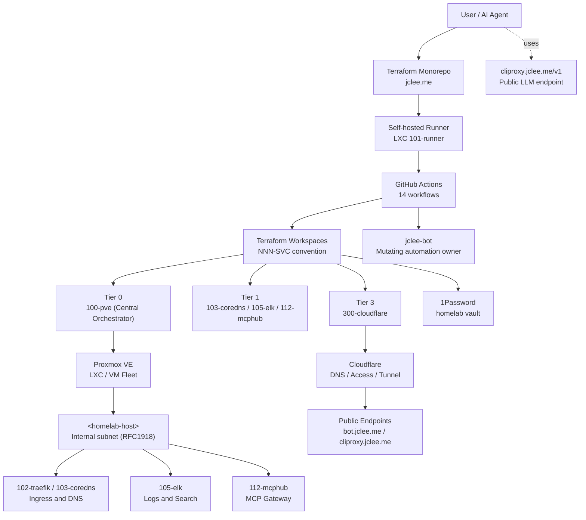

# Terraform Homelab Infrastructure / Terraform Homelab 인프라

> **Bilingual README** — 한국어 본문이 영어보다 먼저 옵니다. (Korean precedes English.)
>
> README auto-sync target: <https://bot.jclee.me>
> Public LLM endpoint: <https://cliproxy.jclee.me/v1>
> Generated by `gpt-5.5` (fallback: `minimax-m3` via CLIProxyAPI)

## Badges / 배지

| Category             | Detail                                                                                 |
| -------------------- | -------------------------------------------------------------------------------------- |
| IaC                  | Terraform `1.10.5` (`>= 1.7, < 2.0`)                                                   |
| Workspace Convention | Flat `NNN-SVC` (e.g. `100-pve`, `105-elk`, `300-cloudflare`)                           |
| CI/CD                | 14 GitHub Actions workflows under `.github/workflows/` — mutating flows owned by **jclee-bot** |
| Secret Backend       | 1Password `homelab` vault (12 items, 48 keys)                                          |
| Review Automation    | [qodo-ai/pr-agent](https://github.com/qodo-ai/pr-agent) + Dependabot auto-merge        |
| Security             | CodeQL · Gitleaks · Dependency Review · OpenSSF Scorecard                              |
| Internal Subnet      | `<homelab-host>/24` (RFC1918 — never published)                                        |
| Public Endpoint      | <https://cliproxy.jclee.me/v1>                                                         |
| Docs Mirror          | <https://bot.jclee.me>                                                                 |
| License              | MIT                                                                                    |

---

# 한국어

## 1. 개요

이 저장소는 `jclee.me` 호멜랩과 관련 외부 서비스를 코드로 관리하기 위한 **Infrastructure-as-Code 모노레포**입니다. Proxmox LXC/VM 플릿, 내부 DNS, ELK 관측 스택, MCP 허브, 그리고 Cloudflare 같은 외부 서비스를 **Terraform 워크스페이스** 단위로 프로비저닝하며, 1Password 시크릿 주입과 GitHub Actions 기반 CI/CD로 완전 자동화되어 있습니다.

- **도메인**: `jclee.me`
- **내부 서브넷**: `<homelab-host>/24` (RFC1918, 절대 외부 게시 금지)
- **공개 LLM 엔드포인트**: <https://cliproxy.jclee.me/v1>
- **Terraform**: `1.10.5` (`>= 1.7, < 2.0`)
- **워크스페이스 컨벤션**: `NNN-SVC` 평탄화 (`100-pve`, `105-elk`, `300-cloudflare` 등)
- **런타임**: Self-hosted GitHub Actions Runner (`101-runner` LXC)
- **자동화 운영자**: 모든 변경(mutating) 워크플로우는 `jclee-bot`이 소유·서명

## 2. 핵심 특징

- **단일 진실 공급원(SSOT)**: `100-pve/envs/prod/hosts.tf` 한 곳에서 모든 호스트의 IP, VMID, 역할, 포트를 정의합니다.
- **선언적 구성 파이프라인**: `hosts.tf → module.hosts → onepassword_secrets + config_renderer → templatefile(*.tftpl) → configs/ → SSH 배포`.
- **1Password 시크릿 주입**: `modules/shared/onepassword-secrets` 모듈이 `homelab` 볼트에서 키-값을 동적으로 가져옵니다.
- **레이어 분리**: Tier 0(코어) → Tier 1(인프라) → Tier 2(앱) → Tier 3(외부)로 명확히 분리하여 부분 적용이 가능합니다.
- **로컬 상태 + Git 커밋**: 원격 백엔드 없이 `.tfstate`를 Git에 커밋하고, CI 동시성 그룹이 적용을 직렬화합니다.
- **자급식 옵저버빌리티**: `105-elk` 워크스페이스가 Logstash/Filebeat 파이프라인을 IaC로 관리합니다.
- **MCP 허브**: `112-mcphub` 워크스페이스가 n8n 같은 다운스트림 앱에 MCP 서버를 안전하게 노출합니다.
- **보안 자동화**: `jclee-bot`이 CodeQL, Gitleaks, Dependency Review, OpenSSF Scorecard, PR auto-fix를 자동 운영합니다.

## 3. 아키텍처


```mermaid
flowchart TB
    Agent["User / AI Agent"] --> Repo["Terraform Monorepo<br/>jclee.me"]
    Repo --> Runner["Self-hosted Runner<br/>LXC 101-runner"]
    Runner --> CI["GitHub Actions<br/>14 workflows"]
    CI --> WK["Terraform Workspaces<br/>NNN-SVC convention"]
    WK --> T0["Tier 0<br/>100-pve (Central Orchestrator)"]
    WK --> T1["Tier 1<br/>103-coredns / 105-elk / 112-mcphub"]
    WK --> T3["Tier 3<br/>300-cloudflare"]
    T0 --> PVE["Proxmox VE<br/>LXC / VM Fleet"]
    PVE --> Fleet["&lt;homelab-host&gt;<br/>Internal subnet (RFC1918)"]
    Fleet --> Edge["102-traefik / 103-coredns<br/>Ingress and DNS"]
    Fleet --> Obs["105-elk<br/>Logs and Search"]
    Fleet --> MCP["112-mcphub<br/>MCP Gateway"]
    T3 --> CF["Cloudflare<br/>DNS / Access / Tunnel"]
    CF --> Public["Public Endpoints<br/>bot.jclee.me / cliproxy.jclee.me"]
    WK --> OP["1Password<br/>homelab vault"]
    CI --> Bot["jclee-bot<br/>Mutating automation owner"]
    Agent -.uses.-> LLM["cliproxy.jclee.me/v1<br/>Public LLM endpoint"]
```

- **Tier 0 (`100-pve`)**: 모든 LXC/VM 라이프사이클을 결정하는 중앙 오케스트레이터. `locals.tf`(사이징) + `envs/prod/hosts.tf`(호스트 SSOT).
- **Tier 1 (`103-coredns`, `105-elk`, `112-mcphub`)**: Proxmox 의존 인프라. `100-pve`의 `remote_state`를 소비합니다.
- **Tier 3 (`300-cloudflare`)**: Proxmox와 무관한 외부 서비스. 어떤 순서로든 적용 가능합니다.
- **Runner**: Self-hosted GitHub Actions Runner가 변경 워크플로우의 실행 환경입니다.
- **공개/내부 분리**: 모든 사설 IP와 컨테이너 번호는 `<homelab-host>`, `<homelab-elk>` 같은 자리표시자로만 표기합니다.

## 4. 저장소 구조

저장소 최상위 디렉터리는 다음과 같습니다.

```text
.
├── AGENTS.md             # AI 에이전트용 프로젝트 지식 베이스
├── ARCHITECTURE.md       # 전체 아키텍처 레퍼런스
├── CODE_STYLE.md         # 네이밍, 파일 구조, 변수, 템플릿 규약
├── CONTRIBUTING.md       # 기여 절차 및 PR 가이드
├── DEPENDENCY_MAP.md     # 모듈 의존성 그래프 + 템플릿 인벤토리
├── LICENSE               # MIT 라이선스
├── Makefile              # `make plan|apply|lint|test|...` 단일 진입점
├── OWNERS                # 코드 오너십 명단
├── OWNERS_ALIASES        # GitHub 별칭 매핑
├── README.md             # 본 문서
├── build.env             # 빌드 환경 변수
├── 103-coredns/          # Tier 1: CoreDNS (내부 DNS)
│   ├── AGENTS.md
│   ├── README.md
│   └── templates/        # *.tftpl 렌더링 입력
├── 105-elk/              # Tier 1: ELK 옵저버빌리티
│   ├── AGENTS.md
│   ├── docker-compose.yml
│   ├── ilm-policy.json
│   ├── scripts/          # Go 운영 도구
│   ├── config/           # 렌더링된 산출물 베이스라인
│   ├── templates/        # *.tftpl 렌더링 입력
│   └── terraform/        # 실제 IaC 모듈
├── 112-mcphub/           # Tier 1: MCP 허브 + n8n 패치
│   ├── AGENTS.md
│   ├── Dockerfile.*
│   ├── README.md
│   ├── mcp_servers.json
│   ├── validate_mcps.py
│   ├── patches/          # n8n 라이선스 패치 등
│   ├── op-mcp-server/    # 1Password 연동 MCP 서버
│   ├── config/           # 렌더링/패치 산출물 + Go 패처
│   └── templates/        # *.tftpl 렌더링 입력
└── 300-cloudflare/       # Tier 3: 외부 서비스 (Cloudflare)
    ├── AGENTS.md
    ├── README.md
    ├── main.tf
    ├── access.tf
    ├── dns.tf
    ├── identity-provider.tf
    ├── logpush.tf
    ├── locals.tf
    ├── onepassword.tf
    ├── checks.tf
    ├── outputs.tf
    ├── outputs-homelab.tf
    ├── outputs-jclee.tf
    └── outputs-synology.tf
```

> 참고: `_bot-scripts/` 같은 디렉터리는 **실제 저장소에는 존재하지 않는 일시적 CI 체크아웃 경로**입니다. 실제 트리에는 포함되지 않습니다.

## 5. jclee-bot 자동화 표면(jclee-bot Automation Surfaces)

`jclee-bot`은 **변경(mutating) 자동화 작업의 단일 소유자**입니다. 워크플로우 파일(`.github/workflows/*.yml`)은 트리거 구현일 뿐이며, 자동화의 진실은 다음 표면(surface)에 있습니다.

| 표면(Surface)                       | 소유자          | 설명                                                                                              |
| ----------------------------------- | --------------- | ------------------------------------------------------------------------------------------------- |
| 이슈 분류·라벨링·라이프사이클        | `jclee-bot`     | 신규 이슈를 자동 분류하고, 작업 지시·자동 수정 라벨을 부착합니다. **jclee-bot에의해자동화됨** 마커가 붙은 코멘트는 봇이 정책에 따라 후속 조치를 수행합니다. |
| 이슈 → 브랜치 변환                   | `jclee-bot`     | 표준 라벨이 부착된 이슈를 작업 브랜치로 변환하여 PR 파이프라인을 즉시 시작합니다.                 |
| PR 리뷰·보안 리뷰                    | `jclee-bot`     | [qodo-ai/pr-agent](https://github.com/qodo-ai/pr-agent) 기반 일반 리뷰와 보안 전용 리뷰를 자동 운영합니다. |
| Dependabot / PR 자동 머지            | `jclee-bot`     | 정책에 부합하는 의존성 업데이트 및 CI 그린 PR을 자동 머지합니다.                                  |
| 머지된 PR 정리                       | `jclee-bot`     | 머지 후 원격 브랜치·스티키 코멘트·임시 산출물을 정리합니다.                                       |
| 자동 수정(bot auto-fix)              | `jclee-bot`     | Lint/포맷/간단한 리팩터링을 봇이 직접 커밋합니다.                                                  |
| 릴리스 노트·릴리스 게시              | `jclee-bot`     | 시맨틱 버전과 변경 로그를 자동 생성·게시합니다.                                                    |
| 다운스트림 헬스체크                  | `jclee-bot`     | 머지 후 외부 의존 서비스의 헬스를 확인하고 이슈를 자동 개설합니다.                                |
| CI 실패 → 이슈 자동 개설            | `jclee-bot`     | CI 실패를 감지하여 재현 정보가 포함된 이슈를 자동 생성합니다.                                     |
| 이슈 백필                            | `jclee-bot`     | 과거 이슈에 누락된 라벨·메타데이터를 일괄 보강합니다.                                             |

> 모든 워크플로우는 `jclee-bot` GitHub App 자격으로 커밋·머지됩니다. 사람이 개입해야 하는 비-표준 작업(예: 비밀키 회전, 티어 0 변경)은 `jclee-bot`이 자동으로 라벨·멘션을 통해 사람 승인을 요청합니다.

## 6. Go 도구(Go Tools)

저장소에는 stdlib 전용으로 작성된 Go 운영 도구가 포함되어 있습니다. CI/빌드 자동화 도구(`.github/workflows/*`)와는 별개이며, 서비스 부트스트랩과 IaC 후처리에 사용됩니다.

| 도구                                         | 위치                                | 역할                                                                  |
| -------------------------------------------- | ----------------------------------- | --------------------------------------------------------------------- |
| `remove-promtail`                            | `105-elk/scripts/remove-promtail.go` | Promtail 잔여 컨테이너/로그를 안전하게 제거합니다.                   |
| `setup-ilm`                                  | `105-elk/scripts/setup-ilm.go`       | Elasticsearch ILM 정책을 부트스트랩 시 적용합니다.                    |
| `setup-watcher`                              | `105-elk/scripts/setup-watcher.go`   | ELK Watcher 알람 룰을 코드 기반으로 등록합니다.                       |
| `entrypoint-patch`                           | `112-mcphub/config/entrypoint-patch.go` | 컨테이너 엔트리포인트를 결정론적으로 패치합니다.                  |

> 모든 Go 도구는 외부 의존성을 추가하지 않으며(`stdlib-only`), Terraform 또는 컨테이너 이미지 빌드 컨텍스트에서 직접 호출됩니다.

## 7. 빠른 시작

```bash
# 1) 저장소 클론
git clone <repo-url> terraform-homelab && cd terraform-homelab

# 2) 워크스페이스 별칭 확인
make help

# 3) 기본 워크스페이스(Tier 0) 초기화 및 플랜
SVC=100-pve make init
SVC=100-pve make plan
```

- `apply`는 의도적으로 **비활성화**되어 있습니다. 모든 변경은 PR을 통해 `jclee-bot`이 운영하는 GitHub Actions에서 적용됩니다.
- `make lint`는 Terraform 형식/보안 검사를 수행합니다(`tflint`, `tfsec`, `checkov`).

## 8. 로컬 개발

- **사전 요구사항**: Terraform `1.10.5`, `tflint`, `tfsec`, `pre-commit`, 1Password CLI(`op`)에 로그인된 세션.
- **시크릿 로컬 검증**: `op signin` 후 `SVC=105-elk make plan`을 실행하면 `onepassword-secrets` 모듈이 자격증명을 자동 주입합니다.
- **템플릿 디버깅**: `100-pve/configs/`는 절대 수동 편집하지 마세요. 모든 변경은 `*.tftpl`에서 시작해야 합니다.
- **워크플로우 디버깅**: `act`로 self-hosted 러너 환경을 로컬에서 시뮬레이션할 수 있으나, `jclee-bot` 자격이 필요한 워크플로우는 실제 러너에서만 동작합니다.
- **린트/포맷**: `make fmt && make lint`를 PR 전에 항상 실행하세요.

## 9. 명령어 참조

`Makefile`은 `NNN-SVC` 평탄화 컨벤션을 따르며, 짧은 별칭(예: `pve`, `elk`, `mcphub`)과 전체 경로(예: `100-pve`)를 모두 받습니다.

| 명령어                | 설명                                                                          |
| --------------------- | ----------------------------------------------------------------------------- |
| `make init`           | Terraform 초기화 (`SVC=100-pve` 기본)                                          |
| `make plan`           | 플랜을 `tfplan` 파일로 저장                                                   |
| `make apply`          | **비활성화** — 반드시 CI/CD 사용                                               |
| `make verify`         | 출력/상태 일관성 검증                                                          |
| `make lint`           | `tflint` + `tfsec` + `checkov`                                                |
| `make lint-go`        | Go 운영 도구 포맷/린트                                                        |
| `make fmt`            | `terraform fmt -recursive`                                                    |
| `make validate`       | `terraform validate`                                                          |
| `make drift-check`    | 실제 인프라와 상태의 드리프트 탐지                                             |
| `make test`           | 모든 Terraform 테스트 실행                                                    |
| `make test-unit`      | 단위 테스트                                                                   |
| `make test-integration` | 통합 테스트                                                                  |
| `make test-workspace` | 워크스페이스 단위 인수 테스트                                                  |
| `make backup`         | 상태 백업                                                                      |
| `make docs`           | 문서 재생성                                                                    |
| `make pre-commit-install` / `make pre-commit-run` | pre-commit 훅 설치/실행                                       |
| `make setup`          | 로컬 개발 환경 1회성 부트스트랩                                                |
| `make help`           | 사용 가능한 모든 타겟과 별칭 출력                                             |

별칭 맵(일부):

```text
pve        -> 100-pve
runner     -> 101-runner
traefik    -> 102-traefik/terraform
elk        -> 105-elk/terraform
supabase   -> 107-supabase
archon     -> 108-archon/terraform
n8n        -> 110-n8n
mcphub     -> 112-mcphub
cloudflare -> 300-cloudflare
gcp        -> 400-gcp
```

## 10. 기여 가이드

1. 이슈를 먼저 개설하거나 기존 이슈에 댓글을 남깁니다.
2. `jclee-bot`이 표준 라벨을 자동으로 부착합니다(예: `area/*`, `priority/*`, `risk/*`).
3. 이슈가 `ready-for-branch`로 표시되면 봇이 작업 브랜치를 생성합니다.
4. 작업 후 PR을 개설하면 `jclee-bot`이 [qodo-ai/pr-agent](https://github.com/qodo-ai/pr-agent) 리뷰를 자동 부착합니다.
5. 보안 관련 PR은 보안 리뷰 봇의 추가 검토를 거칩니다.
6. CI가 그린이고 정책에 부합하면 자동 머지됩니다.
7. 머지 후 `jclee-bot`이 브랜치 정리와 릴리스 노트 갱신을 수행합니다.
8. **티어 0 (`100-pve`) 변경**은 반드시 두 명 이상의 오너 승인이 필요하며, `jclee-bot`이 자동 머지를 보류합니다.

자세한 규약은 [CONTRIBUTING.md](./CONTRIBUTING.md), [CODE_STYLE.md](./CODE_STYLE.md), [ARCHITECTURE.md](./ARCHITECTURE.md)를 참고하세요. AD는 `docs/adr/`에 추가만 가능하며, 변경이 필요하면 새 ADR로 supersede합니다.

## 11. 라이선스

이 프로젝트는 [MIT](./LICENSE) 라이선스 하에 배포됩니다. 공개된 LLM 엔드포인트(<https://cliproxy.jclee.me/v1>)와 문서 미러(<https://bot.jclee.me>)는 커뮤니티용 공개 리소스입니다.

---

# English

## 1. Overview

This repository is an **Infrastructure-as-Code monorepo** that provisions the `jclee.me` homelab and its dependent external services. It manages a Proxmox LXC/VM fleet, internal DNS, ELK observability, an MCP hub, and external services (Cloudflare, etc.) as **Terraform workspaces**, with 1Password secret injection and a fully automated GitHub Actions CI/CD pipeline.

- **Domain**: `jclee.me`
- **Internal subnet**: `<homelab-host>/24` (RFC1918, never published)
- **Public LLM endpoint**: <https://cliproxy.jclee.me/v1>
- **Terraform**: `1.10.5` (`>= 1.7, < 2.0`)
- **Workspace convention**: Flat `NNN-SVC` (e.g. `100-pve`, `105-elk`, `300-cloudflare`)
- **Runtime**: Self-hosted GitHub Actions Runner (`101-runner` LXC)
- **Automation owner**: All mutating workflows are owned and signed by `jclee-bot`

## 2. Key Features

- **Single source of truth**: `100-pve/envs/prod/hosts.tf` defines every host's IP, VMID, role, and port.
- **Declarative config pipeline**: `hosts.tf → module.hosts → onepassword_secrets + config_renderer → templatefile(*.tftpl) → configs/ → SSH deploy`.
- **1Password secret injection**: The `modules/shared/onepassword-secrets` module fetches key/value pairs from the `homelab` vault.
- **Tiered separation**: Tier 0 (core) → Tier 1 (infra) → Tier 2 (apps) → Tier 3 (external) for partial applies.
- **Local state + Git-committed tfstate**: No remote backend; CI concurrency groups serialize applies.
- **Self-contained observability**: The `105-elk` workspace manages the Logstash/Filebeat pipeline as IaC.
- **MCP hub**: The `112-mcphub` workspace safely exposes MCP servers to downstream apps such as n8n.
- **Security automation**: `jclee-bot` operates CodeQL, Gitleaks, Dependency Review, OpenSSF Scorecard, and PR auto-fix automatically.

## 3. Architecture


```mermaid
flowchart TB
    Agent["User / AI Agent"] --> Repo["Terraform Monorepo<br/>jclee.me"]
    Repo --> Runner["Self-hosted Runner<br/>LXC 101-runner"]
    Runner --> CI["GitHub Actions<br/>14 workflows"]
    CI --> WK["Terraform Workspaces<br/>NNN-SVC convention"]
    WK --> T0["Tier 0<br/>100-pve (Central Orchestrator)"]
    WK --> T1["Tier 1<br/>103-coredns / 105-elk / 112-mcphub"]
    WK --> T3["Tier 3<br/>300-cloudflare"]
    T0 --> PVE["Proxmox VE<br/>LXC / VM Fleet"]
    PVE --> Fleet["&lt;homelab-host&gt;<br/>Internal subnet (RFC1918)"]
    Fleet --> Edge["102-traefik / 103-coredns<br/>Ingress and DNS"]
    Fleet --> Obs["105-elk<br/>Logs and Search"]
    Fleet --> MCP["112-mcphub<br/>MCP Gateway"]
    T3 --> CF["Cloudflare<br/>DNS / Access / Tunnel"]
    CF --> Public["Public Endpoints<br/>bot.jclee.me / cliproxy.jclee.me"]
    WK --> OP["1Password<br/>homelab vault"]
    CI --> Bot["jclee-bot<br/>Mutating automation owner"]
    Agent -.uses.-> LLM["cliproxy.jclee.me/v1<br/>Public LLM endpoint"]
```

- **Tier 0 (`100-pve`)**: Central orchestrator that decides every LXC/VM lifecycle. `locals.tf` (sizing) + `envs/prod/hosts.tf` (host SSoT).
- **Tier 1 (`103-coredns`, `105-elk`, `112-mcphub`)**: Proxmox-dependent infrastructure that consumes `remote_state` from `100-pve`.
- **Tier 3 (`300-cloudflare`)**: External services with no Proxmox dependency; can be applied in any order.
- **Runner**: A self-hosted GitHub Actions Runner is the execution environment for mutating workflows.
- **Public/internal separation**: All private IPs and container numbers are expressed as placeholders such as `<homelab-host>` and `<homelab-elk>`.

## 4. Repository Structure

The top-level layout of the repository is as follows.

```text
.
├── AGENTS.md             # AI agent project knowledge base
├── ARCHITECTURE.md       # Full architecture reference
├── CODE_STYLE.md         # Naming, file org, variable, template conventions
├── CONTRIBUTING.md       # Contribution procedure and PR guide
├── DEPENDENCY_MAP.md     # Module dependency graph + template inventory
├── LICENSE               # MIT license
├── Makefile              # Single entry point: `make plan|apply|lint|test|...`
├── OWNERS                # Code ownership list
├── OWNERS_ALIASES        # GitHub alias mapping
├── README.md             # This document
├── build.env             # Build environment variables
├── 103-coredns/          # Tier 1: CoreDNS (internal DNS)
│   ├── AGENTS.md
│   ├── README.md
│   └── templates/        # *.tftpl render inputs
├── 105-elk/              # Tier 1: ELK observability
│   ├── AGENTS.md
│   ├── docker-compose.yml
│   ├── ilm-policy.json
│   ├── scripts/          # Go operational tools
│   ├── config/           # Rendered output baseline
│   ├── templates/        # *.tftpl render inputs
│   └── terraform/        # Actual IaC module
├── 112-mcphub/           # Tier 1: MCP hub + n8n patches
│   ├── AGENTS.md
│   ├── Dockerfile.*
│   ├── README.md
│   ├── mcp_servers.json
│   ├── validate_mcps.py
│   ├── patches/          # n8n license patches, etc.
│   ├── op-mcp-server/    # 1Password-backed MCP server
│   ├── config/           # Render/patch outputs + Go patcher
│   └── templates/        # *.tftpl render inputs
└── 300-cloudflare/       # Tier 3: external service (Cloudflare)
    ├── AGENTS.md
    ├── README.md
    ├── main.tf
    ├── access.tf
    ├── dns.tf
    ├── identity-provider.tf
    ├── logpush.tf
    ├── locals.tf
    ├── onepassword.tf
    ├── checks.tf
    ├── outputs.tf
    ├── outputs-homelab.tf
    ├── outputs-jclee.tf
    └── outputs-synology.tf
```

> Note: Directories such as `_bot-scripts/` do **not** exist in this repository — that name only ever appears as a transient CI checkout path.

## 5. jclee-bot Automation Surfaces

`jclee-bot` is the **single owner of mutating automation**. Workflow files under `.github/workflows/*.yml` are merely implementation triggers; the source of truth for automation lives in the surfaces below.

| Surface                                | Owner         | Description                                                                                          |
| -------------------------------------- | ------------- | ---------------------------------------------------------------------------------------------------- |
| Issue triage, labeling, and lifecycle  | `jclee-bot`   | Auto-classifies new issues and applies actionable labels. Comments tagged **jclee-bot에의해자동화됨** are followed up by the bot per policy. |
| Issue → branch conversion              | `jclee-bot`   | Converts issues with standard labels into working branches and immediately starts the PR pipeline.    |
| PR review and security review          | `jclee-bot`   | Operates [qodo-ai/pr-agent](https://github.com/qodo-ai/pr-agent) for general review and a dedicated security review. |
| Dependabot / PR auto-merge             | `jclee-bot`   | Auto-merges dependency updates and CI-green PRs that satisfy policy.                                  |
| Merged PR cleanup                      | `jclee-bot`   | Cleans up remote branches, sticky comments, and temporary artifacts after merge.                      |
| Bot auto-fix                           | `jclee-bot`   | Commits lint/format/simple refactors directly.                                                        |
| Release notes / release publish        | `jclee-bot`   | Generates and publishes semantic versions and changelogs.                                             |
| Downstream health check                | `jclee-bot`   | Verifies downstream service health after merge and auto-opens issues.                                 |
| CI failure → issue creation            | `jclee-bot`   | Detects CI failures and opens issues with reproduction details.                                       |
| Issue backfill                         | `jclee-bot`   | Bulk-restores missing labels/metadata on legacy issues.                                               |

> All workflows commit and merge as the `jclee-bot` GitHub App. Non-standard work that requires human intervention (e.g. secret rotation, Tier 0 changes) is escalated by `jclee-bot` via labels and mentions requesting human approval.

## 6. Go Tools

The repository contains Go operational tools written with `stdlib only`. They are separate from the CI/build automation tools under `.github/workflows/*` and are used for service bootstrap and IaC post-processing.

| Tool                | Location                                | Role                                                                  |
| ------------------- | --------------------------------------- | --------------------------------------------------------------------- |
| `remove-promtail`   | `105-elk/scripts/remove-promtail.go`    | Safely removes residual Promtail containers/logs.                     |
| `setup-ilm`         | `105-elk/scripts/setup-ilm.go`          | Applies the Elasticsearch ILM policy at bootstrap.                     |
| `setup-watcher`     | `105-elk/scripts/setup-watcher.go`      | Registers ELK Watcher alarm rules from code.                          |
| `entrypoint-patch`  | `112-mcphub/config/entrypoint-patch.go` | Deterministically patches the container entrypoint.                   |

> All Go tools avoid external dependencies (`stdlib-only`) and are invoked directly from Terraform or container image build contexts.

## 7. Quick Start

```bash
# 1) Clone the repository
git clone <repo-url> terraform-homelab && cd terraform-homelab

# 2) Inspect workspace aliases
make help

# 3) Initialize and plan the default workspace (Tier 0)
SVC=100-pve make init
SVC=100-pve make plan
```

- `apply` is **intentionally disabled** locally. All changes are applied through PRs via GitHub Actions operated by `jclee-bot`.
- `make lint` runs Terraform format/security checks (`tflint`, `tfsec`, `checkov`).

## 8. Local Development

- **Prerequisites**: Terraform `1.10.5`, `tflint`, `tfsec`, `pre-commit`, and an authenticated 1Password CLI session (`op signin`).
- **Local secret verification**: After `op signin`, `SVC=105-elk make plan` triggers the `onepassword-secrets` module to inject credentials automatically.
- **Template debugging**: Never hand-edit `100-pve/configs/`. Any change must start from a `*.tftpl` file.
- **Workflow debugging**: You can simulate the self-hosted runner locally with `act`, but workflows that require `jclee-bot` credentials only run on the real runner.
- **Lint/format**: Always run `make fmt && make lint` before opening a PR.

## 9. Commands Reference

The `Makefile` follows the `NNN-SVC` flat convention and accepts both short aliases (e.g. `pve`, `elk`, `mcphub`) and full paths (e.g. `100-pve`).

| Command                              | Description                                                                                |
| ------------------------------------ | ------------------------------------------------------------------------------------------ |
| `make init`                          | Initialize Terraform (`SVC=100-pve` by default)                                            |
| `make plan`                          | Save the plan to `tfplan`                                                                  |
| `make apply`                         | **Disabled** — must go through CI/CD                                                       |
| `make verify`                        | Verify output/state consistency                                                            |
| `make lint`                          | `tflint` + `tfsec` + `checkov`                                                             |
| `make lint-go`                       | Format/lint Go operational tools                                                           |
| `make fmt`                           | `terraform fmt -recursive`                                                                 |
| `make validate`                      | `terraform validate`                                                                       |
| `make drift-check`                   | Detect drift between real infrastructure and state                                         |
| `make test`                          | Run all Terraform tests                                                                    |
| `make test-unit`                     | Unit tests                                                                                 |
| `make test-integration`              | Integration tests                                                                          |
| `make test-workspace`                | Workspace-level acceptance tests                                                           |
| `make backup`                        | State backup                                                                               |
| `make docs`                          | Regenerate documentation                                                                   |
| `make pre-commit-install` / `make pre-commit-run` | Install/run pre-commit hooks                                                  |
| `make setup`                         | One-time local development environment bootstrap                                           |
| `make help`                          | Print all available targets and aliases                                                    |

Alias map (excerpt):

```text
pve        -> 100-pve
runner     -> 101-runner
traefik    -> 102-traefik/terraform
elk        -> 105-elk/terraform
supabase   -> 107-supabase
archon     -> 108-archon/terraform
n8n        -> 110-n8n
mcphub     -> 112-mcphub
cloudflare -> 300-cloudflare
gcp        -> 400-gcp
```

## 10. Contribution Guide

1. Open an issue first, or comment on an existing one.
2. `jclee-bot` automatically attaches standard labels (e.g. `area/*`, `priority/*`, `risk/*`).
3. When the issue is marked `ready-for-branch`, the bot creates a working branch.
4. Open a PR after your work is complete; `jclee-bot` attaches a [qodo-ai/pr-agent](https://github.com/qodo-ai/pr-agent) review automatically.
5. Security-related PRs go through an additional security review bot.
6. PRs that are CI green and satisfy policy are auto-merged.
7. After merge, `jclee-bot` cleans up the branch and refreshes the release notes.
8. **Tier 0 (`100-pve`) changes** always require approval from at least two owners; `jclee-bot` withholds auto-merge for these.

See [CONTRIBUTING.md](./CONTRIBUTING.md), [CODE_STYLE.md](./CODE_STYLE.md), and [ARCHITECTURE.md](./ARCHITECTURE.md) for the full conventions. ADRs are append-only under `docs/adr/`; supersede changes by adding a new ADR.

## 11. License

This project is distributed under the [MIT](./LICENSE) license. The public LLM endpoint (<https://cliproxy.jclee.me/v1>) and the documentation mirror (<https://bot.jclee.me>) are community resources.