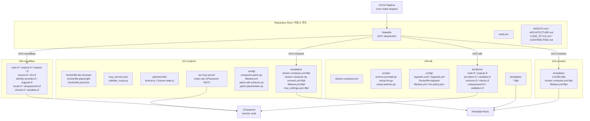

# Homelab Infrastructure Monorepo / 홈랩 인프라 모노레포

> **Manual `apply` is disabled. All changes deploy through CI/CD.**
> **수동 `apply`는 비활성화되어 있습니다. 모든 변경 사항은 CI/CD를 통해 배포됩니다.**

A monorepo of self-contained infrastructure-as-code (IaC) workspaces for a personal homelab and a small set of external (cloud) integrations. Every workspace is named with a flat `NNN-SERVICE` identifier and managed through a single top-level `Makefile`.

개인 홈랩과 소규모 외부(클라우드) 통합을 위한 독립형 인프라스트럭처-코드(IaC) 워크스페이스 모노레포입니다. 각 워크스페이스는 `NNN-SERVICE` 형식의 평탄한(flat) 식별자로 명명되며, 최상위 `Makefile` 하나로 전부 제어합니다.

---

## Table of Contents / 목차

- [Overview / 개요](#overview--개요)
- [Features / 주요 기능](#features--주요-기능)
- [Architecture / 아키텍처](#architecture--아키텍처)
- [Repository Layout / 저장소 구성](#repository-layout--저장소-구성)
- [Workspaces / 워크스페이스](#워크스페이스)
- [Numbering Convention / 번호 규칙](#numbering-규칙)
- [Quick Start / 빠른 시작](#quick-start--빠른-시작)
- [Configuration / 설정](#configuration--설정)
- [Commands Reference / 명령어 참조](#commands-reference--명령어-참조)
- [Local Development / 로컬 개발](#local-development--로컬-개발)
- [Testing / 테스트](#testing--테스트)
- [Contributing / 기여 방법](#contributing--기여-방법)
- [License / 라이선스](#license--라이선스)
- [Additional Documentation / 추가 문서](#additional-문서)

---

## Overview / 개요

This repository hosts every piece of IaC used to run the homelab and its satellite integrations. There are **no application sources** here — only the manifests, Terraform modules, templates, and helper scripts needed to deploy them.

이 저장소는 홈랩과 위성 통합을 운영하는 데 필요한 모든 IaC를 한곳에 모아둔 곳입니다. 여기에는 **애플리케이션 소스는 없으며**, 배포에 필요한 매니페스트, Terraform 모듈, 템플릿, 보조 스크립트만 포함됩니다.

Each workspace is a self-contained deployment unit. Three flavors are supported:

| Flavor / 종류 | Purpose / 용도 | Examples / 예시 |
| --- | --- | --- |
| **Terraform** | Provision external APIs (Cloudflare, GitHub, GCP, Slack, …) and bootstrap local hosts. Some expose a nested `terraform/` directory. / 외부 API 프로비저닝 및 로컬 호스트 부트스트랩 | `300-cloudflare/`, `105-elk/terraform/` |
| **docker-compose** | Run containerized services on the homelab with rendered templates. / 홈랩에서 컨테이너 서비스 실행 | `105-elk/`, `103-coredns/templates/` |
| **Hybrid** | Compose stack + Terraform side-by-side for shared infrastructure. / 컴포즈 스택과 Terraform 공존 | `105-elk/` |

The monorepo favors:

- **One entry point** — `make <target> SVC=<workspace>` from the repository root.
- **Secret safety** — sensitive values come from 1Password via `onepassword.tf` providers; no plaintext secrets in git.
- **Reproducibility** — every workspace renders its manifests from a small set of `.tftpl` templates.

모노레포는 다음을 지향합니다:

- **단일 진입점** — 저장소 루트에서 `make <target> SVC=<workspace>`.
- **비밀 안전** — 민감한 값은 `onepassword.tf` 프로바이더를 통해 1Password에서 가져옵니다.
- **재현성** — 각 워크스페이스는 소수의 `.tftpl` 템플릿에서 매니페스트를 렌더링합니다.

---

## Features / 주요 기능

- **Flat workspace layout** — every service lives under a numbered directory; no nested monorepo tooling required.
- **Single Makefile dispatch** — `make plan`, `make apply`, `make verify`, `make fmt`, `make validate`, `make test` all route through one entry point and accept `SVC=` to pick the workspace.
- **CI/CD-only apply** — manual `apply` is intentionally blocked; only the pipeline can mutate state.
- **1Password-backed secrets** — `onepassword.tf` modules fetch secrets at plan/apply time.
- **Template-driven Compose stacks** — `.tftpl` templates render `docker-compose.yml`, `filebeat.yml`, `Corefile`, and similar.
- **Go helper scripts** — workspace-scoped utilities (`remove-promtail.go`, `setup-ilm.go`, `setup-watcher.go`, `entrypoint-patch.go`) for one-off operational tasks.
- **Validation surfaces** — `checks.tf`, `validation.tf`, and `validate_mcps.py` enforce correctness before plan.
- **Pre-commit hooks** — `make pre-commit-install` wires up the local quality gate.

---

## Architecture / 아키텍처


```mermaid
flowchart TB
    subgraph Repo["Repository Root / 저장소 루트"]
        MK["Makefile<br/>(SVC dispatcher)"]
        BE["build.env"]
        DOC["AGENTS.md / ARCHITECTURE.md<br/>CODE_STYLE.md / CONTRIBUTING.md"]
    end

    subgraph Ws103["103-coredns"]
        T103["templates/<br/>Corefile.tftpl<br/>docker-compose.yml.tftpl<br/>filebeat.yml.tftpl"]
    end

    subgraph Ws105["105-elk"]
        DC105["docker-compose.yml"]
        SCR105["scripts/<br/>remove-promtail.go<br/>setup-ilm.go<br/>setup-watcher.go"]
        CFG105["config/<br/>logstash.conf / logstash.yml<br/>Dockerfile.logstash<br/>filebeat.yml / ilm-policy.json"]
        T105["templates/<br/>*.tftpl"]
        TF105["terraform/<br/>main.tf / outputs.tf<br/>providers.tf / variables.tf<br/>versions.tf / checks.tf<br/>onepassword.tf / validation.tf"]
    end

    subgraph Ws112["112-mcphub"]
        DF112["Dockerfile.dev-browser<br/>Dockerfile.playwright<br/>Dockerfile.proxmox"]
        MCP112["mcp_servers.json<br/>validate_mcps.py"]
        P112["patches/n8n/<br/>license.js / license-state.js"]
        OPC112["op-mcp-server/<br/>index.mjs (1Password MCP)"]
        CFG112["config/<br/>entrypoint-patch.go<br/>filebeat.yml<br/>patch-sdk-schema.cjs<br/>patch-placeholder.cjs"]
        T112["templates/<br/>docker-compose.yml.tftpl<br/>docker-compose-op-connect.yml.tftpl<br/>filebeat.yml.tftpl<br/>mcp_settings.json.tftpl"]
    end

    subgraph Ws300["300-cloudflare"]
        TF300["main.tf / outputs.tf / outputs-*.tf<br/>access.tf / dns.tf<br/>identity-provider.tf / logpush.tf<br/>locals.tf / onepassword.tf<br/>checks.tf / variables.tf"]
    end

    CICD["CI/CD Pipeline<br/>(runs make targets)"]

    MK -- "SVC=elk" --> TF105
    MK -- "SVC=mcphub" --> T112
    MK -- "SVC=cloudflare" --> TF300
    MK -- "SVC=coredns" --> T103

    TF105 --> OP["1Password<br/>secrets vault"]
    TF300 --> OP
    OPC112 --> OP

    T103 --> Hosts["Homelab Hosts"]
    T105 --> Hosts
    T112 --> Hosts

    CICD --> MK
```

The monorepo acts as a thin dispatch layer over many small, single-purpose IaC units. Secrets flow from 1Password into Terraform at plan time; rendered manifests and Compose files are applied to the homelab through the CI/CD pipeline only.

모노레포는 작고 단일 책임인 다수의 IaC 유닛 위에 얇은 디스패치 계층 역할을 합니다. 비밀은 1Password에서 플랜 시점으로 Terraform에 흘러 들어가고, 렌더링된 매니페스트와 Compose 파일은 오직 CI/CD 파이프라인을 통해서만 홈랩에 적용됩니다.

---

## Repository Layout / 저장소 구성

```
.
├── Makefile                  # Single entry point for all workspaces
├── build.env                 # Shared environment variables consumed by Makefile
├── AGENTS.md                 # Agent / contributor guide for the repo root
├── ARCHITECTURE.md           # Cross-workspace architecture notes
├── CODE_STYLE.md             # Formatting and style conventions
├── CONTRIBUTING.md           # Contribution workflow
├── DEPENDENCY_MAP.md         # Inter-workspace dependency graph
├── LICENSE                   # Repository license
├── OWNERS, OWNERS_ALIASES    # Code review ownership
├── README.md                 # This file
├── 103-coredns/              # CoreDNS templates for homelab DNS
├── 105-elk/                  # ELK stack (Compose + Terraform + helpers)
├── 112-mcphub/               # MCP Hub (Dockerfiles, patches, templates)
└── 300-cloudflare/           # Cloudflare edge configuration (Terraform)
```

Each numbered workspace follows its own internal layout (see per-workspace `README.md` / `AGENTS.md` when present).

번호가 매겨진 각 워크스페이스는 자체 내부 레이아웃을 따릅니다 (필요한 경우 워크스페이스별 `README.md` / `AGENTS.md` 참조).

---

## Workspaces / 워크스페이스

### `103-coredns` — CoreDNS templates

A templates-only workspace that renders the CoreDNS configuration, the Compose stack that runs it, and the Filebeat sidecar that ships its logs.

CoreDNS 설정, 이를 실행하는 Compose 스택, 로그를 전송하는 Filebeat 사이드카를 렌더링하는 템플릿 전용 워크스페이스입니다.

| Path / 경로 | Role / 역할 |
| --- | --- |
| `templates/Corefile.tftpl` | CoreDNS zone definition template |
| `templates/docker-compose.yml.tftpl` | Compose stack for the CoreDNS container |
| `templates/filebeat.yml.tftpl` | Filebeat input/output template |

### `105-elk` — ELK stack (hybrid)

A combined Compose and Terraform workspace that deploys Elasticsearch, Logstash, Kibana, Filebeat, and Promtail alongside the ILM policy that retains them.

Elasticsearch, Logstash, Kibana, Filebeat, Promtail과 이를 보존하는 ILM 정책을 함께 배포하는 Compose + Terraform 하이브리드 워크스페이스입니다.

| Path / 경로 | Role / 역할 |
| --- | --- |
| `docker-compose.yml` | Compose stack pinned to the homelab |
| `scripts/remove-promtail.go` | Go helper to uninstall Promtail cleanly |
| `scripts/setup-ilm.go` | Go helper to apply the ILM policy |
| `scripts/setup-watcher.go` | Go helper to register a watch / alert |
| `config/Dockerfile.logstash` | Custom Logstash image |
| `config/filebeat.yml` | Filebeat config |
| `config/ilm-policy.json` | Index Lifecycle Management policy |
| `config/logstash.conf`, `logstash.yml` | Logstash pipeline and runtime config |
| `templates/*.tftpl` | Compose, Filebeat, Logstash, ILM, Dockerfile templates |
| `terraform/main.tf`, `outputs.tf`, `providers.tf`, `variables.tf`, `versions.tf` | Terraform entry points |
| `terraform/checks.tf`, `validation.tf` | Pre-plan assertions |
| `terraform/onepassword.tf` | 1Password-backed secret wiring |

### `112-mcphub` — MCP Hub

The workspace for the MCP (Model Context Protocol) hub: a set of MCP servers, custom container images, runtime patches, and rendered Compose stacks.

MCP(Model Context Protocol) 허브를 위한 워크스페이스로, MCP 서버 모음, 커스텀 컨테이너 이미지, 런타임 패치, 렌더링된 Compose 스택을 포함합니다.

| Path / 경로 | Role / 역할 |
| --- | --- |
| `Dockerfile.dev-browser` | Browser image used by the MCP dev tools |
| `Dockerfile.playwright` | Playwright image used by automation MCPs |
| `Dockerfile.proxmox` | Proxmox-aware MCP image |
| `mcp_servers.json` | MCP server registry consumed by `validate_mcps.py` |
| `validate_mcps.py` | Static validator for `mcp_servers.json` |
| `patches/n8n/license.js`, `license-state.js` | n8n license state patches |
| `op-mcp-server/index.mjs` | 1Password-backed MCP server (Node) |
| `config/entrypoint-patch.go` | Go helper that patches the entrypoint of managed containers |
| `config/filebeat.yml` | Filebeat config shared with the stack |
| `config/patch-sdk-schema.cjs`, `patch-placeholder.cjs` | Runtime schema patches |
| `templates/*.tftpl` | Compose, Filebeat, MCP settings templates |

### `300-cloudflare` — Cloudflare edge (Terraform)

A pure-Terraform workspace that manages the Cloudflare account: DNS, Access policies, identity providers, Logpush jobs, and exported outputs split per consumer.

Cloudflare 계정을 관리하는 순수 Terraform 워크스페이스로, DNS, Access 정책, Identity Provider, Logpush 작업, 그리고 소비자별로 분리된 출력(output)을 포함합니다.

| Path / 경로 | Role / 역할 |
| --- | --- |
| `main.tf` | Module composition and resources |
| `access.tf` | Cloudflare Access applications and policies |
| `dns.tf` | DNS records |
| `identity-provider.tf` | External IdP integration |
| `logpush.tf` | Logpush jobs |
| `locals.tf` | Shared local values |
| `onepassword.tf` | 1Password-backed secret wiring |
| `outputs.tf`, `outputs-homelab.tf`, `outputs-jclee.tf`, `outputs-synology.tf` | Split outputs per consumer |
| `checks.tf` | Pre-plan assertions |

> The Makefile also defines aliases for other workspaces (`pve`, `traefik`, `supabase`, `archon`, `n8n`, `synology`, `youtube`, `github`, `safetywallet`, `slack`, `gcp`, …). Each lives under its own `NNN-SERVICE` directory; consult its `AGENTS.md` / `README.md` when working on it.
>
> Makefile에는 다른 워크스페이스(`pve`, `traefik`, `supabase`, `archon`, `n8n`, `synology`, `youtube`, `github`, `safetywallet`, `slack`, `gcp` 등)에 대한 별칭도 정의되어 있습니다. 각 워크스페이스는 자체 `NNN-SERVICE` 디렉터리에 있으며, 작업 시 해당 `AGENTS.md` / `README.md`를 참조하세요.

---

## Numbering Convention / 번호 규칙

The flat prefix is meaningful:

평탄한 접두사는 의미를 가집니다:

- `1`–`255` — internal homelab infrastructure (services that run on the private LAN).
- `300`+ — external / cloud integrations (Cloudflare, GitHub, GCP, Slack, …).

A few in-tree examples:

| Range / 범위 | Meaning / 의미 | Examples / 예시 |
| --- | --- | --- |
| `1`–`255` | Internal / 내부 | `103-coredns`, `105-elk`, `112-mcphub` |
| `300`+ | External / 외부 | `300-cloudflare` |

The `Makefile` exposes both the full path (`100-pve`) and a short alias (`pve`) for every workspace.

`Makefile`는 모든 워크스페이스에 대해 전체 경로(`100-pve`)와 짧은 별칭(`pve`)을 모두 제공합니다.

---

## Quick Start / 빠른 시작

```bash
# 1. Clone the repository
git clone <your-fork-or-origin-url> homelab && cd homelab

# 2. Inspect available workspaces and aliases
make help

# 3. Pick a workspace and run a plan (CI/CD is the only thing that applies)
SVC=cloudflare make plan
SVC=elk       make plan
SVC=mcphub    make plan
SVC=coredns   make plan

# 4. Validate without touching state
SVC=cloudflare make validate
```

### Prerequisites / 사전 요구 사항

- GNU Make
- Terraform (matching the `versions.tf` constraint of the workspace you target)
- Docker + Docker Compose (for Compose-style workspaces)
- A reachable 1Password Connect server (so `onepassword.tf` providers can resolve secrets)
- Go ≥ 1.21 (only required if you build the helper scripts locally)
- Python ≥ 3.10 (only required to run `112-mcphub/validate_mcps.py`)

---

## Configuration / 설정

### `build.env`

A shared environment file at the repository root consumed by the Makefile. It typically defines variables such as the default `SVC`, `TF_PLUGIN_CACHE_DIR`, `TF_IN_AUTOMATION`, and 1Password Connect endpoints. Source it before running targets:

저장소 루트의 공유 환경 파일로, Makefile이 참조합니다. 일반적으로 기본 `SVC`, `TF_PLUGIN_CACHE_DIR`, `TF_IN_AUTOMATION`, 1Password Connect 엔드포인트 등을 정의합니다. 타겟 실행 전에 소싱하세요:

```bash
set -a; source build.env; set +a
```

### Per-workspace configuration / 워크스페이스별 설정

- **Terraform workspaces** — `variables.tf` declares inputs; `onepassword.tf` fetches secrets. Override variables via a `terraform.tfvars` (gitignored) or `-var` flags on `make plan`.
- **Compose workspaces** — adjust values by editing the `.tftpl` templates, then re-render (the pipeline does this automatically).

### MCP servers / MCP 서버

`112-mcphub/mcp_servers.json` is the registry of MCP servers the hub exposes. Run `make test` (or `python3 112-mcphub/validate_mcps.py`) after any change to it.

`112-mcphub/mcp_servers.json`은 허브가 노출하는 MCP 서버의 레지스트리입니다. 변경 후에는 `make test` (또는 `python3 112-mcphub/validate_mcps.py`)를 실행하세요.

---

## Commands Reference / 명령어 참조

All commands are run from the repository root. `SVC` picks the workspace; both full paths and short aliases work. The default is `SVC=100-pve`.

모든 명령어는 저장소 루트에서 실행합니다. `SVC`로 워크스페이스를 선택하며, 전체 경로와 짧은 별칭 모두 사용할 수 있습니다. 기본값은 `SVC=100-pve`입니다.

| Target / 타겟 | Description / 설명 |
| --- | --- |
| `make init SVC=<ws>` | Run `terraform init` in the selected workspace. |
| `make plan SVC=<ws>` | Produce a `tfplan` file; safe to run locally. |
| `make apply SVC=<ws>` | **Disabled.** The CI/CD pipeline is the only path that mutates state. |
| `make verify SVC=<ws>` | Verify rendered resources against expected state. |
| `make validate SVC=<ws>` | Run `terraform validate` plus pre-plan checks. |
| `make drift-check SVC=<ws>` | Detect drift between live state and configuration. |
| `make fmt SVC=<ws>` | Format Terraform and helper sources. |
| `make lint SVC=<ws>` | Run repository-wide linters. |
| `make lint-go` | Lint the Go helper scripts (workspaces that ship them). |
| `make backup` | Snapshot Terraform state for the selected workspace. |
| `make test` | Run all tests. |
| `make test-unit` | Run unit tests only. |
| `make test-integration` | Run integration tests only. |
| `make test-workspace SVC=<ws>` | Run tests scoped to a workspace. |
| `make docs` | Regenerate workspace documentation. |
| `make pre-commit-install` | Install the local pre-commit hooks. |
| `make pre-commit-run` | Run all pre-commit hooks against the tree. |
| `make setup` | Bootstrap a fresh clone (hooks, env, tool checks). |
| `make help` | Print every available target with its description. |

> If you invoke `make` with an unknown `SVC`, the Makefile prints the list of valid direct paths and aliases before exiting with a non-zero status.
>
> 알 수 없는 `SVC`로 `make`를 호출하면, Makefile은 유효한 직접 경로와 별칭 목록을 출력한 후 비정상 종료합니다.

---

## Local Development / 로컬 개발

1. **Bootstrap** — `make setup` installs hooks and validates the toolchain.
2. **Pick a workspace** — `SVC=elk make plan` to start with a stack that exercises both Compose and Terraform.
3. **Iterate on templates** — edit `*.tftpl` files; the pipeline re-renders Compose manifests from them.
4. **Iterate on Terraform** — edit `*.tf`; `make fmt` keeps formatting consistent, `make validate` checks it locally before you push.
5. **Pre-commit** — `make pre-commit-run` before opening a PR to catch the same things CI will catch.
6. **Helper scripts** — Go helpers (`scripts/*.go`, `config/entrypoint-patch.go`) can be built with `go build ./...` from the workspace root.

Useful environment knobs:

- `TF_PLUGIN_CACHE_DIR` — share downloaded providers across workspaces (set in `build.env`).
- `TF_IN_AUTOMATION=1` — silence interactive prompts.
- `OP_CONNECT_HOST`, `OP_CONNECT_TOKEN` — 1Password Connect endpoint and token for `onepassword.tf`.

---

## Testing / 테스트

| Layer / 계층 | Tool / 도구 | Command / 명령어 |
| --- | --- | --- |
| Terraform format / 포맷 | `terraform fmt -check -recursive` | `make fmt` |
| Terraform validate / 검증 | `terraform validate` + `checks.tf` / `validation.tf` | `make validate` |
| Terraform plan / 플랜 | `terraform plan -out=tfplan` | `make plan` |
| Go helpers / Go 보조 스크립트 | `go vet`, `go test` | `make lint-go` |
| MCP registry / MCP 레지스트리 | `validate_mcps.py` | `make test` (runs it for `112-mcphub`) |
| Pre-commit / 프리커밋 | `pre-commit run --all-files` | `make pre-commit-run` |
| Unit tests / 단위 테스트 | repo unit suites | `make test-unit` |
| Integration tests / 통합 테스트 | repo integration suites | `make test-integration` |

CI runs `make verify`, `make validate`, `make lint`, and `make test` on every workspace touched by a change.

CI는 변경된 모든 워크스페이스에 대해 `make verify`, `make validate`, `make lint`, `make test`를 실행합니다.

---

## Contributing / 기여 방법

1. Read `CONTRIBUTING.md` and `CODE_STYLE.md` before opening a PR.
2. Create a topic branch: `git checkout -b <NNN-workspace>/<short-topic>`.
3. Run `make pre-commit-install` once after cloning.
4. Make your changes; keep templates and Terraform in lock-step with the rendered output.
5. Validate locally: `make fmt && make validate && make pre-commit-run`.
6. Open a PR against `master`. Code ownership is enforced via `OWNERS` / `OWNERS_ALIASES`.
7. Merge only after CI is green — production state changes go through the pipeline, never a local `apply`.

For deeper architectural context, see `ARCHITECTURE.md` and `DEPENDENCY_MAP.md` at the repository root.

---

## License / 라이선스

Released under the terms described in [`LICENSE`](./LICENSE).

[`LICENSE`](./LICENSE) 파일에 명시된 조건에 따라 배포됩니다.

---

## Additional Documentation / 추가 문서

| File / 파일 | Purpose / 용도 |
| --- | --- |
| `AGENTS.md` | Repo-root guide for AI agents and contributors |
| `ARCHITECTURE.md` | Cross-workspace architecture description |
| `CODE_STYLE.md` | Formatting and style rules |
| `CONTRIBUTING.md` | Contribution workflow |
| `DEPENDENCY_MAP.md` | Inter-workspace dependency graph |
| `OWNERS`, `OWNERS_ALIASES` | Code review ownership |
| `Makefile` | Single dispatch surface for every workspace |
| `build.env` | Shared environment variables |

Each workspace also ships its own `AGENTS.md` and often a `README.md` with workspace-specific guidance.