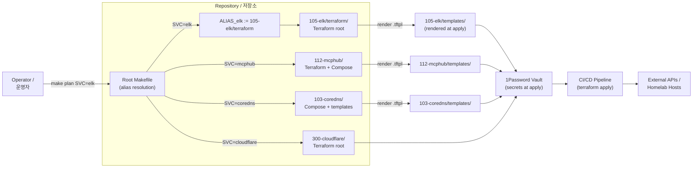

# Homelab Infrastructure Monorepo / 홈랩 인프라 모노레포

> **Manual `apply` is disabled. All changes deploy through CI/CD.**
> **수동 `apply`는 비활성화되어 있습니다. 모든 변경 사항은 CI/CD를 통해 배포됩니다.**

A monorepo of self-contained infrastructure-as-code (IaC) workspaces for a personal homelab and a small set of external (cloud) integrations. Every workspace is named with a flat `NNN-SERVICE` identifier and managed through a single top-level `Makefile`.

개인 홈랩과 소규모 외부(클라우드) 통합을 위한 독립형 인프라스트럭처-코드(IaC) 워크스페이스 모노레포입니다. 각 워크스페이스는 `NNN-SERVICE` 형식의 평탄한(flat) 식별자로 명명되며, 최상위 `Makefile` 하나로 전부 제어합니다.

---

## Table of Contents / 목차

- [Overview / 개요](#overview--개요)
- [Features / 주요 기능](#features--주요-기능)
- [Architecture / 아키텍처](#architecture--아키텍처)
- [Repository Layout / 저장소 구성](#repository-layout--저장소-구성)
- [Workspaces / 워크스페이스](#workspaces--워크스페이스)
- [Numbering Convention / 번호 규칙](#numbering-convention--번호-규칙)
- [Quick Start / 빠른 시작](#quick-start--빠른-시작)
- [Configuration / 설정](#configuration--설정)
- [Commands Reference / 명령어 참조](#commands-reference--명령어-참조)
- [Local Development / 로컬 개발](#local-development--로컬-개발)
- [Testing / 테스트](#testing--테스트)
- [Contributing / 기여 방법](#contributing--기여-방법)
- [License / 라이선스](#license--라이선스)
- [Additional Documentation / 추가 문서](#additional-문서)

---

## Overview / 개요

This repository hosts every piece of IaC used to run the homelab and its satellite integrations. There are **no app sources** here — only the manifests, Terraform modules, templates, and helper scripts needed to deploy them.

이 저장소는 홈랩과 위성 통합을 운영하는 데 필요한 모든 IaC를 한곳에 모아둔 곳입니다. 여기에는 **애플리케이션 소스는 없으며**, 배포에 필요한 매니페스트, Terraform 모듈, 템플릿, 보조 스크립트만 포함됩니다.

Each workspace is a self-contained deployment unit. Three flavors are supported:

| Flavor / 종류 | Purpose / 용도 | Examples / 예시 |
| --- | --- | --- |
| **Terraform** | Provision external APIs (Cloudflare, GitHub, GCP, Slack, …) and bootstrap local hosts. Some expose a nested `terraform/` directory. | `300-cloudflare/`, `105-elk/terraform/`, `112-mcphub/` |
| **Docker Compose** | Run containerised services directly on the homelab. | `103-coredns/`, `105-elk/`, `112-mcphub/` |
| **Template-only** | Reusable `.tftpl` files rendered by Terraform into per-environment manifests. | `103-coredns/templates/`, `105-elk/templates/`, `112-mcphub/templates/` |

A single root `Makefile` dispatches commands to the correct workspace by resolving a short alias (`SVC=elk`) to the full directory path. Secrets are sourced at apply time from a 1Password vault.

---

## Features / 주요 기능

- **Single Makefile dispatch** — One entry point (`make plan`, `make apply`, …) drives every workspace via alias resolution. / 단일 Makefile 디스패치 — 별칭 해석을 통해 모든 워크스페이스를 하나의 진입점으로 제어합니다.
- **Flat `NNN-SERVICE` layout** — Directory names double as human-readable identifiers. / 평탄한 `NNN-SERVICE` 레이아웃 — 디렉터리 이름이 사람이 읽기 좋은 식별자 역할을 겸합니다.
- **Three workspace flavors** — Terraform, Docker Compose, and template-only are all first-class. / 세 가지 워크스페이스 종류 — Terraform, Docker Compose, 템플릿 전용을 모두一等 시민으로 취급합니다.
- **1Password integration** — Secrets injected at apply time, never committed. / 1Password 연동 — 비밀 정보는 적용 시점에 주입되며 커밋되지 않습니다.
- **CI/CD-only `apply`** — Local `apply` is intentionally disabled to enforce review. / CI/CD 전용 `apply` — 리뷰를 강제하기 위해 로컬 `apply`는 의도적으로 비활성화되어 있습니다.
- **Bilingual documentation** — Every section ships in English and Korean. / 이중 언어 문서 — 모든 섹션이 영어와 한국어로 제공됩니다.

---

## Architecture / 아키텍처


```mermaid
flowchart LR
    User["Operator /<br/>운영자"] -->|"make plan SVC=elk"| Makefile["Root Makefile<br/>(alias resolution)"]

    subgraph Repo["Repository / 저장소"]
        Makefile -->|"SVC=elk"| Alias["ALIAS_elk := 105-elk/terraform"]
        Alias --> ElkTF["105-elk/terraform/<br/>Terraform root"]
        Makefile -->|"SVC=mcphub"| Mcphub["112-mcphub/<br/>Terraform + Compose"]
        Makefile -->|"SVC=coredns"| Coredns["103-coredns/<br/>Compose + templates"]
        Makefile -->|"SVC=cloudflare"| CFTF["300-cloudflare/<br/>Terraform root"]
    end

    ElkTF -->|"render .tftpl"| ElkTpl["105-elk/templates/<br/>(rendered at apply)"]
    Mcphub -->|"render .tftpl"| McpTpl["112-mcphub/templates/"]
    Coredns -->|"render .tftpl"| CoreTpl["103-coredns/templates/"]

    ElkTpl --> Secrets["1Password Vault<br/>(secrets at apply)"]
    McpTpl --> Secrets
    CoreTpl --> Secrets
    CFTF --> Secrets

    Secrets --> Apply["CI/CD Pipeline<br/>(terraform apply)"]
    Apply --> Targets["External APIs /<br/>Homelab Hosts"]
```

**Key flows / 주요 흐름:**

- **Dispatch / 디스패치:** Operator invokes `make <target> SVC=<alias>` → `Makefile` resolves `ALIAS_<SVC>` → enters the right directory and runs `terraform` or `docker compose`. / 운영자가 `make <target> SVC=<alias>`를 호출하면 `Makefile`이 `ALIAS_<SVC>`를 해석해 적절한 디렉터리로 들어가 `terraform` 또는 `docker compose`를 실행합니다.
- **Rendering / 렌더링:** Terraform sources `.tftpl` files from each workspace's `templates/` directory and writes concrete manifests. / Terraform은 각 워크스페이스의 `templates/`에 있는 `.tftpl` 파일을 읽어 구체적인 매니페스트를 생성합니다.
- **Secrets / 비밀 정보:** All credentials are read from a 1Password vault at apply time, never stored in the repo. / 모든 자격 증명은 적용 시점에 1Password 볼트에서 읽어오며 저장소에 절대 저장되지 않습니다.
- **Apply / 적용:** Only the CI/CD pipeline can run `terraform apply`. Local apply is hard-disabled. / CI/CD 파이프라인만이 `terraform apply`를 실행할 수 있으며, 로컬 적용은 강제로 비활성화되어 있습니다.

---

## Repository Layout / 저장소 구성

```
/
├── AGENTS.md                # Workspace rules for AI/agent contributors
├── ARCHITECTURE.md          # System architecture notes
├── CODE_STYLE.md            # Style guide for all workspaces
├── CONTRIBUTING.md          # How to add or change a workspace
├── DEPENDENCY_MAP.md        # Cross-workspace dependencies
├── LICENSE                  # Repository license
├── Makefile                 # Single dispatch entry point
├── OWNERS                   # Code ownership
├── OWNERS_ALIASES           # Ownership aliases
├── README.md                # This file
├── build.env                # Shared build environment variables
│
├── 103-coredns/             # Internal DNS (CoreDNS + Filebeat)
│   ├── AGENTS.md
│   ├── README.md
│   └── templates/
│       ├── AGENTS.md
│       ├── Corefile.tftpl
│       ├── docker-compose.yml.tftpl
│       └── filebeat.yml.tftpl
│
├── 105-elk/                 # Logging stack (Elasticsearch + Logstash + Kibana)
│   ├── AGENTS.md
│   ├── docker-compose.yml
│   ├── ilm-policy.json
│   ├── scripts/
│   │   ├── remove-promtail
│   │   ├── remove-promtail.go
│   │   ├── setup-ilm.go
│   │   └── setup-watcher.go
│   ├── config/              # Static configuration shipped into the containers
│   │   ├── AGENTS.md
│   │   ├── Dockerfile.logstash
│   │   ├── filebeat.yml
│   │   ├── ilm-policy.json
│   │   ├── logstash.conf
│   │   └── logstash.yml
│   ├── templates/           # Terraform-rendered manifests
│   │   ├── AGENTS.md
│   │   ├── Dockerfile.logstash.tftpl
│   │   ├── docker-compose.yml.tftpl
│   │   ├── filebeat.yml.tftpl
│   │   ├── ilm-policy.json.tftpl
│   │   ├── logstash.conf.tftpl
│   │   ├── logstash.yml.tftpl
│   │   └── setup-ilm.sh.tftpl
│   └── terraform/           # Nested Terraform root
│       ├── AGENTS.md
│       ├── README.md
│       ├── checks.tf
│       ├── main.tf
│       ├── onepassword.tf
│       ├── outputs.tf
│       ├── providers.tf
│       ├── validation.tf
│       ├── variables.tf
│       └── versions.tf
│
├── 112-mcphub/              # MCP Hub — Model Context Protocol gateway
│   ├── AGENTS.md
│   ├── Dockerfile.dev-browser
│   ├── Dockerfile.playwright
│   ├── Dockerfile.proxmox
│   ├── README.md
│   ├── mcp_servers.json
│   ├── validate_mcps.py
│   ├── patches/
│   │   └── n8n/
│   │       ├── license-state.js
│   │       └── license.js
│   ├── op-mcp-server/       # 1Password-backed MCP server
│   │   ├── AGENTS.md
│   │   ├── index.mjs
│   │   ├── package-lock.json
│   │   └── package.json
│   ├── config/
│   │   ├── AGENTS.md
│   │   ├── entrypoint-patch.go
│   │   ├── filebeat.yml
│   │   ├── patch-placeholder.cjs
│   │   └── patch-sdk-schema.cjs
│   └── templates/
│       ├── AGENTS.md
│       ├── docker-compose-op-connect.yml.tftpl
│       ├── docker-compose.yml.tftpl
│       ├── filebeat.yml.tftpl
│       └── mcp_settings.json.tftpl
│
└── 300-cloudflare/          # External Cloudflare edge (DNS, Access, Logpush)
    ├── AGENTS.md
    ├── README.md
    ├── access.tf
    ├── checks.tf
    ├── dns.tf
    ├── identity-provider.tf
    ├── locals.tf
    ├── logpush.tf
    ├── main.tf
    ├── onepassword.tf
    ├── outputs-homelab.tf
    ├── outputs-jclee.tf
    ├── outputs-synology.tf
    └── outputs.tf
```

---

## Workspaces / 워크스페이스

### `103-coredns/` — Internal DNS

Containerised CoreDNS deployment that resolves internal names to homelab hosts, plus a Filebeat sidecar for log shipping. All manifests are generated from `.tftpl` templates so the same source renders cleanly into multiple environments.

홈랩 호스트의 내부 이름을 해석하는 CoreDNS 컨테이너 배포와 로그 전달용 Filebeat 사이드카를 제공합니다. 모든 매니페스트는 `.tftpl` 템플릿에서 생성되므로, 동일한 소스로 여러 환경에 깔끔히 렌더링할 수 있습니다.

- **Entry point / 진입점:** `templates/Corefile.tftpl`, `templates/docker-compose.yml.tftpl`
- **Alias / 별칭:** *(use full path `103-coredns`)*

### `105-elk/` — Logging Stack

Elasticsearch + Logstash + Kibana with a custom Logstash Dockerfile, ILM policy, and helper Go scripts (`setup-ilm.go`, `setup-watcher.go`, `remove-promtail.go`). The `terraform/` sub-directory is the actual Terraform root that renders `templates/*` into deployable Compose manifests.

Elasticsearch + Logstash + Kibana 스택에 커스텀 Logstash Dockerfile, ILM 정책, 보조 Go 스크립트(`setup-ilm.go`, `setup-watcher.go`, `remove-promtail.go`)가 포함되어 있습니다. `terraform/` 하위 디렉터리가 실제 Terraform 루트이며, `templates/*`를 배포 가능한 Compose 매니페스트로 렌더링합니다.

- **Entry point / 진입점:** `terraform/main.tf` → `templates/*`
- **Alias / 별칭:** `elk`

### `112-mcphub/` — MCP Hub

A Model Context Protocol gateway that aggregates multiple MCP servers (1Password, Proxmox, Playwright, dev-browser) and exposes them to n8n and other clients. Ships a Node.js 1Password MCP server, Python validation script, and n8n license patches.

여러 MCP 서버(1Password, Proxmox, Playwright, dev-browser)를 집계하여 n8n 등 클라이언트에 노출하는 Model Context Protocol 게이트웨이입니다. Node.js 1Password MCP 서버, Python 검증 스크립트, n8n 라이선스 패치가 함께 제공됩니다.

- **Entry point / 진입점:** `templates/docker-compose.yml.tftpl`, `templates/mcp_settings.json.tftpl`
- **Alias / 별칭:** `mcphub`

### `300-cloudflare/` — Cloudflare Edge

Terraform module that manages the external Cloudflare surface: DNS records, Access policies, identity provider wiring, and Logpush jobs. Uses split output files (`outputs-homelab.tf`, `outputs-jclee.tf`, `outputs-synology.tf`) so downstream workspaces can consume only what they need.

외부 Cloudflare 표면을 관리하는 Terraform 모듈입니다. DNS 레코드, Access 정책, ID 공급자 연결, Logpush 작업을 처리하며, 다운스트림 워크스페이스가 필요한 항목만 가져갈 수 있도록 출력 파일이 분리되어 있습니다(`outputs-homelab.tf`, `outputs-jclee.tf`, `outputs-synology.tf`).

- **Entry point / 진입점:** `main.tf`, `access.tf`, `dns.tf`, `identity-provider.tf`, `logpush.tf`
- **Alias / 별칭:** `cloudflare`

### Aliases registered in the Makefile / Makefile에 등록된 별칭

| Alias | Path | Flavor |
| --- | --- | --- |
| `jclee` | `80-jclee` | Terraform |
| `pve` | `100-pve` | Terraform |
| `runner` | `101-runner` | Terraform |
| `traefik` | `102-traefik/terraform` | Terraform (nested) |
| `elk` | `105-elk/terraform` | Terraform (nested) |
| `supabase` | `107-supabase` | Terraform |
| `archon` | `108-archon/terraform` | Terraform (nested) |
| `n8n` | `110-n8n` | Terraform |
| `mcphub` | `112-mcphub` | Terraform + Compose |
| `oc` | `200-oc` | Terraform |
| `synology` | `215-synology` | Terraform |
| `youtube` | `220-youtube` | Terraform |
| `cloudflare` | `300-cloudflare` | Terraform |
| `github` | `301-github` | Terraform |
| `safetywallet` | `310-safetywallet` | Terraform |
| `slack` | `320-slack` | Terraform |
| `gcp` | `400-gcp` | Terraform |

---

## Numbering Convention / 번호 규칙

The leading `NNN-` carries semantic weight, not just ordering. Numbers follow two ranges:

선행 `NNN-`은 단순한 순서가 아니라 의미적 정보를 담고 있습니다. 번호는 두 개의 범위를 따릅니다.

| Range / 범위 | Meaning / 의미 | Examples / 예시 |
| --- | --- | --- |
| `1` – `255` | Internal infrastructure reachable over the private LAN (`<INTERNAL_CIDR>`). / 사설 LAN(`<INTERNAL_CIDR>`)으로 접근 가능한 내부 인프라 | `103-coredns`, `105-elk`, `112-mcphub` |
| `300+` | External / cloud integrations reachable over the public internet. / 공개 인터넷을 통해 접근 가능한 외부/클라우드 통합 | `300-cloudflare`, `301-github`, `310-safetywallet`, `320-slack`, `400-gcp` |

`200-` is reserved for on-prem services that sit between the homelab and the public cloud (for example `200-oc`). The numbers are intentionally **flat** — there is no nested folder hierarchy beyond the `NNN-SERVICE` directory itself.

`200-`대는 홈랩과 공용 클라우드 사이에 위치한 온프레미스 서비스(예: `200-oc`)를 위해 예약되어 있습니다. 번호 체계는 의도적으로 **평탄**합니다 — `NNN-SERVICE` 디렉터리 자체를 제외한 중첩 폴더 계층은 없습니다.

---

## Quick Start / 빠른 시작

```bash
# 1. Clone the repository / 저장소 클론
git clone <REPOSITORY_URL> homelab
cd homelab

# 2. Show every available target with descriptions / 사용 가능한 모든 타겟과 설명 출력
make help

# 3. Inspect a workspace before touching anything / 변경 전 워크스페이스 확인
make plan SVC=elk

# 4. Render templates and validate the rendered output / 템플릿 렌더링 및 결과 검증
make validate SVC=mcphub

# 5. Apply is local-disabled — push to master and let CI/CD handle it
#    로컬 apply는 비활성화 — master에 푸시하면 CI/CD가 처리합니다
git push origin <branch>
```

> **Note / 참고:** Every workspace that pulls secrets from 1Password requires the operator to be signed in locally before `plan` / `validate` can read variables. See `CONTRIBUTING.md` for the sign-in flow.

---

## Configuration / 설정

### `build.env`

A shared environment file at the repository root. Variables here are exported into every `make` invocation. Typical content includes build flags, default `SVC`, and CI toggles.

저장소 루트의 공유 환경 파일입니다. 여기에 정의된 변수는 모든 `make` 호출 시 export됩니다. 일반적으로 빌드 플래그, 기본 `SVC`, CI 토글이 포함됩니다.

```bash
# Example / 예시
SVC=elk
TF_IN_AUTOMATION=true
LOG_LEVEL=info
```

### Per-workspace variables

Every Terraform workspace keeps its inputs in `variables.tf`. Required values without defaults must be supplied via:

모든 Terraform 워크스페이스는 입력을 `variables.tf`에 보관합니다. 기본값이 없는 필수 값은 다음 방법으로 제공해야 합니다.

1. **1Password vault** (preferred for secrets / 비밀 정보에 권장) — wired through `onepassword.tf` in each workspace.
2. **CI/CD variables** — for non-sensitive values that differ per environment.
3. **`.tfvars` files** — only for local development, and **never committed**.

### Template variables

Files in `templates/` use Terraform's [`templatefile()`](https://developer.hashicorp.com/terraform/language/functions/templatefile) syntax. Each template declares its variables at the top with a short comment block; see `templates/AGENTS.md` inside any workspace for the local convention.

`templates/`의 파일은 Terraform의 [`templatefile()`](https://developer.hashicorp.com/terraform/language/functions/templatefile) 문법을 사용합니다. 각 템플릿은 상단의 짧은 주석 블록에 변수를 선언합니다. 각 워크스페이스의 `templates/AGENTS.md`에서 로컬 규약을 확인하세요.

---

## Commands Reference / 명령어 참조

All targets are dispatched through the root `Makefile`. Use `make help` to print the live list with descriptions.

모든 타겟은 루트 `Makefile`을 통해 디스패치됩니다. `make help`로 설명이 포함된 최신 목록을 출력할 수 있습니다.

| Target | Description / 설명 |
| --- | --- |
| `make help` | Print all targets with one-line descriptions. / 모든 타겟을 한 줄 설명과 함께 출력합니다. |
| `make setup` | One-time bootstrap of local tooling (pre-commit hooks, formatter, linter). / 로컬 도구(pre-commit 훅, 포맷터, 린터)를 일회성으로 부트스트랩합니다. |
| `make init SVC=<alias>` | Run `terraform init` in the resolved workspace. / 해석된 워크스페이스에서 `terraform init`을 실행합니다. |
| `make plan SVC=<alias>` | Produce a `tfplan` file via `terraform plan -out=tfplan`. / `terraform plan -out=tfplan`으로 `tfplan` 파일을 생성합니다. |
| `make apply SVC=<alias>` | **Disabled locally.** Push to `master` and let CI/CD apply. / **로컬에서 비활성화.** `master`에 푸시하면 CI/CD가 적용합니다. |
| `make verify SVC=<alias>` | Re-run `terraform plan` against an already-applied state to confirm drift-free. / 이미 적용된 상태에 대해 `terraform plan`을 다시 실행해 드리프트가 없음을 확인합니다. |
| `make drift-check SVC=<alias>` | Detect drift between declared config and live state. / 선언된 설정과 실제 상태 사이의 드리프트를 감지합니다. |
| `make validate SVC=<alias>` | Validate Terraform configuration **and** the rendered templates. / Terraform 구성 **및** 렌더링된 템플릿을 검증합니다. |
| `make fmt` | Run `terraform fmt -recursive` across all workspaces. / 모든 워크스페이스에서 `terraform fmt -recursive`를 실행합니다. |
| `make lint` | Run `tflint` and `tfsec` (or equivalents) across all workspaces. / 모든 워크스페이스에서 `tflint` 및 `tfsec`(또는 동등 도구)을 실행합니다. |
| `make lint-go` | Run `go vet` / `golangci-lint` on Go helper scripts (e.g. `105-elk/scripts/*.go`). / Go 헬퍼 스크립트(예: `105-elk/scripts/*.go`)에 `go vet` / `golangci-lint`를 실행합니다. |
| `make backup SVC=<alias>` | Snapshot the workspace state before risky changes. / 위험한 변경 전에 워크스페이스 상태를 스냅샷합니다. |
| `make docs` | Regenerate workspace READMEs and the dependency graph. / 워크스페이스 README와 의존성 그래프를 재생성합니다. |
| `make pre-commit-install` | Install pre-commit hooks into `.git/hooks`. / pre-commit 훅을 `.git/hooks`에 설치합니다. |
| `make pre-commit-run` | Run pre-commit hooks against every file. / 모든 파일에 대해 pre-commit 훅을 실행합니다. |
| `make test-unit` | Run fast, isolated unit tests (Go helpers, Python validators). / 빠른 격리 단위 테스트(Go 헬퍼, Python 검증기)를 실행합니다. |
| `make test-integration` | Run integration tests that touch live APIs (requires 1Password auth). / 실제 API에 접근하는 통합 테스트를 실행합니다(1Password 인증 필요). |
| `make test-workspace SVC=<alias>` | Run the workspace-specific test suite. / 워크스페이스별 테스트 스위트를 실행합니다. |
| `make test` | Run unit + integration + workspace tests in order. / 단위 + 통합 + 워크스페이스 테스트를 순서대로 실행합니다. |

### Examples / 예시

```bash
# Plan only the ELK workspace / ELK 워크스페이스만 계획
make plan SVC=elk

# Lint every Go helper script / 모든 Go 헬퍼 스크립트 린트
make lint-go

# Run the MCP Hub validator / MCP Hub 검증기 실행
make test-workspace SVC=mcphub

# Show every alias registered in the Makefile / Makefile에 등록된 모든 별칭 표시
make help
```

---

## Local Development / 로컬 개발

### Prerequisites / 사전 요구 사항

| Tool / 도구 | Purpose / 용도 |
| --- | --- |
| `terraform` ≥ 1.6 | IaC engine. / IaC 엔진. |
| `make` | Dispatch entry point. / 디스패치 진입점. |
| `docker` + `docker compose` | Local validation of rendered Compose files. / 렌더링된 Compose 파일의 로컬 검증. |
| `tflint`, `tfsec` | Static analysis. / 정적 분석. |
| `golangci-lint`, `go` ≥ 1.22 | Lint and run Go helper scripts. / Go 헬퍼 스크립트 린트 및 실행. |
| `pre-commit` | Git hook orchestrator. / Git 훅 오케스트레이터. |
| 1Password CLI (`op`) | Inject secrets at apply time. / 적용 시점에 비밀 정보 주입. |

### Bootstrap / 부트스트랩

```bash
# Install pre-commit hooks / pre-commit 훅 설치
make pre-commit-install

# Format and lint everything / 모든 항목 포맷 및 린트
make fmt
make lint
make lint-go
```

### Day-to-day loop / 일상 작업 흐름

1. Edit the workspace you own (e.g. `112-mcphub/templates/docker-compose.yml.tftpl`). / 자신이 담당하는 워크스페이스를 수정합니다(예: `112-mcphub/templates/docker-compose.yml.tftpl`).
2. Run `make validate SVC=mcphub` to confirm templates still render. / 템플릿이 여전히 렌더링되는지 `make validate SVC=mcphub`으로 확인합니다.
3. Run `make plan SVC=mcphub` to see what would change. / `make plan SVC=mcphub`으로 변경 사항을 확인합니다.
4. Commit on a topic branch and open a PR — CI/CD will run `plan` + `validate` automatically. / 토픽 브랜치에 커밋하고 PR을 열면 CI/CD가 자동으로 `plan` + `validate`를 실행합니다.
5. Merge to `master` — CI/CD applies. / `master`에 병합하면 CI/CD가 적용합니다.

---

## Testing / 테스트

| Layer / 계층 | Command / 명령어 | What it covers / 범위 |
| --- | --- | --- |
| Unit / 단위 | `make test-unit` | Go helpers (`105-elk/scripts/setup-ilm.go`, `remove-promtail.go`, `setup-watcher.go`), Python validators (`112-mcphub/validate_mcps.py`). / Go 헬퍼(`105-elk/scripts/setup-ilm.go`, `remove-promtail.go`, `setup-watcher.go`), Python 검증기(`112-mcphub/validate_mcps.py`). |
| Integration / 통합 | `make test-integration` | End-to-end flows against live Cloudflare / 1Password APIs. Requires `op signin`. / Cloudflare / 1Password 실제 API에 대한 종단간 흐름. `op signin` 필요. |
| Workspace / 워크스페이스 | `make test-workspace SVC=<alias>` | `terraform validate` + template render + dry-run for one workspace. / 단일 워크스페이스에 대한 `terraform validate` + 템플릿 렌더 + 드라이런. |
| All / 전체 | `make test` | Runs unit → integration → workspace in order, failing fast. / 단위 → 통합 → 워크스페이스 순서대로 실행하며 빠른 실패. |

Tests live alongside the code they cover — Go helpers in `105-elk/scripts/`, the MCP validator in `112-mcphub/`, and ad-hoc shell snippets in each workspace's `scripts/` directory. There is no central `tests/` tree.

테스트는 해당 코드와 함께 위치합니다 — Go 헬퍼는 `105-elk/scripts/`, MCP 검증기는 `112-mcphub/`, 임시 셸 스니펫은 각 워크스페이스의 `scripts/` 디렉터리에 있습니다. 중앙 집중식 `tests/` 트리는 없습니다.

---

## Contributing / 기여 방법

1. Read `CONTRIBUTING.md` for the full contribution flow and review rules. / 전체 기여 흐름과 리뷰 규칙은 `CONTRIBUTING.md`를 참고하세요.
2. Read `CODE_STYLE.md` before formatting Terraform, Go, Python, or shell files. / Terraform, Go, Python, 셸 파일을 서식 지정하기 전에 `CODE_STYLE.md`를 읽어주세요.
3. Check `DEPENDENCY_MAP.md` if your change crosses workspace boundaries. / 변경 사항이 워크스페이스 경계를 넘는다면 `DEPENDENCY_MAP.md`를 확인하세요.
4. If you are adding a **new** workspace, follow the `NNN-SERVICE` convention and register an `ALIAS_<name>` line in the root `Makefile`. / **새** 워크스페이스를 추가한다면 `NNN-SERVICE` 규칙을 따르고 루트 `Makefile`에 `ALIAS_<name>` 줄을 등록하세요.
5. Open a PR — `make test` and `make validate` are run automatically by CI. / PR을 열면 CI가 `make test`와 `make validate`를 자동으로 실행합니다.

Ownership is tracked in `OWNERS` and `OWNERS_ALIASES`. AI/agent contributors must also respect each workspace's local `AGENTS.md`.

소유권은 `OWNERS`와 `OWNERS_ALIASES`에 기록되어 있습니다. AI/에이전트 기여자는 각 워크스페이스의 로컬 `AGENTS.md`도 준수해야 합니다.

---

## License / 라이선스

See [`LICENSE`](./LICENSE) for the full text.

전체 내용은 [`LICENSE`](./LICENSE)를 참고하세요.

---

## Additional Documentation / 추가 문서

| File / 파일 | Purpose / 용도 |
| --- | --- |
| [`ARCHITECTURE.md`](./ARCHITECTURE.md) | System-level architecture notes and diagrams. / 시스템 수준 아키텍처 노트와 다이어그램. |
| [`CONTRIBUTING.md`](./CONTRIBUTING.md) | How to add or modify a workspace. / 워크스페이스 추가/수정 방법. |
| [`CODE_STYLE.md`](./CODE_STYLE.md) | Style guide for Terraform, Go, Python, shell. / Terraform, Go, Python, 셸 스타일 가이드. |
| [`DEPENDENCY_MAP.md`](./DEPENDENCY_MAP.md) | Cross-workspace dependency graph. / 워크스페이스 간 의존성 그래프. |
| `AGENTS.md` (each workspace) | Workspace-specific rules for AI/agent contributors. / AI/에이전트 기여자를 위한 워크스페이스별 규칙. |