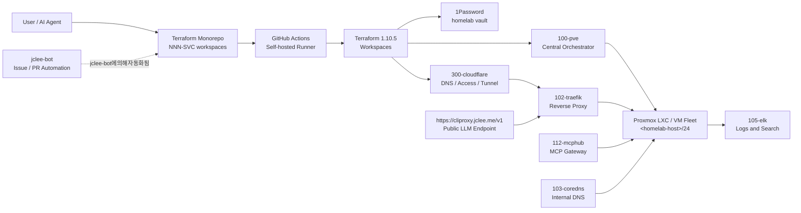

# Terraform Homelab Infrastructure / Terraform Homelab 인프라

> **Bilingual README** — Korean precedes English.
> **이중 언어 README** — 한국어 본문이 영어보다 먼저 옵니다.
>
> README auto-sync target: <https://bot.jclee.me>
> Public LLM endpoint: <https://cliproxy.jclee.me/v1>
> Generated by `gpt-5.5` (fallback: `minimax-m3` via CLIProxyAPI)

## Badges / 배지

| Category             | Detail                                                                                 |
| -------------------- | -------------------------------------------------------------------------------------- |
| IaC                  | Terraform `1.10.5` (`>= 1.7, < 2.0`)                                                   |
| Workspace Convention | Flat `NNN-SVC` (e.g. `100-pve`, `105-elk`, `300-cloudflare`)                           |
| CI/CD                | 14 GitHub Actions workflows under `.github/workflows/` — mutating flows owned by **jclee-bot** |
| Secret Backend       | 1Password `homelab` vault (12 items, 48 keys)                                          |
| Review Automation    | [qodo-ai/pr-agent](https://github.com/qodo-ai/pr-agent) + Dependabot auto-merge        |
| Security             | CodeQL · Gitleaks · Dependency Review · OpenSSF Scorecard                              |
| Internal Subnet      | `<homelab-host>/24` (RFC1918 — never published)                                        |
| Public Endpoint      | <https://cliproxy.jclee.me/v1>                                                         |
| Docs Mirror          | <https://bot.jclee.me>                                                                 |
| License              | MIT                                                                                    |

---

# 한국어

## 1. 개요

이 저장소는 `jclee.me` 호멜랩과 관련 외부 서비스를 코드로 관리하기 위한 **Infrastructure-as-Code 모노레포**입니다. Proxmox LXC/VM 플릿, 네트워크, 모니터링 스택, 그리고 Cloudflare · GitHub · Slack 같은 외부 서비스를 **Terraform 워크스페이스** 단위로 프로비저닝하며, 1Password 시크릿 주입과 GitHub Actions 기반 CI/CD로 완전 자동화되어 있습니다.

- **도메인**: `jclee.me`
- **내부 서브넷**: `<homelab-host>/24` (RFC1918 — 외부 노출 금지)
- **Terraform 버전**: `1.10.5` (`>= 1.7, < 2.0`)
- **공개 엔드포인트**: <https://cliproxy.jclee.me/v1>
- **워크스페이스 규칙**: 평탄(flat) `NNN-SVC` 디렉터리 명명 (`100-pve`, `105-elk`, `300-cloudflare`)
- **상태 백엔드**: 로컬 백엔드, `.tfstate`를 git에 커밋, CI 동시성 그룹이 apply를 직렬화

## 2. 주요 기능

- **모듈식 Terraform 워크스페이스** — `100-pve` 중앙 오케스트레이터가 모든 LXC/VM 라이프사이클을 관리하고, `modules/proxmox/{lxc,vm,lxc-config,vm-config,config-renderer}`로 LXC와 VM을 선언적으로 표현합니다.
- **SSOT(Single Source of Truth) 설정 파이프라인** — `hosts.tf`의 호스트 정의를 `config-renderer` 모듈이 `*.tftpl` 템플릿에 주입하여 `configs/`로 렌더링한 뒤 SSH로 `/opt/{service}/`에 배포합니다.
- **1Password 시크릿 주입** — `modules/shared/onepassword-secrets` 모듈이 `homelab` 볼트(12 items, 48 keys)에서 런타임 시크릿을 안전하게 주입합니다 (`module.onepassword_secrets.secrets["key"]`).
- **변경 자동화** — 브랜치→PR, 이슈→브랜치, PR 리뷰, 시큐리티 스캔, Dependabot 자동 머지, 머지된 PR 정리, 릴리스 노트/퍼블리시, 다운스트림 헬스 체크, CI 실패 이슈 자동 생성 등 **모든 변경(mutating) 자동화는 `jclee-bot`이 소유**합니다.
- **PR 리뷰 자동화** — [qodo-ai/pr-agent](https://github.com/qodo-ai/pr-agent)와 자체 시큐리티 리뷰어로 PR 품질을 자동 검증합니다.
- **보안 스캔** — CodeQL · Gitleaks · Dependency Review · OpenSSF Scorecard가 CI에서 자동 실행됩니다.
- **공개 LLM 엔드포인트** — 호멜랩 내부 CLIProxyAPI 인스턴스가 <https://cliproxy.jclee.me/v1>로 노출되어 외부에서 안전하게 추론 요청을 보낼 수 있습니다.

## 3. 아키텍처

아래 다이어그램은 호멜랩 인프라의 핵심 데이터 흐름과 책임 영역을 보여줍니다. GitHub Actions Runner는 self-hosted LXC에서 실행되며, Terraform 워크스페이스는 평탄한 `NNN-SVC` 규칙을 따릅니다.


```mermaid
flowchart LR
  Agent["User / AI Agent"] --> Repo["Terraform Monorepo<br/>NNN-SVC workspaces"]
  Repo --> CI["GitHub Actions<br/>Self-hosted Runner"]
  CI --> TF["Terraform 1.10.5<br/>Workspaces"]
  TF --> PVE["100-pve<br/>Central Orchestrator"]
  PVE --> Fleet["Proxmox LXC / VM Fleet<br/>&lt;homelab-host&gt;/24"]
  TF --> OP["1Password<br/>homelab vault"]
  TF --> CF["300-cloudflare<br/>DNS / Access / Tunnel"]
  Fleet --> ELK["105-elk<br/>Logs and Search"]
  CF --> Traefik["102-traefik<br/>Reverse Proxy"]
  Traefik --> Fleet
  MCPHub["112-mcphub<br/>MCP Gateway"] --> Fleet
  CoreDNS["103-coredns<br/>Internal DNS"] --> Fleet
  Public["https://cliproxy.jclee.me/v1<br/>Public LLM Endpoint"] --> Traefik
  Bot["jclee-bot<br/>Issue / PR Automation"] -.->|jclee-bot에의해자동화됨| Repo
```

### 3.1 책임 영역 요약

- **100-pve**: 모든 LXC/VM 프로비저닝의 Tier-0 오케스트레이터. 다른 모든 인프라 워크스페이스의 `remote_state` 소비자가 됩니다.
- **102-traefik, 105-elk, 108-archon**: Tier-1 인프라. `100-pve`의 `remote_state`를 소비하며 병렬로 apply 가능합니다.
- **300-cloudflare, 301-github, 320-slack, 400-gcp**: Proxmox에 의존하지 않는 독립 외부 워크스페이스. 어느 순서로든 apply 가능합니다.
- **103-coredns, 112-mcphub**: 템플릿 기반 서비스. 자체 `.tf`가 없으며 `100-pve`가 `*.tftpl`을 렌더링하여 배포합니다.

## 4. 저장소 구조

```text
.
├── AGENTS.md                       # AI 에이전트 지식 베이스 (자동 생성)
├── ARCHITECTURE.md                 # 전체 아키텍처 레퍼런스
├── CODE_STYLE.md                   # 명명/파일/변수/템플릿 컨벤션
├── CONTRIBUTING.md                 # 기여 가이드
├── DEPENDENCY_MAP.md               # 모듈 의존성 그래프 + 템플릿 인벤토리
├── LICENSE                         # MIT
├── Makefile                        # 통합 빌드 오케스트레이터
├── OWNERS / OWNERS_ALIASES         # GitHub 코드 오너십 매핑
├── README.md                       # 본 문서
├── build.env                       # 빌드 환경 변수
│
├── 103-coredns/                    # Tier 1: 내부 DNS 서비스
│   ├── AGENTS.md
│   ├── README.md
│   └── templates/                  # Corefile · docker-compose · filebeat 템플릿
│
├── 105-elk/                        # Tier 1: ELK 로그/검색 스택
│   ├── AGENTS.md
│   ├── docker-compose.yml
│   ├── ilm-policy.json
│   ├── scripts/                    # 운영 스크립트 (Go 헬퍼 포함)
│   ├── config/                     # 렌더링된 설정 산출물
│   ├── templates/                  # *.tftpl 소스 템플릿
│   └── terraform/                  # Terraform 워크스페이스
│
├── 112-mcphub/                     # MCP 게이트웨이 서비스
│   ├── AGENTS.md
│   ├── Dockerfile.{dev-browser,playwright,proxmox}
│   ├── README.md
│   ├── mcp_servers.json
│   ├── validate_mcps.py
│   ├── patches/                    # 업스트림 패치 (예: n8n 라이선스)
│   ├── op-mcp-server/              # 1Password MCP 서버 (Node.js)
│   ├── config/                     # 설정 + Go 진입점 패치
│   └── templates/                  # docker-compose · filebeat · mcp_settings 템플릿
│
└── 300-cloudflare/                 # 외부: Cloudflare DNS/Access/Tunnel
    ├── AGENTS.md
    ├── README.md
    ├── access.tf                   # Cloudflare Access 정책
    ├── checks.tf                   # 사전 조건 검증
    ├── dns.tf                      # DNS 레코드 관리
    ├── identity-provider.tf        # IdP 연동
    ├── locals.tf
    ├── logpush.tf                  # Logpush 작업
    ├── main.tf
    ├── onepassword.tf              # 시크릿 주입
    ├── outputs.tf                  # 공통 출력
    ├── outputs-homelab.tf          # 호멜랩 전용 출력
    ├── outputs-jclee.tf            # jclee.me 도메인 출력
    └── outputs-synology.tf         # Synology 전용 출력
```

## 5. jclee-bot 자동화 영역

**`jclee-bot`**은 이 저장소의 모든 변동(mutating) 자동화를 소유합니다. GitHub Actions의 워크플로우 파일은 구현 트리거에 불과하며, 자동화의 진실의 원천(source of truth)은 **`jclee-bot`의 동작 명세**입니다. 주요 자동화 영역은 다음과 같습니다.

### 5.1 이슈 자동화

- **이슈 → 브랜치 자동 생성**: 라벨이 부착된 이슈로부터 작업 브랜치를 자동 생성합니다 (`jclee-bot에의해자동화됨`).
- **이즈 백필**: 과거 이슈의 메타데이터와 라벨을 정규화합니다.
- **CI 실패 → 이슈**: CI가 실패할 때 자동으로 재현 가능한 이슈를 생성합니다 (`jclee-bot에의해자동화됨`).

### 5.2 PR 자동화

- **브랜치 → PR**: 작업 브랜치가 푸시되면 자동으로 PR을 생성합니다.
- **PR 리뷰**: [qodo-ai/pr-agent](https://github.com/qodo-ai/pr-agent)와 자체 시큐리티 리뷰어가 자동 리뷰를 수행합니다.
- **Dependabot 자동 머지**: 의존성 업데이트 PR은 정책에 따라 자동 머지됩니다.
- **PR 자동 머지**: 라벨/체크 통과 시 자동 머지됩니다.
- **머지된 PR 정리**: 머지 후 원격 브랜치를 자동 삭제합니다.
- **봇 자동 수정**: 리뷰 지적사항에 대해 `jclee-bot`이 자동 패치를 제안합니다.

### 5.3 릴리스 자동화

- **릴리스 노트**: PR 이력으로부터 자동 생성됩니다.
- **릴리스 퍼블리시**: 태그/체크 통과 시 자동 퍼블리시됩니다.

### 5.4 운영 자동화

- **다운스트림 헬스 체크**: 의존 서비스의 헬스 상태를 주기적으로 점검합니다.
- **드리프트 감지**: `terraform plan`의 출력과 실제 상태를 비교하여 리포트합니다.

> **참고**: 워크플로우 파일 자체는 구현 트리거이며 인벤토리 대상이 아닙니다. 자동화 동작을 변경하려면 `jclee-bot`의 설정을 수정하세요.

## 6. Go 자동화 도구

저장소 최상위에는 **`0`개의 Go 자동화 도구**가 존재합니다 (워크플로우 오케스트레이션은 전적으로 GitHub Actions + `jclee-bot`이 담당).

다만 일부 서비스 워크스페이스에는 템플릿 패치 및 운영 스크립트를 위한 Go 헬퍼가 존재합니다 (모두 표준 라이브러리 only):

- `105-elk/scripts/setup-ilm.go` — ELK ILM(인덱스 라이프사이클) 정책 적용
- `105-elk/scripts/setup-watcher.go` — Watcher(알림 엔진) 초기 설정
- `105-elk/scripts/remove-promtail.go` — Promtail 정리 유틸리티
- `112-mcphub/config/entrypoint-patch.go` — 컨테이너 진입점 패치 생성

## 7. 빠른 시작

### 7.1 사전 요구 사항

- Terraform `1.10.5` (`>= 1.7, < 2.0`)
- GNU Make
- 1Password CLI (`op`) 및 `homelab` 볼트 접근 권한
- Proxmox VE API 토큰
- Cloudflare API 토큰

### 7.2 클론 및 초기화

```bash
git clone <repo-url> terraform-homelab
cd terraform-homelab
make init SVC=105-elk       # 특정 워크스페이스 초기화
```

### 7.3 플랜 검토 및 적용

```bash
make plan SVC=105-elk              # 변경 사항 미리보기
# 적용은 CI/CD에서만 수행 (수동 apply는 비활성화)
```

> ⚠️ **중요**: `make apply`는 의도적으로 비활성화되어 있습니다. 모든 프로덕션 변경은 CI/CD 파이프라인을 통해서만 적용됩니다.

## 8. 로컬 개발

### 8.1 환경 변수

`build.env` 파일에 빌드/배포에 필요한 환경 변수를 정의하세요:

```bash
export TF_VAR_proxmox_endpoint="https://<homelab-host>:8006/api2/json"
export TF_VAR_proxmox_api_token="${PROXMOX_TOKEN}"
export OP_VAULT="homelab"
```

### 8.2 워크스페이스 별칭

Makefile은 단축 별칭을 지원합니다 (`make plan SVC=elk` ≡ `make plan SVC=105-elk/terraform`):

| 별칭          | 디렉터리                  | 분류            |
| ------------- | ------------------------- | --------------- |
| `pve`         | `100-pve`                 | Tier 0 (core)   |
| `runner`      | `101-runner`              | Tier 1          |
| `traefik`     | `102-traefik/terraform`   | Tier 1          |
| `elk`         | `105-elk/terraform`       | Tier 1          |
| `supabase`    | `107-supabase`            | Tier 1          |
| `archon`      | `108-archon/terraform`    | Tier 1          |
| `n8n`         | `110-n8n`                 | Tier 1          |
| `mcphub`      | `112-mcphub`              | Template-only   |
| `cloudflare`  | `300-cloudflare`          | External        |
| `github`      | `301-github`              | External        |
| `slack`       | `320-slack`               | External        |
| `gcp`         | `400-gcp`                 | Cloud           |

### 8.3 템플릿 워크플로우

```text
hosts.tf (SSOT)
  └─ module.hosts
       ├─ module.onepassword_secrets
       └─ module.config_renderer
            └─ templatefile("*.tftpl") → configs/ → SSH deploy → /opt/{service}/
```

### 8.4 디버깅

- **드리프트 확인**: `make drift-check SVC=pve`
- **워크스페이스 검증**: `make validate SVC=elk`
- **테스트 실행**: `make test-unit` / `make test-integration` / `make test-workspace`

## 9. 명령어 레퍼런스

| 대상                    | 명령어                       | 설명                                       |
| ----------------------- | ---------------------------- | ------------------------------------------ |
| Terraform 초기화        | `make init SVC=<svc>`        | 워크스페이스 `terraform init`              |
| Terraform 플랜          | `make plan SVC=<svc>`        | 변경 사항 미리보기 (`tfplan` 저장)         |
| Terraform 적용          | `make apply SVC=<svc>`       | **비활성화** — CI/CD에서만 수행            |
| Terraform 검증          | `make validate SVC=<svc>`    | 문법/참조 검증                             |
| Terraform 검증 종합      | `make verify SVC=<svc>`      | validate + format 검사                     |
| 포맷팅                  | `make fmt SVC=<svc>`         | `terraform fmt`                            |
| 드리프트 점검           | `make drift-check SVC=<svc>` | 실제 상태와 SSOT 비교                      |
| Lint                    | `make lint SVC=<svc>`        | `tflint` 등 정적 분석                      |
| Lint (Go 헬퍼)          | `make lint-go`               | Go 헬퍼 스크립트 린트                      |
| 백업                    | `make backup SVC=<svc>`      | `.tfstate` 백업                            |
| 단위 테스트             | `make test-unit`             | `terraform test` 단위 테스트               |
| 통합 테스트             | `make test-integration`      | 모듈 간 통합 테스트                        |
| 워크스페이스 테스트     | `make test-workspace`       | 전체 워크스페이스 종단 테스트              |
| 테스트 종합             | `make test`                  | 모든 테스트 실행                           |
| 문서 생성               | `make docs`                  | `docs/` 자동 갱신                          |
| Pre-commit 설치         | `make pre-commit-install`    | Git 훅 설치                                |
| Pre-commit 실행         | `make pre-commit-run`        | 전체 훅 수동 실행                          |
| 환경 설정               | `make setup`                 | 로컬 개발 환경 셋업                        |
| 도움말                  | `make help`                  | 사용 가능한 모든 대상 출력                 |

## 10. 기여 가이드

### 10.1 변경 절차

1. **이슈 생성**: 변경 의도와 영향을 이슈로 기술합니다. `jclee-bot`이 자동으로 브랜치를 생성합니다 (`jclee-bot에의해자동화됨`).
2. **브랜치 작업**: 자동 생성된 브랜치에서 작업합니다. `CODE_STYLE.md`의 명명/포맷 규칙을 따릅니다.
3. **PR 생성**: 푸시 시 `jclee-bot`이 PR을 자동 생성합니다.
4. **자동 리뷰**: [qodo-ai/pr-agent](https://github.com/qodo-ai/pr-agent)와 시큐리티 리뷰어의 자동 리뷰를 확인합니다.
5. **머지**: 체크 통과 시 자동 머지됩니다.

### 10.2 모듈 개발

- 새 LXC/VM 추가: `100-pve/locals.tf`의 사이징 정의와 `envs/prod/hosts.tf`의 호스트 엔트리를 함께 수정합니다.
- 서비스 설정 변경: `{NNN}-{svc}/templates/*.tftpl`을 수정합니다 (직접 `configs/`를 수정하지 마세요).
- 시크릿 추가/회전: `modules/shared/onepassword-secrets/main.tf`와 1Password 볼트를 함께 갱신합니다.

### 10.3 코드 오너십

`OWNERS`와 `OWNERS_ALIASES`로 정의된 오너십 매핑을 따릅니다. 구조적 결정은 `docs/adr/`에 ADR(append-only)로 기록하세요.

---

# English

## 1. Overview

This repository is an **Infrastructure-as-Code monorepo** that declaratively manages the `jclee.me` homelab and its associated external services. It provisions the Proxmox LXC/VM fleet, networking, monitoring stack, and external services such as Cloudflare · GitHub · Slack on a per-workspace basis, with 1Password secret injection and fully automated GitHub Actions CI/CD.

- **Domain**: `jclee.me`
- **Internal subnet**: `<homelab-host>/24` (RFC1918 — never published externally)
- **Terraform version**: `1.10.5` (`>= 1.7, < 2.0`)
- **Public endpoint**: <https://cliproxy.jclee.me/v1>
- **Workspace convention**: flat `NNN-SVC` directory naming (`100-pve`, `105-elk`, `300-cloudflare`)
- **State backend**: local backend, `.tfstate` committed to git, CI concurrency groups serialize applies

## 2. Features

- **Modular Terraform workspaces** — `100-pve` central orchestrator governs the entire LXC/VM lifecycle. `modules/proxmox/{lxc,vm,lxc-config,vm-config,config-renderer}` express containers and VMs declaratively.
- **SSOT configuration pipeline** — host definitions in `hosts.tf` flow into `*.tftpl` templates via the `config-renderer` module, are rendered into `configs/`, and deployed over SSH to `/opt/{service}/`.
- **1Password secret injection** — `modules/shared/onepassword-secrets` injects runtime secrets from the `homelab` vault (12 items, 48 keys) at apply time via `module.onepassword_secrets.secrets["key"]`.
- **Change automation** — branch→PR, issue→branch, PR review, security scan, Dependabot auto-merge, merged-PR cleanup, release notes/publish, downstream health checks, and CI-failure-issue creation — **all mutating automation is owned by `jclee-bot`**.
- **PR review automation** — [qodo-ai/pr-agent](https://github.com/qodo-ai/pr-agent) plus an in-house security reviewer gate PR quality automatically.
- **Security scanning** — CodeQL · Gitleaks · Dependency Review · OpenSSF Scorecard run automatically in CI.
- **Public LLM endpoint** — the internal CLIProxyAPI instance is exposed at <https://cliproxy.jclee.me/v1>, providing safe external inference.

## 3. Architecture

The diagram below shows the core data flow and responsibility boundaries of the homelab infrastructure. The GitHub Actions runner executes on a self-hosted LXC, and Terraform workspaces follow the flat `NNN-SVC` convention.


```mermaid
flowchart LR
  Agent["User / AI Agent"] --> Repo["Terraform Monorepo<br/>NNN-SVC workspaces"]
  Repo --> CI["GitHub Actions<br/>Self-hosted Runner"]
  CI --> TF["Terraform 1.10.5<br/>Workspaces"]
  TF --> PVE["100-pve<br/>Central Orchestrator"]
  PVE --> Fleet["Proxmox LXC / VM Fleet<br/>&lt;homelab-host&gt;/24"]
  TF --> OP["1Password<br/>homelab vault"]
  TF --> CF["300-cloudflare<br/>DNS / Access / Tunnel"]
  Fleet --> ELK["105-elk<br/>Logs and Search"]
  CF --> Traefik["102-traefik<br/>Reverse Proxy"]
  Traefik --> Fleet
  MCPHub["112-mcphub<br/>MCP Gateway"] --> Fleet
  CoreDNS["103-coredns<br/>Internal DNS"] --> Fleet
  Public["https://cliproxy.jclee.me/v1<br/>Public LLM Endpoint"] --> Traefik
  Bot["jclee-bot<br/>Issue / PR Automation"] -.->|jclee-bot에의해자동화됨| Repo
```

### 3.1 Responsibility Summary

- **100-pve**: Tier-0 orchestrator for all LXC/VM provisioning. Every other infra workspace consumes its `remote_state`.
- **102-traefik, 105-elk, 108-archon**: Tier-1 infrastructure. They consume `remote_state` from `100-pve` and may be applied in parallel.
- **300-cloudflare, 301-github, 320-slack, 400-gcp**: independent external workspaces with no Proxmox dependency; can be applied in any order.
- **103-coredns, 112-mcphub**: template-driven services without their own `.tf`; `100-pve` renders and deploys their `*.tftpl`.

## 4. Repository Structure

```text
.
├── AGENTS.md                       # AI agent knowledge base (auto-generated)
├── ARCHITECTURE.md                 # Full architecture reference
├── CODE_STYLE.md                   # Naming / file / variable / template conventions
├── CONTRIBUTING.md                 # Contribution guide
├── DEPENDENCY_MAP.md               # Module dependency graph + template inventory
├── LICENSE                         # MIT
├── Makefile                        # Unified build orchestrator
├── OWNERS / OWNERS_ALIASES         # GitHub code-ownership mapping
├── README.md                       # This document
├── build.env                       # Build environment variables
│
├── 103-coredns/                    # Tier 1: internal DNS service
│   ├── AGENTS.md
│   ├── README.md
│   └── templates/                  # Corefile · docker-compose · filebeat templates
│
├── 105-elk/                        # Tier 1: ELK log/search stack
│   ├── AGENTS.md
│   ├── docker-compose.yml
│   ├── ilm-policy.json
│   ├── scripts/                    # Operational scripts (Go helpers included)
│   ├── config/                     # Rendered configuration outputs
│   ├── templates/                  # *.tftpl source templates
│   └── terraform/                  # Terraform workspace
│
├── 112-mcphub/                     # MCP gateway service
│   ├── AGENTS.md
│   ├── Dockerfile.{dev-browser,playwright,proxmox}
│   ├── README.md
│   ├── mcp_servers.json
│   ├── validate_mcps.py
│   ├── patches/                    # Upstream patches (e.g. n8n license)
│   ├── op-mcp-server/              # 1Password MCP server (Node.js)
│   ├── config/                     # Settings + Go entrypoint patch
│   └── templates/                  # docker-compose · filebeat · mcp_settings templates
│
└── 300-cloudflare/                 # External: Cloudflare DNS/Access/Tunnel
    ├── AGENTS.md
    ├── README.md
    ├── access.tf                   # Cloudflare Access policies
    ├── checks.tf                   # Precondition checks
    ├── dns.tf                      # DNS record management
    ├── identity-provider.tf        # IdP integration
    ├── locals.tf
    ├── logpush.tf                  # Logpush jobs
    ├── main.tf
    ├── onepassword.tf              # Secret injection
    ├── outputs.tf                  # Common outputs
    ├── outputs-homelab.tf          # Homelab-specific outputs
    ├── outputs-jclee.tf            # jclee.me domain outputs
    └── outputs-synology.tf         # Synology-specific outputs
```

## 5. jclee-bot Automation Surfaces

**`jclee-bot`** owns every mutating automation in this repository. Workflow files under `.github/workflows/` are merely the implementation triggers — **the source of truth for automation behavior is `jclee-bot`**. Major automation surfaces are:

### 5.1 Issue automation

- **Issue → branch creation**: labelled issues automatically spawn working branches (`jclee-bot에의해자동화됨`).
- **Issue backfill**: normalizes metadata and labels on historical issues.
- **CI failure → issue**: CI failures automatically open reproducible issues (`jclee-bot에의해자동화됨`).

### 5.2 PR automation

- **Branch → PR**: pushes to working branches automatically open PRs.
- **PR review**: [qodo-ai/pr-agent](https://github.com/qodo-ai/pr-agent) and an in-house security reviewer run automatically.
- **Dependabot auto-merge**: dependency-update PRs are merged per policy.
- **PR auto-merge**: PRs passing checks/labels are merged automatically.
- **Merged-PR cleanup**: remote branches are pruned after merge.
- **Bot auto-fix**: `jclee-bot` proposes automatic patches for review feedback.

### 5.3 Release automation

- **Release notes**: auto-generated from PR history.
- **Release publish**: auto-published on tag/check pass.

### 5.4 Operational automation

- **Downstream health check**: periodic health verification of dependent services.
- **Drift detection**: compares `terraform plan` output against real state.

> **Note**: workflow files are implementation triggers and are not part of the automation inventory. To change automation behavior, update `jclee-bot`'s configuration.

## 6. Go Automation Tools

There are **`0` Go automation tools** at the repository root (workflow orchestration is handled entirely by GitHub Actions + `jclee-bot`).

However, some service workspaces contain Go helpers used for template patching and operational scripting (stdlib-only):

- `105-elk/scripts/setup-ilm.go` — applies ELK ILM (index lifecycle) policy
- `105-elk/scripts/setup-watcher.go` — initial Watcher (alerting engine) setup
- `105-elk/scripts/remove-promtail.go` — Promtail cleanup utility
- `112-mcphub/config/entrypoint-patch.go` — generates container entrypoint patches

## 7. Quick Start

### 7.1 Prerequisites

- Terraform `1.10.5` (`>= 1.7, < 2.0`)
- GNU Make
- 1Password CLI (`op`) with access to the `homelab` vault
- Proxmox VE API token
- Cloudflare API token

### 7.2 Clone and Initialize

```bash
git clone <repo-url> terraform-homelab
cd terraform-homelab
make init SVC=105-elk       # initialize a specific workspace
```

### 7.3 Plan and Apply

```bash
make plan SVC=105-elk              # preview changes
# applies are CI/CD-only (manual apply is disabled)
```

> ⚠️ **Important**: `make apply` is intentionally disabled. All production changes must flow through the CI/CD pipeline.

## 8. Local Development

### 8.1 Environment variables

Define build/deploy variables in `build.env`:

```bash
export TF_VAR_proxmox_endpoint="https://<homelab-host>:8006/api2/json"
export TF_VAR_proxmox_api_token="${PROXMOX_TOKEN}"
export OP_VAULT="homelab"
```

### 8.2 Workspace aliases

The Makefile supports short aliases (`make plan SVC=elk` ≡ `make plan SVC=105-elk/terraform`):

| Alias          | Directory                 | Tier            |
| -------------- | ------------------------- | --------------- |
| `pve`          | `100-pve`                 | Tier 0 (core)   |
| `runner`       | `101-runner`              | Tier 1          |
| `traefik`      | `102-traefik/terraform`   | Tier 1          |
| `elk`          | `105-elk/terraform`       | Tier 1          |
| `supabase`     | `107-supabase`            | Tier 1          |
| `archon`       | `108-archon/terraform`    | Tier 1          |
| `n8n`          | `110-n8n`                 | Tier 1          |
| `mcphub`       | `112-mcphub`              | Template-only   |
| `cloudflare`   | `300-cloudflare`          | External        |
| `github`       | `301-github`              | External        |
| `slack`        | `320-slack`               | External        |
| `gcp`          | `400-gcp`                 | Cloud           |

### 8.3 Template workflow

```text
hosts.tf (SSOT)
  └─ module.hosts
       ├─ module.onepassword_secrets
       └─ module.config_renderer
            └─ templatefile("*.tftpl") → configs/ → SSH deploy → /opt/{service}/
```

### 8.4 Debugging

- **Drift check**: `make drift-check SVC=pve`
- **Workspace validation**: `make validate SVC=elk`
- **Tests**: `make test-unit` / `make test-integration` / `make test-workspace`

## 9. Commands Reference

| Target                  | Command                       | Description                                       |
| ----------------------- | ----------------------------- | ------------------------------------------------- |
| Terraform init          | `make init SVC=<svc>`         | Run `terraform init` in the workspace             |
| Terraform plan          | `make plan SVC=<svc>`         | Preview changes (saves `tfplan`)                  |
| Terraform apply         | `make apply SVC=<svc>`        | **Disabled** — CI/CD only                         |
| Terraform validate      | `make validate SVC=<svc>`     | Syntax/reference validation                       |
| Terraform verify        | `make verify SVC=<svc>`       | validate + format check                           |
| Formatting              | `make fmt SVC=<svc>`          | `terraform fmt`                                   |
| Drift check             | `make drift-check SVC=<svc>`  | Compare real state vs SSOT                        |
| Lint                    | `make lint SVC=<svc>`         | Static analysis (e.g. `tflint`)                   |
| Lint (Go helpers)       | `make lint-go`                | Lint Go helper scripts                            |
| Backup                  | `make backup SVC=<svc>`       | Back up `.tfstate`                                |
| Unit tests              | `make test-unit`              | `terraform test` unit tests                       |
| Integration tests       | `make test-integration`       | Cross-module integration tests                    |
| Workspace tests         | `make test-workspace`         | End-to-end workspace tests                        |
| Tests (all)             | `make test`                   | Run the entire test suite                         |
| Docs                    | `make docs`                   | Auto-refresh `docs/`                              |
| Pre-commit install      | `make pre-commit-install`     | Install Git hooks                                 |
| Pre-commit run          | `make pre-commit-run`         | Run all hooks manually                            |
| Environment setup       | `make setup`                  | Set up local dev environment                      |
| Help                    | `make help`                   | Print all available targets                       |

## 10. Contribution Guide

### 10.1 Change process

1. **Open an issue**: describe the intent and impact. `jclee-bot` will create the working branch automatically (`jclee-bot에의해자동화됨`).
2. **Work on the branch**: edit on the auto-created branch, following conventions in `CODE_STYLE.md`.
3. **Open a PR**: pushing the branch automatically opens a PR via `jclee-bot`.
4. **Automated review**: review feedback from [qodo-ai/pr-agent](https://github.com/qodo-ai/pr-agent) and the security reviewer.
5. **Merge**: PRs are merged automatically once checks pass.

### 10.2 Module development

- **New LXC/VM**: update sizing in `100-pve/locals.tf` and add a host entry to `envs/prod/hosts.tf`.
- **Service config change**: edit `{NNN}-{svc}/templates/*.tftpl` (do not hand-edit `configs/`).
- **Add/rotate a secret**: update `modules/shared/onepassword-secrets/main.tf` and the 1Password vault together.

### 10.3 Code ownership

Follow the ownership mapping in `OWNERS` and `OWNERS_ALIASES`. Record architectural decisions in `docs/adr/` as append-only ADRs (supersede older ones with new entries rather than editing in place).

---

&copy; `jclee.me` Homelab — MIT License — Docs mirror: <https://bot.jclee.me>