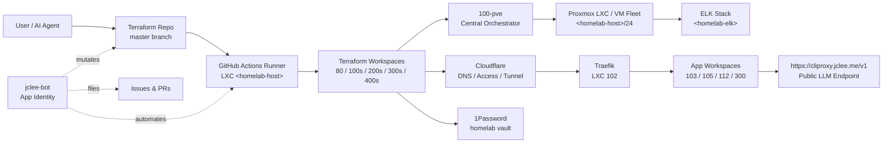

# Terraform Homelab Infrastructure / Terraform Homelab 인프라

> **Bilingual README** — 한국어 본문이 영어보다 먼저 옵니다. (Korean precedes English.)
>
> - README auto-sync target: <https://bot.jclee.me>
> - Public LLM endpoint: <https://cliproxy.jclee.me/v1>
> - Generated by `gpt-5.5` (fallback: `minimax-m3` via CLIProxyAPI)

## Badges / 배지

| Category             | Detail                                                                                       |
| -------------------- | -------------------------------------------------------------------------------------------- |
| IaC                  | Terraform `1.10.5` (`>= 1.7, < 2.0`)                                                         |
| Workspace Convention | Flat `NNN-SVC` (e.g. `103-coredns`, `105-elk`, `112-mcphub`, `300-cloudflare`)               |
| CI/CD                | 14 GitHub Actions workflows under `.github/workflows/` — mutating flows owned by **jclee-bot** |
| Secret Backend       | 1Password `homelab` vault                                                                    |
| Review Automation    | [qodo-ai/pr-agent](https://github.com/qodo-ai/pr-agent) + Dependabot auto-merge              |
| Security             | CodeQL · Gitleaks · Dependency Review · OpenSSF Scorecard                                    |
| Internal Subnet      | `<homelab-host>/24` (RFC1918 — never published)                                              |
| Public Endpoint      | <https://cliproxy.jclee.me/v1>                                                               |
| Docs Mirror          | <https://bot.jclee.me>                                                                       |
| License              | MIT                                                                                          |

---

# 한국어

## 1. 개요

이 저장소는 `jclee.me` 호멜랩과 관련 외부 서비스를 코드로 관리하기 위한 **Infrastructure-as-Code 모노레포**입니다. Proxmox LXC/VM 플릿, 내부 DNS, ELK 관측 스택, MCP 허브, 그리고 Cloudflare 같은 외부 서비스를 **Terraform 워크스페이스** 단위로 프로비저닝하며, 1Password 시크릿 주입과 GitHub Actions 기반 CI/CD로 완전 자동화되어 있습니다.

- **도메인**: `jclee.me`
- **내부 서브넷**: `<homelab-host>/24` (RFC1918, 게시 금지)
- **워크스페이스 컨벤션**: `NNN-SVC` (예: `103-coredns`, `105-elk`, `112-mcphub`, `300-cloudflare`)
- **상태 백엔드**: 로컬 (`.tfstate` 커밋)
- **공개 엔드포인트**: <https://cliproxy.jclee.me/v1>
- **문서 미러**: <https://bot.jclee.me>

## 2. 주요 기능

- **중앙 오케스트레이터 (`100-pve`)** — 모든 LXC/VM 라이프사이클 단일 출처(Single Source of Truth)
- **템플릿 파이프라인** — `hosts.tf → module.hosts → onepassword_secrets + config_renderer → *.tftpl → /opt/{service}/`
- **1Password 시크릿 주입** — `onepassword-secrets` 모듈을 통한 런타임 시크릿 주입
- **Traefik 인그레스** — LXC 102 기반 라우팅, Cloudflare Tunnel과 페어링
- **ELK 관측 스택** — Filebeat → Logstash → Elasticsearch + ILM 정책
- **MCP 허브** — `112-mcphub`에서 다중 MCP 서버 통합
- **Cloudflare 통합** — DNS / Access / Tunnel / Logpush 단일 선언형 관리
- **PR 자동화** — `qodo-ai/pr-agent` 리뷰 + Dependabot 자동 머지
- **보안 스캔** — CodeQL, Gitleaks, Dependency Review, OpenSSF Scorecard

## 3. 아키텍처


```mermaid
flowchart LR
  User["User / AI Agent"] --> Repo["Terraform Repo<br/>master branch"]
  Repo --> Runner["GitHub Actions Runner<br/>LXC &lt;homelab-host&gt;"]
  Runner --> TFW["Terraform Workspaces<br/>80 / 100s / 200s / 300s / 400s"]
  TFW --> Orch["100-pve<br/>Central Orchestrator"]
  Orch --> Fleet["Proxmox LXC / VM Fleet<br/>&lt;homelab-host&gt;/24"]
  TFW --> CF["Cloudflare<br/>DNS / Access / Tunnel"]
  TFW --> OP["1Password<br/>homelab vault"]
  Fleet --> ELK["ELK Stack<br/>&lt;homelab-elk&gt;"]
  CF --> Traefik["Traefik<br/>LXC 102"]
  Traefik --> Apps["App Workspaces<br/>103 / 105 / 112 / 300"]
  Apps --> CLIProxy["https://cliproxy.jclee.me/v1<br/>Public LLM Endpoint"]
  Bot["jclee-bot<br/>App Identity"] -. mutates .-> Repo
  Bot -. automates .-> Runner
  Bot -. files .-> Issues["Issues &amp; PRs"]
```

**워크스페이스 티어**

| 티어 | 워크스페이스 | 적용 순서 |
| --- | --- | --- |
| 0 (core) | `100-pve` | 1순위 — 모든 LXC/VM 프로비저닝 |
| 1 (infra) | `102-traefik`, `105-elk`, `108-archon` | 2순위 (병렬) — `100-pve` `remote_state` 소비 |
| Independent | `300-cloudflare`, `301-github`, `320-slack`, `400-gcp` | 자유 순서 — Proxmox 의존성 없음 |
| Template-only | 다수 (`103-coredns`, `110-n8n` 등) | `.tf` 없음 — `100-pve`가 렌더링 |

상세 아키텍처는 [`ARCHITECTURE.md`](./ARCHITECTURE.md) 및 [`DEPENDENCY_MAP.md`](./DEPENDENCY_MAP.md) 참고.

## 4. jclee-bot 자동화 영역

> **핵심 원칙**: 저장소에 가하는 모든 변형(mutating) 자동화는 **`jclee-bot`** GitHub App 신원 하나로 소유·서명됩니다. 사람/외부 봇은 동일 영역에 직접 쓰기 작업을 하지 않습니다.

### 4.1 소유 표면 (App-owned)

jclee-bot이 **소유**하는 변형 자동화 영역은 다음과 같습니다.

- **PR 라이프사이클**
  - 브랜치에서 PR 자동 생성 / PR-to-branch 동기화
  - 자동 리뷰, 자동 라벨링, 자동 머지 (의존성 업데이트 포함)
  - 머지된 PR 정리(원격 브랜치 삭제, 상태 종료)
- **이슈 라이프사이클**
  - `jclee-bot에의해자동화됨` — 신규/기존 이슈 자동 분류, 백필, 자동 트리아지
  - CI 실패 → 이슈 자동 생성, 종료 조건에 따라 자동 close
  - 릴리스 노트 생성 및 게시
- **다운스트림 헬스체크**
  - 배포된 워크스페이스의 상태 점검 및 비정상 시 자동 이슈 발행
- **보안 자동 픽스**
  - Gitleaks/CodeQL/Dependabot 결과에 대한 자동 PR 생성

### 4.2 사람/외부 협업 영역 (App does NOT mutate)

- 코드 리뷰 자체의 컨텐츠(사람이 작성)
- `qodo-ai/pr-agent`가 남기는 리뷰 코멘트(읽기 전용)
- Dependabot이 의존성 업데이트 PR을 **여는** 행위(jclee-bot이 머지를 **소유**)

### 4.3 CI 트리거와 소유의 분리

`.github/workflows/`에는 14개의 워크플로우가 존재하며, 이는 **구현 트리거**일 뿐 자동화의 진실의 원천(source of truth)이 아닙니다. 동일한 트리거가 다른 App 신원으로 실행되면 실패하도록 보호 규칙이 적용되어 있습니다.

## 5. Go 도구

이 저장소의 최상위 **크로스-워크스페이스 Go 자동화 도구**는 **현재 0개**입니다. 모든 변형 자동화는 GitHub Actions + jclee-bot 권한으로 수행됩니다.

다만 일부 워크스페이스 내부에는 **운영 보조용(operational)** Go 스크립트가 존재합니다. 이 스크립트들은 해당 워크스페이스의 컨테이너 라이프사이클 안에서만 실행되며, 저장소 외부 가시 자동화 표면이 아닙니다.

- `105-elk/scripts/`
  - `setup-ilm.go` — Elasticsearch ILM 정책 부트스트랩
  - `setup-watcher.go` — Watcher 등록/갱신
  - `remove-promtail.go` — Promtail 정리 유틸리티
- `112-mcphub/config/entrypoint-patch.go` — MCP 허브 엔트리포인트 패치

> 새 크로스-워크스페이스 도구를 추가할 경우 `scripts/`(생성 시) 또는 별도 모듈에 위치시키고, `Makefile`과 [`ARCHITECTURE.md`](./ARCHITECTURE.md)의 "Automation Surfaces" 절에 등록해야 합니다.

## 6. 빠른 시작

### 6.1 전제 조건

- Terraform `1.10.5` (`>= 1.7, < 2.0`)
- `op` (1Password CLI) 로그인 상태
- Proxmox API 토큰 (1Password `homelab` 볼트)
- GitHub App: `jclee-bot` 설치 + 저장소 권한 부여

### 6.2 표준 워크플로

1. 브랜치 생성 — `jclee-bot`이 템플릿 이슈에서 브랜치를 자동 생성
2. 변경 커밋
3. PR 개설 — `qodo-ai/pr-agent`가 자동 리뷰
4. CI 통과 — CodeQL · Gitleaks · Terraform plan/validate
5. 자동 머지 — `jclee-bot`이 의존성/유형별 정책에 따라 머지
6. 배포 — `100-pve` → 다운스트림 워크스페이스 순서로 자동 적용
7. 정리 — 머지된 PR의 원격 브랜치는 `jclee-bot`이 정리

## 7. 로컬 개발

### 7.1 클론

```bash
git clone <repo-url>
cd terraform-homelab
```

### 7.2 시크릿 로드

```bash
eval "$(op signin)"
```

> 1Password 세션은 동일 셸에서 실행되는 Terraform 호출에만 적용됩니다.

### 7.3 포맷·검증

```bash
make fmt          # terraform fmt -recursive
make validate     # terraform validate (각 워크스페이스)
```

### 7.4 워크스페이스 지정

`SVC`는 풀 경로(`105-elk`) 또는 단축 별칭(`elk`)을 받습니다. 단축 별칭 사용 시 `ALIAS_*` 매핑을 통해 자동으로 `terraform/` 하위 디렉터리가 해석됩니다.

```bash
make plan SVC=elk          # 105-elk/terraform
make plan SVC=105-elk      # 동일
make plan SVC=cloudflare   # 300-cloudflare (별칭 → 풀 경로)
```

## 8. 명령어 레퍼런스

> 모든 타겟은 `make <target> [SVC=<workspace>]`로 호출합니다. `SVC` 미지정 시 기본값은 `100-pve`입니다.

### 8.1 Terraform

| 명령 | 설명 |
| --- | --- |
| `make init SVC=<ws>` | Terraform 초기화 |
| `make plan SVC=<ws>` | Plan 파일 생성 (`tfplan`) |
| `make apply SVC=<ws>` | **비활성** — `apply`는 CI/CD 전용 |
| `make drift-check SVC=<ws>` | 실제 상태와 선언 상태 비교 |
| `make verify SVC=<ws>` | `terraform verify` |
| `make validate SVC=<ws>` | `terraform validate` |

### 8.2 코드 품질

| 명령 | 설명 |
| --- | --- |
| `make fmt` | `terraform fmt -recursive` |
| `make lint` | `tflint` + `tfsec` |
| `make lint-go` | Go 스크립트 (`gofmt` + `go vet`) |
| `make pre-commit-install` | pre-commit 훅 설치 |
| `make pre-commit-run` | pre-commit 훅 수동 실행 |

### 8.3 테스트

| 명령 | 설명 |
| --- | --- |
| `make test` | 전체 테스트 스위트 |
| `make test-unit` | `terraform test` (단위) |
| `make test-integration` | 통합 테스트 |
| `make test-workspace` | 워크스페이스 단위 종단 테스트 |

### 8.4 운영

| 명령 | 설명 |
| --- | --- |
| `make backup` | 상태 백업 (`.tfstate` 스냅샷) |
| `make setup` | 1Password 세션 + 토큰 점검 |
| `make docs` | 문서 재생성 (Mermaid, ADR 인덱스) |
| `make help` | 사용 가능한 타겟 목록 |

## 9. 기여 가이드

1. **컨벤션 숙지** — [`CODE_STYLE.md`](./CODE_STYLE.md), [`ARCHITECTURE.md`](./ARCHITECTURE.md)
2. **이슈 우선** — 새 브랜치는 이슈에서 출발 (`jclee-bot에의해자동화됨` 흐름)
3. **템플릿 사용** — 새 서비스 추가는 `NNN-SVC/` 하위에 `templates/*.tftpl` + `terraform/`
4. **모듈 재사용** — Proxmox 리소스는 `modules/proxmox/{lxc,vm,lxc-config,vm-config,config-renderer}` 사용
5. **시크릿은 1Password** — 절대 평문 커밋 금지 (`modules/shared/onepassword-secrets` 경유)
6. **PR 자동 리뷰 수용** — `qodo-ai/pr-agent`의 제안을 검토 반영
7. **머지 후 정리 확인** — `jclee-bot`이 원격 브랜치를 정리하나, 로컬 브랜치는 수동 제거

상세 규칙은 [`CONTRIBUTING.md`](./CONTRIBUTING.md) 참고.

---

# English

## 1. Overview

This repository is an **Infrastructure-as-Code monorepo** for managing the `jclee.me` homelab and related external services. It provisions Proxmox LXC/VM fleets, internal DNS, the ELK observability stack, the MCP hub, and external services (Cloudflare) through **Terraform workspaces**, with full automation via 1Password secret injection and GitHub Actions CI/CD.

- **Domain**: `jclee.me`
- **Internal subnet**: `<homelab-host>/24` (RFC1918, must never be published)
- **Workspace convention**: `NNN-SVC` (e.g. `103-coredns`, `105-elk`, `112-mcphub`, `300-cloudflare`)
- **State backend**: local (`.tfstate` committed)
- **Public endpoint**: <https://cliproxy.jclee.me/v1>
- **Docs mirror**: <https://bot.jclee.me>

## 2. Features

- **Central orchestrator (`100-pve`)** — single source of truth for all LXC/VM lifecycle
- **Template pipeline** — `hosts.tf → module.hosts → onepassword_secrets + config_renderer → *.tftpl → /opt/{service}/`
- **1Password secret injection** — runtime secret delivery via the `onepassword-secrets` module
- **Traefik ingress** — LXC 102 routing, paired with Cloudflare Tunnel
- **ELK observability** — Filebeat → Logstash → Elasticsearch with ILM
- **MCP hub** — `112-mcphub` unifies multiple MCP servers
- **Cloudflare integration** — declarative DNS / Access / Tunnel / Logpush
- **PR automation** — `qodo-ai/pr-agent` review + Dependabot auto-merge
- **Security scanning** — CodeQL, Gitleaks, Dependency Review, OpenSSF Scorecard

## 3. Architecture


```mermaid
flowchart LR
  User["User / AI Agent"] --> Repo["Terraform Repo<br/>master branch"]
  Repo --> Runner["GitHub Actions Runner<br/>LXC &lt;homelab-host&gt;"]
  Runner --> TFW["Terraform Workspaces<br/>80 / 100s / 200s / 300s / 400s"]
  TFW --> Orch["100-pve<br/>Central Orchestrator"]
  Orch --> Fleet["Proxmox LXC / VM Fleet<br/>&lt;homelab-host&gt;/24"]
  TFW --> CF["Cloudflare<br/>DNS / Access / Tunnel"]
  TFW --> OP["1Password<br/>homelab vault"]
  Fleet --> ELK["ELK Stack<br/>&lt;homelab-elk&gt;"]
  CF --> Traefik["Traefik<br/>LXC 102"]
  Traefik --> Apps["App Workspaces<br/>103 / 105 / 112 / 300"]
  Apps --> CLIProxy["https://cliproxy.jclee.me/v1<br/>Public LLM Endpoint"]
  Bot["jclee-bot<br/>App Identity"] -. mutates .-> Repo
  Bot -. automates .-> Runner
  Bot -. files .-> Issues["Issues &amp; PRs"]
```

**Workspace tiers**

| Tier | Workspaces | Apply order |
| --- | --- | --- |
| 0 (core) | `100-pve` | First — provisions all LXC/VM |
| 1 (infra) | `102-traefik`, `105-elk`, `108-archon` | Second (parallel) — consumes `100-pve` `remote_state` |
| Independent | `300-cloudflare`, `301-github`, `320-slack`, `400-gcp` | Any order — no Proxmox dependency |
| Template-only | many (`103-coredns`, `110-n8n`, etc.) | No `.tf` — rendered by `100-pve` |

For full architecture see [`ARCHITECTURE.md`](./ARCHITECTURE.md) and [`DEPENDENCY_MAP.md`](./DEPENDENCY_MAP.md).

## 4. jclee-bot automation surfaces

> **Core principle**: every **mutating** automation touching this repository is owned and signed by a single GitHub App identity: **`jclee-bot`**. Humans and other bots do not perform direct write operations in the same surfaces.

### 4.1 App-owned surfaces

`jclee-bot` **owns** the following mutating surfaces:

- **PR lifecycle**
  - Branch-to-PR automation, PR-to-branch sync
  - Auto review, auto labeling, auto merge (including dependency updates)
  - Merged-PR cleanup (remote branch deletion, status closure)
- **Issue lifecycle**
  - `jclee-bot에의해자동화됨` — auto classification, backfill, and triage of new/existing issues
  - CI failures → automatic issue creation; auto-close on resolved conditions
  - Release-note generation and publishing
- **Downstream health checks**
  - Post-deploy state checks on applied workspaces; auto-issue on anomalies
- **Security auto-fix**
  - Auto PRs for Gitleaks/CodeQL/Dependabot findings

### 4.2 Human / external collaboration surfaces (App does NOT mutate)

- The content of code reviews (humans)
- Comments posted by `qodo-ai/pr-agent` (read-only)
- Dependabot **opening** dependency-update PRs (jclee-bot **owns** the merge step)

### 4.3 Trigger vs ownership

There are 14 GitHub Actions workflows under `.github/workflows/`. They are **implementation triggers**, not the source of truth for automation. Guard rails ensure that the same trigger executed under a different App identity fails closed.

## 5. Go tools

This repository currently has **0 cross-workspace Go automation tools** at the top level. All mutating automation is performed through GitHub Actions with `jclee-bot` authority.

Workspace-internal **operational** Go helpers do exist. They run only inside the relevant workspace container lifecycle and are **not** externally visible automation surfaces.

- `105-elk/scripts/`
  - `setup-ilm.go` — Elasticsearch ILM policy bootstrap
  - `setup-watcher.go` — Watcher registration/refresh
  - `remove-promtail.go` — Promtail cleanup utility
- `112-mcphub/config/entrypoint-patch.go` — MCP hub entrypoint patcher

> New cross-workspace tools must live under `scripts/` (when created) or a dedicated module, and must be registered in the `Makefile` plus the "Automation Surfaces" section of [`ARCHITECTURE.md`](./ARCHITECTURE.md).

## 6. Quick start

### 6.1 Prerequisites

- Terraform `1.10.5` (`>= 1.7, < 2.0`)
- `op` (1Password CLI) signed in
- Proxmox API token (from 1Password `homelab` vault)
- GitHub App: `jclee-bot` installed with repository permissions

### 6.2 Standard flow

1. Create a branch — `jclee-bot` generates branches from template issues
2. Commit changes
3. Open a PR — `qodo-ai/pr-agent` performs auto review
4. CI passes — CodeQL · Gitleaks · Terraform plan/validate
5. Auto merge — `jclee-bot` merges per dependency/type policy
6. Deploy — `100-pve` then downstream workspaces, automatically
7. Cleanup — `jclee-bot` removes the merged remote branch

## 7. Local development

### 7.1 Clone

```bash
git clone <repo-url>
cd terraform-homelab
```

### 7.2 Load secrets

```bash
eval "$(op signin)"
```

> The 1Password session applies only to Terraform invocations within the same shell.

### 7.3 Format & validate

```bash
make fmt          # terraform fmt -recursive
make validate     # terraform validate (per workspace)
```

### 7.4 Selecting a workspace

`SVC` accepts a full path (`105-elk`) or a short alias (`elk`). Short aliases are resolved via the `ALIAS_*` map, automatically descending into the `terraform/` subdirectory when applicable.

```bash
make plan SVC=elk          # 105-elk/terraform
make plan SVC=105-elk      # equivalent
make plan SVC=cloudflare   # 300-cloudflare (alias → full path)
```

## 8. Commands reference

> All targets are invoked as `make <target> [SVC=<workspace>]`. Default `SVC` is `100-pve`.

### 8.1 Terraform

| Command | Description |
| --- | --- |
| `make init SVC=<ws>` | Terraform init |
| `make plan SVC=<ws>` | Produce a plan file (`tfplan`) |
| `make apply SVC=<ws>` | **Disabled** — applies run only via CI/CD |
| `make drift-check SVC=<ws>` | Compare actual vs declared state |
| `make verify SVC=<ws>` | `terraform verify` |
| `make validate SVC=<ws>` | `terraform validate` |

### 8.2 Code quality

| Command | Description |
| --- | --- |
| `make fmt` | `terraform fmt -recursive` |
| `make lint` | `tflint` + `tfsec` |
| `make lint-go` | Go scripts (`gofmt` + `go vet`) |
| `make pre-commit-install` | Install pre-commit hooks |
| `make pre-commit-run` | Run pre-commit hooks manually |

### 8.3 Tests

| Command | Description |
| --- | --- |
| `make test` | Full test suite |
| `make test-unit` | `terraform test` (unit) |
| `make test-integration` | Integration tests |
| `make test-workspace` | Per-workspace end-to-end tests |

### 8.4 Operations

| Command | Description |
| --- | --- |
| `make backup` | State backup (`.tfstate` snapshot) |
| `make setup` | Verify 1Password session and tokens |
| `make docs` | Regenerate docs (Mermaid, ADR index) |
| `make help` | List available targets |

## 9. Contribution guide

1. **Read the conventions** — [`CODE_STYLE.md`](./CODE_STYLE.md), [`ARCHITECTURE.md`](./ARCHITECTURE.md)
2. **Issue-first** — new branches originate from issues (the `jclee-bot에의해자동화됨` flow)
3. **Use templates** — new services go under `NNN-SVC/` with `templates/*.tftpl` and `terraform/`
4. **Reuse modules** — Proxmox resources via `modules/proxmox/{lxc,vm,lxc-config,vm-config,config-renderer}`
5. **Secrets live in 1Password** — never commit plaintext (route through `modules/shared/onepassword-secrets`)
6. **Accept PR automation** — review and adopt `qodo-ai/pr-agent` suggestions
7. **Verify post-merge cleanup** — `jclee-bot` removes remote branches; remove local ones manually

See [`CONTRIBUTING.md`](./CONTRIBUTING.md) for full rules.

---

## Repository layout / 저장소 구조

```text
/
├── AGENTS.md                 # Project knowledge base (auto-generated)
├── ARCHITECTURE.md           # Full architecture reference
├── CODE_STYLE.md             # Naming, file org, variable, template conventions
├── CONTRIBUTING.md           # Contribution rules
├── DEPENDENCY_MAP.md         # Module dependency graph + template inventory
├── LICENSE                   # MIT
├── Makefile                  # Workspace dispatch + quality / test / ops targets
├── OWNERS                    # CODEOWNERS analog
├── OWNERS_ALIASES            # Team / bot aliases
├── README.md                 # This file
├── build.env                 # CI build environment variables
├── 103-coredns/              # Internal DNS (CoreDNS) — template-only workspace
│   ├── AGENTS.md
│   ├── README.md
│   └── templates/
│       ├── AGENTS.md
│       ├── Corefile.tftpl
│       ├── docker-compose.yml.tftpl
│       └── filebeat.yml.tftpl
├── 105-elk/                  # ELK observability stack
│   ├── AGENTS.md
│   ├── docker-compose.yml
│   ├── ilm-policy.json
│   ├── scripts/              # Operational Go helpers (workspace-scoped)
│   │   ├── remove-promtail
│   │   ├── remove-promtail.go
│   │   ├── setup-ilm.go
│   │   └── setup-watcher.go
│   ├── config/               # Rendered / standalone configs
│   │   ├── AGENTS.md
│   │   ├── Dockerfile.logstash
│   │   ├── filebeat.yml
│   │   ├── ilm-policy.json
│   │   ├── logstash.conf
│   │   └── logstash.yml
│   ├── templates/            # *.tftpl consumed by 100-pve
│   │   ├── AGENTS.md
│   │   ├── Dockerfile.logstash.tftpl
│   │   ├── docker-compose.yml.tftpl
│   │   ├── filebeat.yml.tftpl
│   │   ├── ilm-policy.json.tftpl
│   │   ├── logstash.conf.tftpl
│   │   ├── logstash.yml.tftpl
│   │   └── setup-ilm.sh.tftpl
│   └── terraform/            # Tier 1 infra workspace (100s)
│       ├── AGENTS.md
│       ├── README.md
│       ├── checks.tf
│       ├── main.tf
│       ├── onepassword.tf
│       ├── outputs.tf
│       ├── providers.tf
│       ├── validation.tf
│       └── variables.tf
│       └── versions.tf
├── 112-mcphub/               # MCP hub (multi-server unification)
│   ├── AGENTS.md
│   ├── Dockerfile.dev-browser
│   ├── Dockerfile.playwright
│   ├── Dockerfile.proxmox
│   ├── README.md
│   ├── mcp_servers.json
│   ├── validate_mcps.py
│   ├── patches/
│   │   └── n8n/
│   │       ├── license-state.js
│   │       └── license.js
│   ├── op-mcp-server/
│   │   ├── AGENTS.md
│   │   ├── index.mjs
│   │   ├── package-lock.json
│   │   └── package.json
│   ├── config/
│   │   ├── AGENTS.md
│   │   ├── entrypoint-patch.go
│   │   ├── filebeat.yml
│   │   ├── patch-placeholder.cjs
│   │   └── patch-sdk-schema.cjs
│   └── templates/
│       ├── AGENTS.md
│       ├── docker-compose-op-connect.yml.tftpl
│       ├── docker-compose.yml.tftpl
│       ├── filebeat.yml.tftpl
│       └── mcp_settings.json.tftpl
└── 300-cloudflare/           # External services (300+)
    ├── AGENTS.md
    ├── README.md
    ├── access.tf
    ├── checks.tf
    ├── dns.tf
    ├── identity-provider.tf
    ├── locals.tf
    ├── logpush.tf
    ├── main.tf
    ├── onepassword.tf
    ├── outputs-homelab.tf
    ├── outputs-jclee.tf
    ├── outputs-synology.tf
    └── outputs.tf
```

> **Note**: 14 GitHub Actions workflows live under `.github/workflows/` as **implementation triggers** for the automation surfaces described in §4. They are not enumerated here; their semantics are owned by `jclee-bot`.