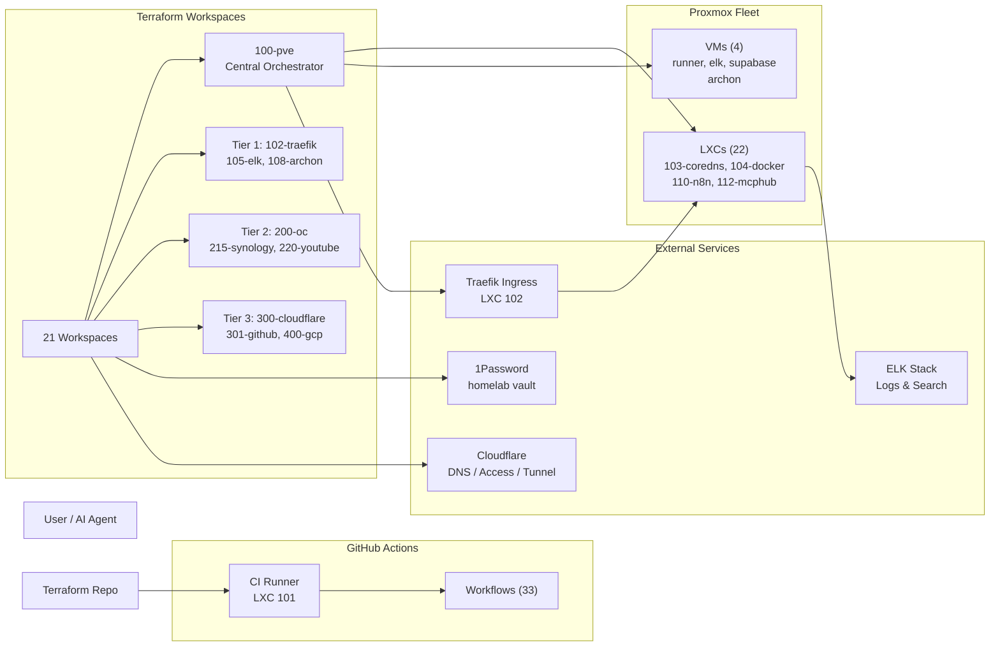

# Terraform Homelab Infrastructure / Terraform Homelab 인프라

[](https://www.terraform.io)
[](LICENSE)
[](.github/workflows)
[](https://scorecard.dev)
[](https://www.proxmox.com/)
[](Makefile)

> English version follows Korean content / 한국어 다음에 영어 버전이 이어집니다.

Infrastructure-as-code monorepo for `jclee.me`. Provisions a Proxmox LXC/VM fleet, networking, monitoring, and external services via 21 Terraform workspaces with 1Password secret injection and GitHub Actions CI/CD.

`jclee.me`를 위한 Infrastructure-as-Code 모노레포입니다. 21개의 Terraform 워크스페이스를 통해 Proxmox LXC/VM 플릿, 네트워킹, 모니터링 및 외부 서비스를 프로비저닝하며, 1Password 시크릿 주입과 GitHub Actions CI/CD로 운영됩니다.

---

## Table of Contents / 목차

- [Features / 주요 기능](#features--주요-기능)
- [Architecture / 아키텍처](#architecture--아키텍처)
- [Automation Inventory / 자동화 인벤토리](#automation-inventory--자동화-인벤토리)
- [Quick Start / 빠른 시작](#quick-start--빠른-시작)
- [Local Development / 로컬 개발](#local-development--로컬-개발)
- [Commands Reference / 명령어 참조](#commands-reference--명령어-참조)
- [Contribution Guide / 기여 가이드](#contribution-guide--기여-가이드)

---

## Features / 주요 기능

### Infrastructure Provisioning / 인프라 프로비저닝

- **21 Terraform workspaces** across 4 tiers (Tier 0 core, Tier 1 infra, Tier 2 VMs, Tier 3 external/cloud)
- **Proxmox LXC/VM fleet** managed as code (22 LXCs, 4 VMs across `<homelab-host>/24` subnet)
- **Single Source of Truth (SSoT)** in `100-pve/envs/prod/hosts.tf` for all host definitions

### Configuration Management / 구성 관리

- **Template-driven rendering** via `modules/proxmox/config-renderer` (10 workspaces produce zero `.tf` files — templates rendered by `100-pve`)
- **Cloud-init** for LXC and VM bootstrapping
- **Systemd unit injection** via templates for service autorestart

### Secret Management / 시크릿 관리

- **1Password integration** via `modules/shared/onepassword-secrets` (vault: `homelab`, 12 items, 48 keys)
- **Zero hardcoded secrets** — all secrets injected at apply time from 1Password

### CI/CD Automation / CI/CD 자동화

- **33 GitHub Actions workflows** covering PR lifecycle, issue management, release automation, and health monitoring
- **Automated code review** via `10_pr-review.yml` (PR-Agent) and `05_gitleaks.yml` (secret scanning)
- **Auto-merge / auto-fix** pipelines for dependency and documentation updates

---

## Architecture / 아키텍처


```mermaid
flowchart LR
    User["User / AI Agent"]
    Repo["Terraform Repo"]
    subgraph "GitHub Actions"
        CI["CI Runner<br/>LXC 101"]
        WF["Workflows (33)"]
    end
    CI --> WF
    Repo --> CI
    
    subgraph "Terraform Workspaces"
        TF["21 Workspaces"]
        PVE["100-pve<br/>Central Orchestrator"]
        T1["Tier 1: 102-traefik<br/>105-elk, 108-archon"]
        T2["Tier 2: 200-oc<br/>215-synology, 220-youtube"]
        T3["Tier 3: 300-cloudflare<br/>301-github, 400-gcp"]
    end
    
    TF --> PVE
    TF --> T1
    TF --> T2
    TF --> T3
    
    subgraph "Proxmox Fleet"
        LXC["LXCs (22)<br/>103-coredns, 104-docker<br/>110-n8n, 112-mcphub"]
        VM["VMs (4)<br/>runner, elk, supabase<br/>archon"]
    end
    
    PVE --> LXC
    PVE --> VM
    
    subgraph "External Services"
        OP["1Password<br/>homelab vault"]
        CF["Cloudflare<br/>DNS / Access / Tunnel"]
        ELK["ELK Stack<br/>Logs & Search"]
        Traefik["Traefik Ingress<br/>LXC 102"]
    end
    
    TF --> OP
    TF --> CF
    PVE --> Traefik
    Traefik --> LXC
    LXC --> ELK
```

### Workspace Tiers / 워크스페이스 티어

| Tier | Workspaces | Apply Order | Description |
| ---- | ---------- | ----------- |-------------|
| 0 (core) | `100-pve` | First | Provisions all LXC/VM lifecycle |
| 1 (infra) | `102-traefik`, `105-elk`, `108-archon` | Second | Consume `remote_state` from `100-pve` |
| 2 (apps) | `110-n8n`, `112-mcphub`, `200-oc`, `215-synology`, `220-youtube` | Third | VM-based applications |
| 3 (external) | `300-cloudflare`, `301-github`, `320-slack`, `400-gcp` | Any | No Proxmox dependency |

### Config Pipeline / 구성 파이프라인

```
hosts.tf (SSoT)
    ↓
modules/proxmox/lxc or vm
    ↓
modules/shared/onepassword-secrets + modules/proxmox/config-renderer
    ↓
templatefile(*.tftpl)
    ↓
configs/ (rendered, never hand-edit)
    ↓
SSH deploy to /opt/{service}/
```

---

## Automation Inventory / 자동화 인벤토리

### GitHub Actions Workflows / GitHub Actions 워크플로우

#### PR Lifecycle / PR 라이프사이클

| Workflow File | Purpose |
|--------------|---------|
| `01_branch-to-pr.yml` | Create PR from feature branch |
| `03_pr-checks.yml` | Run terraform validate, fmt, plan on PRs |
| `04_actionlint.yml` | Lint all workflow files |
| `05_gitleaks.yml` | Scan commits for secrets |
| `06_codeql.yml` | CodeQL security analysis |
| `07_dependency-review.yml` | Check dependency vulnerabilities |
| `08_scorecard.yml` | OpenSSF Scorecard baseline |
| `09_semantic-pr.yml` | Enforce semantic PR title format |
| `10_pr-review.yml` | AI-powered PR review via qodo-ai/pr-agent |
| `13_pr-auto-merge.yml` | Auto-merge on CI pass |
| `14_bot-auto-fix.yml` | Auto-fix formatting/lint issues |
| `15_merged-pr-cleanup.yml` | Cleanup after PR merge |

#### Issue Management / 이슈 관리

| Workflow File | Purpose |
|--------------|---------|
| `02_issue-to-branch.yml` | Create branch from issue |
| `18_issue-management.yml` | Label, milestone, close issues |
| `19_issue-backfill.yml` | Sync issues to project board |
| `91_issue-classification.yml` | Classify and route issues |

#### Release Automation / 릴리스 자동화

| Workflow File | Purpose |
|--------------|---------|
| `24_release-notes.yml` | Generate release notes |
| `25_release-publish.yml` | Publish release to GitHub |

#### Documentation / 문서

| Workflow File | Purpose |
|--------------|---------|
| `20_readme-gen.yml` | Auto-generate README from agents |
| `21_docs-sync.yml` | Sync documentation across repos |
| `42_reusable-docs-sync.yml` | Reusable workflow for doc sync |

#### Dependency Management / 의존성 관리

| Workflow File | Purpose |
|--------------|---------|
| `12_dependabot-auto-merge.yml` | Auto-merge Dependabot PRs |

#### Health & Monitoring / 상태 모니터링

| Workflow File | Purpose |
|--------------|---------|
| `29_downstream-health-check.yml` | Check downstream service health |
| `37_ci-failure-issues.yml` | Create issue on CI failure |
| `60_ci-auto-heal.yml` | Auto-heal broken CI pipelines |

#### Security / 보안

| Workflow File | Purpose |
|--------------|---------|
| `security/11_pr-review.yml` | Security-focused PR review |

#### Utility / 유틸리티

| Workflow File | Purpose |
|--------------|---------|
| `auto-merge.yml` | General auto-merge workflow |
| `ci.yml` | Shared CI reusable workflow |
| `labeler.yml` | Auto-label PRs/issues |
| `welcome.yml` | Welcome new contributors |

#### Reusable Workflows / 재사용 가능한 워크플로우

| Workflow File | Purpose |
|--------------|---------|
| `44_reusable-pr-checks.yml` | Reusable PR checks |
| `45_reusable-gitleaks.yml` | Reusable gitleaks scan |
| `43_reusable-issue-management.yml` | Reusable issue management |

### External Tools / 외부 도구

| Tool | Purpose | URL |
|------|---------|-----|
| **qodo-ai/pr-agent** | AI PR review and automation | <https://qodo-ai/pr-agent> |
| **1Password** | Secret management (vault: `homelab`) | Internal module |
| **Cloudflare** | DNS, Access, Tunnel management | `300-cloudflare` workspace |
| **OpenSSF Scorecard** | Security scoring | scorecard.dev |

---

## Quick Start / 빠른 시작

### Prerequisites / 필수 조건

- Terraform `>= 1.7, < 2.0` (1.10.5 recommended)
- `make` command
- 1Password account with access to `homelab` vault
- GitHub CLI (`gh`) for CI/CD

### Clone & Initialize / 클론 및 초기화

```bash
git clone https://github.com/jclee/homelab.git
cd homelab
```

### Initialize Terraform / Terraform 초기화

```bash
# Default workspace (100-pve)
make init

# Specific workspace via alias
SVC=pve make init
SVC=elk make init

# Specific workspace via path
SVC=105-elk make init
```

### Plan Changes / 변경 계획

```bash
# Plan default workspace
make plan

# Plan specific workspace
SVC=elk make plan
```

---

## Local Development / 로컬 개발

### Workspace Aliases / 워크스페이스_alias

The `Makefile` provides convenient aliases for common workspaces:

| Alias | Workspace Path | Description |
|-------|---------------|-------------|
| `jclee` | `80-jclee` | Personal infrastructure |
| `pve` | `100-pve` | Proxmox central orchestrator |
| `runner` | `101-runner` | GitHub Actions runner |
| `traefik` | `102-traefik/terraform` | Traefik ingress |
| `elk` | `105-elk/terraform` | ELK stack |
| `supabase` | `107-supabase` | Supabase |
| `archon` | `108-archon/terraform` | Archon |
| `n8n` | `110-n8n` | n8n workflow |
| `mcphub` | `112-mcphub` | MCP hub |
| `oc` | `200-oc` | Owncast |
| `synology` | `215-synology` | Synology |
| `youtube` | `220-youtube` | YouTube downloader |
| `cloudflare` | `300-cloudflare` | Cloudflare management |
| `github` | `301-github` | GitHub repo management |
| `safetywallet` | `310-safetywallet` | Safety wallet |
| `slack` | `320-slack` | Slack integration |
| `gcp` | `400-gcp` | Google Cloud Platform |

### Using Aliases / Alias 사용

```bash
# Initialize traefik workspace
SVC=traefik make init

# Plan ELK workspace
SVC=elk make plan

# Apply to n8n workspace
SVC=n8n make apply
```

### List Available Workspaces / 사용 가능한 워크스페이스 목록

```bash
make help
```

Output shows all available aliases and direct workspace paths.

---

## Commands Reference / 명령어 참조

### Terraform Commands / Terraform 명령어

| Command | Description |
|---------|-------------|
| `make init` | Initialize Terraform for workspace (SVC=100-pve) |
| `make plan` | Create Terraform plan for workspace |
| `make apply` | **DISABLED** — Use CI/CD for apply |
| `make verify` | Verify Terraform configuration |
| `make fmt` | Format Terraform files |
| `make validate` | Validate Terraform syntax |
| `make drift-check` | Check for configuration drift |

### Testing Commands / 테스트 명령어

| Command | Description |
|---------|-------------|
| `make test` | Run all tests |
| `make test-unit` | Run unit tests |
| `make test-integration` | Run integration tests |
| `make test-workspace` | Run workspace-specific tests |

### Documentation Commands / 문서 명령어

| Command | Description |
|---------|-------------|
| `make docs` | Generate documentation |
| `make pre-commit-install` | Install pre-commit hooks |
| `make pre-commit-run` | Run pre-commit hooks |

### Environment Variables / 환경 변수

| Variable | Default | Description |
|----------|---------|-------------|
| `SVC` | `100-pve` | Target workspace (alias or path) |

### Examples / 사용 예시

```bash
# Initialize and plan workspace
SVC=elk make init
SVC=elk make plan

# Check drift on all infra
SVC=pve make drift-check

# Format and validate before PR
make fmt validate

# Run full test suite
make test
```

---

## Contribution Guide / 기여 가이드

### Branch Strategy / 브랜치 전략

1. **Create issue first** — All changes start with an issue
2. **Branch from issue** — Use `02_issue-to-branch.yml` workflow or manually
3. **PR to master** — All changes go through PR with required checks
4. **Squash merge** — Squash and merge for clean history

### PR Requirements / PR 요구사항

- [ ] Semantic PR title (`type(scope): description`)
- [ ] All `03_pr-checks.yml` checks pass
- [ ] No secrets committed (verified by `05_gitleaks.yml`)
- [ ] Documentation updated if applicable
- [ ] Tests added/updated for new resources

### Adding New LXC/VM / 새 LXC/VM 추가

1. Add host entry to `100-pve/envs/prod/hosts.tf`
2. Add sizing defaults to `100-pve/locals.tf`
3. Add 1Password secret entries if needed
4. Create template in `100-pve/configs/` or service workspace
5. Plan and apply via CI/CD

### Config Rendering / 구성 렌더링

Templates are rendered by `modules/proxmox/config-renderer`. **Never hand-edit** files in `100-pve/configs/rendered/`. These are outputs consumed by SSH deployment.

### Architecture Decisions / 아키텍처 결정

- Document decisions in `docs/adr/` (append-only)
- New ADR supersedes old one; do not delete old ADRs
- Runbooks for debugging in `docs/runbooks/`

### Code Style / 코드 스타일

See `CODE_STYLE.md` for naming conventions, file organization, variable naming, and template conventions.

### Dependency Map / 의존성 맵

See `DEPENDENCY_MAP.md` for module dependency graph and template inventory.

---

## Repository Structure / 저장소 구조

```text
/
├── AGENTS.md                    # AI agent knowledge base
├── ARCHITECTURE.md              # Full architecture reference
├── CODE_STYLE.md                # Coding conventions
├── CONTRIBUTING.md              # Contributing guide
├── DEPENDENCY_MAP.md            # Module dependency graph
├── LICENSE                      # MIT license
├── Makefile                     # Workspace automation
├── OWNERS                       # CODEOWNERS
├── OWNERS_ALIASES               # Team aliases
├── README.md                    # This file
├── build.env                    # Build environment variables
│
├── modules/                     # Reusable Terraform modules
│   ├── AGENTS.md
│   ├── proxmox/                 # Proxmox resource modules
│   │   ├── AGENTS.md
│   │   ├── vm/                  # VM provisioning module
│   │   ├── lxc/                 # LXC provisioning module
│   │   ├── vm-config/           # VM configuration templates
│   │   ├── lxc-config/          # LXC configuration templates
│   │   └── config-renderer/     # Template rendering module
│   └── shared/                  # Shared modules
│       └── onepassword-secrets/ # 1Password integration
│
├── 100-pve/                     # Tier 0: Central orchestrator
│   ├── AGENTS.md
│   ├── terraform/
│   │   ├── main.tf
│   │   ├── locals.tf
│   │   ├── variables.tf
│   │   ├── outputs.tf
│   │   ├── lxc_configs.tf
│   │   ├── vm_configs.tf
│   │   ├── firewall.tf
│   │   ├── storage.tf
│   │   ├── backup_jobs.tf
│   │   ├── secrets.tf
│   │   ├── checks.tf
│   │   ├── data.tf
│   │   ├── versions.tf
│   │   └── configs/              # Rendered configs (auto-generated)
│   │       ├── lxc-103-coredns/
│   │       └── rendered/
│   └── README.md
│
├── 101-runner/                  # Tier 1: GitHub Actions runner
├── 102-traefik/                 # Tier 1: Traefik ingress
├── 105-elk/                     # Tier 1: ELK stack
├── 108-archon/                  # Tier 1: Archon
├── 110-n8n/                     # Tier 2: n8n workflow
├── 112-mcphub/                  # Tier 2: MCP hub
├── 200-oc/                      # Tier 2: Owncast
├── 215-synology/                # Tier 2: Synology
├── 220-youtube/                 # Tier 2: YouTube downloader
├── 300-cloudflare/              # Tier 3: Cloudflare
├── 301-github/                  # Tier 3: GitHub management
├── 310-safetywallet/            # Tier 3: Safety wallet
├── 320-slack/                   # Tier 3: Slack
├── 400-gcp/                     # Tier 3: GCP
│
└── .github/
    └── workflows/              # 33 GitHub Actions workflows
        ├── 01_branch-to-pr.yml
        ├── 02_issue-to-branch.yml
        ├── 03_pr-checks.yml
        ├── 04_actionlint.yml
        ├── 05_gitleaks.yml
        ├── 06_codeql.yml
        ├── 07_dependency-review.yml
        ├── 08_scorecard.yml
        ├── 09_semantic-pr.yml
        ├── 10_pr-review.yml
        ├── 12_dependabot-auto-merge.yml
        ├── 13_pr-auto-merge.yml
        ├── 14_bot-auto-fix.yml
        ├── 15_merged-pr-cleanup.yml
        ├── 18_issue-management.yml
        ├── 19_issue-backfill.yml
        ├── 20_readme-gen.yml
        ├── 21_docs-sync.yml
        ├── 24_release-notes.yml
        ├── 25_release-publish.yml
        ├── 29_downstream-health-check.yml
        ├── 37_ci-failure-issues.yml
        ├── 42_reusable-docs-sync.yml
        ├── 43_reusable-issue-management.yml
        ├── 44_reusable-pr-checks.yml
        ├── 45_reusable-gitleaks.yml
        ├── 60_ci-auto-heal.yml
        ├── 91_issue-classification.yml
        ├── auto-merge.yml
        ├── ci.yml
        ├── labeler.yml
        ├── welcome.yml
        └── security/
            └── 11_pr-review.yml
```

---

## Support / 지원

- **Issues**: Open a GitHub issue for bugs or feature requests
- **Architecture Questions**: See `ARCHITECTURE.md` and `docs/adr/`
- **Operational Runbooks**: See `docs/runbooks/`

---

## License / 라이선스

MIT License — See [LICENSE](LICENSE)
