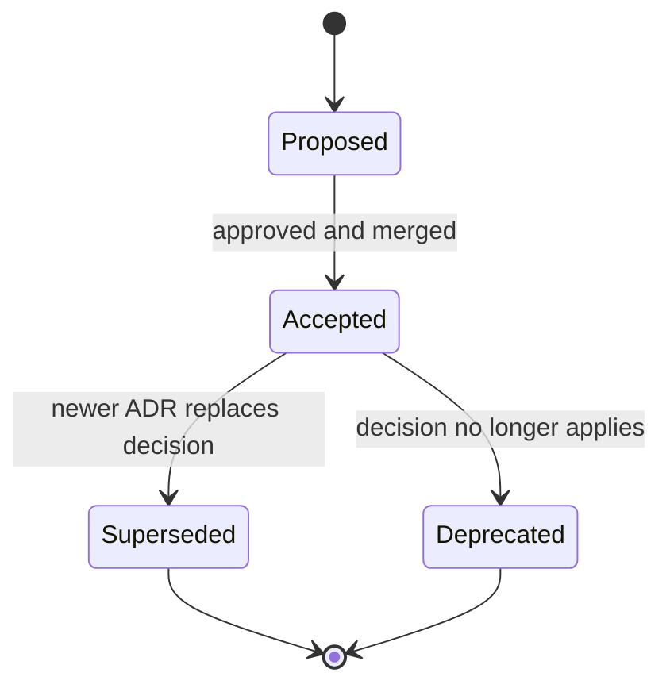

# Architecture Decision Records

This directory contains historical architecture decisions for the Terraform homelab repository. ADRs are append-only decision records: keep historical context intact, and supersede decisions with a newer ADR when the architecture changes.

## Current ADR Index

| ADR | Title | Status | Notes |
| --- | ----- | ------ | ----- |
| [001](001-monorepo-structure.md) | Monorepo Structure with Bazel | Superseded | Directory/workspace structure remains useful historical context; Bazel governance was removed. |
| [002](002-mcphub-single-entrypoint.md) | MCPHub as Single MCP Entrypoint | Accepted | Defines VM 112 MCPHub as the central MCP gateway. |
| [003](003-cloudflare-tunnel-architecture.md) | Cloudflare Tunnel Architecture | Accepted | Documents external access model. |
| [004](004-onepassword-vault-standardization.md) | 1Password Vault Standardization | Accepted | Defines shared vault item/schema conventions. |
| [014](014-cloud-init-for-lxc.md) | Cloud-init for LXC | Accepted | Documents LXC initialization/configuration decision. |

## Numbering Gaps

ADR numbers 005 through 013 are absent in this repository. Treat those gaps as intentional or unknown historical gaps; do not fabricate placeholder ADRs. If supporting evidence for a missing decision is found later, add a real ADR with the appropriate number and source context.

## Lifecycle

## Maintenance Rules

- Preserve original decision context in existing ADRs.
- Change status only when there is clear repository evidence that a decision has been superseded or deprecated.
- Prefer creating a new ADR over rewriting an accepted one.
- Keep gaps documented without inventing missing decisions.
