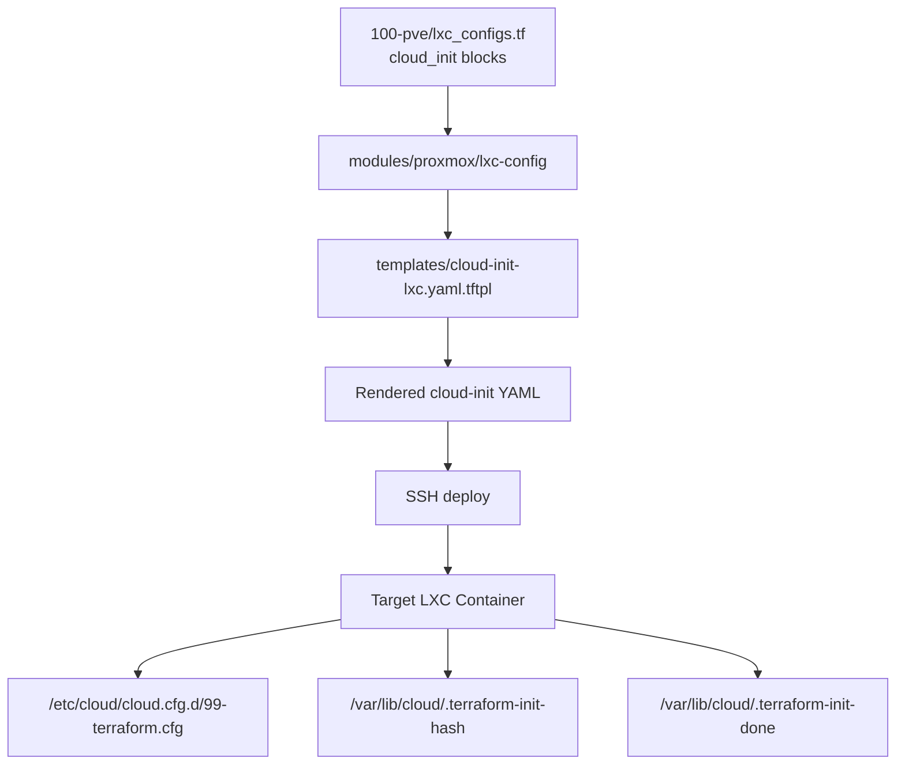
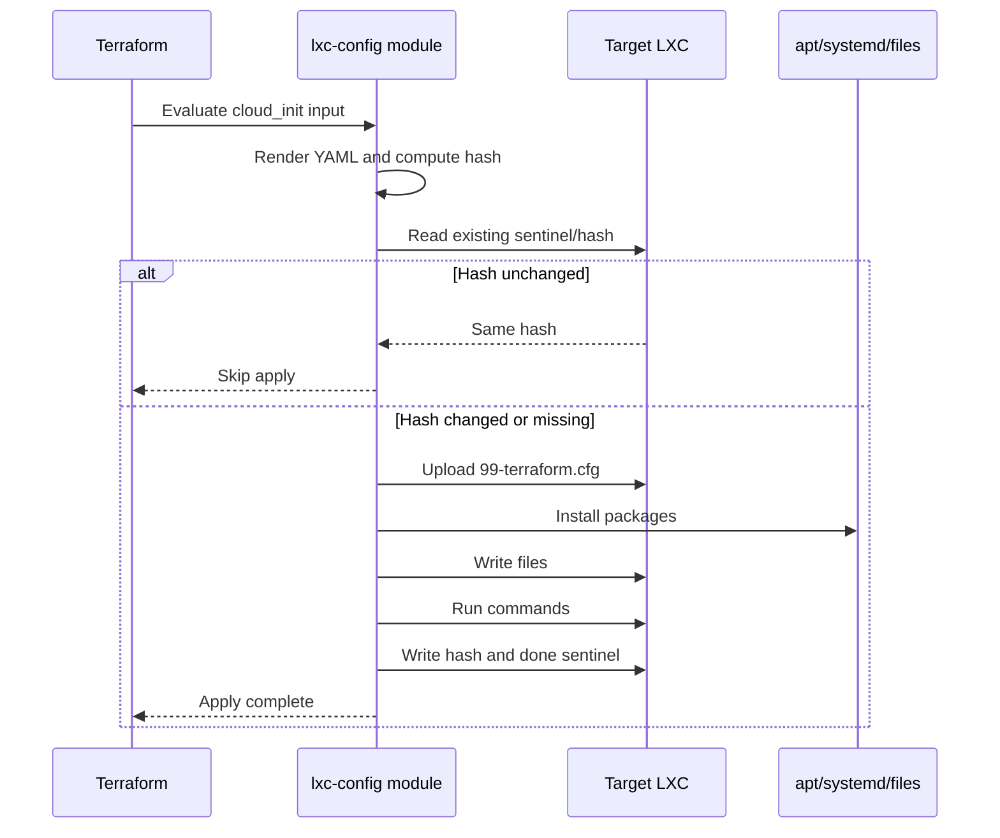
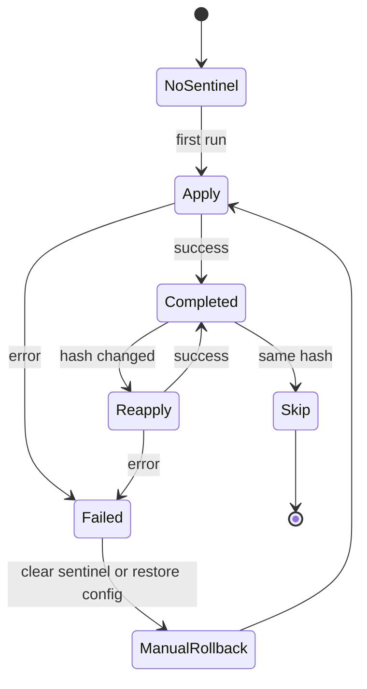

# LXC Cloud-Init Technical Specification

**Status:** Implemented
**Date:** 2026-03-30
**Last Updated:** 2026-05-07

This document specifies the technical implementation of cloud-init support for LXC containers in the Terraform Proxmox infrastructure. The design has been fully implemented in `modules/proxmox/lxc-config`.

## Goals

1. Provide consistent cloud-init interface for both VMs and LXC containers
2. Support packages, write_files, and runcmd directives
3. Maintain idempotency across container restarts
4. Leverage existing SSH deployment infrastructure

## Architecture



## Data Structures

### Container Configuration

```hcl
object({
  vmid       = number
  hostname   = string
  ip         = string
  # ... existing fields ...

  cloud_init = optional(object({
    packages = optional(list(string), [])

    write_files = optional(list(object({
      path        = string
      content     = string
      permissions = optional(string, "0644")
      owner       = optional(string, "root:root")
    })), [])

    runcmd = optional(list(string), [])
  }), {})
})
```

### Cloud-Init Template Variables

```hcl
{
  hostname    = string
  packages    = list(string)
  write_files = list(object({...}))
  runcmd      = list(string)
}
```

## Implementation Details

### Template Rendering

The template `cloud-init-lxc.yaml.tftpl` will produce valid cloud-init YAML:

```yaml
#cloud-config
hostname: ${hostname}
manage_etc_hosts: true

package_update: true
package_upgrade: false

packages:
%{ for pkg in packages ~}
  - ${pkg}
%{ endfor ~}

%{ if length(write_files) > 0 ~}
write_files:
%{ for file in write_files ~}
  - path: ${file.path}
    permissions: '${file.permissions}'
    owner: ${file.owner}
    content: |
      ${indent(6, file.content)}
%{ endfor ~}
%{ endif ~}

%{ if length(runcmd) > 0 ~}
runcmd:
%{ for cmd in runcmd ~}
  - ${cmd}
%{ endfor ~}
%{ endif ~}

final_message: "Cloud-init completed for ${hostname}"
```

### Deployment Logic

```hcl
locals {
  # Only process containers that have cloud_init defined
  containers_with_cloudinit = {
    for name, container in var.containers : name => container
    if length(container.cloud_init.packages) > 0 ||
       length(container.cloud_init.write_files) > 0 ||
       length(container.cloud_init.runcmd) > 0
  }
}

resource "null_resource" "lxc_cloud_init" {
  for_each = var.deploy_lxc_configs ? local.containers_with_cloudinit : {}

  triggers = {
    # Hash the rendered template to detect changes
    config_hash = md5(templatefile(
      "${path.module}/templates/cloud-init-lxc.yaml.tftpl",
      {
        hostname    = each.value.hostname
        packages    = each.value.cloud_init.packages
        write_files = each.value.cloud_init.write_files
        runcmd      = each.value.cloud_init.runcmd
      }
    ))
    # Include SSH connection details in triggers
    host = each.value.ip
  }

  connection {
    type        = "ssh"
    host        = each.value.ip
    user        = var.ssh_user
    private_key = var.ssh_private_key
    timeout     = "5m"
  }

  # Ensure cloud-init directory exists
  provisioner "remote-exec" {
    inline = [
      "mkdir -p /etc/cloud/cloud.cfg.d",
      "mkdir -p /var/lib/cloud",
    ]
  }

  # Upload cloud-init configuration
  provisioner "file" {
    content = templatefile(
      "${path.module}/templates/cloud-init-lxc.yaml.tftpl",
      {
        hostname    = each.value.hostname
        packages    = each.value.cloud_init.packages
        write_files = each.value.cloud_init.write_files
        runcmd      = each.value.cloud_init.runcmd
      }
    )
    destination = "/etc/cloud/cloud.cfg.d/99-terraform.cfg"
  }

  # Execute cloud-init (simulated)
  provisioner "remote-exec" {
    inline = flatten([
      # Check if already executed with same config
      "CURRENT_HASH=$(cat /var/lib/cloud/.terraform-init-hash 2>/dev/null || echo '')",
      "NEW_HASH='${md5(templatefile(...))}'",
      "[ \"$CURRENT_HASH\" = \"$NEW_HASH\" ] \u0026\u0026 exit 0",
      "",
      # Log start
      "echo \"Applying cloud-init for ${each.value.hostname}...\"",
      "",
      # Install packages
      length(each.value.cloud_init.packages) > 0 ? [
        "apt-get update -qq",
        "apt-get install -y -qq ${join(" ", each.value.cloud_init.packages)}",
      ] : [],
      "",
      # Write files
      [
        for file in each.value.cloud_init.write_files : [
          "mkdir -p $(dirname ${file.path})",
          "cat > ${file.path} << 'EOF'",
          file.content,
          "EOF",
          "chmod ${file.permissions} ${file.path}",
          "chown ${file.owner} ${file.path}",
        ]
      ],
      "",
      # Run commands
      [
        for cmd in each.value.cloud_init.runcmd : cmd
      ],
      "",
      # Mark completion
      "echo '${md5(templatefile(...))}' > /var/lib/cloud/.terraform-init-hash",
      "touch /var/lib/cloud/.terraform-init-done",
      "echo \"Cloud-init completed for ${each.value.hostname}\"",
    ])
  }

  lifecycle {
    replace_triggered_by = [
      # Re-run if hash changes
    ]
  }
}
```

### Apply and Reapply Flow



## Container Migration

### Existing Containers

For existing LXC containers, we'll add cloud_init blocks to `100-pve/lxc_configs.tf`:

```hcl
module "lxc_config" {
  # ...
  containers = {
    traefik = {
      # ... existing fields ...
      cloud_init = {
        packages = ["curl", "jq", "ca-certificates"]
        runcmd = [
          "systemctl enable filebeat || true",
        ]
      }
    }
    # ... other containers ...
  }
}
```

### Migration Strategy

1. **Phase 1**: Add cloud_init with minimal configuration (basic packages)
2. **Phase 2**: Migrate existing `config_files` to `write_files`
3. **Phase 3**: Migrate existing `systemd_services` to `runcmd`
4. **Phase 4**: Remove deprecated `config_files` and `systemd_services`

### Idempotency State


## QA Checklist

Before marking cloud-init deployment as verified for a container:

- [ ] `terraform plan` shows no unexpected changes for the lxc-config module
- [ ] `/etc/cloud/cloud.cfg.d/99-terraform.cfg` exists and contains valid YAML
- [ ] `/var/lib/cloud/.terraform-init-done` exists after first apply
- [ ] `/var/lib/cloud/.terraform-init-hash` matches the rendered config hash
- [ ] Re-running `terraform apply` skips execution (idempotency)
- [ ] Modifying `cloud_init` input triggers re-execution
- [ ] Packages listed in `cloud_init.packages` are installed (`dpkg -l | grep <pkg>`)
- [ ] Files listed in `cloud_init.write_files` exist with correct permissions and ownership
- [ ] Commands in `cloud_init.runcmd` executed successfully (check logs or state)
- [ ] No secrets are visible in rendered configs or `/etc/cloud/cloud.cfg.d/99-terraform.cfg`
## Rollback Checklist

If cloud-init deployment fails or leaves a container in a partial state:

1. **Clear sentinel files** to force re-execution on next apply:
   ```bash
   rm /var/lib/cloud/.terraform-init-done /var/lib/cloud/.terraform-init-hash
   ```
2. **Remove the cloud-init config** if it causes startup failures:
   ```bash
   rm /etc/cloud/cloud.cfg.d/99-terraform.cfg
   ```
3. **Revert package changes** manually if needed:
   ```bash
   apt-get remove --purge <package>
   ```
4. **Restore file state** from backup or previous Terraform state:
   ```bash
   # Re-run Terraform with the previous known-good state
   terraform apply
   ```
5. **Verify rollback** by checking that sentinels are gone and container boots cleanly.
## Security Considerations

1. **SSH Access**: Requires root SSH access to LXC containers
2. **Secrets in cloud-init**: Use 1Password integration, never hardcode secrets
3. **File Permissions**: Enforce proper permissions in write_files
4. **Command Execution**: Validate runcmd entries for safety

## Future Enhancements

1. Support for cloud-init modules (e.g., `users`, `ssh_authorized_keys`)
2. Integration with cloud-init's native CLI for full compatibility
3. Support for container images with pre-installed cloud-init
4. Webhook notifications on cloud-init completion

## References

- [ADR 014: Cloud-Init for LXC Containers](../adr/014-cloud-init-for-lxc.md)
- [modules/proxmox/lxc-config/](../../modules/proxmox/lxc-config/)
- [modules/proxmox/lxc-config/templates/cloud-init-lxc.yaml.tftpl](../../modules/proxmox/lxc-config/templates/cloud-init-lxc.yaml.tftpl)
- [modules/proxmox/vm-config/templates/cloud-init.yaml.tftpl](../../modules/proxmox/vm-config/templates/cloud-init.yaml.tftpl)
- [Proxmox LXC Documentation](https://pve.proxmox.com/wiki/Linux_Container)
