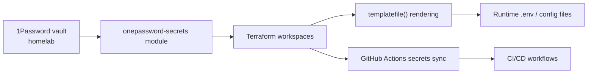

# Secret Management

Single source of truth for the homelab secret lifecycle. All secrets flow through 1Password into Terraform workspaces, then via config-renderer to runtime .env files on LXC/VM hosts.

## Quick Start

```bash
# Sync all secrets from 1Password → GitHub (recommended)
go run scripts/sync-vault-secrets.go

# Audit 1Password sync state
go run scripts/sync-vault-secrets.go --audit

# Force rotation (overwrite existing)
go run scripts/sync-vault-secrets.go --force

# Fallback: resolve from .tfvars + 1Password + env vars
go run scripts/setup-github-secrets.go
go run scripts/setup-github-secrets.go --audit
```

## Architecture



## 1Password Item Inventory

The shared module (`modules/shared/onepassword-secrets/`) manages core homelab and optional service items:

| Item         | Description          | Key Secrets                                                                                                                  |
| ------------ | -------------------- | ---------------------------------------------------------------------------------------------------------------------------- |
| `grafana`    | Observability stack  | `service_account_token`, `admin_password`                                                                                    |
| `proxmox`    | Hypervisor API       | `api_token_id`, `api_token_secret`                                                                                           |
| `github`     | GitHub PAT           | `personal_access_token`                                                                                                      |

| `supabase`   | Self-hosted Supabase | `postgres_password`, `jwt_secret`, `anon_key`, `service_role_key`, `dashboard_password`                                      |
| `archon`     | Archon MCP           | `openai_api_key`                                                                                                             |
| `cloudflare` | CF account           | `account_id`, `zone_id`, `api_token`                                                                                         |
| `mcphub`     | MCPHub service       | `admin_password`, `op_token`, `github_pat`, `es_password`, `proxmox_token` |
| `elk`        | ELK stack            | `elastic_password`, `kibana_password`                                                                                        |
| `synology`   | Synology NAS         | `username`, `password`                                                                                                       |
| `youtube`    | YouTube API          | `client_id`, `client_secret`, `access_token`, `refresh_token`                                                               |
| `telegram`   | Telegram Bot API     | `bot_token`                                                                                                                 |
| `pbs`        | Proxmox Backup       | `username`, `password` (optional, gated by `enable_pbs`)                                                                     |

**Module outputs:**

- 23 secret keys (sensitive=true, not printed in Terraform output)
- 11 metadata keys (sensitive=false)

**Access pattern:**

```hcl
# Simplified (preferred)
module.secrets.secrets["grafana_service_account_token"]

# Verbose with fallback
try(module.secrets.secrets["grafana_service_account_token"], section_map["secrets"].field_map["service_account_token"].value, "")
```

## Workspace Integration

| Workspace             | Has onepassword.tf       | Key Secrets Consumed                               |
| --------------------- | ------------------------ | -------------------------------------------------- |
| 100-pve               | via versions.tf provider | `proxmox_api_token`, all template secrets          |
| 105-elk/terraform     | ✅                       | `elk_elastic_password`                             |
| 215-synology          | ✅                       | `synology_username`, `synology_password`           |
| 300-cloudflare        | ✅                       | `cloudflare_account_id`, `zone_id`, `github_token` |
| 102-traefik           | ❌                       | —                                                  |
| 108-archon            | ❌                       | —                                                  |

Grafana secrets are consumed by the template/config pipeline, not by a standalone Grafana Terraform workspace.

## Runtime Secret Distribution

Per-host `.env` secrets deployed via config-renderer templates:

| Host          | Secrets                                                                                                                                    |
| ------------- | ------------------------------------------------------------------------------------------------------------------------------------------ |
| 102-traefik   | `homelab_tunnel_token` (via cloudflared compose)                                                                                           |
| Grafana runtime | `GRAFANA_ADMIN_PASSWORD`                                                                                                                 |
| 105-elk       | `elastic_password`, `kibana_password` (in docker-compose env vars)                                                                         |
| 107-supabase  | `POSTGRES_PASSWORD`, `JWT_SECRET`, `ANON_KEY`, `SERVICE_ROLE_KEY`, `DASHBOARD_PASSWORD`                                                    |
| 108-archon    | `OPENAI_API_KEY`                                                                                                                           |
| 112-mcphub    | MCPHub admin, 1Password Connect, Proxmox token, GitHub PAT, Elasticsearch password |

## Provider Authentication

The `OP_CONNECT_TOKEN` and `OP_CONNECT_HOST` environment variables authenticate the Terraform provider to 1Password via the Connect Server on LXC 112 (port 8090).

**Token location:** LXC 112 at `/opt/mcphub/.env`

**Local Terraform runs:** The provider falls back to `OP_CONNECT_TOKEN` and `OP_CONNECT_HOST` env vars when `op_service_account_token` variable is empty (default). Set these locally:

```bash
export OP_CONNECT_TOKEN=$(ssh root@192.168.50.112 'grep OP_SERVICE_ACCOUNT_TOKEN /opt/mcphub/.env | cut -d= -f2-')
export OP_CONNECT_HOST="http://192.168.50.112:8090"
terraform plan
```

## Terraform Secret Backend

Secrets are consumed at plan-time via the `onepassword-secrets` shared module:

```hcl
module "secrets" {
  source                   = "../modules/shared/onepassword-secrets"
  op_vault_id              = var.op_vault_id
  op_service_account_token = var.op_service_account_token
}

# Access: module.secrets.secrets["grafana_admin_password"]
```

## Secret Inventory (GitHub Actions)

### 1Password-Sourced (via `sync-vault-secrets.go`)

| Secret                | 1Password Reference                                  | Field                   | Priority |
| --------------------- | ---------------------------------------------------- | ----------------------- | -------- |
| `TF_VAR_GRAFANA_AUTH` | `op://homelab/grafana/secrets/service_account_token` | `service_account_token` | P1       |
| `TF_VAR_SUPABASE_URL` | `op://homelab/supabase/secrets/url`                  | `url`                   | P1       |
| `GH_PAT`              | `op://homelab/github/secrets/personal_access_token`  | `personal_access_token` | P2       |

### From local `.tfvars` (via `setup-github-secrets.go`)

| Secret                         | Source File                       | Variable                | Priority |
| ------------------------------ | --------------------------------- | ----------------------- | -------- |
| `TF_VAR_PROXMOX_ENDPOINT`      | `100-pve/terraform.tfvars`        | `proxmox_endpoint`      | P0       |
| `TF_VAR_PROXMOX_API_TOKEN`    | `100-pve/terraform.tfvars`        | `proxmox_api_token`     | P0       |
| `TF_VAR_PROXMOX_INSECURE`     | `100-pve/terraform.tfvars`        | `proxmox_insecure`      | P0       |
| `TF_VAR_CLOUDFLARE_ACCOUNT_ID`| `300-cloudflare/terraform.tfvars` | `cloudflare_account_id` | P1       |
| `TF_VAR_CLOUDFLARE_ZONE_ID`   | `300-cloudflare/terraform.tfvars` | `cloudflare_zone_id`    | P1       |
| `TF_VAR_SYNOLOGY_DOMAIN`      | `300-cloudflare/terraform.tfvars` | `synology_domain`       | P1       |
| `CLOUDFLARE_API_TOKEN`        | env / CF dashboard                | —                       | P2       |

Note: `PROXMOX_ENDPOINT` was renamed to `TF_VAR_PROXMOX_ENDPOINT` and all workflow references now use the canonical `TF_VAR_*` secret name.

### Manual (3/17 — not in 1Password)

| Secret                    | Priority | Source                                  | Used By                     |
| ------------------------- | -------- | --------------------------------------- | --------------------------- |
| `TF_API_TOKEN`            | P0       | Terraform Cloud (skip if not using TFC) | terraform-plan/apply, drift |
| `CF_ACCESS_CLIENT_ID`     | P2       | CF Zero Trust → Service Tokens          | internal-service-access     |
| `CF_ACCESS_CLIENT_SECRET` | P2       | CF Zero Trust → Service Tokens          | internal-service-access     |

## Secret Rotation

```bash
# 1. Update value in 1Password
#    Via UI: 1Password → homelab vault → item → Edit field
#    Via CLI: op item edit "cloudflare" "secrets.account_id=NEW" --vault homelab

# 2. Push to GitHub
go run scripts/sync-vault-secrets.go --force

# 3. Verify
go run scripts/setup-github-secrets.go --audit
```

## Weekly Audit

The `secret-audit.yml` workflow runs every Monday at 09:00 UTC.
It validates all 17 secrets and reports missing ones.
Trigger manually: Actions → Secret Audit → Run workflow.

## Cross-References

- [Cloudflare Token Rotation](cloudflare-token-rotation.md)
- [Credential Rotation Runbook](runbooks/credential-rotation.md)
