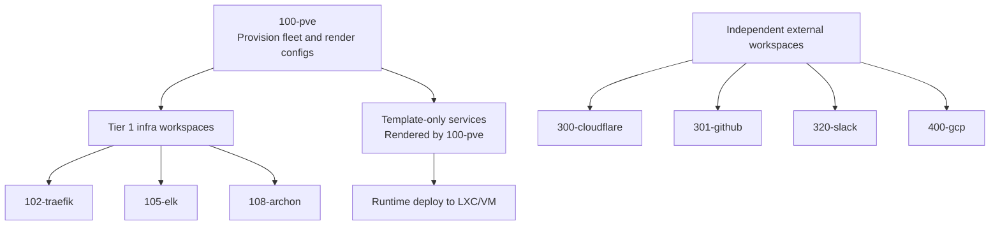

# Workspace Dependency Ordering

## Overview

This monorepo contains multiple Terraform workspaces that must be applied in a
specific order due to `terraform_remote_state` dependencies. The root workspace
(`100-pve`) provisions infrastructure and exports outputs consumed by downstream
app workspaces.

## Dependency Graph



## Apply Order

### Tier 0 — Infrastructure (must apply first)

| Workspace | CI Workflow | Triggers On |
|-----------|-------------|-------------|
| `100-pve` | `terraform-plan.yml` / `terraform-apply.yml` | `100-pve/**`, `modules/**` |

### Tier 1 — App Workspaces (apply after Tier 0)

These workspaces consume `data.terraform_remote_state.infra` from `100-pve`.
They are independent of each other and can run in parallel.

| Workspace | CI Workflow | Triggers On |
|-----------|-------------|-------------|
| `102-traefik/terraform` | `traefik-plan.yml` / `traefik-apply.yml` | `102-traefik/**` |
| `105-elk/terraform` | `elk-plan.yml` / `elk-apply.yml` | `105-elk/**` |
| `108-archon/terraform` | `archon-plan.yml` / `archon-apply.yml` | `108-archon/**` |

Grafana is managed through the current template/config pipeline rather than as a standalone Terraform workspace.

### Tier Independent — External Providers

| Workspace | CI Workflow | Triggers On |
|-----------|-------------|-------------|
| `300-cloudflare` | `cloudflare-plan.yml` / `cloudflare-apply.yml` | `300-cloudflare/**` |
| `301-github` | `github-plan.yml` / `github-apply.yml` | `301-github/**` |
| `310-safetywallet` | `safetywallet-plan.yml` / `safetywallet-apply.yml` (GitLab CI) | `310-safetywallet/**` |
| `320-slack` | `slack-plan.yml` / `slack-apply.yml` | `320-slack/**` |
| `400-gcp` | `gcp-plan.yml` / `gcp-apply.yml` | `400-gcp/**` |
## CI/CD Notes

- **Path-based triggers**: Each workspace pair fires only on changes to its
  directory, so Tier 1 workflows do not re-run when `100-pve` changes.
- **Plan artifacts**: The `terraform-plan.yml` workflow uploads `tfplan` and
  `plan_output.txt` as GitHub Actions artifacts (7-day retention) for audit
  and reproducibility.
- **Apply safety**: The `terraform-apply.yml` workflow runs `terraform plan`
  immediately before `terraform apply` to ensure the applied state matches
  the current configuration (plan-then-apply pattern).
- **Concurrency**: All apply workflows use `cancel-in-progress: false` to
  prevent mid-apply cancellation. Plan workflows use `cancel-in-progress: true`
  for fast feedback on new pushes.
- **Environment protection**: All apply workflows require the `production`
  environment, enabling manual approval gates if configured.

## Manual Multi-Workspace Apply

When changing `100-pve` outputs consumed by downstream workspaces:

```bash
# 1. Apply infrastructure first
make plan SVC=100-pve && make apply SVC=100-pve

# 2. Apply dependent workspaces (can be parallel)
make plan SVC=traefik && make apply SVC=traefik
make plan SVC=elk && make apply SVC=elk
make plan SVC=archon && make apply SVC=archon
```
